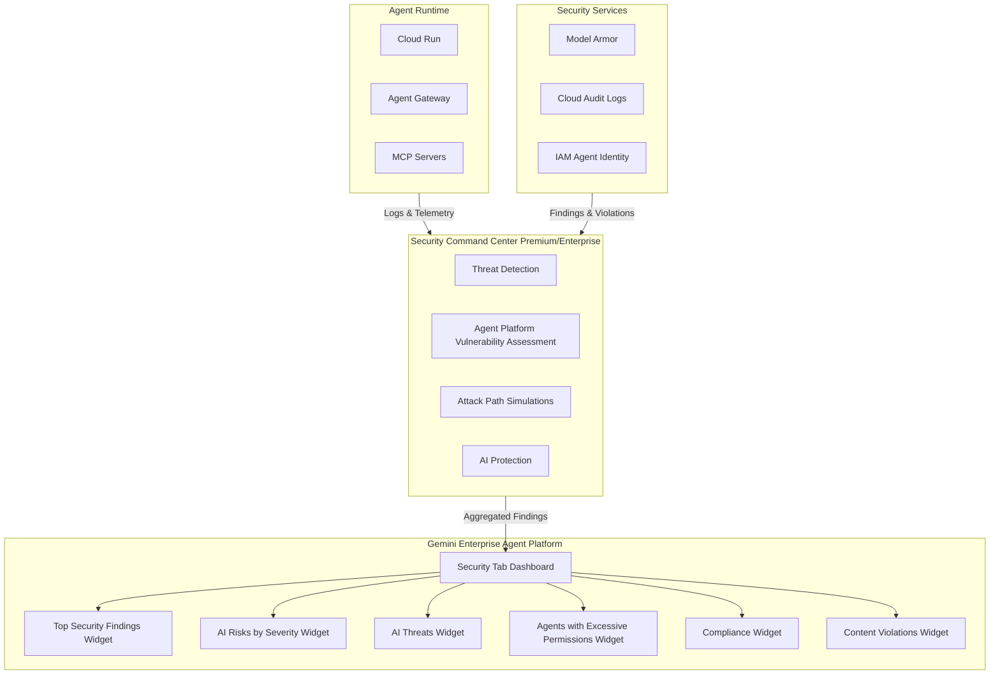

# Gemini Enterprise Agent Platform: AI Security Findings - GA

**リリース日**: 2026-06-24

**サービス**: Gemini Enterprise Agent Platform

**機能**: AI security findings in Agent Platform

**ステータス**: GA (Generally Available)

[このアップデートのインフォグラフィックを見る](https://takech9203.github.io/google-cloud-news-summary/20260624-gemini-agent-platform-ai-security-findings-ga.html)

## 概要

Gemini Enterprise Agent Platform の Security タブにおける AI セキュリティファインディングスとポスチャー管理サマリーの表示が GA (一般提供) となった。このリリースにより、Security ダッシュボードに「Top security findings」ウィジェットが新たに導入され、デプロイ済みの AI エージェント全体にわたるセキュリティファインディングスの集約ビューが提供される。

本機能は、Security Command Center (Premium または Enterprise ティア) と統合し、脅威検出、ポリシー違反、異常行動に関するファインディングスを Agent Platform のコンソール内で直接確認できるようにするものである。エージェントのセキュリティ態勢の監視、脅威のトリアージ、コンプライアンス状態の確認を一元的に行える統合セキュリティダッシュボードとして機能する。

また、以下の機能が Preview として利用可能になっている:
- エージェントランタイム (Cloud Run) に対する脆弱性ファインディングスおよび脅威モニタリング
- コンテンツ違反の履歴トレンド表示 (Violations over time)

**アップデート前の課題**

- AI エージェントのセキュリティファインディングスを確認するには、Security Command Center のダッシュボードに個別に移動する必要があった
- エージェント環境全体のセキュリティリスクを俯瞰的に把握する統合ビューが存在しなかった
- AI エージェント固有の脅威 (権限エスカレーション、データ流出、横方向移動) に特化したモニタリングが不足していた
- エージェントランタイムの脆弱性を Agent Platform のコンテキスト内で確認する手段がなかった

**アップデート後の改善**

- Agent Platform の Security タブから直接、セキュリティファインディングスの集約ビューを確認可能になった
- 6 種類の専用ウィジェットにより、リスクの優先順位付け、脅威監視、権限管理、コンプライアンス確認が一画面で完結する
- エージェントランタイム (Cloud Run) の脆弱性や脅威もダッシュボード内で確認可能 (Preview)
- コンテンツ違反の経時変化トレンドにより、攻撃パターンの検出が容易になった (Preview)

## アーキテクチャ図



Agent Platform の Security タブは Security Command Center と統合し、エージェントランタイムおよびセキュリティサービスからのファインディングスを集約して 6 種類のウィジェットで可視化する。

## サービスアップデートの詳細

### 主要機能

1. **Top Security Findings ウィジェット (GA)**
   - デプロイ済みエージェント全体のアクティブなセキュリティファインディングスを集約表示
   - ファインディングタイプ別にカテゴライズし、システミックリスクの特定を支援
   - 各メトリクスをクリックすると Security Command Center のフィルタ済みファインディングスリストに遷移

2. **AI Risks by Severity ウィジェット**
   - 脆弱性、設定ミス、Toxic Combination (過剰権限のエージェントがインターネットに公開されているなど) を重大度順に表示
   - Attack Exposure Score に基づくリスクランキング
   - エージェントランタイム (Cloud Run) の脆弱性ファインディングスも含む (Preview)
   - Toxic Combination 算出に含めるには、エージェントを High-Value Resource Set に追加する必要がある

3. **AI Threats ウィジェット**
   - Agent Platform のコントロールプレーンおよびランタイムに対するリアルタイムの脅威検出
   - 異常な IAM 付与、暗号マイニングマルウェア、横方向移動の試行などを追跡
   - Critical および High 重大度の脅威を優先表示
   - Cloud Run ランタイムの脅威モニタリング (Preview)

4. **Agents with Excessive Permissions ウィジェット**
   - 過剰または不要なアクセス権限を付与されたエージェントを特定
   - 特定のエージェントアイデンティティと未使用の権限の詳細情報を提供
   - 機能を壊さずにロールを調整するためのガイダンスを表示

5. **Compliance ウィジェット**
   - AI デプロイメントが業界セキュリティ標準に準拠しているかを検証
   - AI Essentials を含む事前定義されたセキュリティフレームワークに対する監視
   - プロジェクトレベルで利用可能 (Security Command Center Premium または Enterprise が必要)

6. **Content Violations ウィジェット**
   - Model Armor によるコンテンツ関連セキュリティ問題の集約表示
   - All、Gemini Enterprise、Agent gateways、Gemini models、MCP servers のタブ別表示
   - Violations over time: コンテンツ違反の履歴トレンド表示 (Preview)

### Preview 機能

| 機能 | 説明 |
|------|------|
| エージェントランタイム脆弱性ファインディングス | Cloud Run 上のエージェントランタイムの脆弱性を検出 |
| エージェントランタイム脅威モニタリング | Cloud Run ランタイムに対するリアルタイム脅威検出 |
| Violations over time | コンテンツ違反の経時変化トレンドの可視化 |

## 技術仕様

### 必要な IAM ロール

Security タブを表示するには以下のロールが必要:

| ロール | 説明 |
|--------|------|
| `roles/securitycenter.adminViewer` | Security Center Admin Viewer |
| `roles/logging.viewer` | Logs Viewer |
| `roles/observability.viewAccessor` | Observability View Accessor |
| `roles/logging.viewAccessor` | Logs View Accessor |

### 前提条件となる Security Command Center 設定

| サービス | 用途 |
|----------|------|
| AI Protection | AI ワークロードのセキュリティポスチャー管理 |
| Agent Platform Vulnerability Assessment | AI エージェント固有の脆弱性検出 |
| Compliance Monitoring | コンプライアンスフレームワークへの準拠確認 |
| Sensitive Data Discovery | トレーニングデータ内の機密データ検出 |
| Model Armor | プロンプト/レスポンスのスクリーニング |
| AI Discovery | AI インベントリデータの収集 |
| Attack Path Simulations | 最もリスクの高いファインディングスの特定 |

### Agent Platform Threat Detection の検出ルール

Agent Platform Threat Detection は以下のような脅威を検出する:

| 検出名 | 説明 | 重大度 |
|--------|------|--------|
| Exfiltration: AI Agent Initiated BigQuery Data Extraction | AI エージェントによる BigQuery データの外部流出 | High |
| Initial Access: AI Agent Identity Excessive Permission Denied Actions | 権限拒否エラーの繰り返し発生 | Medium |
| Privilege Escalation: AI Agent Token Generation Using signJwt | signJwt を使用した不正トークン生成 | Low |
| Privilege Escalation: AI Agent Token Generation Using Implicit Delegation | 暗黙的委任によるトークン生成の悪用 | Low |
| Privilege Escalation: AI Agent Cross-Project OpenID Token Generation | クロスプロジェクト OpenID トークンの不正生成 | Low |
| Privilege Escalation: AI Agent Cross-Project Access Token Generation | クロスプロジェクト Access Token の不正生成 | Low |

## 設定方法

### 前提条件

1. Security Command Center Premium または Enterprise ティアが有効化されていること
2. 対象プロジェクトで必要な IAM ロールが付与されていること
3. AI Protection サービスが有効化されていること

### 手順

#### ステップ 1: Security Command Center の設定確認

AI Protection、Agent Platform Vulnerability Assessment、Compliance Monitoring を有効化する。

```bash
# Security Command Center の設定確認
gcloud scc settings describe --organization=ORGANIZATION_ID
```

#### ステップ 2: Security タブへのアクセス

1. Google Cloud コンソールで Agent Platform の Security タブに移動
2. プロジェクトを選択
3. ナビゲーションメニューで「Security」をクリック

#### ステップ 3: 高度な機能の有効化 (オプション)

Toxic Combination 算出にエージェントを含めるには、High-Value Resource Set に追加する:

```bash
# エージェントを High-Value Resource Set に追加
gcloud scc high-value-resource-sets add \
  --organization=ORGANIZATION_ID \
  --resource-type="aiplatform.googleapis.com/Agent" \
  --resource-name="projects/PROJECT_ID/locations/LOCATION/agents/AGENT_ID"
```

## メリット

### ビジネス面

- **統合セキュリティ管理**: エージェント開発者とセキュリティチームが同一ダッシュボードでリスクを共有でき、対応速度が向上
- **コンプライアンス証跡**: AI Essentials を含むフレームワークへの準拠状況を継続的に監視し、監査対応コストを削減
- **リスクの可視化**: Attack Exposure Score による定量的なリスク評価が可能となり、セキュリティ投資の優先順位付けを支援

### 技術面

- **一元的な脅威検出**: コントロールプレーンとランタイム両方の脅威をリアルタイムで検出し、インシデント対応時間を短縮
- **最小権限の維持**: 未使用権限の自動検出により、エージェントの権限を継続的に最適化
- **Terraform 連携による修復**: サポートされるファインディングスについては「Remediate with Gemini」による自動修復ガイダンスを提供

## デメリット・制約事項

### 制限事項

- Security Command Center の Premium または Enterprise ティアが必須 (Standard ティアでは利用不可)
- エージェントランタイムの脆弱性ファインディングスと脅威モニタリングは現時点で Preview
- Violations over time (履歴トレンド) は Preview であり、本番環境での SLA 保証なし
- Toxic Combination 算出にはエージェントを High-Value Resource Set に明示的に追加する必要がある

### 考慮すべき点

- Security Command Center Enterprise ティアは 2027 年 5 月 21 日にシャットダウン予定。Premium ティアへの自動移行が行われる
- Model Armor ウィジェットのデータ表示には Cloud Trace の有効化が必要
- プロジェクトレベルの有効化では一部の検出ルールが利用不可 (クロスプロジェクト検出など)

## ユースケース

### ユースケース 1: エージェントフリートのセキュリティトリアージ

**シナリオ**: 企業が複数の AI エージェントを本番環境で運用しており、セキュリティチームが日次でリスクレビューを行う必要がある。

**効果**: Security タブの Top Security Findings ウィジェットで全エージェントのファインディングスを重大度別に一覧し、AI Risks by Severity で最も Critical な Toxic Combination を優先的に対処可能。各メトリクスをクリックして Security Command Center の詳細画面に遷移し、修復ガイダンスに従って対応できる。

### ユースケース 2: エージェント権限の継続的最適化

**シナリオ**: 開発チームが迅速にエージェントをデプロイするため、初期段階で広い権限を付与しがちであり、本番運用後も不要な権限が残存するリスクがある。

**効果**: Agents with Excessive Permissions ウィジェットが未使用の権限を自動的に検出し、機能を壊さずにロールを縮小するためのガイダンスを提供。最小権限の原則を継続的に維持できる。

### ユースケース 3: コンテンツセキュリティ違反の傾向分析

**シナリオ**: AI エージェントに対するプロンプトインジェクション攻撃が増加傾向にあるかどうかを確認し、防御策を強化したい。

**効果**: Content Violations ウィジェットの Violations over time (Preview) により、コンテンツ違反の経時変化を可視化。攻撃パターンの急増を検知し、Model Armor テンプレートの調整やフロア設定の強化を先手で実施できる。

## 料金

本機能自体に追加料金は発生しないが、前提条件として Security Command Center Premium または Enterprise ティアが必要となる。

- **Security Command Center Standard**: 無料 (本機能は利用不可)
- **Security Command Center Premium**: Pay-as-you-go またはサブスクリプション
- **Security Command Center Enterprise**: サブスクリプション (2027 年 5 月 21 日シャットダウン予定)

詳細な料金については [Security Command Center pricing](https://cloud.google.com/security-command-center/pricing) を参照。

## 関連サービス・機能

- **Security Command Center**: ファインディングスの生成元。Premium または Enterprise ティアが必要
- **AI Protection**: AI ワークロードのセキュリティポスチャー管理。エージェントおよび MCP サーバーをサポート
- **Agent Platform Threat Detection**: AI エージェントに対する脅威検出サービス。ランタイムおよびコントロールプレーンの脅威を検出
- **Model Armor**: LLM プロンプト/レスポンスのスクリーニング。Agent Gateway との統合で利用
- **Cloud Audit Logs**: IAM ポリシー変更の監査証跡
- **Agent Gateway**: エージェントへのアクセス制御とセキュリティポリシー適用

## 参考リンク

- [インフォグラフィック](https://takech9203.github.io/google-cloud-news-summary/20260624-gemini-agent-platform-ai-security-findings-ga.html)
- [公式リリースノート](https://docs.cloud.google.com/release-notes#June_24_2026)
- [View security findings ドキュメント](https://docs.cloud.google.com/gemini-enterprise-agent-platform/govern/view-security-findings)
- [Agent Platform Threat Detection 概要](https://docs.cloud.google.com/security-command-center/docs/agent-platform-threat-detection-overview)
- [AI Protection 概要](https://docs.cloud.google.com/security-command-center/docs/ai-protection-overview)
- [Security Command Center サービスティア](https://docs.cloud.google.com/security-command-center/docs/service-tiers)
- [Security Command Center 料金](https://cloud.google.com/security-command-center/pricing)

## まとめ

Gemini Enterprise Agent Platform の AI Security Findings が GA となり、AI エージェント環境のセキュリティ態勢を一元的に管理するためのダッシュボードが正式に利用可能になった。Security Command Center との深い統合により、脅威検出・脆弱性管理・権限最適化・コンプライアンス監視を Agent Platform のコンソール内で完結できるようになったことは、エージェント AI を本番運用する企業にとって重要なマイルストーンである。Security Command Center Premium または Enterprise ティアをまだ有効化していない場合は、本機能の活用に向けて導入を検討することを推奨する。

---

**タグ**: #GeminiEnterpriseAgentPlatform #SecurityCommandCenter #AIProtection #ThreatDetection #AgentSecurity #GA
