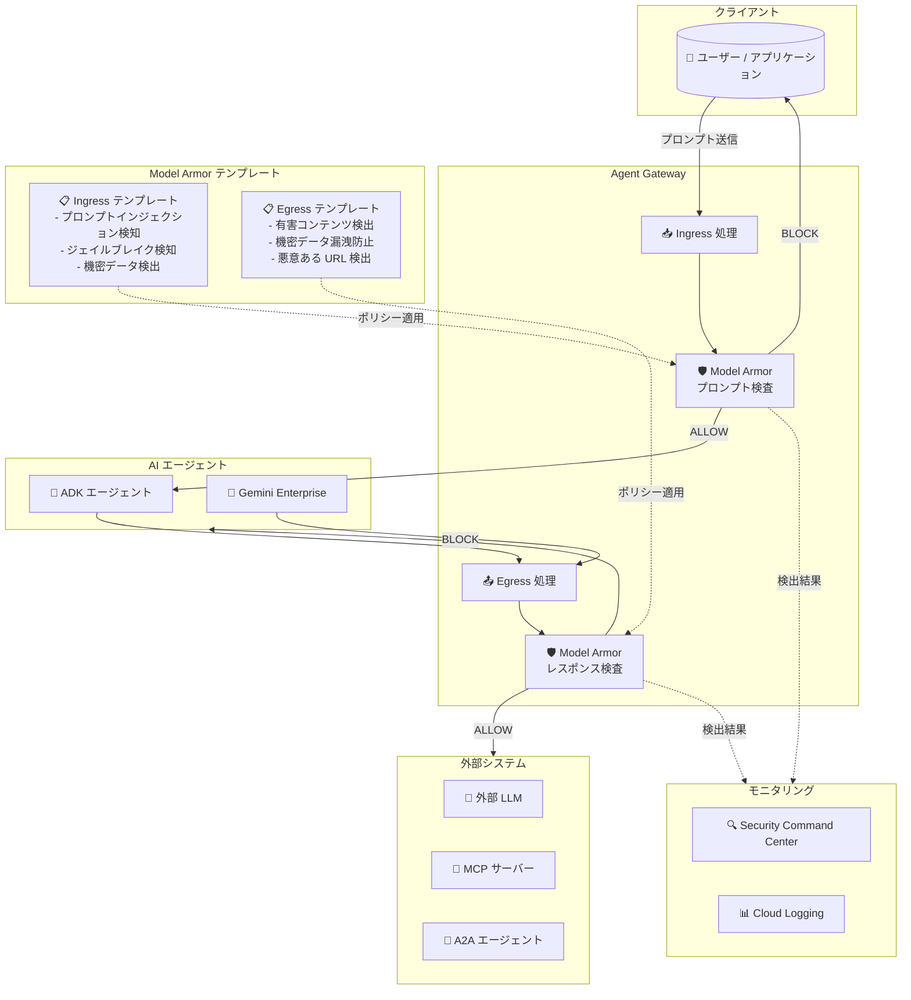

# Gemini Enterprise Agent Platform: Model Armor for Agent Gateway が GA

**リリース日**: 2026-06-24

**サービス**: Gemini Enterprise Agent Platform

**機能**: Model Armor for Agent Gateway

**ステータス**: General Availability (GA)

[このアップデートのインフォグラフィックを見る](https://takech9203.github.io/google-cloud-news-summary/20260624-gemini-agent-platform-model-armor-gateway-ga.html)

## 概要

Google Cloud は、Gemini Enterprise Agent Platform の Agent Gateway リソースに対する Model Armor の統合を一般提供 (GA) として発表した。この機能により、Agent Gateway を通過するプロンプトとレスポンスに対して、組織のコンテンツセキュリティガードレールを適用できるようになる。

Model Armor は、AI エージェントのセキュリティとガバナンスの基準を、エージェント内部にフィルタリングロジックを実装することなく一元的に適用する Google Cloud のサービスである。Agent Gateway と統合することで、ゲートウェイが管理する通信経路に直接スクリーニング機能が埋め込まれ、プロンプトインジェクション、ジェイルブレイク攻撃、機密情報の漏洩、有害コンテンツの生成といったリスクを軽減する。

この GA リリースにより、エンタープライズ企業は本番環境で SLA に裏打ちされたコンテンツセキュリティを AI エージェントのインフラストラクチャレベルで適用でき、セキュリティチームとエージェント開発者の双方に大きな価値を提供する。

**アップデート前の課題**

- AI エージェント個別にコンテンツフィルタリングロジックを実装する必要があり、一貫性の確保が困難だった
- エージェントごとにセキュリティポリシーを管理するため運用負荷が高く、ポリシーの漏れが発生しやすかった
- プロンプトインジェクションやジェイルブレイクに対する防御が各エージェントに依存し、組織全体での統一的な対策が取りづらかった
- Preview 段階では本番環境での利用に SLA が適用されず、エンタープライズ用途での採用に慎重にならざるを得なかった

**アップデート後の改善**

- Agent Gateway レベルでコンテンツセキュリティガードレールが一元適用され、ゲートウェイ配下の全エージェントに一貫したポリシーを強制できるようになった
- エージェント開発者はセキュリティロジックの実装から解放され、ビジネスロジックに集中できるようになった
- GA リリースにより SLA が適用され、本番環境での利用が正式にサポートされた
- Ingress (クライアント→エージェント) と Egress (エージェント→外部システム) 双方のトラフィックフローを保護可能になった

## アーキテクチャ図



この図は、Model Armor が Agent Gateway のインフラストラクチャに組み込まれ、Ingress (クライアントからエージェント) と Egress (エージェントから外部システム) の双方向トラフィックに対してコンテンツセキュリティ検査を実行する仕組みを示している。Model Armor テンプレートに基づいてトラフィックが ALLOW または BLOCK され、検出結果は Security Command Center と Cloud Logging に送信される。

## サービスアップデートの詳細

### 主要機能

1. **双方向トラフィック保護**
   - **Client-to-Agent (Ingress)**: クライアントからエージェントへのリクエストと、エージェントからクライアントへのレスポンスを検査
   - **Agent-to-Anywhere (Egress)**: エージェントから外部 LLM、MCP サーバー、A2A エージェントへの通信を検査
   - 各方向に個別のテンプレートを適用可能、または同一テンプレートを共用可能

2. **コンテンツセキュリティフィルター**
   - **プロンプトインジェクション検知**: 悪意ある入力の検出とブロック (最大 10,000 トークン対応)
   - **ジェイルブレイク検知**: LLM の制約を回避する試みの検出
   - **責任ある AI フィルター**: ヘイトスピーチ、ハラスメント、危険なコンテンツ、性的に露骨なコンテンツの検出
   - **機密データ保護**: PII (個人識別情報) や知的財産の漏洩検知とリダクション
   - **悪意ある URL 検出**: 有害なリンクの検出

3. **柔軟なエンフォースメントモード**
   - **Inspect only (検査のみ)**: ポリシー違反を検出してログに記録するが、トラフィックはブロックしない。テスト・チューニング段階に適切
   - **Inspect and block (検査とブロック)**: ポリシー違反を検出し、コンテンツをブロックまたはリダクション。本番環境での運用に適切

4. **ストリーミング対応**
   - リアルタイムストリーミングモードで無制限トークンをサポート
   - 長時間のインタラクションやモデルレスポンスに適用可能 (ADK エージェントの streamQuery メソッドに対応)

5. **ドキュメントスクリーニング**
   - PDF、CSV、TXT、Microsoft Office ファイル (Word、PowerPoint、Excel) のテキストコンテンツを検査可能
   - 入力サイズ上限: 4 MB

## 技術仕様

### 対応プロトコルとペイロード

| トラフィック方向 | プロトコル | サニタイズ対象 |
|---|---|---|
| Ingress (Client-to-Agent) | ADK (streamQuery) | リクエスト/レスポンス |
| Egress (A2A) | A2A v1 | Send Message、Agent Card、JSON-RPC、HTTP+JSON/REST |
| Egress (MCP) | MCP | tools/call、prompts/get (リクエスト/レスポンス) |
| Egress (外部 LLM) | OpenAI API 互換 | Chat Completions、Responses、Embeddings |

### 信頼度レベル設定

| レベル | 検出確率 | 誤検知リスク | 推奨用途 |
|---|---|---|---|
| High | 違反がほぼ確実な場合のみ検出 | 極めて低い | 本番環境 (中断なし重視) |
| Medium and above | バランスの取れた検出 | 中程度 | 標準的なエンタープライズ用途 |
| Low and above | わずかな兆候でも検出 | 高い | プロンプトインジェクション検知 (高リスク領域) |

### 必要な IAM ロール

```yaml
# Model Armor テンプレート管理
- roles/modelarmor.admin

# Ingress (Agent Gateway → Model Armor)
- roles/modelarmor.calloutUser  # エージェントプロジェクト
- roles/modelarmor.user          # テンプレートプロジェクト

# Egress (Agent Gateway → Model Armor)
- roles/modelarmor.calloutUser          # ゲートウェイプロジェクト
- roles/serviceusage.serviceUsageConsumer  # ゲートウェイプロジェクト
- roles/modelarmor.user                    # テンプレートプロジェクト
```

## 設定方法

### 前提条件

1. Google Cloud プロジェクトで Model Armor API が有効化されていること
2. Agent Gateway がセットアップ済みであること
3. `roles/modelarmor.admin` IAM ロールが付与されていること
4. Model Armor テンプレートと Agent Gateway が同一リージョンにデプロイされていること

### 手順

#### ステップ 1: Model Armor API の有効化

```bash
gcloud services enable modelarmor.googleapis.com \
  --project=PROJECT_ID
```

Model Armor API を有効化する。

#### ステップ 2: Model Armor テンプレートの作成

Agent Gateway と同じリージョンに Model Armor テンプレートを作成する。テンプレートでは、検出するフィルターの種類と信頼度レベル、エンフォースメントモード (Inspect only / Inspect and block) を設定する。

```bash
# Google Cloud Console で作成する場合
# https://console.cloud.google.com/security/model-armor にアクセス
# 「テンプレートを作成」から設定

# テンプレート名を控えておく (後のステップで使用)
```

テンプレートでは以下を設定:
- 責任ある AI フィルター (ヘイトスピーチ、ハラスメント等) の閾値
- プロンプトインジェクション/ジェイルブレイク検知の閾値
- Sensitive Data Protection (機密データ保護) の設定
- エンフォースメントタイプ (INSPECT_ONLY / INSPECT_AND_BLOCK)

#### ステップ 3: Agent Gateway のセットアップと Model Armor テンプレートの関連付け

```bash
# Agent Gateway セットアップ時に Model Armor テンプレートを指定
# Client-to-Agent (Ingress) ゲートウェイの場合:
#   - Ingress トラフィック用テンプレートを指定

# Agent-to-Anywhere (Egress) ゲートウェイの場合:
#   - Egress トラフィック用テンプレートを指定
```

Agent Gateway のセットアップ手順に従い、作成した Model Armor テンプレートをゲートウェイに関連付ける。

#### ステップ 4: クロスプロジェクト構成の場合の IAM 設定

```bash
# テンプレートとゲートウェイが異なるプロジェクトにある場合
# Ingress の場合
gcloud projects add-iam-policy-binding TEMPLATE_PROJECT_ID \
  --member="serviceAccount:SERVICE_AGENT_SA" \
  --role="roles/modelarmor.user"

# Egress の場合
gcloud projects add-iam-policy-binding GATEWAY_PROJECT_ID \
  --member="serviceAccount:AGENT_GATEWAY_SA" \
  --role="roles/modelarmor.calloutUser"

gcloud projects add-iam-policy-binding TEMPLATE_PROJECT_ID \
  --member="serviceAccount:AGENT_GATEWAY_SA" \
  --role="roles/modelarmor.user"
```

テンプレートとゲートウェイが異なるプロジェクトにある場合、適切なサービスアカウントに IAM ロールを付与する。

## メリット

### ビジネス面

- **コンプライアンスの統一的な適用**: 組織全体のAIエージェントに対してコンテンツセキュリティポリシーを一元管理でき、規制要件への準拠を容易にする
- **運用コストの削減**: エージェント個別のセキュリティ実装が不要になり、開発・保守コストが削減される
- **リスクの軽減**: プロンプトインジェクションや機密データ漏洩による情報セキュリティインシデントのリスクを大幅に低減

### 技術面

- **インフラストラクチャレベルの適用**: ゲートウェイ層でのフィルタリングにより、エージェントのフレームワークや実装に依存しない一貫した保護を実現
- **段階的なロールアウト**: Inspect only モードで既存トラフィックへの影響をテストしてから Inspect and block に移行可能
- **Security Command Center 統合**: 検出結果が SCC に自動連携され、セキュリティ運用の既存ワークフローに統合できる
- **ステートレス処理**: コンテンツを保存しないプライバシー重視の設計で、データレジデンシー要件にも対応

## デメリット・制約事項

### 制限事項

- Ingress のストリーミングサニタイゼーションは ADK で構築されたエージェントの streamQuery メソッドのみ対応
- Model Armor と Agent Gateway は同一リージョンにデプロイする必要があり、クロスリージョン呼び出しは非対応
- Egress のインライン保護は MCP サーバー、OpenAI 形式互換 LLM、A2A (Agent Gateway 経由) に限定
- Ingress のインライン保護は ADK で構築されたエージェントのみ対応
- Client-to-Agent モードは Gemini Enterprise では非対応 (Agent Runtime のみ)
- ファイルサイズ上限は 4 MB

### 考慮すべき点

- 誤検知 (false positive) によるユーザー体験の劣化リスクがあるため、初期段階では Inspect only モードでの検証が推奨
- クロスプロジェクト構成では双方のプロジェクトで十分な API クォータが必要
- フィルター閾値の設定は反復的なテストとチューニングが必要であり、代表的なプロンプトデータセットでの事前検証が重要

## ユースケース

### ユースケース 1: エンタープライズカスタマーサポート AI

**シナリオ**: 大企業が複数の ADK ベースの AI カスタマーサポートエージェントを運用しており、顧客がクレジットカード番号や住所などの個人情報を誤って入力するリスクがある。また、悪意あるユーザーによるプロンプトインジェクション攻撃から保護する必要がある。

**実装例**:
```yaml
# Model Armor テンプレート設定 (Ingress)
enforcement_type: INSPECT_AND_BLOCK
filters:
  prompt_injection:
    confidence_level: MEDIUM_AND_ABOVE
  jailbreak_detection:
    confidence_level: MEDIUM_AND_ABOVE
  sensitive_data_protection:
    inspect_template: projects/PROJECT_ID/locations/REGION/inspectTemplates/PII_TEMPLATE
    deidentify_template: projects/PROJECT_ID/locations/REGION/deidentifyTemplates/REDACT_TEMPLATE
```

**効果**: 顧客の個人情報が自動的にリダクションされ、エージェントに到達する前に保護される。プロンプトインジェクション攻撃は Medium 以上の信頼度で検出・ブロックされる。

### ユースケース 2: マルチエージェント環境での外部 LLM 連携保護

**シナリオ**: 複数の AI エージェントが外部の LLM サービスや MCP サーバーと連携しており、エージェントが意図せず機密情報を外部に送信するリスクや、外部 LLM からの有害なレスポンスを受信するリスクがある。

**効果**: Agent Gateway の Egress トラフィックに Model Armor を適用することで、組織の知的財産や機密データが外部システムに漏洩することを防止し、外部からの有害コンテンツをブロックする。すべてのエージェント通信が一元的に監視・保護される。

## 料金

Model Armor は Pay-as-you-go とサブスクリプションの両方で利用可能。

### 料金例

| プラン | 無料枠 | 追加料金 |
|---|---|---|
| Model Armor (スタンドアロン / Agent Platform 統合) | 月間 200 万トークンまで無料 | 100 万トークンあたり $0.10 |
| SCC Premium (Pay-as-you-go) | 月間 200 万トークンまで無料 | 100 万トークンあたり $0.10 |
| SCC Premium / Enterprise (サブスクリプション) | 月間 30 億トークン含む | 100 万トークンあたり $0.10 |
| Gemini Enterprise App | Gemini Enterprise サブスクリプションに含む | - |

## 利用可能リージョン

Model Armor と Agent Gateway は同一リージョンにデプロイする必要がある。Gemini Enterprise との連携では以下のマッピングに従う:

| Gemini Enterprise ロケーション | 必要な Agent Gateway リージョン |
|---|---|
| global | us-central1 |
| us | us-central1 |
| eu | europe-west1 |

Agent Runtime の場合は、エージェントがデプロイされているリージョンと同じプロジェクト・リージョンに Agent Gateway をデプロイする。

## 関連サービス・機能

- **Security Command Center**: Model Armor の検出結果 (Findings) が自動的に SCC に連携され、セキュリティ運用ダッシュボードで確認可能
- **Cloud Logging**: ポリシー違反イベントの詳細ログを記録。Inspect only モードでの監視にも活用
- **Sensitive Data Protection (DLP)**: Model Armor の高度な機密データ保護設定で DLP テンプレートを使用し、PII のリダクションを実現
- **Agent Registry**: Agent Gateway が管理するエージェント、エンドポイント、MCP サーバーの登録・メタデータ管理
- **Agent Development Kit (ADK)**: Ingress のストリーミングサニタイゼーションに対応するエージェント開発フレームワーク
- **Context-Aware Access**: エージェント ID を mTLS と DPoP で暗号的に認証し、Agent Gateway の認可決定に活用

## 参考リンク

- [インフォグラフィック](https://takech9203.github.io/google-cloud-news-summary/20260624-gemini-agent-platform-model-armor-gateway-ga.html)
- [公式ドキュメント: Configure Model Armor on a gateway](https://docs.cloud.google.com/gemini-enterprise-agent-platform/govern/configure-model-armor)
- [Model Armor 概要](https://docs.cloud.google.com/model-armor/overview)
- [Agent Gateway 概要](https://docs.cloud.google.com/gemini-enterprise-agent-platform/govern/gateways/agent-gateway-overview)
- [Agent Gateway セットアップガイド](https://docs.cloud.google.com/gemini-enterprise-agent-platform/govern/gateways/set-up-agent-gateway)
- [Model Armor と Agent Gateway の統合](https://docs.cloud.google.com/model-armor/model-armor-agent-gateway-integration)
- [料金ページ](https://cloud.google.com/security/products/model-armor#pricing)

## まとめ

Model Armor for Agent Gateway の GA リリースは、エンタープライズ AI エージェントのセキュリティガバナンスにおける重要なマイルストーンである。インフラストラクチャレベルでコンテンツセキュリティガードレールを適用することで、エージェント開発者はビジネスロジックに集中しつつ、セキュリティチームは組織全体の AI 利用に対する一貫したポリシー適用を実現できる。既に AI エージェントを運用している組織は、まず Inspect only モードでの導入を検討し、既存トラフィックパターンを分析した上で段階的に Inspect and block モードへ移行することを推奨する。

---

**タグ**: #GeminiEnterpriseAgentPlatform #ModelArmor #AgentGateway #AIセキュリティ #GA #コンテンツセキュリティ #プロンプトインジェクション #ガードレール
