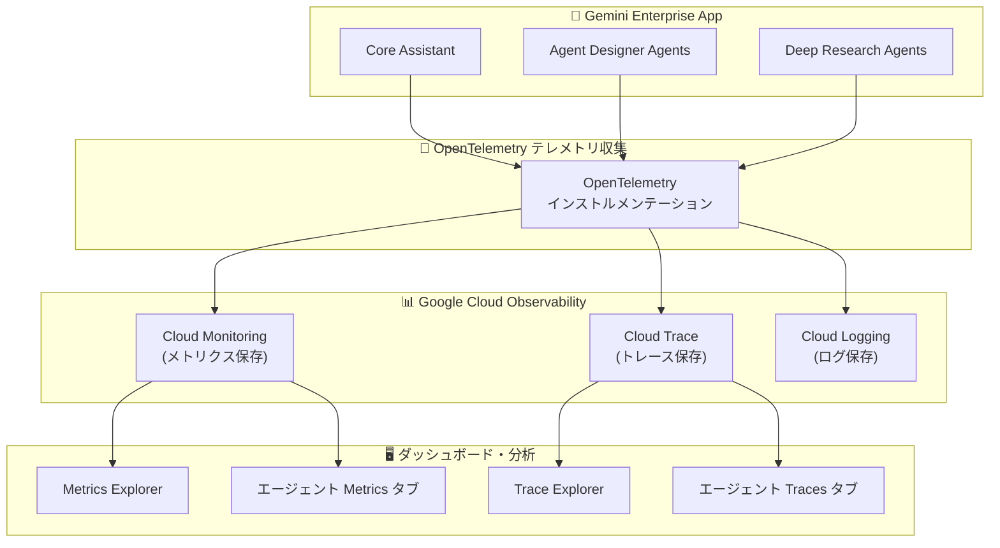

# Gemini Enterprise: エージェント向けオブザーバビリティ機能 (GA)

**リリース日**: 2026-06-24

**サービス**: Gemini Enterprise

**機能**: Observability for agents

**ステータス**: GA (一般提供開始)

📊 [このアップデートのインフォグラフィックを見る](https://takech9203.github.io/google-cloud-news-summary/20260624-gemini-enterprise-observability-agents-ga.html)

## 概要

Gemini Enterprise のエージェント向けオブザーバビリティ機能が一般提供 (GA) となった。この機能により、Gemini Enterprise アプリケーション内のエージェントおよび Core Assistant の動作・パフォーマンス・健全性を包括的に可視化できるようになる。

本機能では、アプリケーションレベルおよび個別エージェントレベルでオブザーバビリティ設定を構成でき、Metrics Explorer でのメトリクスダッシュボード表示、Trace Explorer でのトレーススパン表示が可能となる。OpenTelemetry 形式のテレメトリデータを活用し、エージェントの非決定的な推論ループを含む複雑な実行パスを詳細に追跡できる。

対象ユーザーは、Gemini Enterprise を利用してエージェントベースの AI ソリューションを構築・運用する組織の管理者・開発者・SRE チームである。

**アップデート前の課題**

- エージェントの実行パスやツール呼び出しの詳細な追跡が困難であり、問題の根本原因特定に時間がかかっていた
- メトリクスやトレースデータの収集には手動でのカスタムインストルメンテーションが必要だった
- エージェントのパフォーマンス（レイテンシ、エラー率、ツール使用状況）を統合的に把握する手段が限定的だった
- Preview 段階では本番環境での利用に SLA が保証されていなかった

**アップデート後の改善**

- アプリレベルおよびエージェントレベルでオブザーバビリティ設定をトグルで簡単に有効化できるようになった
- Metrics Explorer で定義済みのメトリクス（セッション数、ターン数、ツール呼び出し数、レイテンシ）を即座に可視化できる
- Trace Explorer でエージェントの実行フロー全体をスパン単位で詳細に確認でき、DAG（有向非巡回グラフ）として視覚化できる
- GA としてプロダクション環境での利用が正式にサポートされた

## アーキテクチャ図



Gemini Enterprise のエージェントが OpenTelemetry 形式でテレメトリデータを送信し、Cloud Monitoring・Cloud Trace・Cloud Logging に保存される。管理者は Metrics Explorer / Trace Explorer またはエージェント専用タブからデータを参照できる。

## サービスアップデートの詳細

### 主要機能

1. **アプリレベル・エージェントレベルのオブザーバビリティ設定**
   - Core Assistant エージェント: アプリの「Configurations」からオブザーバビリティタブで設定
   - Agent Designer エージェント・Deep Research エージェント: 個別エージェントの設定内で有効化
   - 2 つの設定トグル: OpenTelemetry トレース/ログのインストルメンテーション有効化、プロンプト入出力のログ記録有効化

2. **Metrics Explorer でのメトリクスダッシュボード**
   - セッション数、ツール呼び出し数、ターン数、レイテンシなどの定義済みメトリクスを可視化
   - `discoveryengine.googleapis.com/` プレフィックスでメトリクスを公開
   - 1 分間隔でデータ更新
   - カスタムダッシュボード作成やアラート設定にも対応

3. **Trace Explorer でのトレーススパン表示**
   - エージェントの実行フロー全体をスパン単位で追跡
   - セッションビュー、トレースビュー、スパンビューの 3 つの表示モード
   - DAG（有向非巡回グラフ）とタイムラインでの視覚化
   - Agent to Tool、Invoke Agent、Agent to Model のスパンタイプ分類

4. **エージェント専用 Metrics タブ**
   - Overview: セッション数、平均セッション時間、エージェント呼び出し数、レイテンシ、トラフィック、エラー率
   - Tools: ツール別呼び出し数、P95 レイテンシ、エラー率、ツール未使用率

5. **エージェント専用 Traces タブ**
   - トレースサマリーテーブル: ステータス、スパン ID、スパン名、スパンタイプ、期間、入出力、開始時刻
   - 詳細トレースビュー: サマリー、ログ、評価結果、入出力、イベント、スタックトレース、メタデータ、属性

## 技術仕様

### メトリクス一覧

| メトリクス名 | 説明 |
|------|------|
| Gemini Enterprise Agent Session Count | エージェントが処理したセッション数 |
| Gemini Enterprise Agent Tool Count | エージェントがツールを呼び出した回数 |
| Gemini Enterprise Agent Turn Count | セッション内の会話ターン数 |
| Gemini Enterprise Agent Total Latency | エージェント応答の合計レイテンシ |
| Gemini Enterprise Agent Tool Total Latency | ツール実行の合計レイテンシ |
| Gemini Enterprise DataConnector Request Count | データコネクタへのリクエスト総数 |

### データ保持期間

| データ種別 | 保持期間 | 保存先 |
|------|------|------|
| メトリクス | 6 週間 | Cloud Monitoring |
| トレース/スパン | 30 日間 | Cloud Trace |
| ログ | Cloud Logging のポリシーに準拠 | Cloud Logging |

### IAM ロール要件

| 操作 | 必要なロール |
|------|------|
| オブザーバビリティ設定の管理 | Gemini Enterprise Admin (`discoveryengine.agentspaceAdmin`) |
| メトリクスの閲覧 | Monitoring Viewer (`roles/monitoring.viewer`) |
| トレースの閲覧 | Cloud Trace User (`roles/cloudtrace.user`) |
| ログの閲覧 | Logs Viewer (`roles/logging.viewer`) |

### REST API 設定例

```json
{
  "observabilityConfig": {
    "observabilityEnabled": true,
    "sensitiveLoggingEnabled": false
  }
}
```

## 設定方法

### 前提条件

1. Gemini Enterprise Admin ロールを持つアカウント
2. 既存の Gemini Enterprise Web アプリ
3. Metrics Explorer 利用時: Monitoring Viewer ロール
4. Trace Explorer 利用時: Cloud Trace User ロール

### 手順

#### ステップ 1: オブザーバビリティの有効化 (Console)

1. Google Cloud コンソールで Gemini Enterprise ページに移動
2. 対象アプリの名前をクリック
3. エージェントタイプに応じて設定:
   - **Core Assistant**: 「Configurations」をクリック → 「Observability」タブ
   - **その他のエージェント**: 「Agents」→ 対象エージェント → 「Observability」タブ
4. 「Enable instrumentation of OpenTelemetry traces and logs」を有効化
5. 必要に応じて「Enable logging of prompt inputs and response outputs」を有効化

#### ステップ 2: オブザーバビリティの有効化 (REST API)

```bash
# アプリレベル (Core Assistant) でオブザーバビリティを有効化
curl -X PATCH \
  -H "Authorization: Bearer $(gcloud auth print-access-token)" \
  -H "Content-Type: application/json" \
  -H "X-Goog-User-Project: PROJECT_ID" \
  "https://ENDPOINT_LOCATION-discoveryengine.googleapis.com/v1alpha/projects/PROJECT_ID/locations/LOCATION/collections/default_collection/engines/APP_ID?updateMask=observabilityConfig" \
  -d '{
    "observabilityConfig": {
      "observabilityEnabled": true,
      "sensitiveLoggingEnabled": false
    }
  }'
```

- `ENDPOINT_LOCATION`: マルチリージョン (`us`, `eu`, `global`)
- `PROJECT_ID`: プロジェクト ID
- `LOCATION`: データストアのマルチリージョン
- `APP_ID`: アプリ ID

#### ステップ 3: メトリクスの確認

1. Google Cloud コンソールで Metrics Explorer ページに移動
2. 「Select a metric」をクリック
3. 「Gemini Enterprise Agent」で検索し、目的のメトリクスを選択
4. ラベルフィルタ、集約設定、時間範囲を調整

#### ステップ 4: トレースの確認

1. Google Cloud コンソールで Trace Explorer ページに移動
2. 対象プロジェクトを選択
3. テーブル内の Span ID をクリックしてトレース詳細を表示
4. または、エージェントの「Traces」タブからセッション・トレース・スパンビューを切り替え

## メリット

### ビジネス面

- **運用コストの削減**: エージェントの問題を迅速に特定・解決でき、MTTR（平均復旧時間）を短縮
- **サービス品質の向上**: メトリクスベースのアラート設定により、ユーザー影響が発生する前に問題を検知
- **データ駆動の意思決定**: エージェントの使用パターンやパフォーマンストレンドに基づくリソース最適化

### 技術面

- **OpenTelemetry 標準準拠**: ベンダー非依存のテレメトリフォーマットにより、他のオブザーバビリティツールとの相互運用性を確保
- **エンドツーエンドの可視性**: エージェントからモデル呼び出し、ツール実行まで、リクエストのライフサイクル全体を追跡
- **粒度の高いデバッグ**: スパン単位での入出力確認、スタックトレース、属性情報により、非決定的なエージェント動作の根本原因を特定

## デメリット・制約事項

### 制限事項

- メトリクスの保持期間は 6 週間、トレースは 30 日間に限定される
- プロンプト入出力のログ記録を有効にすると、PII（個人識別情報）を含む機密データがログに記録される可能性がある
- Google Cloud コンソールでの使用（Vertex AI Studio など）のメトリクスはダッシュボードに追加されない

### 考慮すべき点

- プロンプト入出力のログ記録は機密データを含むため、アクセス権限を適切に制限する必要がある
- オブザーバビリティ有効化によるテレメトリ送信はわずかなオーバーヘッドを伴う
- 大量のトレースデータが生成される環境では Cloud Trace のコストに注意

## ユースケース

### ユースケース 1: エージェントのレイテンシ問題の調査

**シナリオ**: 社内ナレッジベースに接続した Gemini Enterprise エージェントの応答が突然遅くなったと報告を受けた。

**実装例**:
1. エージェントの Metrics タブで「Agent latency」メトリクスを確認し、遅延の開始時刻を特定
2. Tools メトリクスで特定のツール（データコネクタ）の P95 レイテンシが急上昇していることを確認
3. Traces タブで該当時間帯のトレースを開き、Agent to Tool スパンの詳細を確認
4. スパンのメタデータから、バックエンドのデータソースでタイムアウトが発生していることを特定

**効果**: 問題の根本原因を数分で特定し、データソース側の設定修正により復旧

### ユースケース 2: エージェント品質の継続的モニタリング

**シナリオ**: 複数の部門向けにデプロイされた Agent Designer エージェント群の品質を継続的に監視したい。

**実装例**:
1. 各エージェントの Metrics タブで Overview メトリクスを定期確認
2. Metrics Explorer でカスタムダッシュボードを作成し、全エージェントのエラー率を一覧表示
3. エラー率が閾値を超えた場合のアラートポリシーを設定

**効果**: 品質劣化を早期に検知し、プロアクティブに対応できる体制を構築

## 料金

Gemini Enterprise はサブスクリプション・シートベースの課金モデルである。オブザーバビリティ機能自体は Gemini Enterprise サブスクリプションに含まれるが、テレメトリデータの保存には以下の Google Cloud サービスの料金が適用される:

| コンポーネント | 料金体系 |
|--------|-----------------|
| Cloud Monitoring (メトリクス) | Gemini Enterprise メトリクスは無料枠内（`discoveryengine.googleapis.com/` プレフィックス） |
| Cloud Trace (トレース) | 取り込み量に応じた従量課金 |
| Cloud Logging (ログ) | 取り込み量に応じた従量課金 |

詳細は [Cloud Monitoring の料金](https://cloud.google.com/monitoring/pricing)、[Cloud Trace の料金](https://cloud.google.com/trace/pricing)、[Cloud Logging の料金](https://cloud.google.com/logging/pricing) を参照。

## 利用可能リージョン

Gemini Enterprise のオブザーバビリティ設定は、以下のマルチリージョンで利用可能:

- `us` (米国マルチリージョン)
- `eu` (EU マルチリージョン)
- `global` (グローバル)

## 関連サービス・機能

- **Cloud Monitoring**: メトリクスの保存・可視化・アラート設定の基盤サービス
- **Cloud Trace**: 分散トレーシングの保存・分析サービス
- **Cloud Logging**: ログの収集・保存・分析サービス
- **OpenTelemetry**: テレメトリデータの標準フォーマットとして採用されているオープンソースプロジェクト
- **Gemini Enterprise Agent Platform**: エージェントのデプロイ・管理・オブザーバビリティを統合的に提供するプラットフォーム
- **Agent Development Kit (ADK)**: エージェント開発フレームワーク。OpenTelemetry インストルメンテーションとの統合をサポート

## 参考リンク

- 📊 [インフォグラフィック](https://takech9203.github.io/google-cloud-news-summary/20260624-gemini-enterprise-observability-agents-ga.html)
- [公式リリースノート](https://cloud.google.com/release-notes)
- [Manage observability settings](https://docs.cloud.google.com/gemini/enterprise/docs/manage-observability-settings)
- [Access metrics](https://docs.cloud.google.com/gemini/enterprise/docs/access-metrics)
- [Access traces and spans](https://docs.cloud.google.com/gemini/enterprise/docs/access-traces-and-spans)
- [Gemini Enterprise Agent Platform Observability Overview](https://docs.cloud.google.com/gemini-enterprise-agent-platform/optimize/observability/overview)
- [View Agent Traces](https://docs.cloud.google.com/gemini-enterprise-agent-platform/optimize/observability/traces)
- [Gemini Enterprise エディション比較](https://docs.cloud.google.com/gemini/enterprise/docs/editions)

## まとめ

Gemini Enterprise のエージェント向けオブザーバビリティ機能の GA リリースにより、エンタープライズ環境でのエージェント運用に不可欠なメトリクス収集・トレーシング・ログ記録が本番レベルで利用可能になった。OpenTelemetry 標準に準拠したテレメトリ基盤により、エージェントの動作を詳細に可視化し、問題の迅速な特定と解決が可能となる。Gemini Enterprise でエージェントを運用している組織は、オブザーバビリティ設定を有効化し、Metrics Explorer と Trace Explorer を活用したモニタリング体制を構築することを推奨する。

---

**タグ**: #GeminiEnterprise #Observability #GA #CloudMonitoring #CloudTrace #OpenTelemetry #AgentPlatform #メトリクス #トレーシング
