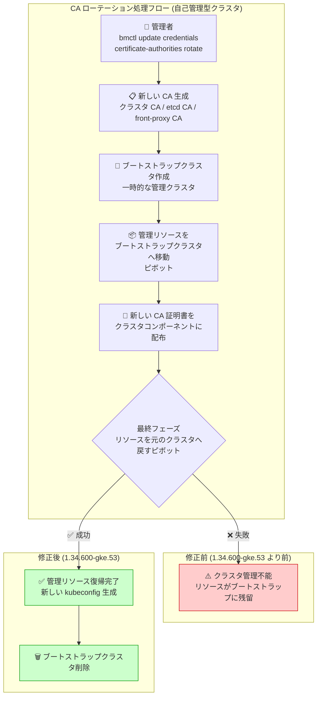

# Google Distributed Cloud (software only) for bare metal: バージョン 1.34.600-gke.53 リリース (CA ローテーション修正)

**リリース日**: 2026-06-24

**サービス**: Google Distributed Cloud (software only) for bare metal

**機能**: バージョン 1.34.600-gke.53 - CA ローテーション修正およびノードテイント修正

**ステータス**: Announcement / Fixed

📊 [このアップデートのインフォグラフィックを見る](https://takech9203.github.io/google-cloud-news-summary/20260624-google-distributed-cloud-bare-metal-1-34-600.html)

## 概要

Google Distributed Cloud (software only) for bare metal のバージョン 1.34.600-gke.53 がリリースされた。本リリースは Kubernetes v1.34.7-gke.200 上で動作し、重大なセキュリティ脆弱性の修正に加え、自己管理型クラスタ (admin、hybrid、standalone) における Certificate Authority (CA) ローテーションの致命的な不具合と、ノードプール更新時にテイントやラベルが恒久的に残留する問題を修正している。

特に CA ローテーションの不具合は、クラスタを管理不能な状態に陥らせる可能性がある重大な問題であり、CA ローテーションを実施する前に本バージョンへのアップグレードが必須となる。リリース後、GKE On-Prem API クライアント (Google Cloud コンソール、gcloud CLI、Terraform) でインストールまたはアップグレードが可能になるまで約 7〜14 日かかる。

**アップデート前の課題**

- 自己管理型クラスタ (admin、hybrid、standalone) で CA ローテーションを実行すると、最終フェーズで一時ブートストラップクラスタから自己管理型クラスタへ管理リソースを戻す際に失敗し、クラスタが管理不能な状態になる可能性があった
- ノードプール更新中に一時的または部分的な障害が発生すると、NodePool カスタムリソースの仕様から削除してもノードテイントやラベルがワーカーノードに恒久的に残留 (stranded) してしまう問題があった
- セキュリティ脆弱性が存在していた

**アップデート後の改善**

- CA ローテーションの最終フェーズ (ピボット処理) が正しく動作するようになり、自己管理型クラスタでも安全に CA ローテーションを実施可能になった
- ノードプール更新時の障害が発生しても、テイントやラベルが正しく reconcile され、仕様と実際のノード状態の一貫性が保たれるようになった
- セキュリティ脆弱性が修正された

## アーキテクチャ図



本図は CA ローテーション処理のフローと、修正前後の動作の違いを示している。修正前はピボット処理の最終フェーズで失敗しクラスタが管理不能になる可能性があったが、修正後は正常に管理リソースが元のクラスタに戻される。

## サービスアップデートの詳細

### 主要機能

1. **CA ローテーション修正 (重大)**
   - 対象: 自己管理型クラスタ (admin、hybrid、standalone)
   - 問題: CA ローテーションの最終フェーズで、一時ブートストラップクラスタから自己管理型クラスタへ管理リソースを戻す「ピボット」処理が失敗する
   - 影響: クラスタが管理不能な状態に陥り、復旧が困難になる
   - 対処: 1.34.600-gke.53 へのアップグレードが CA ローテーション実施の前提条件

2. **ノードテイント・ラベルの残留修正**
   - 対象: すべてのクラスタタイプのワーカーノード
   - 問題: ノードプール更新中に一時的または部分的な障害が発生した場合、NodePool カスタムリソースの仕様からテイントやラベルを削除しても、実際のノードから除去されずに残留する
   - 影響: Pod スケジューリングが意図しない動作をする可能性
   - 修正内容: 障害発生後も reconciliation が正しく動作し、仕様と実状態の整合性が保たれる

3. **セキュリティ脆弱性修正**
   - 詳細は [Vulnerability fixes](https://cloud.google.com/kubernetes-engine/distributed-cloud/bare-metal/docs/vulnerabilities) を参照

## 技術仕様

### バージョン情報

| 項目 | 詳細 |
|------|------|
| リリースバージョン | 1.34.600-gke.53 |
| Kubernetes バージョン | v1.34.7-gke.200 |
| マイナーバージョン系列 | 1.34 |
| API クライアント利用可能日 | リリース後 7〜14 日 |

### CA ローテーションの技術詳細

| 項目 | 詳細 |
|------|------|
| 対象 CA | クラスタ CA、etcd CA、front-proxy CA |
| 対象クラスタ | admin、hybrid、standalone (自己管理型) |
| ローテーション方式 | インクリメンタル (段階的) |
| 所要時間 (目安) | コントロールプレーン 1 台 + ワーカーノード 50 台で約 2 時間 |
| 中断可否 | 一度開始するとパーズやロールバック不可 |

### ノードテイント・ラベルの reconciliation 仕様

| 項目 | 詳細 |
|------|------|
| Reconciliation 対象 | NodePool.spec.taints および NodePool.spec.labels |
| 無効化アノテーション | `baremetal.cluster.gke.io/label-taint-no-sync` |
| 動作 | ノードに直接追加されたテイント・ラベルは同期時に削除される |

## 設定方法

### 前提条件

1. 最新の `bmctl` バイナリ (1.34.600-gke.53) をダウンロード済みであること
2. Application Default Credentials (ADC) が設定済みであること
3. サードパーティストレージベンダーを使用している場合、[Google Distributed Cloud-ready storage partners](https://cloud.google.com/kubernetes-engine/distributed-cloud/bare-metal/docs/concepts/storage-partners) ドキュメントで互換性を確認すること

### 手順

#### ステップ 1: ADC の設定

```bash
gcloud auth application-default login
```

#### ステップ 2: クラスタ構成ファイルの更新

```yaml
apiVersion: baremetal.cluster.gke.io/v1
kind: Cluster
metadata:
  name: my-cluster
  namespace: cluster-my-cluster
spec:
  type: admin  # admin, hybrid, または standalone
  anthosBareMetalVersion: 1.34.600-gke.53
```

#### ステップ 3: クラスタのアップグレード

```bash
bmctl upgrade cluster -c CLUSTER_NAME --kubeconfig ADMIN_KUBECONFIG
```

アップグレード完了後、CA ローテーションを安全に実施可能。

#### ステップ 4: CA ローテーションの実施 (必要な場合)

```bash
bmctl update credentials certificate-authorities rotate \
  --cluster CLUSTER_NAME \
  --kubeconfig KUBECONFIG
```

## メリット

### ビジネス面

- **運用リスクの大幅低減**: CA ローテーションによるクラスタ管理不能状態の回避により、本番環境の可用性が向上
- **コンプライアンス対応の安全化**: 定期的な CA ローテーションを安全に実施でき、セキュリティポリシーへの準拠が容易になる
- **運用コスト削減**: ノードテイント残留問題の手動修復作業が不要になる

### 技術面

- **ピボット処理の信頼性向上**: ブートストラップクラスタから自己管理型クラスタへのリソース移行が確実に完了する
- **状態の一貫性保証**: ノードプールの宣言的仕様と実際のノード状態が常に一致する
- **セキュリティ強化**: 既知の脆弱性が修正され、攻撃面が縮小される

## デメリット・制約事項

### 制限事項

- リリース後、GKE On-Prem API クライアント (コンソール、gcloud CLI、Terraform) で利用可能になるまで 7〜14 日かかる
- CA ローテーションは一度開始すると中断やロールバックができない
- CA ローテーション中はクラスタ管理操作が実行不可
- HA 構成でないクラスタでは CA ローテーション中に短時間のコントロールプレーンダウンタイムが発生する

### 考慮すべき点

- 1.34.600-gke.53 より前のバージョンで CA ローテーションを実行すると問題が発生するため、**必ず先にアップグレードを完了させること**
- アップグレードには事前のプリフライトチェックが含まれるが、失敗する場合は [トラブルシューティングガイド](https://cloud.google.com/kubernetes-engine/distributed-cloud/bare-metal/docs/troubleshooting/create-upgrade) を参照
- サードパーティストレージベンダーの互換性確認を忘れないこと

## ユースケース

### ユースケース 1: 定期的な CA ローテーション (セキュリティコンプライアンス)

**シナリオ**: エンタープライズ環境で、セキュリティポリシーにより年 1 回以上の CA ローテーションが義務付けられている。自己管理型の admin クラスタで CA ローテーションを安全に実施したい。

**実装例**:
```bash
# 1. まずクラスタを 1.34.600-gke.53 にアップグレード
bmctl upgrade cluster -c admin-cluster --kubeconfig admin-cluster-kubeconfig

# 2. アップグレード完了を確認
kubectl get cluster admin-cluster -n cluster-admin-cluster \
  --kubeconfig admin-cluster-kubeconfig \
  -o jsonpath='{.status.anthosBareMetalVersion}'

# 3. CA ローテーションを実施
bmctl update credentials certificate-authorities rotate \
  --cluster admin-cluster \
  --kubeconfig admin-cluster-kubeconfig
```

**効果**: CA ローテーションが安全に完了し、クラスタが管理不能な状態に陥るリスクがなくなる。

### ユースケース 2: ノードプールのテイント管理

**シナリオ**: GPU ワークロード用のノードプールにテイントを設定していたが、ワークロード変更に伴いテイントを削除したい。以前のバージョンでは更新中の障害によりテイントが残留する可能性があった。

**実装例**:
```yaml
apiVersion: baremetal.cluster.gke.io/v1
kind: NodePool
metadata:
  name: gpu-pool
  namespace: cluster-my-cluster
spec:
  clusterName: my-cluster
  nodes:
    - address: 10.200.0.7
    - address: 10.200.0.8
  # taints セクションを削除してテイントを除去
  labels:
    workload-type: general
```

**効果**: テイントの削除が確実に反映され、Pod が正しくスケジューリングされる。

## 料金

Google Distributed Cloud (software only) for bare metal の料金は、クラスタの vCPU 数に基づく課金モデルとなっている。詳細は [料金ページ](https://cloud.google.com/kubernetes-engine/distributed-cloud/bare-metal/pricing) を参照。本パッチリリース自体による追加料金は発生しない。

## 利用可能リージョン

Google Distributed Cloud for bare metal はオンプレミス環境で動作するため、特定の Google Cloud リージョンに依存しない。ただし、GKE On-Prem API クライアント (コンソール、gcloud CLI、Terraform) を使用する場合は、クラスタ登録時に指定した Google Cloud リージョンに関連付けられる。

## 関連サービス・機能

- **GKE Enterprise**: Google Distributed Cloud for bare metal は GKE Enterprise の一部として提供され、マルチクラスタ管理、ポリシー管理、サービスメッシュなどの機能を利用可能
- **Connect Gateway**: オンプレミスクラスタへのリモートアクセスを提供し、Google Cloud コンソールからの管理を可能にする
- **Cloud Monitoring / Cloud Logging**: クラスタのメトリクスとログを Google Cloud に送信し、統合的な可観測性を実現
- **Binary Authorization**: コンテナイメージのデプロイポリシーを適用し、信頼できるイメージのみの実行を保証
- **Config Sync**: GitOps ベースの構成管理により、クラスタ構成の一貫性を維持

## 参考リンク

- 📊 [インフォグラフィック](https://takech9203.github.io/google-cloud-news-summary/20260624-google-distributed-cloud-bare-metal-1-34-600.html)
- [公式リリースノート](https://cloud.google.com/kubernetes-engine/distributed-cloud/bare-metal/docs/release-notes#June_24_2026)
- [クラスタのアップグレード手順](https://cloud.google.com/kubernetes-engine/distributed-cloud/bare-metal/docs/how-to/upgrade)
- [CA ローテーションガイド](https://cloud.google.com/kubernetes-engine/distributed-cloud/bare-metal/docs/how-to/ca-rotation)
- [脆弱性修正一覧](https://cloud.google.com/kubernetes-engine/distributed-cloud/bare-metal/docs/vulnerabilities)
- [ノードプール管理](https://cloud.google.com/kubernetes-engine/distributed-cloud/bare-metal/docs/how-to/add-remove-node-pools)
- [ストレージパートナー互換性](https://cloud.google.com/kubernetes-engine/distributed-cloud/bare-metal/docs/concepts/storage-partners)
- [アップグレードのライフサイクルとステージ](https://cloud.google.com/kubernetes-engine/distributed-cloud/bare-metal/docs/how-to/upgrade-lifecycle)

## まとめ

Google Distributed Cloud for bare metal 1.34.600-gke.53 は、自己管理型クラスタの CA ローテーションにおける致命的な不具合を修正した重要なパッチリリースである。CA ローテーションを実施する予定のある全ての自己管理型クラスタ (admin、hybrid、standalone) は、事前に本バージョンへのアップグレードが必須となる。また、ノードテイント・ラベルの残留問題の修正により、宣言的なノードプール管理の信頼性が向上している。対象クラスタを運用している場合は、速やかにアップグレード計画を策定することを推奨する。

---

**タグ**: #GoogleDistributedCloud #BareMetalクラスタ #CAローテーション #セキュリティ修正 #GKEEnterprise #Kubernetes #オンプレミス #クラスタ管理
