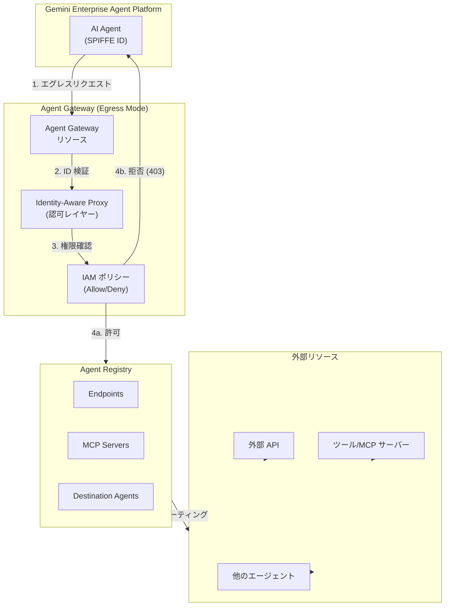

# Identity-Aware Proxy: Agent Gateway 向け Agent-to-Anywhere Egress セキュリティが GA

**リリース日**: 2026-06-24

**サービス**: Identity-Aware Proxy (IAP)

**機能**: Agent Gateway 向け Agent-to-Anywhere Egress セキュリティ

**ステータス**: GA (一般提供)

[このアップデートのインフォグラフィックを見る](https://takech9203.github.io/google-cloud-news-summary/20260624-iap-agent-gateway-egress-ga.html)

## 概要

Identity-Aware Proxy (IAP) が Agent Gateway における Agent-to-Anywhere エグレストラフィックのセキュリティ保護を正式に GA (一般提供) としてサポートしました。この機能により、Gemini Enterprise Agent Platform 上で動作するエージェントが外部のツール、MCP サーバー、API、他のエージェントにアクセスする際のすべてのアウトバウンド通信に対して、IAM ベースのきめ細かなアクセス制御ポリシーを適用できるようになります。

Agent Gateway は、Gemini Enterprise Agent Platform のネットワーキングおよびセキュリティの中核コンポーネントであり、エージェント間通信のすべてを統制するゲートウェイとして機能します。IAP は Agent Gateway のデフォルトの認可レイヤーとして動作し、エージェントの SPIFFE ID を検証し、割り当てられた IAM 権限を確認した上で、他のエージェントやツールへの呼び出しを許可または拒否します。

この GA により、エンタープライズ環境で AI エージェントのエグレストラフィックを本番品質のセキュリティで運用できるようになり、Zero Trust アーキテクチャの原則をエージェント間通信にも適用可能になります。

**アップデート前の課題**

- エージェントから外部サービスやツールへのアウトバウンド通信に対する一元的なアクセス制御メカニズムがなかった
- エージェントがどのリソースにアクセスしているかの可視性が限定的で、許可されていない通信先へのアクセスを防止することが困難だった
- VPC Service Controls ではエージェント固有のエグレスポリシー (どのエージェントがどのツールにアクセスできるか) をきめ細かく制御できなかった
- エージェントのアイデンティティに基づいた認可がなく、すべてのエージェントが同一の権限で外部通信を行っていた

**アップデート後の改善**

- IAP が Agent Gateway のデフォルト認可レイヤーとして、すべてのエグレストラフィックに対する IAM ベースのポリシー適用が GA 品質で利用可能になった
- `roles/iap.egressor` ロールにより、エージェント単位で個別のエンドポイントや MCP サーバーへのアクセス許可を制御可能になった
- デフォルト拒否ポリシーにより、明示的に許可されていないすべてのエグレストラフィックがブロックされる
- Dry-run モードにより、本番環境に影響を与えずにポリシーのテストと検証が可能になった
- Cloud Audit Logs との統合により、すべてのエグレス判定の完全な監査証跡が取得可能になった

## アーキテクチャ図



IAP が Agent Gateway のデフォルト認可レイヤーとして機能し、エージェントの SPIFFE ID を検証した上で IAM ポリシーに基づきエグレストラフィックを許可または拒否するフローを示しています。すべてのトラフィックはデフォルトで拒否され、明示的な IAM バインディングがある場合のみ通過が許可されます。

## サービスアップデートの詳細

### 主要機能

1. **デフォルト拒否 (Default Deny) ポリシー**
   - Agent Gateway はデフォルトですべてのエグレストラフィックを拒否する
   - `roles/iap.egressor` ロールが明示的に付与されたエージェントのみが、対応するリソースにアクセス可能
   - Agent Registry に登録されていないホストへのアクセスは自動的にブロックされる

2. **IAP-secured Egressor ロールによるきめ細かな制御**
   - `iap.webServiceVersions.egressViaIAP` パーミッションを付与する専用ロール
   - レジストリ全体レベルまたは個別リソースレベルでバインディング可能
   - Organization、Folder、Project レベルでの階層的な権限管理をサポート

3. **Dry-run モードによる安全な導入**
   - `DRY_RUN` モードでは、ポリシー違反を Cloud Audit Logs に記録するが通信はブロックしない
   - 本番適用前にポリシーの影響を検証可能
   - 検証完了後に `ENFORCE` モードに切り替えて本番適用

4. **複数の認可メカニズムとの統合**
   - Model Armor: プロンプトインジェクション攻撃や機密データ漏洩からの保護
   - Semantic Governance Policies: ツールの危険な組み合わせに対する自然言語ベースの制御
   - Service Extensions: カスタム認可エンジンや外部システムへの委任

## 技術仕様

### IAM ロールとパーミッション

| 項目 | 詳細 |
|------|------|
| ロール名 | `roles/iap.egressor` (IAP-secured Egressor) |
| パーミッション | `iap.webServiceVersions.egressViaIAP` |
| バインディングスコープ | レジストリ全体 / 個別エンドポイント / 個別 MCP サーバー |
| デフォルトポリシー | すべてのエグレストラフィックを拒否 |
| 適用モード | `DRY_RUN` (監査のみ) / `ENFORCE` (強制) |

### サポートされるランタイム

| ランタイム | Agent-to-Anywhere (Egress) | Client-to-Agent (Ingress) |
|-----------|:--------------------------:|:-------------------------:|
| Agent Runtime | 対応 | 対応 |
| Gemini Enterprise | 対応 | 非対応 |

### Agent Gateway YAML 定義

```yaml
name: my-agent-gateway-egress
protocols:
  - MCP
googleManaged:
  governedAccessPath: AGENT_TO_ANYWHERE
  registries:
    - //agentregistry.googleapis.com/projects/PROJECT_ID/locations/REGION
```

### IAP Authorization Extension 定義

```yaml
name: my-iap-request-authz-ext
service: iap.googleapis.com
failOpen: true
timeout: 1s
metadata:
  iamEnforcementMode: "DRY_RUN"
  iapPolicyVersion: "V1"
```

## 設定方法

### 前提条件

1. Gemini Enterprise Agent Platform が有効化されたプロジェクト
2. Agent Registry にエージェント、エンドポイント、MCP サーバーが登録済み
3. エージェントに Agent Identity が割り当て済み
4. 適切な IAM 権限 (IAP Policy Admin など)

### 手順

#### ステップ 1: Agent Gateway リソースの作成

```bash
# Agent Gateway の YAML 定義を作成
cat > my-agent-gateway-egress.yaml <<EOF
name: my-agent-gateway-egress
protocols:
  - MCP
googleManaged:
  governedAccessPath: AGENT_TO_ANYWHERE
  registries:
    - //agentregistry.googleapis.com/projects/PROJECT_ID/locations/REGION
EOF

# Agent Gateway リソースをインポート
gcloud network-services agent-gateways import my-agent-gateway-egress \
  --source="my-agent-gateway-egress.yaml" \
  --location=us-central1
```

#### ステップ 2: IAP Authorization Extension の設定

```bash
# IAP Authorization Extension を定義 (初回は DRY_RUN モード推奨)
cat > iap-request-authz-extension.yaml <<EOF
name: my-iap-request-authz-ext
service: iap.googleapis.com
failOpen: true
timeout: 1s
metadata:
  iamEnforcementMode: "DRY_RUN"
  iapPolicyVersion: "V1"
EOF

# Extension をインポート
gcloud beta service-extensions authz-extensions import my-iap-request-authz-ext \
  --source=iap-request-authz-extension.yaml \
  --location=us-central1
```

#### ステップ 3: Authorization Policy の作成と適用

```bash
# Authorization Policy を定義
cat > iap-request-authz-policy.yaml <<EOF
name: my-iap-request-authz-policy
target:
  resources:
    - "projects/PROJECT_ID/locations/us-central1/agentGateways/my-agent-gateway-egress"
policyProfile: REQUEST_AUTHZ
action: CUSTOM
customProvider:
  authzExtension:
    resources:
      - "projects/PROJECT_ID/locations/us-central1/authzExtensions/my-iap-request-authz-ext"
EOF

# Policy をインポート
gcloud beta network-security authz-policies import my-iap-request-authz-policy \
  --source=iap-request-authz-policy.yaml \
  --location=us-central1
```

#### ステップ 4: エージェントに IAP Egressor ロールを付与

```bash
# レジストリ全体に対してロールを付与
curl -H "Authorization: Bearer $(gcloud auth application-default print-access-token)" \
  -H "Content-Type: application/json" \
  -d '{
    "policy": {
      "bindings": [{
        "role": "roles/iap.egressor",
        "members": ["principal://iam.googleapis.com/projects/PROJECT_NUMBER/locations/global/workloadIdentityPools/POOL_ID/subject/AGENT_SPIFFE_ID"]
      }]
    }
  }' \
  -X POST "https://iap.googleapis.com/v1/projects/PROJECT_NUMBER/locations/REGION/iap_web/agentRegistry:setIamPolicy"
```

#### ステップ 5: エージェントを Agent Gateway に関連付け

```bash
# 既存エージェントを Agent-to-Anywhere Gateway に紐付け
curl -X PATCH \
  -H "Authorization: Bearer $(gcloud auth print-access-token)" \
  -H "Content-Type: application/json; charset=utf-8" \
  -d '{
    "spec": {
      "deploymentSpec": {
        "agentGatewayConfig": {
          "agentToAnywhereConfig": {
            "agentGateway": "projects/PROJECT_ID/locations/us-central1/agentGateways/my-agent-gateway-egress"
          }
        }
      }
    }
  }' \
  "https://us-central1-aiplatform.googleapis.com/v1beta1/projects/PROJECT_ID/locations/us-central1/reasoningEngines/RESOURCE_ID?updateMask=spec.deploymentSpec.agentGatewayConfig"
```

#### ステップ 6: ポリシーのテストと本番適用

```bash
# Cloud Audit Logs で IAP 判定を確認
# protoPayload.serviceName="iap.googleapis.com" でフィルタ

# 検証完了後、ENFORCE モードに変更
cat > iap-request-authz-extension.yaml <<EOF
name: my-iap-request-authz-ext
service: iap.googleapis.com
failOpen: true
timeout: 1s
metadata:
  iamEnforcementMode: "ENFORCE"
  iapPolicyVersion: "V1"
EOF

gcloud beta service-extensions authz-extensions import my-iap-request-authz-ext \
  --source=iap-request-authz-extension.yaml \
  --location=us-central1
```

## メリット

### ビジネス面

- **Zero Trust の実現**: エージェント間通信にもゼロトラスト原則を適用し、企業のセキュリティコンプライアンス要件を満たせる
- **段階的な導入**: Dry-run モードにより、既存のエージェントワークロードを中断せずにセキュリティポリシーを段階的に導入可能
- **一元管理**: すべてのエージェントエグレスポリシーを IAM で一元的に管理し、組織全体での統制を実現

### 技術面

- **きめ細かな制御**: エージェント単位、ツール単位でのアクセス許可制御により最小権限の原則を適用
- **完全な監査証跡**: Cloud Audit Logs との統合により、すべてのエグレス判定を記録し監査可能
- **デフォルト拒否**: 明示的に許可されていないトラフィックはすべてブロックされるため、未知のリスクに対する保護を提供
- **Multi-layer セキュリティ**: IAP に加え Model Armor、Semantic Governance Policies を組み合わせた多層防御が可能

## デメリット・制約事項

### 制限事項

- 2026 年 4 月 29 日以前に作成された Runtime Reasoning Engine には Agent Gateway をバインドできない
- 同一プロジェクト・リージョン内のすべてのエージェントは同一の Agent Gateway インスタンスにバインドする必要がある (エージェントごとに異なるゲートウェイは選択不可)
- VPC Service Controls は Agent Gateway との併用がサポートされていない
- Client-to-Agent (Ingress) モードでは Agent Runtime の query/streamQuery メソッドのみが統制対象
- Gemini Enterprise は Agent-to-Anywhere (Egress) モードのみをサポート

### 考慮すべき点

- Agent Registry に登録されていないホストへのアクセスはすべてブロックされるため、エージェントが利用するすべてのエンドポイント (Cloud Trace、Cloud Logging、LLM API 等) を事前に登録する必要がある
- mTLS やリージョナルバリアントなど、同一サービスの複数のエンドポイントホスト名をすべて登録する必要がある
- Organization Policy によるゲートウェイの制限設定が反映されるまでに最大 15 分かかる

## ユースケース

### ユースケース 1: マルチエージェントシステムの権限分離

**シナリオ**: 企業の業務自動化システムで、顧客対応エージェント、バックオフィスエージェント、データ分析エージェントがそれぞれ異なる外部ツールやサービスにアクセスする必要がある。

**実装例**:
```yaml
# 顧客対応エージェント: CRM API とナレッジベースのみアクセス可能
- role: roles/iap.egressor
  members: ["principal://...customer-agent-identity"]
  resource: "projects/PROJECT/locations/REGION/iap_web/agentRegistry/endpoints/crm-api"

# データ分析エージェント: BigQuery と Cloud Storage のみアクセス可能
- role: roles/iap.egressor
  members: ["principal://...analytics-agent-identity"]
  resource: "projects/PROJECT/locations/REGION/iap_web/agentRegistry/endpoints/bigquery-api"
```

**効果**: エージェントごとにアクセス可能なリソースを明確に分離し、1 つのエージェントが侵害された場合の影響範囲を限定する。

### ユースケース 2: 外部 MCP サーバーへのセキュアなアクセス制御

**シナリオ**: AI エージェントがサードパーティの MCP サーバー (コード生成ツール、検索エンジン等) にアクセスする際に、認可されたエージェントのみがアクセスでき、かつ Model Armor でコンテンツの安全性を確保する。

**効果**: エージェントの外部通信に対するセキュリティガードレールを確立し、データ漏洩やプロンプトインジェクション攻撃のリスクを軽減する。

## 料金

Identity-Aware Proxy の基本機能 (Google Cloud ホストリソースへのアクセス保護) は無料で利用可能です。ただし、Agent Gateway のネットワーキングとコンピューティングに関連する料金が適用されます。

BeyondCorp Enterprise の高度な機能 (非 Google Cloud リソースへのプロキシ、IAP のカスタマイズ、デバイス属性ベースのアクセスレベル) を利用する場合は追加料金が発生します。

詳細は [IAP 料金ページ](https://cloud.google.com/iap/pricing) および [BeyondCorp Enterprise 料金ページ](https://cloud.google.com/beyondcorp/pricing) を参照してください。

## 利用可能リージョン

Agent Gateway はリージョナルリソースとして提供されます。Agent Runtime エージェントの場合、エージェントと同一のプロジェクト・リージョンにデプロイする必要があります。

Gemini Enterprise エージェントの場合、以下のマッピングに従うリージョンが必要です:

| Gemini Enterprise ロケーション | Agent Gateway リージョン |
|-------------------------------|-------------------------|
| global | us-central1 |
| us | us-central1 |
| eu | europe-west1 |

## 関連サービス・機能

- **Agent Registry**: エージェント、エンドポイント、MCP サーバーの登録と管理。Agent Gateway がトラフィックを統制するための基盤
- **Model Armor**: Agent Gateway と統合し、プロンプトインジェクション攻撃、有害コンテンツ、機密データ漏洩からエージェントを保護
- **Semantic Governance Policies**: 自然言語ベースのコンテキストアウェアなポリシーで、ツールの危険な組み合わせを制御
- **Cloud Audit Logs**: IAP のエグレス判定をすべて記録し、セキュリティ監査と問題の診断に活用
- **Agent Runtime**: Agent Gateway と連携してエージェントのデプロイと実行を管理するランタイム環境
- **IAM (Identity and Access Management)**: Agent Gateway が IAP を通じてポリシーを適用するための権限管理基盤

## 参考リンク

- [インフォグラフィック](https://takech9203.github.io/google-cloud-news-summary/20260624-iap-agent-gateway-egress-ga.html)
- [公式リリースノート](https://cloud.google.com/release-notes#June_24_2026)
- [IAP for Agents 概要](https://cloud.google.com/iap/docs/agent-overview)
- [Agent Gateway 概要](https://cloud.google.com/gemini-enterprise-agent-platform/govern/gateways/agent-gateway-overview)
- [Agent Gateway セットアップ](https://cloud.google.com/gemini-enterprise-agent-platform/govern/gateways/set-up-agent-gateway)
- [IAM エージェントポリシーの作成](https://cloud.google.com/gemini-enterprise-agent-platform/govern/policies/assign-identity-iam)
- [Agent Gateway Runtime デプロイ](https://cloud.google.com/gemini-enterprise-agent-platform/scale/runtime/agent-gateway-runtime-deploy)
- [ポリシーのテスト](https://cloud.google.com/gemini-enterprise-agent-platform/govern/policies/test-policies)
- [IAP 料金](https://cloud.google.com/iap/pricing)

## まとめ

IAP による Agent Gateway のエグレスセキュリティが GA になったことで、Gemini Enterprise Agent Platform 上の AI エージェントに対して本番品質のゼロトラストアクセス制御を適用できるようになりました。デフォルト拒否ポリシーと `roles/iap.egressor` によるきめ細かな権限管理により、エージェントが外部リソースにアクセスする際のセキュリティリスクを大幅に軽減できます。まずは Dry-run モードでポリシーをテストし、段階的に ENFORCE モードへ移行することを推奨します。

---

**タグ**: #IdentityAwareProxy #IAP #AgentGateway #Egress #Security #ZeroTrust #GeminiEnterprise #AgentPlatform #GA
