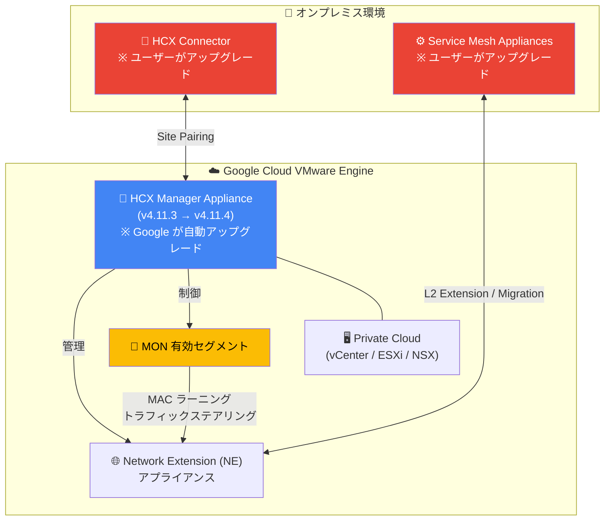

# Google Cloud VMware Engine: HCX Manager Appliance 4.11.4 アップグレード

**リリース日**: 2026-06-24

**サービス**: Google Cloud VMware Engine

**機能**: HCX Manager Appliance バージョン 4.11.4 へのアップグレード

**ステータス**: Announcement

📊 [このアップデートのインフォグラフィックを見る](https://takech9203.github.io/google-cloud-news-summary/20260624-vmware-engine-hcx-4-11-4.html)

## 概要

Google Cloud VMware Engine の運用チームが、HCX Manager Appliance をバージョン 4.11.4 にアップグレードするメンテナンスを開始しました。このアップグレードは、Mobility Optimized Networking (MON) が有効なセグメントで発生していた重大な不具合を解決するものです。

Broadcom が HCX 4.11.3 で特定した問題により、MON が有効なプライベートクラウドで「RestartZMQ」サービスパニックが発生し、Network Extension (NE) アプライアンスのサービスがクラッシュおよび再起動する事象が確認されていました。HCX 4.11.4 へのアップグレードにより、MAC ラーニングとトラフィックステアリングが安定化され、MON 有効セグメントの通信が恒久的に修正されます。

なお、このメンテナンスでは HCX Manager Appliance のアップグレードのみが対象であり、HCX On-Prem/Connectors および Service Mesh Appliances のアップグレードはユーザーの責任で実施する必要があります。

**アップデート前の課題**

HCX 4.11.3 において、MON が有効なプライベートクラウドで以下の問題が発生していました。

- MON 有効セグメントで「RestartZMQ」サービスパニックが発生し、Network Extension (NE) アプライアンスのサービスがクラッシュ・再起動する
- Cloud Gateway (CGW) サービスの再起動後、HCX Extended VLAN でトラフィックが通過しなくなる
- MAC ラーニングとトラフィックステアリングが不安定になり、ワークロードの通信断が発生する可能性がある

**アップデート後の改善**

HCX 4.11.4 へのアップグレードにより、以下の改善が実現されます。

- MON 有効セグメントでの RestartZMQ サービスパニックが恒久的に解決される
- MAC ラーニングとトラフィックステアリングが安定化される
- CGW サービス再起動後の Extended VLAN トラフィック通過問題が修正される

## アーキテクチャ図



HCX アップグレードのコンポーネント構成を示す図です。Google Cloud 側の HCX Manager Appliance は VMware Engine 運用チームが自動的にアップグレードしますが、オンプレミス側の HCX Connector と Service Mesh Appliances はユーザーが手動でアップグレードする必要があります。

## サービスアップデートの詳細

### 主要機能

1. **MON セグメントの安定化修正**
   - HCX 4.11.3 で発生していた RestartZMQ サービスパニックを恒久的に解決
   - Network Extension アプライアンスのクラッシュ・再起動問題を修正
   - MAC ラーニングとトラフィックステアリングの安定性を確保

2. **HCX Manager Appliance の自動アップグレード**
   - VMware Engine 運用チームがスケジュールされたメンテナンスウィンドウ内で実施
   - アップグレード中の HCX Manager のダウンタイムは約 5 分間
   - メール通知でメンテナンスウィンドウのスケジュールが事前に共有される

3. **ユーザー責任のコンポーネントアップグレード**
   - HCX On-Prem/Connectors のアップグレード
   - HCX Service Mesh Appliances のアップグレード
   - Broadcom のアップグレード手順ドキュメントに従って実施

## 技術仕様

### アップグレード責任マトリックス

| コンポーネント | アップグレード責任 | 場所 | 備考 |
|--------------|-------------------|------|------|
| HCX Manager Appliance | Google (VMware Engine 運用チーム) | クラウド側 | メンテナンスウィンドウ内で自動実施 |
| HCX On-Prem/Connectors | ユーザー | オンプレミス側 | Manager アップグレード後に実施 |
| HCX Service Mesh Appliances | ユーザー | 両側 | Manager アップグレード後に実施 |

### アップグレード影響範囲

| 項目 | 詳細 |
|------|------|
| 対象バージョン | HCX 4.11.3 → 4.11.4 |
| ダウンタイム | HCX Manager 約 5 分間 |
| 影響を受けるユーザー | MON 有効セグメントを使用しているプライベートクラウド |
| HCX 未使用環境への影響 | なし |
| 進行中のマイグレーション | アップグレード中は実行不可 |

### Mobility Optimized Networking (MON) の概要

MON は HCX Enterprise ライセンスで利用可能な機能で、Layer 2 Extension (L2E) セグメントにおけるネットワーク最適化を提供します。MON を有効にすることで、移行済み VM のトラフィックが最適なパスでルーティングされ、「トロンボーン」ルーティング (オンプレミスのデフォルトゲートウェイ経由の非効率なルーティング) を回避できます。

## 設定方法

### 前提条件

1. HCX Manager Appliance のアップグレードが VMware Engine 運用チームによって完了していること
2. 進行中のマイグレーションがないことを確認
3. HCX Cloud Manager UI へのアクセス権限

### 手順

#### ステップ 1: メンテナンス通知の確認

VMware Engine 運用チームからのメール通知で、HCX Manager Appliance のアップグレードスケジュールを確認します。Update Center でスケジュールの確認・変更が可能です。

```
Google Cloud Console > VMware Engine > Update Center
```

#### ステップ 2: HCX Connector のアップグレード (ユーザー作業)

HCX Manager Appliance のアップグレード完了後、オンプレミス側の HCX Connector をアップグレードします。

```
HCX Connector UI > Administration > System Updates > Check for Updates
```

#### ステップ 3: Service Mesh Appliances のアップグレード (ユーザー作業)

HCX Cloud Manager UI から Service Mesh Appliances をアップグレードします。

```
HCX Cloud Manager > Infrastructure > Service Mesh > Upgrade
```

## メリット

### ビジネス面

- **サービス安定性の向上**: MON 有効セグメントでの予期せぬ通信断が解消され、ワークロードの可用性が向上
- **運用負荷の軽減**: Google 側の HCX Manager アップグレードは自動で実施されるため、クラウド側のメンテナンス作業が不要

### 技術面

- **MAC ラーニングの安定化**: トラフィックステアリングが正常に機能し、ネットワーク最適化が維持される
- **NE アプライアンスの信頼性向上**: RestartZMQ サービスパニックの恒久修正により、Network Extension サービスの安定稼働が実現
- **短時間のダウンタイム**: HCX Manager のアップグレードに伴うダウンタイムは約 5 分間と最小限

## デメリット・制約事項

### 制限事項

- アップグレード中は進行中のマイグレーションを一時停止する必要がある
- HCX Manager のダウンタイム (約 5 分) 中は HCX 管理操作が不可
- HCX On-Prem/Connectors と Service Mesh Appliances のアップグレードはユーザーが別途実施する必要がある

### 考慮すべき点

- HCX を使用していないプライベートクラウドには影響なし (アップグレード自体は実施されるが機能的影響なし)
- メンテナンスウィンドウは Update Center で確認・変更可能 (最低週 40 時間のウィンドウが必要)
- オンプレミス側のアップグレード作業は、計画的なメンテナンス時間を確保して実施すること

## ユースケース

### ユースケース 1: MON を使用したハイブリッド環境でのワークロード移行

**シナリオ**: オンプレミスから Google Cloud VMware Engine への段階的なワークロード移行において、MON を有効にして移行済み VM のネットワーク最適化を行っている環境。HCX 4.11.3 の不具合により、CGW サービス再起動後にトラフィックが通過しなくなる事象が発生していた。

**効果**: 4.11.4 へのアップグレードにより、MON 有効セグメントの安定性が向上し、移行中および移行後のワークロード通信が確実に維持される。

### ユースケース 2: Layer 2 Extension を使用した DC マイグレーション

**シナリオ**: データセンター統合プロジェクトで、HCX Layer 2 Extension によりオンプレミスのネットワークセグメントをクラウドに延伸している環境。MON を活用してクラウド側 VM のローカルルーティングを最適化している。

**効果**: Network Extension アプライアンスの安定性向上により、延伸されたネットワークセグメント上のワークロードの通信断リスクが軽減される。

## 料金

HCX は Google Cloud VMware Engine のプライベートクラウド作成時に自動的にデプロイされ、HCX Enterprise ライセンスがデフォルトで含まれています。HCX 自体の追加料金は発生しません。VMware Engine の料金はノードタイプと使用形態 (オンデマンド / CUD) によって決まります。

詳細は [VMware Engine 料金ページ](https://cloud.google.com/vmware-engine/pricing) を参照してください。

## 利用可能リージョン

Google Cloud VMware Engine (HCX を含む) は、以下を含む主要リージョンで利用可能です:

- アジア太平洋: 東京 (asia-northeast1)、大阪 (asia-northeast2)、シンガポール (asia-southeast1)、シドニー (australia-southeast1) など
- 欧州: ロンドン (europe-west2)、フランクフルト (europe-west3)、オランダ (europe-west4) など
- 北米: アイオワ (us-central1)、バージニア (us-east4)、ロサンゼルス (us-west2) など
- 南米: サンパウロ (southamerica-east1)、サンティアゴ (southamerica-west1)

全リージョンの詳細は [VMware Engine ノードタイプのリージョン可用性](https://cloud.google.com/vmware-engine/docs/concepts-node-types#regional-node-types) を参照してください。

## 関連サービス・機能

- **VMware Engine Update Center**: メンテナンスウィンドウのスケジュール管理と確認に使用
- **Cloud Interconnect / Cloud VPN**: オンプレミス環境と VMware Engine プライベートクラウド間の接続に必要
- **NSX-T Data Center**: ネットワークセグメント管理、MON 有効時の Tier-1 ルーター設定に関連
- **Cloud Monitoring**: VMware Engine プライベートクラウドのヘルスモニタリング
- **VMware vCenter**: プライベートクラウドの VM 管理、HCX マイグレーション操作の実行元

## 参考リンク

- 📊 [インフォグラフィック](https://takech9203.github.io/google-cloud-news-summary/20260624-vmware-engine-hcx-4-11-4.html)
- [公式リリースノート](https://cloud.google.com/vmware-engine/docs/release-notes#June_24_2026)
- [最新サービスアナウンスメント](https://cloud.google.com/vmware-engine/docs/service-announcements#2026-06-24)
- [HCX 4.11.4 リリースノート (Broadcom)](https://techdocs.broadcom.com/us/en/vmware-cis/hcx/vmware-hcx/4-11/hcx-4-11-release-notes/vmware-hcx-4114-release-notes.html)
- [HCX アップグレード手順 (Broadcom)](https://techdocs.broadcom.com/us/en/vmware-cis/hcx/vmware-hcx/4-11/vmware-hcx-user-guide-4-11/updating-vmware-hcx/about-hcx-service-updates.html)
- [VMware Engine HCX マイグレーションガイド](https://cloud.google.com/vmware-engine/docs/workloads/howto-migrate-vms-using-hcx)
- [VMware Engine Update Center](https://cloud.google.com/vmware-engine/docs/update-center)
- [VMware Engine 料金](https://cloud.google.com/vmware-engine/pricing)

## まとめ

今回の HCX 4.11.4 アップグレードは、MON 有効セグメントで発生していた Network Extension アプライアンスのクラッシュ問題を恒久的に解決する重要なメンテナンスです。Google Cloud VMware Engine 運用チームが HCX Manager Appliance を自動でアップグレードしますが、ユーザーは HCX On-Prem/Connectors および Service Mesh Appliances のアップグレードを計画的に実施する必要があります。MON を使用しているハイブリッド環境では、このアップグレードの適用を速やかに完了させることを推奨します。

---

**タグ**: #GoogleCloud #VMwareEngine #HCX #MON #NetworkExtension #ハイブリッドクラウド #マイグレーション #メンテナンス
