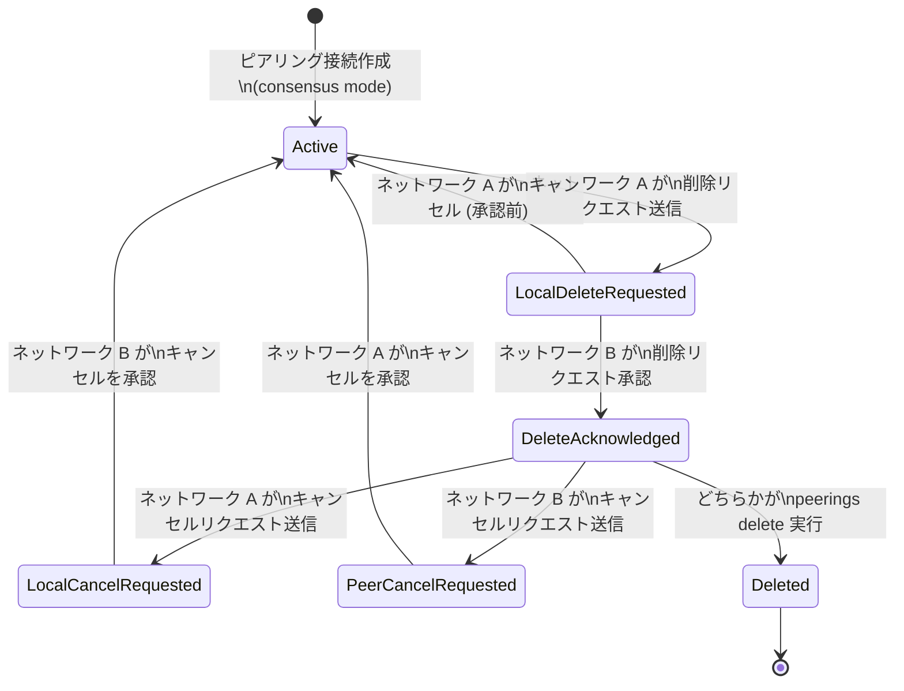

# Virtual Private Cloud: VPC Network Peering コンセンサスモードにおける削除リクエストのキャンセル機能

**リリース日**: 2026-06-24

**サービス**: Virtual Private Cloud

**機能**: VPC Network Peering コンセンサスモードでの削除リクエストキャンセル

**ステータス**: GA (一般提供)

[このアップデートのインフォグラフィックを見る](https://takech9203.github.io/google-cloud-news-summary/20260624-vpc-peering-cancel-deletion-consensus.html)

## 概要

Google Cloud Virtual Private Cloud (VPC) の Network Peering において、コンセンサスモードで構成されたピアリング接続の保留中の削除リクエストをキャンセルできる機能が一般提供 (GA) となりました。この機能により、誤って発行された削除リクエストや、計画変更により不要になった削除操作を安全に取り消すことが可能になります。

VPC Network Peering のコンセンサスモードは、ピアリング接続の更新や削除に両方のネットワーク管理者の合意を必要とする安全機構です。従来、一度発行された削除リクエストを取り消す手段がなかったため、誤操作時のリカバリーが困難でした。今回の GA リリースにより、削除リクエストがピアネットワークに承認される前後のいずれの段階でもキャンセルが可能となり、マルチチーム環境における VPC ピアリング接続の運用安全性が大幅に向上します。

この機能は、複数のプロジェクトやチーム間で VPC ピアリング接続を共有し、コンセンサスモードによるガバナンスを実施しているネットワーク管理者やクラウドインフラストラクチャチームを対象としています。

**アップデート前の課題**

- コンセンサスモードで削除リクエストを発行した後、キャンセルする正式な手段が限定的であった
- 誤って削除リクエストを送信した場合、ピアネットワークの管理者と手動で調整する必要があった
- 削除リクエストが保留中の間、全ての更新リクエスト (保留中の更新の承認やキャンセルを含む) が拒否されるため、ピアリング設定の変更がブロックされていた

**アップデート後の改善**

- `gcloud compute networks peerings cancel-request-delete` コマンドにより、保留中の削除リクエストを即座にキャンセル可能になった
- 削除リクエストがピアネットワークに承認される前後の両方のタイミングでキャンセルが可能
- Google Cloud Console からも GUI 操作でキャンセルが実行でき、運用の柔軟性が向上した

## アーキテクチャ図



この図は、VPC Network Peering コンセンサスモードにおける削除リクエストのライフサイクルを示しています。削除リクエストの送信から承認、そして今回 GA となったキャンセル操作による Active 状態への復帰フローを表現しています。

## サービスアップデートの詳細

### 主要機能

1. **承認前の削除リクエストキャンセル**
   - 削除リクエストを発行したネットワーク (ローカルネットワーク) が、ピアネットワークが承認する前にキャンセルを実行可能
   - キャンセル後、`deleteStatus` フィールドが `UNSPECIFIED` に戻り、接続は通常の Active 状態に復帰

2. **承認後の削除リクエストキャンセル**
   - `DELETE_ACKNOWLEDGED` 状態 (両方のネットワークが削除に同意した状態) からでもキャンセルが可能
   - どちらのネットワークからでもキャンセルリクエストを発行可能
   - ピアネットワークがキャンセルを承認することで、接続が Active 状態に戻る

3. **deleteStatus による状態管理**
   - `LOCAL_CANCEL_REQUESTED`: ローカルネットワークがキャンセルをリクエストした状態
   - `PEER_CANCEL_REQUESTED`: ピアネットワークがキャンセルをリクエストした状態
   - これらのステータスにより、キャンセルの進行状況を明確に追跡可能

## 技術仕様

### deleteStatus フィールドの状態遷移

| ステータス | 説明 |
|------|------|
| `UNSPECIFIED` | 削除リクエストが保留されていない (通常状態) |
| `LOCAL_DELETE_REQUESTED` | ローカルネットワークが削除をリクエスト |
| `PEER_DELETE_REQUESTED` | ピアネットワークが削除をリクエスト |
| `DELETE_ACKNOWLEDGED` | 両方のネットワークが削除に同意 |
| `LOCAL_CANCEL_REQUESTED` | ローカルネットワークがキャンセルをリクエスト |
| `PEER_CANCEL_REQUESTED` | ピアネットワークがキャンセルをリクエスト |

### キャンセル操作の条件

| 条件 | キャンセル可能なネットワーク |
|------|------|
| 承認前 (`LOCAL_DELETE_REQUESTED`) | リクエストを発行したネットワークのみ |
| 承認後 (`DELETE_ACKNOWLEDGED`) | どちらのネットワークでも可能 |

### IAM 権限

```json
{
  "permissions": [
    "compute.networks.removePeering",
    "compute.networks.get",
    "compute.networks.list"
  ],
  "role": "roles/compute.networkAdmin"
}
```

## 設定方法

### 前提条件

1. VPC Network Peering 接続がコンセンサスモード (`--update-strategy=CONSENSUS`) で構成されていること
2. 対象のピアリング接続に保留中の削除リクエストが存在すること
3. 操作するユーザーが `compute.networkAdmin` ロールまたは同等の権限を持っていること

### 手順

#### ステップ 1: 現在の削除ステータスを確認

```bash
# ネットワークの詳細を確認し、deleteStatus を確認する
gcloud compute networks describe NETWORK_NAME \
  --project=PROJECT_ID
```

出力の `peerings` セクション内にある `consensusState.deleteStatus` フィールドで現在の状態を確認します。

#### ステップ 2: 承認前のキャンセル (LOCAL_DELETE_REQUESTED の場合)

```bash
# 削除リクエストを発行したネットワークからキャンセルを実行
gcloud compute networks peerings cancel-request-delete PEERING_NAME \
  --network=NETWORK_NAME
```

この操作により、削除リクエストが即座にキャンセルされ、接続は Active 状態に戻ります。

#### ステップ 3: 承認後のキャンセル (DELETE_ACKNOWLEDGED の場合)

```bash
# どちらかのネットワークからキャンセルリクエストを送信
gcloud compute networks peerings cancel-request-delete PEERING_NAME \
  --network=NETWORK_NAME
```

```bash
# ピアネットワークからもキャンセルを承認
gcloud compute networks peerings cancel-request-delete PEER_PEERING_NAME \
  --network=PEER_NETWORK_NAME
```

両方のネットワークがキャンセルを実行すると、接続は Active 状態に戻ります。

#### ステップ 4: キャンセル完了の確認

```bash
# ステータスが UNSPECIFIED に戻ったことを確認
gcloud compute networks describe NETWORK_NAME \
  --project=PROJECT_ID \
  --format="get(peerings)"
```

## メリット

### ビジネス面

- **運用リスクの低減**: 誤った削除リクエストを安全にロールバックでき、意図しないサービス停止を防止
- **チーム間コラボレーションの改善**: マルチチーム環境で、削除の意思決定を柔軟に変更・撤回可能
- **コンプライアンス対応の強化**: 変更管理プロセスにおいて、承認後でもキャンセル可能な安全弁が追加される

### 技術面

- **ダウンタイムゼロ**: キャンセル操作中もピアリング接続は Active のまま維持され、トラフィックに影響なし
- **更新操作のブロック解除**: 削除リクエストをキャンセルすることで、ブロックされていた更新リクエストの処理が再開可能
- **状態の可視性**: `deleteStatus` フィールドにより、キャンセルの進行状況をプログラム的に追跡可能

## デメリット・制約事項

### 制限事項

- コンセンサスモードのピアリング接続にのみ適用され、独立モード (INDEPENDENT) の接続には適用されない
- 承認前のキャンセルは、リクエストを発行したネットワーク側からのみ実行可能
- キャンセル操作自体も、承認後の場合は両方のネットワークからの操作が必要

### 考慮すべき点

- 削除リクエストが保留中の間は、更新リクエスト (保留中の更新の承認やキャンセルを含む) が拒否される。更新を再開するには、まず削除リクエストをキャンセルする必要がある
- 承認後のキャンセルには両方のネットワーク管理者の協力が必要であり、一方だけではキャンセルを完了できない
- コンセンサスモードの設定自体には、ルート交換オプションの補完的な値の一致が必要

## ユースケース

### ユースケース 1: 誤操作からのリカバリー

**シナリオ**: ネットワーク管理者が、メンテナンス作業中に誤って本番環境の VPC ピアリング接続に対して削除リクエストを送信してしまった。

**実装例**:
```bash
# 誤って送信した削除リクエストを即座にキャンセル
gcloud compute networks peerings cancel-request-delete prod-peering \
  --network=prod-vpc \
  --project=prod-project

# ステータスが正常に戻ったことを確認
gcloud compute networks describe prod-vpc \
  --project=prod-project \
  --format="value(peerings[0].consensusState.deleteStatus)"
```

**効果**: ピアネットワーク管理者が削除を承認する前にキャンセルすることで、サービス影響なしに誤操作をリカバリーできる。

### ユースケース 2: 計画変更によるマイグレーション中止

**シナリオ**: VPC ピアリング接続を Shared VPC に移行する計画に基づいて削除リクエストを送信し、ピアネットワーク側でも承認済みだったが、プロジェクトの優先度変更により移行が延期された。

**実装例**:
```bash
# ネットワーク A 側からキャンセルリクエストを送信
gcloud compute networks peerings cancel-request-delete migration-peering \
  --network=network-a \
  --project=project-a

# ネットワーク B 側からもキャンセルを承認
gcloud compute networks peerings cancel-request-delete migration-peering-b \
  --network=network-b \
  --project=project-b
```

**効果**: 承認済みの削除でも実際の削除前であればキャンセル可能で、計画変更に柔軟に対応できる。

## 料金

VPC Network Peering 自体の利用は無料です。ピアリング接続の作成、更新、削除、およびキャンセル操作に対する追加料金は発生しません。

ただし、VPC Network Peering を介したデータ転送には通常のネットワーク料金が適用されます。

### 料金例

| 項目 | 料金 |
|--------|---------|
| VPC Network Peering 接続 | 無料 |
| ピアリング接続の作成・削除・キャンセル操作 | 無料 |
| 同一リージョン内のピアリング経由データ転送 | 無料 |
| リージョン間のピアリング経由データ転送 | リージョン間のネットワーク料金が適用 |

## 利用可能リージョン

VPC Network Peering のコンセンサスモードおよび削除リクエストのキャンセル機能は、Google Cloud のすべてのリージョンで利用可能です。VPC Network Peering はグローバルリソースであり、リージョンに依存しません。

## 関連サービス・機能

- **Shared VPC**: 組織内の複数プロジェクト間でネットワークリソースを共有する代替アプローチ。ピアリングよりも中央管理型のモデル
- **Private Service Connect**: Google サービスやサードパーティサービスへのプライベート接続を提供。ピアリングに代わる接続手段
- **Private Services Access**: Google マネージドサービス (Cloud SQL, AlloyDB 等) との VPC ピアリングベースの接続
- **Cloud Interconnect / Cloud VPN**: オンプレミスネットワークとの接続に使用。VPC ピアリングと組み合わせてハイブリッドネットワークを構築
- **VPC Flow Logs**: ピアリング経由のトラフィックを監視・分析するためのログ機能

## 参考リンク

- [インフォグラフィック](https://takech9203.github.io/google-cloud-news-summary/20260624-vpc-peering-cancel-deletion-consensus.html)
- [公式リリースノート](https://cloud.google.com/vpc/docs/release-notes#June_24_2026)
- [VPC Network Peering の概要](https://cloud.google.com/vpc/docs/about-peering-connections)
- [VPC Network Peering の設定と管理](https://cloud.google.com/vpc/docs/using-vpc-peering)
- [削除リクエストのキャンセル](https://cloud.google.com/vpc/docs/using-vpc-peering#cancel-delete)
- [gcloud compute networks peerings cancel-request-delete](https://cloud.google.com/sdk/gcloud/reference/compute/networks/peerings/cancel-request-delete)
- [VPC 料金ページ](https://cloud.google.com/vpc/pricing)

## まとめ

VPC Network Peering コンセンサスモードにおける削除リクエストのキャンセル機能の GA リリースは、マルチチーム環境でのネットワーク管理における安全性と柔軟性を大幅に向上させます。この機能により、誤操作や計画変更に対して迅速かつ安全にリカバリーが可能となり、コンセンサスモードの採用をより安心して進められるようになります。コンセンサスモードを利用中のネットワーク管理者は、チームの運用手順にキャンセル操作を組み込み、インシデント対応プロセスを更新することを推奨します。

---

**タグ**: #VPC #NetworkPeering #ConsensusMode #削除キャンセル #GA #ネットワーク管理 #GoogleCloud
