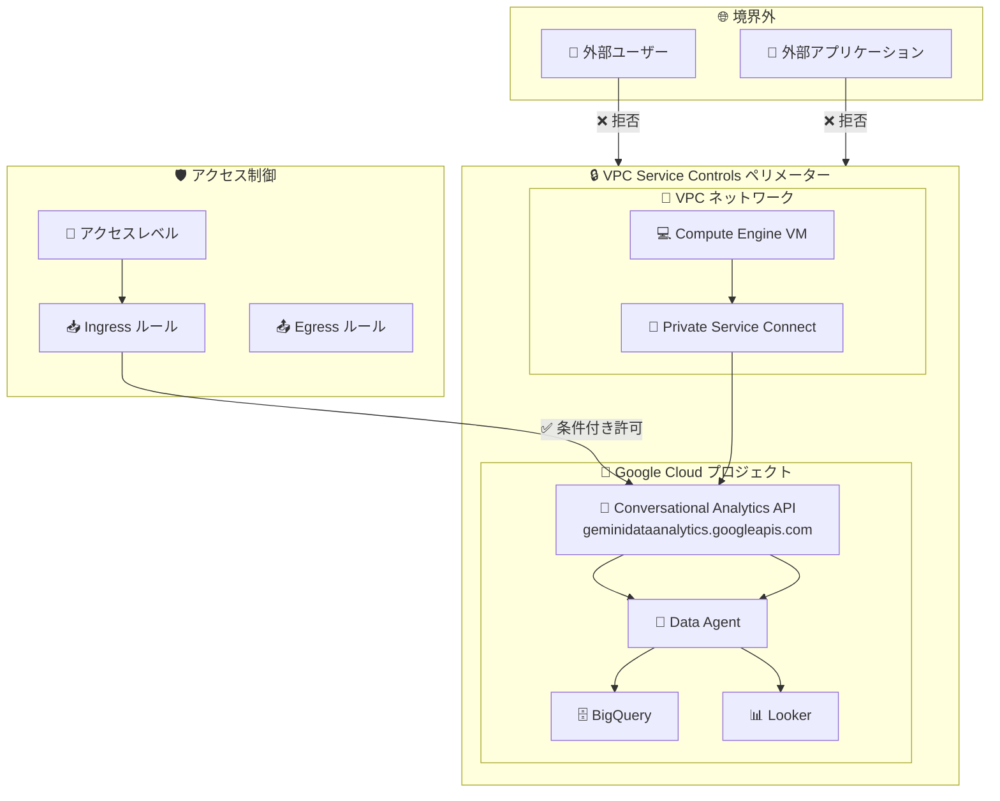

# VPC Service Controls: Conversational Analytics API の GA サポート

**リリース日**: 2026-06-24

**サービス**: VPC Service Controls

**機能**: Conversational Analytics API インテグレーションの一般提供 (GA)

**ステータス**: GA (一般提供)

📊 [このアップデートのインフォグラフィックを見る](https://takech9203.github.io/google-cloud-news-summary/20260624-vpc-service-controls-conversational-analytics.html)

## 概要

VPC Service Controls が Conversational Analytics API のインテグレーションを一般提供 (GA) としてサポート開始した。これにより、Conversational Analytics API を VPC Service Controls のサービス境界 (ペリメーター) 内で保護し、データ漏洩リスクを軽減しながら自然言語によるデータ分析機能を利用できるようになった。

Conversational Analytics API は `geminidataanalytics.googleapis.com` エンドポイントを通じてアクセスされ、BigQuery、Looker、Data Studio などの構造化データに対して自然言語で質問できる AI 搭載のチャットインターフェースを構築するための API である。Gemini for Google Cloud を活用し、SQL、Python、可視化ライブラリなどのツールと連携してデータ分析を行う。

今回のアップデートにより、金融、ヘルスケア、公共機関など厳格なデータ保護要件を持つ組織が、VPC Service Controls による境界防御を維持しつつ、Conversational Analytics の先進的なデータ分析機能を安全に活用できるようになった。

**アップデート前の課題**

- Conversational Analytics API を VPC Service Controls のサービス境界内で正式に保護する手段がなかった
- 自然言語によるデータ分析機能を使用する際、データ漏洩防止のための境界制御が限定的だった
- 規制要件の厳しい環境では、Conversational Analytics API の採用にセキュリティ上の懸念があった

**アップデート後の改善**

- Conversational Analytics API をサービス境界の制限サービスとして追加し、境界外からの不正アクセスを防止可能になった
- VPC Service Controls の Ingress/Egress ルールを使用して、Conversational Analytics API へのアクセスを細かく制御可能になった
- GA ステータスにより、本番環境での利用が正式にサポートされ、SLA の対象となった

## アーキテクチャ図



VPC Service Controls のサービス境界が Conversational Analytics API を保護し、境界外からの不正アクセスを遮断する。境界内の VPC ネットワークからは Private Service Connect 経由で安全にアクセスでき、必要に応じて Ingress ルールで条件付きアクセスを許可する構成を示す。

## サービスアップデートの詳細

### 主要機能

1. **サービス境界による保護**
   - Conversational Analytics API (`geminidataanalytics.googleapis.com`) をサービス境界の制限サービスとして設定可能
   - 境界外からの API リクエストを自動的にブロック
   - Dry Run モードで事前にアクセスパターンへの影響を検証可能

2. **Ingress/Egress ルールによる細粒度アクセス制御**
   - 特定の ID (ユーザー、サービスアカウント) に基づくアクセス許可
   - IP アドレス範囲やデバイス属性に基づくコンテキストアウェアアクセス
   - プロジェクト間のデータ共有を Egress ルールで安全に制御

3. **VPC アクセス可能サービスとの統合**
   - VPC ネットワーク内のエンドポイントからアクセス可能なサービスを制限
   - Private Service Connect を使用したプライベート接続のサポート
   - DNS 設定による API トラフィックのルーティング制御

## 技術仕様

### サービス情報

| 項目 | 詳細 |
|------|------|
| サービス名 | `geminidataanalytics.googleapis.com` |
| VPC SC ステータス | GA (完全サポート) |
| ペリメーター保護 | 可能 |
| 関連 API | `cloudaicompanion.googleapis.com`, `bigquery.googleapis.com` |

### Conversational Analytics API が利用するデータソース

| データソース | サービス名 | VPC SC 連携時の考慮事項 |
|-------------|-----------|----------------------|
| BigQuery | `bigquery.googleapis.com` | 同一ペリメーターに含める必要あり |
| Looker | `looker.googleapis.com` | 同一ペリメーターに含める必要あり |
| AlloyDB | `alloydb.googleapis.com` | データベースへの IAM 認証設定が必要 |
| Cloud SQL | `sqladmin.googleapis.com` | IAM 認証の有効化が必要 |
| Spanner | `spanner.googleapis.com` | IAM 認証の有効化が必要 |

### 必要な IAM ロール

```json
{
  "vpcServiceControlsAdmin": "roles/accesscontextmanager.policyAdmin",
  "conversationalAnalyticsUser": "roles/geminidataanalytics.dataAgentUser",
  "conversationalAnalyticsCreator": "roles/geminidataanalytics.dataAgentCreator"
}
```

## 設定方法

### 前提条件

1. 組織レベルの Access Context Manager ポリシーが作成済みであること
2. `roles/accesscontextmanager.policyAdmin` ロールを持つアカウントでの操作
3. Conversational Analytics API (`geminidataanalytics.googleapis.com`) がプロジェクトで有効化済みであること
4. BigQuery API など、利用するデータソースの API が有効化済みであること

### 手順

#### ステップ 1: 必要な API の有効化

```bash
# Conversational Analytics API の有効化
gcloud services enable geminidataanalytics.googleapis.com --project=PROJECT_ID

# 関連 API の有効化
gcloud services enable cloudaicompanion.googleapis.com --project=PROJECT_ID
gcloud services enable bigquery.googleapis.com --project=PROJECT_ID
```

#### ステップ 2: サービス境界の作成 (Conversational Analytics API を含む)

```bash
# サービス境界を作成し、Conversational Analytics API を制限サービスとして追加
gcloud access-context-manager perimeters create ConvAnalyticsPerimeter \
  --title="Conversational Analytics Perimeter" \
  --resources=projects/PROJECT_NUMBER \
  --restricted-services=geminidataanalytics.googleapis.com,bigquery.googleapis.com,cloudaicompanion.googleapis.com \
  --policy=POLICY_NAME
```

#### ステップ 3: 既存ペリメーターへのサービス追加 (既にペリメーターがある場合)

```bash
# 既存ペリメーターに Conversational Analytics API を追加
gcloud access-context-manager perimeters update PERIMETER_NAME \
  --add-restricted-services=geminidataanalytics.googleapis.com \
  --policy=POLICY_NAME
```

#### ステップ 4: Dry Run モードでの検証 (推奨)

```bash
# Dry Run モードでペリメーターを作成して影響を事前検証
gcloud access-context-manager perimeters dry-run create TestPerimeter \
  --perimeter-title="Test Conversational Analytics Perimeter" \
  --perimeter-type="regular" \
  --perimeter-resources=projects/PROJECT_NUMBER \
  --perimeter-restricted-services=geminidataanalytics.googleapis.com,bigquery.googleapis.com \
  --policy=POLICY_NAME
```

#### ステップ 5: Ingress ルールの設定 (必要に応じて)

```yaml
# ingress-policy.yaml
- ingressFrom:
    identityType: ANY_IDENTITY
    sources:
      - accessLevel: accessPolicies/POLICY_ID/accessLevels/TRUSTED_ACCESS
  ingressTo:
    operations:
      - serviceName: geminidataanalytics.googleapis.com
        methodSelectors:
          - method: "*"
    resources:
      - projects/PROJECT_NUMBER
```

```bash
# Ingress ルールを適用
gcloud access-context-manager perimeters update PERIMETER_NAME \
  --set-ingress-policies=ingress-policy.yaml \
  --policy=POLICY_NAME
```

## メリット

### ビジネス面

- **コンプライアンス要件の充足**: 金融規制 (FISC など) やヘルスケア規制で求められるデータ境界制御を満たしつつ、AI によるデータ分析機能を活用可能
- **データガバナンスの強化**: 組織のデータが意図しない形で外部に流出するリスクを軽減し、安心してビジネスインサイトを取得可能
- **GA による本番利用保証**: SLA 対象のサービスとして本番環境で安心して利用可能

### 技術面

- **ゼロトラストアーキテクチャとの整合**: VPC Service Controls による境界防御と IAM による ID ベースのアクセス制御を組み合わせた多層防御
- **監査ログの統合**: Cloud Audit Logs と連携し、Conversational Analytics API へのすべてのアクセスを記録・監視可能
- **柔軟なアクセス制御**: Ingress/Egress ルールにより、必要なアクセスパターンのみを許可する最小権限の原則を実現

## デメリット・制約事項

### 制限事項

- VPC Service Controls の制限サービスに追加する場合、関連する API (BigQuery、Cloud AI Companion など) も同一ペリメーターに含める必要がある
- サービス境界内からの Google Cloud コンソールによるアクセスが制限される場合がある (Ingress ルールでの対応が必要)
- Private Service Connect の設定が必要な場合、追加のネットワーク構成作業が発生する

### 考慮すべき点

- 既存のサービス境界に追加する際、Dry Run モードで事前検証を推奨
- Conversational Analytics API が接続するデータソース (BigQuery、Looker 等) がすべて同一ペリメーター内に存在することを確認する必要がある
- VPC アクセス可能サービスを有効にしている場合、`geminidataanalytics.googleapis.com` を許可サービスリストに追加する必要がある

## ユースケース

### ユースケース 1: 金融機関でのセキュアなデータ分析

**シナリオ**: 金融機関のデータアナリストが、顧客の取引データに対して自然言語で質問し、ビジネスインサイトを得たい。ただし、顧客データは厳格な規制下にあり、外部への漏洩を防ぐ必要がある。

**実装例**:
```bash
# 金融データ分析用のペリメーターを作成
gcloud access-context-manager perimeters create FinanceAnalytics \
  --title="Finance Analytics Perimeter" \
  --resources=projects/FINANCE_PROJECT_NUMBER \
  --restricted-services=geminidataanalytics.googleapis.com,bigquery.googleapis.com,cloudaicompanion.googleapis.com \
  --policy=POLICY_NAME

# 社内ネットワークからのアクセスのみ許可
gcloud access-context-manager perimeters update FinanceAnalytics \
  --set-ingress-policies=finance-ingress.yaml \
  --policy=POLICY_NAME
```

**効果**: 取引データが境界外に漏洩するリスクを排除しつつ、アナリストは自然言語で「先月の高額取引のトレンドは?」といった質問をデータエージェントに投げかけ、迅速にインサイトを取得可能。

### ユースケース 2: マルチチーム環境でのデータアクセス制御

**シナリオ**: 大規模組織で複数のチームがそれぞれ異なるデータセットに対して Conversational Analytics を利用する際、チーム間のデータアクセスを分離したい。

**効果**: サービス境界をチーム・プロジェクト単位で分割し、各チームは自分のデータに対してのみ自然言語クエリを実行可能。境界を跨いだ不正なデータアクセスを防止。

## 料金

VPC Service Controls の利用に追加料金は発生しない。Conversational Analytics API 自体の料金は、利用するデータソース (BigQuery など) の料金とは別に、Gemini for Google Cloud の料金体系に準じる。

詳細な料金については以下を参照:
- [VPC Service Controls 料金](https://cloud.google.com/vpc-service-controls/pricing) - 無料
- [Conversational Analytics API 料金](https://cloud.google.com/gemini/data-agents/pricing)

## 利用可能リージョン

VPC Service Controls はグローバルに利用可能。Conversational Analytics API のリージョナルエンドポイントは以下をサポート:
- `us-central1`
- `europe-west1`
- `asia-northeast1`
- その他のリージョンについては公式ドキュメントを参照

## 関連サービス・機能

- **BigQuery**: Conversational Analytics の主要データソースとして、自然言語クエリの変換先となる SQL を実行
- **Gemini for Google Cloud**: Conversational Analytics の基盤となる AI モデルを提供
- **Cloud AI Companion API** (`cloudaicompanion.googleapis.com`): Conversational Analytics API の動作に必要な関連 API
- **Access Context Manager**: VPC Service Controls のポリシーとアクセスレベルを管理するための基盤サービス
- **Cloud Audit Logs**: サービス境界内での API アクセスを監査・記録
- **Private Service Connect**: VPC ネットワークから Google API へのプライベート接続を提供

## 参考リンク

- 📊 [インフォグラフィック](https://takech9203.github.io/google-cloud-news-summary/20260624-vpc-service-controls-conversational-analytics.html)
- [公式リリースノート](https://cloud.google.com/release-notes#June_24_2026)
- [VPC Service Controls サポート対象プロダクト一覧](https://cloud.google.com/vpc-service-controls/docs/supported-products)
- [サービス境界の作成ドキュメント](https://cloud.google.com/vpc-service-controls/docs/create-service-perimeters)
- [Conversational Analytics API 概要](https://cloud.google.com/gemini/data-agents/conversational-analytics-api/overview)
- [Conversational Analytics API アクセス制御](https://cloud.google.com/gemini/data-agents/conversational-analytics-api/access-control)

## まとめ

VPC Service Controls による Conversational Analytics API の GA サポートは、セキュリティ要件の厳しい組織が自然言語によるデータ分析を安全に導入するための重要なマイルストーンである。既に VPC Service Controls を利用している組織は、既存のペリメーターに `geminidataanalytics.googleapis.com` を追加するだけで保護を開始でき、新規導入の場合も Dry Run モードで影響を検証してから本番適用できる。コンプライアンス要件を満たしつつ AI データ分析を活用したい組織には、早期の導入検討を推奨する。

---

**タグ**: #VPCServiceControls #ConversationalAnalytics #BigQuery #セキュリティ #データ保護 #GA #GeminiForGoogleCloud #サービス境界
