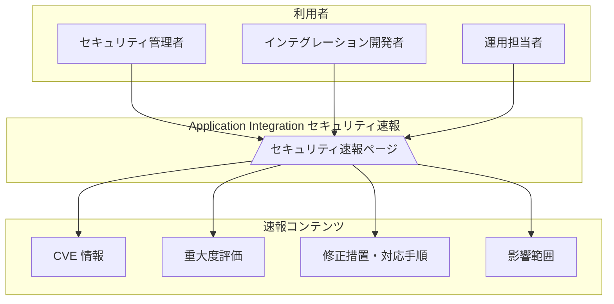

# Application Integration: セキュリティ速報ページの新設

**リリース日**: 2026-06-25

**サービス**: Application Integration

**機能**: セキュリティ速報ページ (Security Bulletins Page)

**ステータス**: 公開済み

[このアップデートのインフォグラフィックを見る](https://takech9203.github.io/google-cloud-news-summary/20260625-application-integration-security-bulletins.html)

## 概要

Application Integration に専用のセキュリティ速報 (Security Bulletins) ページが新設された。このページでは、Application Integration に関連するセキュリティアップデート、脆弱性情報、および修正措置に関する情報を一元的に確認できる。

この新設ページの公開と同時に、最初のセキュリティ速報として GCP-2026-044 が公開されている。これは Application Integration の JavaScript タスクで使用されていた Rhino JavaScript エンジンに関する脆弱性 (CVE-2025-0982) についての情報であり、重大度は「High」と評価されている。

Application Integration を利用する組織のセキュリティ担当者やインテグレーション開発者にとって、セキュリティ関連の情報を迅速に把握し、適切な対応を取るための重要なリソースとなる。

**アップデート前の課題**

- Application Integration に関するセキュリティ情報は Google Cloud 全体のセキュリティ速報ページに統合されており、該当サービスの情報を個別に確認するのが困難だった
- セキュリティ脆弱性の影響範囲や対応手順を迅速に把握するための専用リソースが存在しなかった

**アップデート後の改善**

- Application Integration 専用のセキュリティ速報ページが提供され、関連するセキュリティ情報を一元的に確認できるようになった
- 脆弱性の詳細、重大度、影響範囲、対応手順が構造化された形式で提供されるようになった
- セキュリティアップデートに関する最新情報をタイムリーに確認できるようになった

## アーキテクチャ図

Application Integration のセキュリティ速報ページは、CVE 情報、重大度評価、修正措置、影響範囲を構造化して提供し、セキュリティ管理者・開発者・運用担当者が迅速に対応できるよう設計されている。

## サービスアップデートの詳細

### 主要機能

1. **セキュリティ速報ページ**
   - Application Integration に特化したセキュリティ脆弱性情報の公開ページ
   - 各脆弱性について、説明、重大度、CVE 番号、対応手順を一覧表示
   - 時系列で速報が追加され、最新情報を継続的に確認可能

2. **GCP-2026-044 (初回速報)**
   - 対象: Application Integration の JavaScript タスク (Rhino エンジン使用時)
   - 脆弱性: CVE-2025-0982 (重大度: High)
   - 内容: Rhino JavaScript エンジンが Java リフレクションとインメモリ権限オブジェクトの変更を許可しており、Java Security Manager をバイパスしてサンドボックスから脱出可能だった
   - 影響範囲: 2025 年 1 月以前に公開されたインテグレーションの JavaScript タスクのみ
   - 対応: Google は 2025 年 1 月に V8 エンジンへ移行し、2026 年 3 月 30 日に Rhino エンジンを完全に廃止・ブロック

### CVE-2025-0982 の詳細

| 項目 | 詳細 |
|------|------|
| CVE ID | CVE-2025-0982 |
| 重大度 | High |
| 影響を受ける構成 | 2025 年 1 月以前に公開された JavaScript タスク (Rhino エンジン使用) |
| 攻撃条件 | JavaScript タスクの作成・実行権限を持つユーザー |
| 脆弱性の種類 | サンドボックスエスケープによる任意コード実行 |
| 修正状況 | 2025 年 1 月: V8 エンジンへの移行開始、2026 年 3 月 30 日: Rhino エンジン完全廃止 |

## 技術仕様

### JavaScript エンジンの移行タイムライン

| 時期 | 対応内容 |
|------|----------|
| 2025 年 1 月 | V8 エンジン導入。新規公開のインテグレーションは V8 を使用 |
| 2025 年 1 月 24 日 | Rhino エンジンの非推奨化を正式発表 |
| 2026 年 3 月 30 日 | Rhino エンジン完全廃止。Rhino を使用する実行をブロック |
| 2026 年 6 月 25 日 | セキュリティ速報ページ公開、CVE-2025-0982 の詳細を公開 |

### V8 エンジンの利点

| 項目 | 詳細 |
|------|------|
| パフォーマンス | Rhino より大幅に高速。大規模変数や複雑な計算を含むスクリプトの実行速度が向上 |
| 標準準拠 | ECMAScript 2024 対応 |
| セキュリティ | 継続的なセキュリティ更新により、より安全な実行環境を提供 |
| モダン機能 | 最新の JavaScript 機能を利用可能 |

## 設定方法

### Rhino エンジンから V8 への移行手順

#### 前提条件

1. 2025 年 1 月以前に公開された JavaScript タスクを含むインテグレーションが存在すること
2. インテグレーションの編集・公開権限を持つこと

#### ステップ 1: 対象インテグレーションの特定

Rhino エンジンを使用している JavaScript タスクを含む公開済みインテグレーションを特定する。

#### ステップ 2: インテグレーションの非公開化

対象のインテグレーションを非公開 (Unpublish) にする。

#### ステップ 3: JavaScript タスクの更新

各 JavaScript タスクのタスク設定ペインから「Open script editor」をクリックする。Application Integration が自動的に既存スクリプトを V8 用に更新する。

#### ステップ 4: テストと再公開

JavaScript コードを確認・テストした後、インテグレーションを再公開する。

## メリット

### ビジネス面

- **セキュリティガバナンスの強化**: 専用ページにより、Application Integration のセキュリティ状況を一元管理でき、コンプライアンス対応が容易になる
- **迅速なインシデント対応**: 脆弱性情報と対応手順が明確に提示されるため、影響評価と対応の迅速化が期待できる

### 技術面

- **V8 エンジンによるセキュリティ向上**: サンドボックスの強化により、JavaScript タスクの実行環境が安全になった
- **ECMAScript 2024 対応**: 最新の JavaScript 機能を活用した、より保守性の高いインテグレーションコードの記述が可能

## デメリット・制約事項

### 制限事項

- 2026 年 3 月 30 日以降、Rhino エンジンを使用する JavaScript タスクは実行がブロックされるため、未移行のインテグレーションは動作しない
- V8 への移行時に一部の Rhino 固有のコード (Java リフレクションを使用するコードなど) は書き直しが必要

### 考慮すべき点

- 2025 年 1 月以前に公開したインテグレーションがある場合、Rhino エンジンに依存する JavaScript タスクが残っていないか確認が必要
- 移行作業時にインテグレーションを一時的に非公開にする必要がある

## ユースケース

### ユースケース 1: セキュリティ監査での活用

**シナリオ**: 定期的なセキュリティ監査において、Application Integration の脆弱性対応状況を確認する必要がある。

**効果**: セキュリティ速報ページを参照することで、既知の脆弱性と対応状況を網羅的に確認でき、監査レポートへの反映が容易になる。

### ユースケース 2: 未移行インテグレーションの特定と修正

**シナリオ**: 組織内に 2025 年 1 月以前に作成された多数のインテグレーションがあり、Rhino エンジンに依存する JavaScript タスクの有無を確認する必要がある。

**効果**: セキュリティ速報 GCP-2026-044 に記載された移行手順に従い、V8 エンジンへの移行を計画的に実施できる。

## 関連サービス・機能

- **Google Cloud セキュリティ速報**: Google Cloud 全体のセキュリティ速報ページ。Application Integration 固有の速報はそこからもリンクされる
- **Application Integration JavaScript タスク**: V8 エンジンを使用してカスタム JavaScript コードを実行する機能
- **Integration Connectors**: Application Integration で使用する 90 以上のプリビルトコネクタ群
- **Cloud Monitoring / Cloud Logging**: インテグレーションの実行状況やセキュリティイベントの監視に活用

## 参考リンク

- [インフォグラフィック](https://takech9203.github.io/google-cloud-news-summary/20260625-application-integration-security-bulletins.html)
- [公式リリースノート](https://docs.cloud.google.com/release-notes#June_25_2026)
- [Application Integration セキュリティ速報](https://docs.cloud.google.com/application-integration/docs/security-bulletins)
- [CVE-2025-0982](https://www.cve.org/CVERecord?id=CVE-2025-0982)
- [JavaScript タスクの設定 (V8 エンジンへの移行手順)](https://docs.cloud.google.com/application-integration/docs/configure-javascript-task)
- [Application Integration セキュリティガイドライン](https://docs.cloud.google.com/application-integration/docs/security-guidelines)
- [Application Integration 概要](https://docs.cloud.google.com/application-integration/docs/overview)

## まとめ

Application Integration に専用のセキュリティ速報ページが新設され、セキュリティ脆弱性情報を一元的に確認できるようになった。初回速報として公開された GCP-2026-044 (CVE-2025-0982) は、Rhino JavaScript エンジンのサンドボックスエスケープ脆弱性に関するもので、2025 年 1 月以前に公開されたインテグレーションが影響を受ける。該当するインテグレーションが存在する場合は、V8 エンジンへの移行が完了しているか確認することを推奨する。

---

**タグ**: #ApplicationIntegration #Security #SecurityBulletin #CVE #JavaScript #V8Engine #iPaaS
