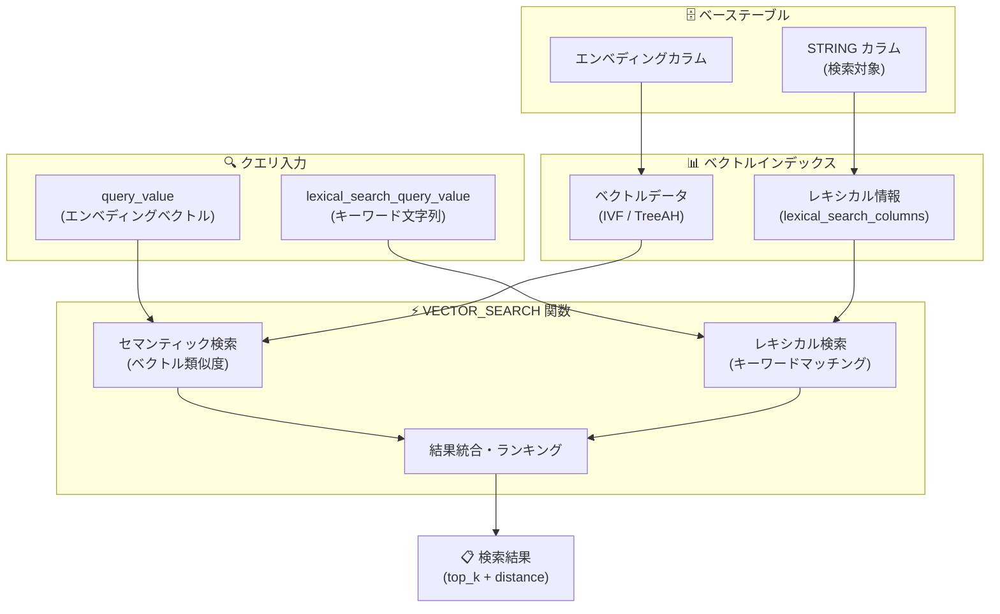

# BigQuery: VECTOR_SEARCH ハイブリッド検索 (Preview)

**リリース日**: 2026-06-25

**サービス**: BigQuery

**機能**: VECTOR_SEARCH ハイブリッド検索 (セマンティック + レキシカル検索の統合)

**ステータス**: Preview

📊 [このアップデートのインフォグラフィックを見る](https://takech9203.github.io/google-cloud-news-summary/20260625-bigquery-vector-search-hybrid-search-preview.html)

## 概要

BigQuery の `VECTOR_SEARCH` 関数にハイブリッド検索機能が Preview として追加された。これにより、セマンティック検索 (意味ベースの検索) とレキシカル検索 (キーワードベースの検索) を単一のクエリで組み合わせて実行できるようになった。

従来、高品質な検索を実現するには、セマンティック検索エンジンとキーワード検索エンジンを別々に構築・運用し、結果をマージする必要があった。今回のアップデートにより、BigQuery 単体でハイブリッド検索を実現でき、RAG (Retrieval-Augmented Generation) パイプラインや情報検索アプリケーションの検索品質を大幅に向上させることが可能になった。

また、自律的エンベディング生成 (autonomous embedding generation) が有効なテーブルでは、`AI.SEARCH` 関数の `HYBRID` モードを使用することで、より簡潔な構文でハイブリッド検索を実行できる。

**アップデート前の課題**

- セマンティック検索だけでは、商品番号、固有名詞、新語など「ドメイン外」のデータに対する検索精度が低かった
- ハイブリッド検索を実現するには、セマンティック検索エンジンとキーワード検索エンジンを別々に構築・運用し、結果をマージする複雑なアーキテクチャが必要だった
- レキシカル検索部分のパフォーマンスを最適化するためのインデックス機能がなかった

**アップデート後の改善**

- `VECTOR_SEARCH` 関数に `lexical_search_columns` と `lexical_search_query_value` パラメータが追加され、単一クエリでハイブリッド検索が可能になった
- ベクトルインデックスに `lexical_search_columns` オプションを指定することで、レキシカル検索のパフォーマンスが向上した
- `AI.SEARCH` 関数で `mode => 'HYBRID'` を指定するだけで、簡潔にハイブリッド検索を実行できるようになった
- レキシカル検索カラムはエンベディング生成元のカラムと異なるカラムを指定可能で、クロスカラム検索に対応した

## アーキテクチャ図



BigQuery のハイブリッド検索は、セマンティック検索とレキシカル検索を単一のベクトルインデックス内で統合し、両方の検索結果をマージして返す構成となっている。

## サービスアップデートの詳細

### 主要機能

1. **VECTOR_SEARCH 関数のハイブリッド検索パラメータ**
   - `lexical_search_columns`: レキシカル検索対象の STRING カラムを配列で指定
   - `lexical_search_query_value`: レキシカル検索のクエリ文字列を指定
   - エンベディング生成元カラムとは異なるカラムに対してもレキシカル検索が可能 (クロスカラム検索)

2. **AI.SEARCH 関数の HYBRID モード**
   - 自律的エンベディング生成が有効なテーブルで使用可能
   - `mode => 'HYBRID'` を指定するだけでハイブリッド検索が実行される
   - `mode => 'AUTO'` (デフォルト) の場合、ハイブリッドインデックスが存在すればハイブリッド検索を自動実行
   - `mode => 'VECTOR'` でセマンティック検索のみを明示的に指定可能

3. **ベクトルインデックスのハイブリッド検索対応**
   - `CREATE VECTOR INDEX` の `OPTIONS` に `lexical_search_columns` を指定可能
   - レキシカル検索対象カラムは `STORING` 句にも追加が必要
   - IVF、TreeAH の両方のインデックスタイプに対応
   - レキシカル検索部分のパフォーマンスが向上

## 技術仕様

### VECTOR_SEARCH ハイブリッド検索の構文

| 項目 | 詳細 |
|------|------|
| 対象構文 | シングルクエリ構文 (single search) のみ |
| バッチクエリ | 非対応 |
| lexical_search_columns | ARRAY<STRING> (ベーステーブルの STRING カラム名) |
| lexical_search_query_value | STRING (レキシカル検索クエリ) |
| クロスカラム検索 | 対応 (エンベディング元と異なるカラムを検索可能) |
| 出力カラム | base (ベーステーブルデータ), distance (セマンティック距離) |
| デフォルト top_k | 10 |

### AI.SEARCH の mode パラメータ

| モード | 動作 |
|--------|------|
| AUTO (デフォルト) | ハイブリッドインデックスがあればハイブリッド検索、なければセマンティック検索 |
| HYBRID | ハイブリッド検索を実行 |
| VECTOR | セマンティック検索のみを実行 |

## 設定方法

### 前提条件

1. BigQuery API が有効化されていること
2. `bigquery.tables.createIndex` 権限を持つ IAM ロール (BigQuery Data Owner または BigQuery Data Editor)
3. ハイブリッドインデックスを使用する場合、Enterprise または Enterprise Plus エディション (Standard エディションではインデックス非対応)

### 手順

#### ステップ 1: ハイブリッド検索対応のベクトルインデックス作成

```sql
-- ベクトルインデックスにレキシカル検索カラムを追加
CREATE VECTOR INDEX hybrid_index
ON my_dataset.my_table(embedding)
STORING(header, content, footer)
OPTIONS (
  index_type = 'IVF',
  distance_type = 'EUCLIDEAN',
  lexical_search_columns = ['header', 'content', 'footer']
);
```

#### ステップ 2: VECTOR_SEARCH でハイブリッド検索を実行

```sql
-- セマンティック検索 + レキシカル検索の組み合わせ
SELECT *
FROM VECTOR_SEARCH(
  TABLE my_dataset.my_table,
  "my_embedding",
  query_value => [1.0, -1.0],
  lexical_search_columns => ["description"],
  lexical_search_query_value => "striped hunter",
  top_k => 10
);
```

#### ステップ 3: AI.SEARCH で簡易ハイブリッド検索 (自律的エンベディング生成テーブル)

```sql
-- AI.SEARCH の HYBRID モードで簡易実行
SELECT base.name, base.description, distance
FROM AI.SEARCH(
  TABLE my_dataset.products,
  'description',
  "A really fun toy",
  mode => 'HYBRID'
);
```

## メリット

### ビジネス面

- **検索品質の向上**: セマンティック検索が苦手な固有名詞・商品番号・専門用語もキーワード検索で補完し、ユーザーの検索体験を改善
- **インフラ簡素化**: 2 つの検索エンジンを別々に構築・運用する必要がなくなり、コストと運用負荷を削減
- **RAG パイプラインの精度向上**: LLM アプリケーションのコンテキスト検索精度が向上し、生成結果の品質が改善

### 技術面

- **単一クエリで統合検索**: セマンティック検索とレキシカル検索を 1 つの SQL クエリで実行可能
- **インデックス統合**: ベクトルインデックスにレキシカル情報を含めることで、追加のインデックス管理が不要
- **クロスカラム検索**: エンベディング生成元とは異なるカラムに対してレキシカル検索を実行でき、柔軟な検索設計が可能
- **低レイテンシ**: 転置インデックス方式と比較して、ベクトルインデックスベースのレキシカル検索はミリ秒単位でのクエリ完了が可能

## デメリット・制約事項

### 制限事項

- Preview 段階であり、本番環境での使用は Pre-GA 利用規約に従う
- ハイブリッド検索はシングルクエリ構文のみ対応 (バッチクエリでは使用不可)
- Standard エディションではベクトルインデックスの使用が非対応
- サポートや問い合わせは bq-vector-search@google.com へのメール経由

### 考慮すべき点

- ハイブリッドインデックスの `lexical_search_columns` に指定するカラムは `STORING` 句にも追加が必要で、インデックスのストレージサイズが増加する
- `AI.SEARCH` の HYBRID モードは自律的エンベディング生成が有効なテーブルでのみ使用可能
- BI Engine によるクエリのアクセラレーションは VECTOR_SEARCH / AI.SEARCH クエリに対して非対応

## ユースケース

### ユースケース 1: EC サイトの商品検索

**シナリオ**: EC サイトで「快適な椅子」のようなセマンティッククエリと「SKU-12345」のような商品番号の両方で検索する必要がある場合

**実装例**:
```sql
SELECT base.product_name, base.description, base.sku, distance
FROM VECTOR_SEARCH(
  TABLE ecommerce.products,
  "description_embedding",
  query_value => AI.EMBED("comfortable gaming chair",
    endpoint => 'text-embedding-005',
    model_params => JSON '{"outputDimensionality": 768}').result,
  lexical_search_columns => ["product_name", "sku", "description"],
  lexical_search_query_value => "ergonomic mesh",
  top_k => 20
);
```

**効果**: 意味的に類似した商品を見つけつつ、特定のキーワードや型番にもマッチする結果を返すことで、検索精度が向上

### ユースケース 2: RAG パイプラインのコンテキスト検索改善

**シナリオ**: 社内ナレッジベースで LLM に渡すコンテキストを検索する際、セマンティック検索だけでは見逃される専門用語や固有名詞を含むドキュメントも取得したい場合

**効果**: セマンティック検索で意味的に関連するドキュメントを取得しつつ、レキシカル検索で専門用語の完全一致も補完することで、RAG の回答精度が向上

## 料金

VECTOR_SEARCH および AI.SEARCH 関数は BigQuery のコンピュート料金に基づいて課金される。

| 料金モデル | 課金基準 |
|------------|----------|
| オンデマンド | ベーステーブル、インデックス、検索クエリのスキャンバイト数に基づく |
| エディション (容量ベース) | ジョブ完了に必要なスロット数に基づく (複雑な類似度計算ほど高コスト) |

**ベクトルインデックスのコスト:**
- インデックスの構築・リフレッシュ: 組織ごとのインデックステーブルサイズ上限以下であれば無料
- 上限を超える場合: 自前のリザベーションが必要
- インデックスストレージ: アクティブストレージ料金が適用

詳細は [BigQuery 料金ページ](https://cloud.google.com/bigquery/pricing) を参照。

## 関連サービス・機能

- **BigQuery 自律的エンベディング生成 (Autonomous Embedding Generation)**: テーブルのデータ更新時にエンベディングを自動生成・管理する機能。AI.SEARCH の HYBRID モードの前提条件
- **Vertex AI Embeddings (text-embedding-005)**: エンベディング生成に使用されるモデル。VECTOR_SEARCH の `AI.EMBED` 関数で利用可能
- **BigQuery Vector Index (IVF / TreeAH)**: Approximate Nearest Neighbor 検索を効率化するインデックス。ハイブリッド検索のパフォーマンス向上に必要
- **Gemini Enterprise Agent Platform Vector Search**: Google Cloud のマネージドベクトル検索サービス。BigQuery 外でのハイブリッド検索にも対応

## 参考リンク

- 📊 [インフォグラフィック](https://takech9203.github.io/google-cloud-news-summary/20260625-bigquery-vector-search-hybrid-search-preview.html)
- [公式リリースノート](https://docs.cloud.google.com/release-notes#June_25_2026)
- [VECTOR_SEARCH 関数リファレンス](https://docs.cloud.google.com/bigquery/docs/reference/standard-sql/search_functions#vector_search)
- [AI.SEARCH 関数リファレンス](https://docs.cloud.google.com/bigquery/docs/reference/standard-sql/bigqueryml-syntax-ai-search)
- [ベクトルインデックスの作成・管理](https://docs.cloud.google.com/bigquery/docs/vector-index)
- [自律的エンベディング生成](https://docs.cloud.google.com/bigquery/docs/autonomous-embedding-generation)
- [ベクトル検索の概要](https://docs.cloud.google.com/bigquery/docs/vector-search-intro)
- [料金ページ](https://cloud.google.com/bigquery/pricing)

## まとめ

BigQuery の VECTOR_SEARCH 関数にハイブリッド検索機能が追加されたことで、セマンティック検索とレキシカル検索を単一の SQL クエリで統合できるようになった。これにより、RAG パイプラインや情報検索アプリケーションの検索品質を、複雑なインフラ構築なしに向上させることが可能になる。Preview 段階ではあるが、BigQuery をベクトルデータベースとして活用しているプロジェクトでは、早期にハイブリッド検索のパフォーマンスと検索品質の改善を評価することを推奨する。

---

**タグ**: #BigQuery #VectorSearch #HybridSearch #SemanticSearch #LexicalSearch #RAG #AI #Preview
