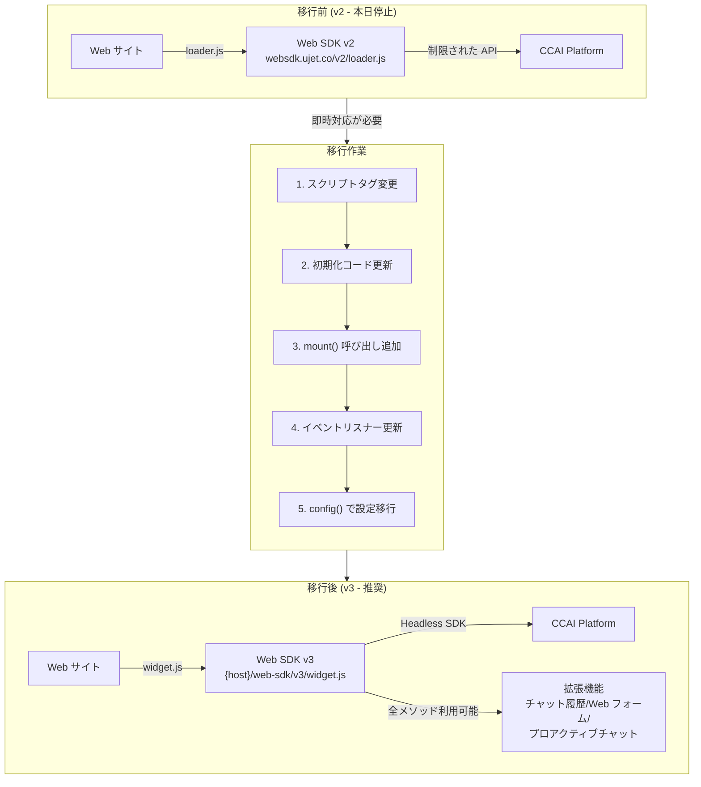

# Google Cloud Contact Center as a Service (CCaaS): Web SDK v2 シャットダウン

**リリース日**: 2026-06-25

**サービス**: Google Cloud Contact Center as a Service (CCaaS) / CCAI Platform

**機能**: Web SDK バージョン 2 のサポート終了

**ステータス**: シャットダウン (2026年6月26日)

:chart_with_upwards_trend: [このアップデートのインフォグラフィックを見る](https://takech9203.github.io/google-cloud-news-summary/20260625-ccaas-web-sdk-v2-shutdown.html)

## 概要

**[緊急] Web SDK v2 は本日 (2026年6月26日) にシャットダウンされます。**

Google Cloud は、Contact Center AI Platform (CCAI Platform) の Web SDK バージョン 2 を 2026年6月26日をもって完全にシャットダウンすることを発表しました。2025年6月26日に Web SDK v3 の一般提供 (GA) が開始された際に、v2 の廃止スケジュールが告知されており、正確に 1 年間の移行期間が設けられていました。本日以降、Web SDK v2 は動作しなくなるため、まだ移行が完了していない場合は即座に対応が必要です。

Web SDK は、CCAI Platform のコンタクトセンター機能を Web アプリケーションに組み込むためのクライアントライブラリです。v3 は Headless SDK をベースに再構築されており、より柔軟なカスタマイズと新機能を提供します。

**アップデート前の課題**

- Web SDK v2 は新機能の追加が停止されており、最新の CCAI Platform 機能を利用できない状態が続いていた
- v2 のアーキテクチャでは Headless SDK の機能に直接アクセスできず、カスタマイズの柔軟性に制限があった
- v2 では一部の設定オプション (customData, disableAttachment など) が初期化時に直接指定する方式で、動的な設定変更が困難だった

**アップデート後の改善**

- Web SDK v3 は Headless SDK 上に構築されており、Headless SDK のすべてのメソッドが利用可能
- v3 では `.config()` メソッドによる動的な設定変更が可能 (customData, disableAttachment など)
- チャット履歴の閲覧・トランスクリプトのダウンロード、Web フォーム、プロアクティブチャットトリガーの条件演算子など新機能を利用可能
- テーマカスタマイズが CSS 変数ベースに刷新され、より細かいデザイン制御が可能

## アーキテクチャ図



Web SDK v2 から v3 への移行フロー。v2 は本日シャットダウンされるため、まだ移行が完了していない場合は即座にスクリプトタグの変更と初期化コードの更新が必要です。

## サービスアップデートの詳細

### 主要な変更点

1. **スクリプトソースの変更**
   - v2: `https://websdk.ujet.co/v2/loader.js`
   - v3: `https://{your_ccaas_host}/web-sdk/v3/widget.js`
   - v3 では自社の CCaaS ホストから直接配信される

2. **マウントポイントの導入**
   - v3 では明示的にウィジェットをマウントする DOM 要素を指定する必要がある
   - `ccaas.mount('#ccaas-widget')` を初期化後に呼び出す
   - HTML 側に `<div id="ccaas-widget"></div>` を追加

3. **設定方法の変更**
   - v2 で初期化時に指定していた `customData`, `disableAttachment` などは v3 では `ccaas.config()` メソッドで設定
   - v3 の初期化オプションは Headless SDK と同一の `ClientOption` インターフェースに準拠

4. **イベントリスニングの変更**
   - v2: `ccaas.on('chat:update', callback)`
   - v3: `ccaas.client.on('chat.updated', callback)`
   - v3 では Headless SDK クライアント経由でイベントを購読

5. **メソッドの拡張**
   - v2 には `createCobrowseCode()`, `fetchWaitTimes()` などの限定的なメソッドのみ
   - v3 では Headless SDK の全メソッドが利用可能 (`getCompany()`, `loadOngoingChat()` など)

### Web SDK v3 の新機能

- **チャット履歴の閲覧とダウンロード**: エンドユーザーが過去のチャットを閲覧し、トランスクリプトをダウンロード可能
- **Web フォーム**: HTML Web フォームによるエンドユーザーからのデータ収集
- **プロアクティブチャットトリガーの条件演算子**: OR/AND 演算子による柔軟なトリガー条件設定
- **エージェントによるファイル添付**: チャットセッション中にエージェントがファイルを添付可能
- **チャットオーディオの無効化**: エンドユーザーがチャットオーディオを無効化可能
- **システムメッセージのカテゴリ分け**: standard、confirmation、error の 3 種類に分類
- **ポストセッション転送**: エンドユーザーがセッションを終了した際のポストセッション転送

## 技術仕様

### 初期化コードの比較

| 項目 | Web SDK v2 | Web SDK v3 |
|------|-----------|-----------|
| スクリプトソース | `websdk.ujet.co/v2/loader.js` | `{your_ccaas_host}/web-sdk/v3/widget.js` |
| 初期化 | `new UJET({...})` | `new UJET({...})` + `ccaas.mount(element)` |
| 設定変更 | 初期化時のみ | `ccaas.config({...})` で動的変更可能 |
| イベント | `ccaas.on('event:name', cb)` | `ccaas.client.on('event.name', cb)` |
| CSP 設定 | `websdk.ujet.co` を許可 | `{your_ccaas_host}` を `script-src` と `frame-src` に追加 |

### ClientOption インターフェース (v3)

```typescript
interface ClientOption {
  companyId: string;
  authenticate: () => Promise<TokenResponse>;
  tenant?: string;
  host?: string;
  lang?: string;
  bridge?: string;
  cobrowse?: {
    enabled: boolean;
    template?: string;
    messages?: CobrowseMessages;
    api?: string;
    license?: string;
    trustedOrigins?: string[];
    capabilities?: string[];
    registration?: boolean;
    redactedViews?: string[];
    unredactedViews?: string[];
  };
}
```

### ConfigOptions インターフェース (v3)

```typescript
interface ConfigOptions {
  accent?: AccentColor;
  logo?: string;
  menuKey?: string;
  ticketId?: string;
  preferredChannel?: string;
  disableAttachment?: boolean;
  customData?: string | Record<string, any>;
  messages?: Record<string, unknown>;
  reCaptchaSiteKey?: string;
}
```

## 設定方法

### 前提条件

1. CCAI Platform のアカウントと Company Key を取得済みであること
2. バックエンドサーバーに認証トークンエンドポイントが設定されていること
3. CSP (Content Security Policy) に `{your_ccaas_host}` が許可されていること

### 手順

#### ステップ 1: スクリプトタグの置換

既存の v2 スクリプトタグを v3 に変更します。

```html
<!-- 削除: v2 のスクリプト -->
<script type="module" src="https://websdk.ujet.co/v2/loader.js"></script>

<!-- 追加: v3 のスクリプト -->
<script src="https://{your_ccaas_host}/web-sdk/v3/widget.js"></script>
```

#### ステップ 2: マウントポイントの追加

HTML にウィジェットをマウントする要素を追加します。

```html
<div id="ccaas-widget"></div>
```

#### ステップ 3: 初期化コードの更新

```javascript
// v3 の初期化
var ccaas = new UJET({
  companyId: "YOUR_COMPANY_ID",
  host: "https://{your_ccaas_host}",
  authenticate: getAuthToken
});

// v2 にはなかった mount() 呼び出しを追加
ccaas.mount("#ccaas-widget");
```

#### ステップ 4: 設定オプションの移行

v2 で初期化時に指定していたオプションを `config()` メソッドに移行します。

```javascript
// v2 で初期化時に指定していた customData などを config() に移行
ccaas.config({
  disableAttachment: true,
  customData: {
    version: { label: 'Version', value: '1.0.0' }
  }
});
```

#### ステップ 5: イベントリスナーの更新

```javascript
// v2 のイベントリスニング (削除)
// ccaas.on('chat:update', (chat) => { console.log(chat) })

// v3 のイベントリスニング (追加)
const client = ccaas.client;
client.on('chat.updated', (chat) => { console.log(chat) });
```

#### ステップ 6: CSP の更新

```
Content-Security-Policy: script-src 'self' https://{your_ccaas_host}; frame-src 'self' https://{your_ccaas_host};
```

## メリット

### ビジネス面

- **最新機能へのアクセス**: Web フォーム、プロアクティブチャットトリガー、チャット履歴ダウンロードなど、顧客体験を向上させる機能が利用可能
- **継続的なサポート**: v3 は今後も新機能の追加やバグ修正が行われるアクティブなバージョン
- **アクセシビリティ対応**: WCAG 準拠、右から左への言語サポート、スクリーンリーダー互換性の改善

### 技術面

- **Headless SDK との統合**: 全 Headless SDK メソッドが利用可能になり、より高度なカスタマイズが実現
- **動的設定変更**: `config()` メソッドにより実行時に設定を変更可能
- **CSS 変数によるテーマカスタマイズ**: アクセントカラー、ボタン、チャットバブルなど、細かいデザイン制御が CSS 変数で可能
- **自社ホストからの配信**: v3 は自社 CCaaS ホストから配信されるため、外部依存が減少

## デメリット・制約事項

### 制限事項

- v3 では v2 の一部メソッド (`createCobrowseCode()`, `fetchWaitTimes()`) が直接利用できず、Headless SDK の対応メソッドに置き換える必要がある
- Web SDK widget UI を超えるカスタマイズはサポート対象外。高度なカスタマイズが必要な場合は Headless SDK の直接利用が推奨される
- `ccaas.mount()` を明示的に呼び出す必要があり、v2 のように自動表示されない

### 考慮すべき点

- **即時対応が必要**: v2 は本日 (2026年6月26日) にシャットダウンされるため、未移行の場合はコンタクトセンターの Web チャネルが停止する
- **テスト環境での検証**: テーマカスタマイズや CSP 設定の変更が含まれるため、本番デプロイ前にテスト環境での検証が推奨される
- **CSP の更新**: v2 では `websdk.ujet.co` を許可していたが、v3 では自社 CCaaS ホストを許可する必要がある

## ユースケース

### ユースケース 1: 基本的な Web チャットウィジェットの移行

**シナリオ**: 既存の Web サイトに v2 で実装したチャットウィジェットを v3 に移行する

**実装例**:
```html
<!DOCTYPE html>
<html lang="ja">
<head>
  <meta charset="UTF-8">
  <title>カスタマーサポート</title>
</head>
<body>
  <div id="ccaas-widget"></div>
  <script src="https://{your_ccaas_host}/web-sdk/v3/widget.js"></script>
  <script>
    var ccaas = new UJET({
      companyId: "YOUR_COMPANY_ID",
      host: "https://{your_ccaas_host}",
      authenticate: function() {
        return fetch('/auth/token').then(function(resp) {
          return resp.json();
        });
      }
    });
    ccaas.mount("#ccaas-widget");
  </script>
</body>
</html>
```

**効果**: 最小限のコード変更で v3 への移行が完了し、Headless SDK の全機能が利用可能になる

### ユースケース 2: カスタムデータとテーマカスタマイズの移行

**シナリオ**: v2 でカスタムデータとブランドカラーを設定していた実装を v3 に移行する

**実装例**:
```javascript
var ccaas = new UJET({
  companyId: "YOUR_COMPANY_ID",
  host: "https://{your_ccaas_host}",
  authenticate: getAuthToken
});

// v3 では config() で設定
ccaas.config({
  accent: 'blue',
  logo: 'https://example.com/logo.png',
  customData: {
    userId: { label: 'User ID', value: '12345' },
    plan: { label: 'Plan', value: 'enterprise' }
  }
});

ccaas.mount("#ccaas-widget");
```

**効果**: ブランドカラーのカスタマイズと顧客属性のカスタムデータ連携を維持しつつ v3 に移行可能

## 関連サービス・機能

- **Headless Web SDK**: Web SDK v3 の基盤となる SDK。UI を持たず、独自の UI を構築する場合に利用
- **Dialogflow CX**: CCAI Platform と連携する仮想エージェント構築サービス。Web SDK 経由で提供される自動応答の基盤
- **Agent Assist**: エージェントの通話・チャット中にリアルタイムで支援を提供する機能
- **Customer Experience Insights (CCAI Insights)**: コンタクトセンターデータのパターン検出と可視化

## 参考リンク

- :chart_with_upwards_trend: [インフォグラフィック](https://takech9203.github.io/google-cloud-news-summary/20260625-ccaas-web-sdk-v2-shutdown.html)
- [公式リリースノート (2026年6月25日)](https://docs.cloud.google.com/release-notes#June_25_2026)
- [CCAI Platform リリースノート](https://docs.cloud.google.com/contact-center/ccai-platform/docs/release-notes)
- [Web SDK v3 リリースノート (2025年6月26日)](https://docs.cloud.google.com/contact-center/ccai-platform/docs/release-notes#June_26_2025)
- [Web SDK v2 から v3 へのアップグレードガイド](https://docs.cloud.google.com/contact-center/ccai-platform/docs/web-sdk-v3-upgrade)
- [Web SDK v3 ガイド](https://docs.cloud.google.com/contact-center/ccai-platform/docs/web-sdk-v3-getting-started)
- [Web SDK v3 テーマカスタマイズ](https://docs.cloud.google.com/contact-center/ccai-platform/docs/web-sdk-v3-theme-customization)
- [Headless Web SDK ガイド](https://docs.cloud.google.com/contact-center/ccai-platform/docs/headless-web-guide)
- [Web SDK v3 実装例 (GitHub)](https://github.com/GoogleCloudPlatform/ccaas-web-sdk-v3-examples)

## まとめ

Web SDK v2 のシャットダウンは本日 (2026年6月26日) です。まだ移行が完了していない場合、Web チャネル経由のコンタクトセンター機能が停止するリスクがあります。移行作業の中心はスクリプトタグの変更、`mount()` 呼び出しの追加、イベントリスナーの書き換えであり、公式アップグレードガイドに従えば比較的短時間で対応可能です。即座にアップグレードガイドを参照し、テスト環境での検証後、速やかに本番環境へデプロイすることを強く推奨します。

---

**タグ**: #GoogleCloud #CCaaS #CCAI-Platform #WebSDK #Deprecation #Shutdown #ContactCenter #Migration
