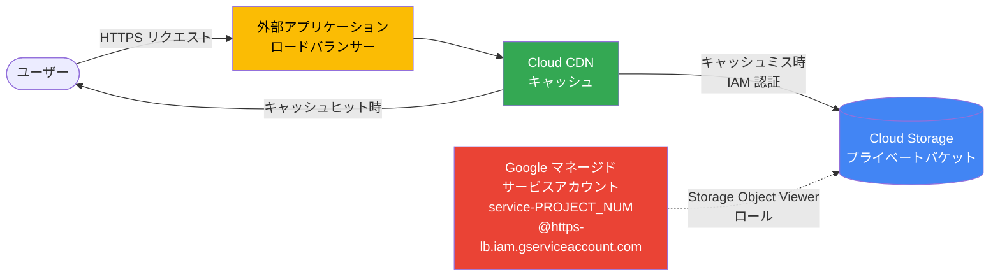

# Cloud CDN: Private Bucket Access が GA (一般提供)

**リリース日**: 2026-06-25

**サービス**: Cloud CDN / External Application Load Balancer

**機能**: Private Bucket Access (プライベートバケットアクセス)

**ステータス**: GA (一般提供)

[このアップデートのインフォグラフィックを見る](https://takech9203.github.io/google-cloud-news-summary/20260625-cloud-cdn-private-bucket-access-ga.html)

## 概要

Cloud CDN および外部アプリケーションロードバランサーにおいて、Cloud Storage バケットに対する **セルフサービス Private Bucket Access** が一般提供 (GA) となった。この機能により、Cloud Storage バケットを公開設定にすることなく、Cloud CDN を通じてコンテンツを安全に配信できるようになる。

従来、Cloud CDN でプライベートバケットからコンテンツを配信するには、Signed URL や Signed Cookie を利用するか、バケットを公開設定にする必要があった。Private Bucket Access は、Google マネージドサービスアカウントに対する IAM 権限によってバケットへのアクセスを管理する仕組みであり、バケットを公開する必要がなくなる。セキュリティを重視しつつ CDN によるコンテンツ配信を行いたい全てのユーザーに恩恵がある。

**アップデート前の課題**

- Cloud CDN でバケットからコンテンツを配信するには、バケットを公開 (`allUsers` に `Storage Object Viewer` を付与) する必要があった
- 公開バケットはインターネット上の誰でもオブジェクトの閲覧・一覧取得が可能なため、意図しないデータ露出のリスクがあった
- 代替策として Signed URL/Signed Cookie があるが、クライアントサイドでの署名管理が必要で運用が複雑だった

**アップデート後の改善**

- バケットを公開設定にせずに Cloud CDN 経由でコンテンツを配信可能になった
- Google マネージドサービスアカウント (`service-PROJECT_NUM@https-lb.iam.gserviceaccount.com`) への IAM 権限付与のみで設定が完了する
- セルフサービスで設定できるため、サポートへの問い合わせが不要
- GA となったことで、本番環境での利用に SLA が適用される

## アーキテクチャ図



Cloud CDN がキャッシュミス時に Google マネージドサービスアカウントの IAM 権限を使用してプライベートバケットからコンテンツを取得し、以降はキャッシュから配信する構成を示す。

## サービスアップデートの詳細

### 主要機能

1. **セルフサービス設定**
   - Google Cloud コンソールまたは gcloud CLI から設定可能
   - サポートへの問い合わせなしで有効化できる
   - バックエンドバケットリソースの作成後にサービスアカウントが自動生成される

2. **IAM ベースのアクセス制御**
   - Google マネージドサービスアカウント (`service-PROJECT_NUM@https-lb.iam.gserviceaccount.com`) を使用
   - `roles/storage.objectViewer` ロールのみを付与
   - バケット全体を公開する必要がない

3. **読み取り専用コンテンツ配信**
   - GET、HEAD、OPTIONS、TRACE メソッドのみをサポート
   - POST、PUT、PATCH、DELETE などのデータ変更メソッドは非対応
   - コンテンツ配信に特化した設計

## 技術仕様

### サポートされるロードバランサー

| 項目 | 詳細 |
|------|------|
| グローバル外部アプリケーションロードバランサー | サポート |
| 従来型 (Classic) アプリケーションロードバランサー | サポート |
| サービスアカウント形式 | `service-PROJECT_NUM@https-lb.iam.gserviceaccount.com` |
| 必要な IAM ロール | `roles/storage.objectViewer` |
| サポートされる HTTP メソッド | GET, HEAD, OPTIONS, TRACE |

### 推奨キャッシュ設定

| 設定項目 | 推奨値 |
|---------|--------|
| キャッシュモード | `FORCE_CACHE_ALL` (全コンテンツを強制キャッシュ) |
| TTL | max-ttl 値を明示的に指定 |

## 設定方法

### 前提条件

1. プロジェクト内にバックエンドバケットリソースが 1 つ以上作成されていること (サービスアカウントはバックエンドバケット作成後に利用可能になる)
2. Cloud Storage バケットが作成されていること
3. `roles/storage.admin` または同等の権限を持つこと

### 手順

#### ステップ 1: サービスアカウントへの権限付与

```bash
gcloud storage buckets add-iam-policy-binding gs://BUCKET_NAME \
  --member=serviceAccount:service-PROJECT_NUM@https-lb.iam.gserviceaccount.com \
  --role=roles/storage.objectViewer
```

`BUCKET_NAME` を Cloud Storage バケット名、`PROJECT_NUM` をプロジェクト番号に置き換える。

#### ステップ 2: キャッシュモードの設定

```bash
gcloud compute backend-buckets update BACKEND_BUCKET_NAME \
  --cache-mode=FORCE_CACHE_ALL
```

全てのコンテンツがキャッシュされるよう、キャッシュモードを `FORCE_CACHE_ALL` に設定する。

#### ステップ 3: (オプション) 公開アクセスの削除

```bash
gcloud storage buckets remove-iam-policy-binding gs://BUCKET_NAME \
  --member=allUsers \
  --role=roles/storage.objectViewer
```

既存のパブリックアクセスを削除し、プライベートバケットアクセスのみに切り替える。

## メリット

### ビジネス面

- **セキュリティリスクの低減**: バケットを公開する必要がなくなり、意図しないデータ露出リスクを排除
- **コンプライアンス対応**: データの公開範囲を最小限に抑えることで、規制要件への準拠が容易に
- **運用負荷の削減**: Signed URL の発行・管理が不要 (クライアント認証が不要な場合)

### 技術面

- **シンプルな設定**: IAM ロールの付与のみで完結し、複雑な署名ロジックが不要
- **Google マネージドサービスアカウント**: 鍵のローテーションや管理が Google 側で自動的に行われる
- **既存アーキテクチャとの互換性**: Signed URL/Signed Cookie と併用可能 (クライアント認証が必要な場合は両方を使える)

## デメリット・制約事項

### 制限事項

- 読み取り専用のコンテンツ配信のみをサポート (POST、PUT、PATCH、DELETE は不可)
- `roles/storage.objectViewer` ロールのみを付与すること (他のロールは非対応)
- サービスアカウントはバックエンドバケットリソースの作成後に初めて利用可能になる

### 考慮すべき点

- キャッシュモードを `FORCE_CACHE_ALL` に設定する必要があるため、動的コンテンツには不向き
- クライアント側のアクセス制御 (特定ユーザーのみアクセス可能にする) が必要な場合は、別途 Signed URL または Signed Cookie の併用が必要
- プライベートバケットでは `Cache-Control: private` ヘッダーが設定されるため、キャッシュモードの明示的な設定が重要

## ユースケース

### ユースケース 1: 静的 Web サイトのセキュアな配信

**シナリオ**: 企業の Web サイトの静的アセット (画像、CSS、JavaScript) を Cloud Storage に格納し、Cloud CDN 経由で配信したいが、バケットを公開したくない。

**実装例**:
```bash
# プライベートバケットへの CDN アクセスを許可
gcloud storage buckets add-iam-policy-binding gs://my-website-assets \
  --member=serviceAccount:service-123456789@https-lb.iam.gserviceaccount.com \
  --role=roles/storage.objectViewer

# キャッシュモードを設定
gcloud compute backend-buckets update my-backend-bucket \
  --cache-mode=FORCE_CACHE_ALL
```

**効果**: バケットを公開せずに CDN 経由で高速配信が可能。検索エンジンやスクレイパーによるバケット直接アクセスを防止。

### ユースケース 2: ソフトウェアダウンロードの安全な配信

**シナリオ**: SaaS 企業がインストーラーやアップデートファイルを配信する際、Cloud Storage のバケット URL を直接公開せず、CDN 経由でのみダウンロードを許可したい。

**効果**: バケットの直接 URL ではなく CDN ドメインからのみコンテンツにアクセス可能。ダウンロードの帯域制御やログ記録もロードバランサー経由で一元管理できる。

## 料金

Private Bucket Access 自体に追加料金は発生しない。通常の Cloud CDN および Cloud Storage の料金が適用される。

### Cloud CDN 料金 (参考)

| カテゴリ | 料金 (USD) |
|---------|------------|
| キャッシュ Egress (10 TiB 未満) | $0.08/GiB から |
| キャッシュ Egress (10-150 TiB) | $0.055/GiB から |
| キャッシュ Egress (150-500 TiB) | $0.03/GiB から |
| キャッシュフィル (北米/欧州内) | $0.01/GiB |
| キャッシュフィル (アジア太平洋/南米/中東/アフリカ内) | $0.02/GiB |
| キャッシュフィル (リージョン間) | $0.04/GiB |
| ルックアップリクエスト | $0.0075/10,000 リクエスト |

## 利用可能リージョン

Cloud CDN はグローバルサービスであり、Google のエッジネットワーク全体で利用可能。バックエンドの Cloud Storage バケットは任意のリージョンに配置可能。

## 関連サービス・機能

- **Cloud Storage**: コンテンツのオリジンストレージ。プライベートバケットアクセスの対象
- **外部アプリケーションロードバランサー**: Cloud CDN のフロントエンドとして機能し、トラフィックルーティングを提供
- **Signed URL / Signed Cookie**: クライアント側のアクセス制御。Private Bucket Access (オリジン側) と併用可能
- **Cloud Armor**: DDoS 防御とセキュリティポリシー。ロードバランサーと組み合わせて利用
- **Private Origin Authentication**: 外部オリジン (Amazon S3 など) に対する認証。Cloud Storage 向けの Private Bucket Access とは別の機能

## 参考リンク

- [インフォグラフィック](https://takech9203.github.io/google-cloud-news-summary/20260625-cloud-cdn-private-bucket-access-ga.html)
- [公式リリースノート](https://docs.cloud.google.com/release-notes#June_25_2026)
- [Private Bucket Access ドキュメント](https://docs.cloud.google.com/cdn/docs/setting-up-cdn-with-bucket#enable_private_bucket_access)
- [Cloud CDN でバックエンドバケットを設定する](https://docs.cloud.google.com/cdn/docs/setting-up-cdn-with-bucket)
- [Cloud CDN 料金ページ](https://cloud.google.com/cdn/pricing)
- [コンテンツ認証の概要](https://docs.cloud.google.com/cdn/docs/authenticate-content)

## まとめ

Cloud CDN の Private Bucket Access が GA となったことで、Cloud Storage バケットを公開設定にするリスクを排除しつつ、CDN による高速コンテンツ配信が実現できるようになった。設定は Google マネージドサービスアカウントへの IAM ロール付与のみで完結するため、既存環境への導入も容易である。セキュリティとパフォーマンスを両立させたい全ての Cloud CDN ユーザーに対して、バケットのアクセス設定を見直し、Private Bucket Access への移行を検討することを推奨する。

---

**タグ**: #CloudCDN #CloudStorage #Security #IAM #GA #ContentDelivery #LoadBalancing
