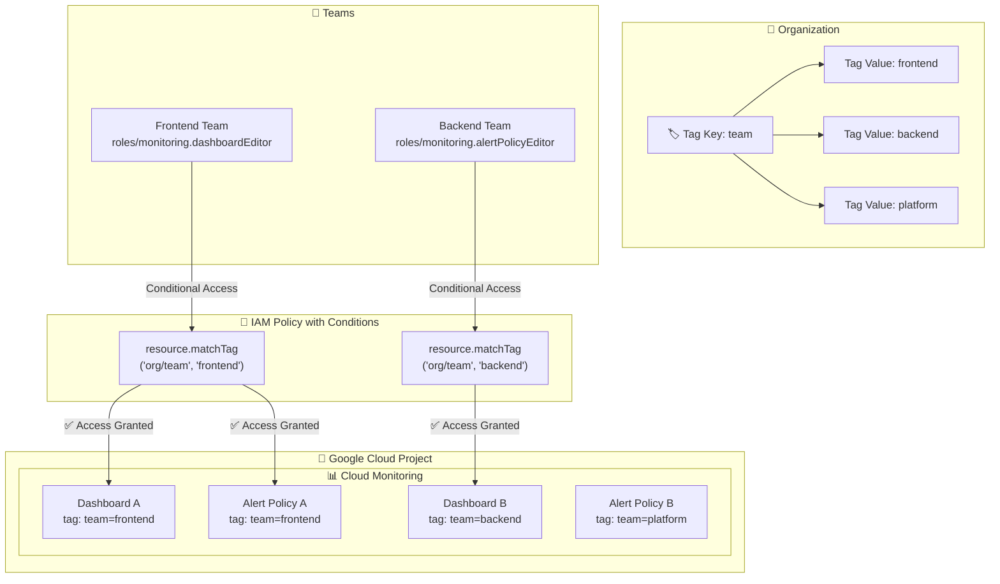

# Cloud Monitoring: Tags によるロールベースアクセス制御 (RBAC) が GA

**リリース日**: 2026-06-25

**サービス**: Cloud Monitoring

**機能**: Tags を使用したダッシュボードおよびアラートポリシーへの RBAC 適用

**ステータス**: GA (一般提供)

📊 [このアップデートのインフォグラフィックを見る](https://takech9203.github.io/google-cloud-news-summary/20260625-cloud-monitoring-rbac-tags-ga.html)

## 概要

Cloud Monitoring のダッシュボードとアラートポリシーに対して、Google Cloud Tags を使用したロールベースアクセス制御 (RBAC) を適用する機能が一般提供 (GA) となった。これにより、Terraform で管理された Cloud Monitoring リソースを Tags で保護し、チームスコープのアクセス制御を構成できるようになる。

Tags は Google Cloud のリソース階層全体で使用されるキーバリューペアであり、IAM Conditions と組み合わせることで、特定のタグが付与されたリソースに対してのみ条件付きでロールを付与できる。本機能により、Cloud Monitoring のダッシュボードやアラートポリシーといった個別リソースレベルでのきめ細かなアクセス制御が実現される。

**アップデート前の課題**

- Cloud Monitoring のアクセス制御はプロジェクトレベルでの IAM ロール付与が基本であり、個別のダッシュボードやアラートポリシーごとにアクセスを制限することが困難だった
- 複数チームが同一プロジェクトを共有する場合、すべてのダッシュボードとアラートポリシーが全員に見える状態となり、チーム固有のリソースを保護できなかった
- Terraform で管理する Monitoring リソースに対して、IaC パイプライン内でアクセス制御を一貫して適用する仕組みがなかった

**アップデート後の改善**

- Tags を使用してダッシュボードやアラートポリシーに対して条件付き IAM ロールバインディングを設定でき、リソースレベルのアクセス制御が可能になった
- チームごとにタグを付与し、チームスコープのアクセスを構成することで、マルチチーム環境でのリソース分離が実現できるようになった
- Terraform で Tags と IAM Conditions を組み合わせて管理でき、Infrastructure as Code によるアクセス制御の一元管理が可能になった

## アーキテクチャ図



Tags と IAM Conditions を組み合わせることで、チームごとに特定の Cloud Monitoring リソースへのアクセスを条件付きで制御するアーキテクチャを示す。

## サービスアップデートの詳細

### 主要機能

1. **ダッシュボードへの Tag バインディング**
   - Cloud Monitoring ダッシュボードに Tags を直接アタッチ可能
   - `monitoring.dashboards.createTagBinding` / `monitoring.dashboards.deleteTagBinding` 権限による Tag 管理
   - `monitoring.dashboards.listEffectiveTags` / `monitoring.dashboards.listTagBindings` 権限による Tag 確認

2. **アラートポリシーへの Tag バインディング**
   - Cloud Monitoring アラートポリシーに Tags を直接アタッチ可能
   - `monitoring.alertPolicies.createTagBinding` / `monitoring.alertPolicies.deleteTagBinding` 権限による Tag 管理
   - `monitoring.alertPolicies.listEffectiveTags` / `monitoring.alertPolicies.listTagBindings` 権限による Tag 確認

3. **IAM Conditions との連携**
   - `resource.matchTag()` 関数を使用して、特定のタグを持つリソースにのみロールを条件付きで付与
   - `resource.hasTagKey()` 関数による Tag キーの存在チェック
   - Allow Policy および Deny Policy の両方で Tag ベースの条件を使用可能

## 技術仕様

### 関連する IAM 権限

| 権限 | 説明 | 含まれるロール |
|------|------|----------------|
| `monitoring.dashboards.createTagBinding` | ダッシュボードへの Tag アタッチ | Monitoring Admin, Monitoring Editor, Dashboard Editor |
| `monitoring.dashboards.deleteTagBinding` | ダッシュボードからの Tag デタッチ | Monitoring Admin, Monitoring Editor, Dashboard Editor |
| `monitoring.dashboards.listEffectiveTags` | 有効な Tags の一覧取得 | Monitoring Admin, Monitoring Editor, Monitoring Viewer, Dashboard Editor, Dashboard Viewer |
| `monitoring.dashboards.listTagBindings` | Tag バインディングの一覧取得 | Monitoring Admin, Monitoring Editor, Monitoring Viewer, Dashboard Editor, Dashboard Viewer |
| `monitoring.alertPolicies.createTagBinding` | アラートポリシーへの Tag アタッチ | Monitoring Admin, Monitoring Editor, AlertPolicy Editor |
| `monitoring.alertPolicies.deleteTagBinding` | アラートポリシーからの Tag デタッチ | Monitoring Admin, Monitoring Editor, AlertPolicy Editor |
| `monitoring.alertPolicies.listEffectiveTags` | 有効な Tags の一覧取得 | Monitoring Admin, Monitoring Editor, Monitoring Viewer, AlertPolicy Editor, AlertPolicy Viewer |
| `monitoring.alertPolicies.listTagBindings` | Tag バインディングの一覧取得 | Monitoring Admin, Monitoring Editor, Monitoring Viewer, AlertPolicy Editor, AlertPolicy Viewer |

### IAM Condition 式の例

```json
{
  "title": "Frontend_team_dashboards_only",
  "description": "Grant access only to dashboards tagged with team=frontend",
  "expression": "resource.matchTag('123456789012/team', 'frontend')"
}
```

## 設定方法

### 前提条件

1. Cloud Monitoring が有効化されたプロジェクト
2. 組織またはプロジェクトレベルで Tag キーと Tag 値が作成済み
3. `monitoring.dashboards.createTagBinding` または `monitoring.alertPolicies.createTagBinding` 権限

### 手順

#### ステップ 1: Tag キーと Tag 値の作成

```bash
# Tag キーの作成
gcloud resource-manager tags keys create team \
  --parent=organizations/ORGANIZATION_ID \
  --description="Team ownership tag"

# Tag 値の作成
gcloud resource-manager tags values create frontend \
  --parent=tagKeys/TAG_KEY_ID \
  --description="Frontend team resources"
```

#### ステップ 2: Cloud Monitoring リソースへの Tag アタッチ

```bash
# ダッシュボードへの Tag バインディング作成
gcloud resource-manager tags bindings create \
  --tag-value=tagValues/TAG_VALUE_ID \
  --parent=//monitoring.googleapis.com/projects/PROJECT_ID/dashboards/DASHBOARD_ID \
  --location=global
```

#### ステップ 3: 条件付き IAM ロールバインディングの設定

```bash
# チームメンバーに対して条件付きでダッシュボード閲覧権限を付与
gcloud projects add-iam-policy-binding PROJECT_ID \
  --member="group:frontend-team@example.com" \
  --role="roles/monitoring.dashboardViewer" \
  --condition='title=frontend_dashboards,expression=resource.matchTag("123456789012/team","frontend")'
```

#### ステップ 4: Terraform での管理 (推奨)

```hcl
# Tag キーの定義
resource "google_tags_tag_key" "team" {
  parent      = "organizations/${var.org_id}"
  short_name  = "team"
  description = "Team ownership tag for monitoring resources"
}

# Tag 値の定義
resource "google_tags_tag_value" "frontend" {
  parent      = google_tags_tag_key.team.id
  short_name  = "frontend"
  description = "Frontend team"
}

# ダッシュボードへの Tag バインディング
resource "google_tags_tag_binding" "dashboard_frontend" {
  parent    = "//monitoring.googleapis.com/projects/${var.project_id}/dashboards/${google_monitoring_dashboard.frontend.dashboard_id}"
  tag_value = google_tags_tag_value.frontend.id
}

# 条件付き IAM バインディング
resource "google_project_iam_binding" "frontend_dashboard_viewer" {
  project = var.project_id
  role    = "roles/monitoring.dashboardViewer"

  members = [
    "group:frontend-team@example.com",
  ]

  condition {
    title       = "frontend_dashboards_only"
    description = "Access only to frontend team dashboards"
    expression  = "resource.matchTag('${var.org_id}/team', 'frontend')"
  }
}
```

## メリット

### ビジネス面

- **マルチチーム環境でのガバナンス強化**: チームごとに Monitoring リソースを分離し、意図しない変更や情報漏洩を防止
- **コンプライアンス対応**: 監査要件に対応したリソースレベルのアクセスログと制御を実現
- **運用負荷の軽減**: タグベースの動的なアクセス制御により、メンバー変更時の IAM ポリシー更新が不要

### 技術面

- **Infrastructure as Code との統合**: Terraform で Tags と IAM Conditions をコードとして管理し、GitOps ワークフローに組み込み可能
- **きめ細かなアクセス制御**: プロジェクトレベルではなくリソースレベルでの権限制御が可能
- **スケーラブルなアクセス管理**: 新しいリソースにタグを付与するだけで既存の IAM ポリシーが自動適用

## デメリット・制約事項

### 制限事項

- Tags は組織またはプロジェクトレベルで事前に Tag キーと Tag 値を定義する必要がある
- Tag キーは組織またはプロジェクトあたり最大 1,000 個 (サポートリクエストにより 10,000 まで拡張可能)
- Tag 値は Tag キーあたり最大 1,000 個 (サポートリクエストにより 10,000 まで拡張可能)
- Google Cloud Console の一部の画面では、Tag ベースの条件付きロールバインディングが正しく認識されない場合がある (gcloud CLI での操作を推奨)

### 考慮すべき点

- 既存の Cloud Monitoring リソースに対して Tags を一括適用する移行作業が必要
- Tag ベースのアクセス制御を導入する前に、チームの境界とリソースの所有権を明確に定義する設計が重要
- Dynamic Tag Values は IAM Conditions では使用できないため、事前定義された Tag 値を使用する必要がある

## ユースケース

### ユースケース 1: マルチチーム環境でのダッシュボード分離

**シナリオ**: 複数のマイクロサービスチームが同一プロジェクトで Cloud Monitoring を使用しており、各チームが自分たちのダッシュボードのみを編集できるようにしたい。

**実装例**:
```hcl
# 各チームのダッシュボードにチームタグを付与
resource "google_tags_tag_binding" "payment_dashboard" {
  parent    = "//monitoring.googleapis.com/projects/${var.project_id}/dashboards/${google_monitoring_dashboard.payment.dashboard_id}"
  tag_value = google_tags_tag_value.payment_team.id
}

# Payment チームに対して条件付きで Dashboard Editor を付与
resource "google_project_iam_binding" "payment_dashboard_editor" {
  project = var.project_id
  role    = "roles/monitoring.dashboardEditor"
  members = ["group:payment-team@example.com"]
  condition {
    title      = "payment_dashboards"
    expression = "resource.matchTag('${var.org_id}/team', 'payment')"
  }
}
```

**効果**: 各チームは自分たちのダッシュボードのみを編集でき、他チームのダッシュボードは閲覧のみ (または非表示) にできる。

### ユースケース 2: 本番環境アラートポリシーの保護

**シナリオ**: 本番環境のクリティカルなアラートポリシーを、限定されたSREチームのみが変更できるようにしたい。

**効果**: 開発チームは開発環境のアラートポリシーを自由に変更でき、本番環境のアラートポリシーはSREチームの承認なしに変更されないことが保証される。

## 料金

Tags を使用したアクセス制御自体に追加料金は発生しない。Cloud Monitoring の標準的な料金体系が適用される。

| 項目 | 料金 | 無料枠 |
|------|------|--------|
| Monitoring データ (最初の 150-100,000 MiB) | $0.2580/MiB | 非課金 Google Cloud メトリクス + 最初の 150 MiB |
| Monitoring API Read 呼び出し | $0.50/100万タイムシリーズ返却 | 最初の 100 万タイムシリーズ/請求アカウント |

詳細は [Cloud Monitoring 料金ページ](https://cloud.google.com/stackdriver/pricing) を参照。

## 関連サービス・機能

- **Resource Manager (Tags)**: Tag キーと Tag 値の作成・管理を担当するサービス。Cloud Monitoring リソースへの Tag バインディングの基盤
- **IAM Conditions**: Tag ベースの条件式を評価し、条件付きアクセス制御を実現する機能
- **Terraform Google Provider**: `google_tags_tag_key`、`google_tags_tag_value`、`google_tags_tag_binding` リソースによる IaC 管理
- **Cloud Logging**: Cloud Monitoring と並行して利用されるログ管理サービス。Tags による同様のアクセス制御が利用可能

## 参考リンク

- 📊 [インフォグラフィック](https://takech9203.github.io/google-cloud-news-summary/20260625-cloud-monitoring-rbac-tags-ga.html)
- [公式リリースノート](https://docs.cloud.google.com/release-notes#June_25_2026)
- [Use Tags to control access to resources - Cloud Monitoring](https://docs.cloud.google.com/monitoring/docs/access-control-with-tags)
- [Cloud Monitoring アクセス制御](https://docs.cloud.google.com/monitoring/access-control)
- [Tags と IAM によるアクセス制御](https://docs.cloud.google.com/iam/docs/tags-access-control)
- [Tags の作成と管理](https://docs.cloud.google.com/resource-manager/docs/tags/tags-creating-and-managing)
- [Cloud Monitoring 料金](https://cloud.google.com/stackdriver/pricing)

## まとめ

Cloud Monitoring の Tags による RBAC サポートの GA は、マルチチーム環境で Cloud Monitoring を運用する組織にとって重要なアップデートである。従来のプロジェクトレベルの IAM ロール付与では実現できなかった、ダッシュボードやアラートポリシー単位でのきめ細かなアクセス制御が可能になる。特に Terraform による IaC 管理との組み合わせにより、チームの所有権と責任を明確にしたガバナンスモデルの構築が推奨される。

---

**タグ**: #CloudMonitoring #RBAC #Tags #IAM #AccessControl #GA #Terraform #Governance
