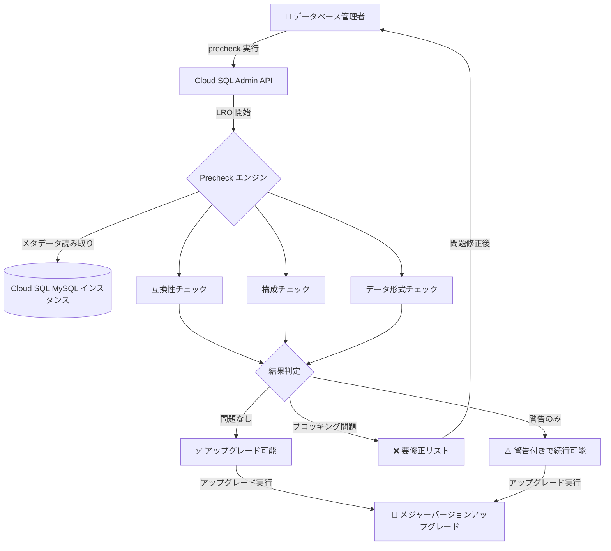

# Cloud SQL for MySQL: メジャーバージョンアップグレード事前チェック (Precheck) 機能

**リリース日**: 2026-06-25

**サービス**: Cloud SQL for MySQL

**機能**: Upgrade Readiness Precheck (アップグレード準備状況の事前チェック)

**ステータス**: Preview

📊 [このアップデートのインフォグラフィックを見る](https://takech9203.github.io/google-cloud-news-summary/20260625-cloud-sql-mysql-upgrade-readiness-precheck.html)

## 概要

Cloud SQL for MySQL に、メジャーバージョンアップグレード前にインスタンスの準備状況を評価できる Precheck (事前チェック) 機能が Preview として追加されました。この機能により、実際のアップグレードを実行する前に、バージョン間の非互換性を検出し、アップグレード前に修正が必要な問題を一覧表示できます。

Precheck はロングランニングオペレーション (LRO) として実行され、インスタンスのメタデータを読み取って互換性チェックを行います。インスタンスのパフォーマンスに影響を与えず、ダウンタイムも発生しません。これにより、アップグレード失敗のリスクを大幅に低減し、計画的なバージョン移行を実現します。

この機能は、MySQL 5.7 から 8.0、および MySQL 8.0 から 8.4 へのメジャーバージョンアップグレードを計画しているすべての Cloud SQL for MySQL ユーザーにとって有益です。

**アップデート前の課題**

- メジャーバージョンアップグレードの互換性問題は、実際にアップグレードを実行するまで完全には把握できなかった
- MySQL Shell の Upgrade Checker Utility を手動で実行する必要があり、Cloud SQL 側でのネイティブなプリチェック機能は提供されていなかった
- アップグレード失敗時にはロールバックが発生し、予期しないダウンタイムが生じる可能性があった
- 非互換性の検出と修正のサイクルが非効率で、複数回のアップグレード試行が必要になることがあった

**アップデート後の改善**

- Cloud SQL のネイティブ機能としてプリチェックが実行可能になり、gcloud CLI や REST API から直接利用できる
- アップグレードをブロックする問題と警告を事前に分類して表示し、対処方法も提示される
- インスタンスのパフォーマンスやダウンタイムに影響なくチェックを実行できる
- アップグレード失敗のリスクを事前に排除し、計画的なバージョン移行が可能になった

## アーキテクチャ図



Precheck は Cloud SQL Admin API を通じて LRO として実行され、インスタンスのメタデータと構成を分析して互換性問題を検出します。結果に基づいて、アップグレード可否の判断を支援します。

## サービスアップデートの詳細

### 主要機能

1. **非互換性の自動検出**
   - 予約キーワードの衝突 (RANKS, GROUPS, FUNCTION など)
   - 無効な UTF 文字のテーブル定義
   - 未コミットの XA トランザクション
   - 64 文字を超える外部キー制約名
   - 混合インデックス内の空間データ型

2. **結果の分類表示**
   - ブロッキングエラー: アップグレードを妨げる問題 (修正必須)
   - 非ブロッキング警告: アップグレードは可能だが注意が必要な項目
   - 成功: 問題なしでアップグレード可能

3. **バージョン別チェック項目**
   - MySQL 5.7 → 8.0: 予約キーワード、UTF 文字、XA トランザクション、外部キー制約名、空間データ型
   - MySQL 8.0 → 8.4: レプリケーション用語の変更 (MASTER/SLAVE の廃止)、認証プラグインの更新 (caching_sha2_password への移行)

4. **非侵襲的な実行**
   - メタデータの読み取りのみで、インスタンスのパフォーマンスに影響なし
   - ダウンタイム不要
   - データベース負荷が低い時間帯での実行を推奨

## 技術仕様

### IAM 権限

| 項目 | 詳細 |
|------|------|
| 必要な権限 | `cloudsql.instances.preCheckMajorVersionUpgrade` |
| 含まれるロール | Cloud SQL Admin, Cloud SQL Editor, Cloud SQL Viewer, Owner, Editor, Viewer |
| API | Cloud SQL Admin API |
| オペレーション種別 | Long Running Operation (LRO) |

### 前提条件と制限事項

| 項目 | 詳細 |
|------|------|
| インスタンス状態 | RUNNING である必要あり |
| インスタンス種別 | プライマリインスタンスのみ (レプリカは非対応) |
| ブロッキングオペレーション | 他のオペレーションが実行中でないこと |
| データベースアクセス | すべてのデータベースに接続可能であること |

### 検出される主な問題 (MySQL 5.7 → 8.0)

```json
{
  "precheckResults": [
    {
      "category": "RESERVED_KEYWORDS",
      "severity": "ERROR",
      "description": "ストアドプロシージャで予約キーワード GROUPS を使用",
      "remediation": "キーワードをバッククォートで囲むか名前を変更"
    },
    {
      "category": "INVALID_UTF_CHARACTERS",
      "severity": "ERROR",
      "description": "テーブル定義に無効な UTF 文字が含まれている",
      "remediation": "テーブル定義の文字エンコーディングを修正"
    },
    {
      "category": "FOREIGN_KEY_LENGTH",
      "severity": "ERROR",
      "description": "外部キー制約名が 64 文字を超えている",
      "remediation": "制約名を 64 文字以下に短縮"
    }
  ]
}
```

## 設定方法

### 前提条件

1. Cloud SQL Admin API が有効化されていること
2. `cloudsql.instances.preCheckMajorVersionUpgrade` IAM 権限を持つこと (Cloud SQL Viewer 以上のロール)
3. 対象インスタンスが RUNNING 状態であること

### 手順

#### ステップ 1: アップグレード対象バージョンの確認

```bash
# インスタンスのアップグレード可能なバージョンを確認
gcloud sql instances describe INSTANCE_NAME \
  --format="yaml(upgradableDatabaseVersions)"
```

出力例に `upgradableDatabaseVersions` セクションが表示され、利用可能なターゲットバージョンが確認できます。

#### ステップ 2: Precheck の実行

```bash
# REST API を使用して precheck を実行
curl -X POST \
  -H "Authorization: Bearer $(gcloud auth print-access-token)" \
  -H "Content-Type: application/json" \
  "https://sqladmin.googleapis.com/v1/projects/PROJECT_ID/instances/INSTANCE_NAME/preCheckMajorVersionUpgrade"
```

Precheck は LRO として実行されます。完了まで数分かかる場合があります。

#### ステップ 3: 結果の確認と対処

```bash
# オペレーションの状態を確認
gcloud sql operations list --instance=INSTANCE_NAME

# オペレーションの詳細を取得
gcloud sql operations describe OPERATION_ID
```

結果に応じて以下の対応を行います:
- **問題なし**: そのままアップグレードを実行可能
- **ブロッキング問題あり**: 提示された修正方法に従い問題を解決後、再度 precheck を実行
- **警告のみ**: 内容を確認の上、アップグレードを実行可能

#### ステップ 4: アップグレードの実行

```bash
# precheck が成功したらアップグレードを実行
gcloud sql instances patch INSTANCE_NAME \
  --database-version=DATABASE_VERSION
```

## メリット

### ビジネス面

- **ダウンタイムリスクの低減**: 事前に問題を検出・修正することで、アップグレード失敗による予期しないダウンタイムを防止
- **計画的な移行**: アップグレードに必要な作業量を事前に把握でき、正確なスケジュール策定が可能
- **運用コストの削減**: アップグレード失敗とロールバックの繰り返しによる工数を削減

### 技術面

- **非侵襲的チェック**: 本番環境のパフォーマンスに影響なく安全に実行可能
- **包括的な互換性検証**: バージョン固有の非互換性を網羅的にチェック
- **ネイティブ統合**: Cloud SQL Admin API、gcloud CLI からシームレスに利用可能
- **修正ガイダンス**: 検出された問題に対する具体的な修正方法を提示

## デメリット・制約事項

### 制限事項

- Preview 段階であり、本番環境での利用には注意が必要
- プライマリインスタンスのみ対応 (レプリカインスタンスでは実行不可)
- インスタンスが RUNNING 状態でなければ実行不可
- 他のブロッキングオペレーションが実行中の場合は使用不可
- すべてのデータベースに接続可能である必要がある (ロックされたデータベースがあると失敗の可能性)

### 考慮すべき点

- Precheck の結果が問題なしでも、アプリケーションレベルの互換性は別途テストが必要
- データベース負荷が低い時間帯での実行が推奨される
- ドライラン (クローンインスタンスでのテストアップグレード) と併用することで、より確実な移行が可能

## ユースケース

### ユースケース 1: MySQL 5.7 から 8.0 への計画的移行

**シナリオ**: エンタープライズアプリケーションで MySQL 5.7 を使用しており、EOL に備えて 8.0 への移行を計画している。多数のストアドプロシージャやトリガーを使用しており、予約キーワードの衝突が懸念される。

**実装例**:
```bash
# 1. Precheck を実行して非互換性を検出
gcloud sql instances describe my-production-db \
  --format="yaml(upgradableDatabaseVersions)"

# 2. precheck API を呼び出し
curl -X POST \
  -H "Authorization: Bearer $(gcloud auth print-access-token)" \
  "https://sqladmin.googleapis.com/v1/projects/my-project/instances/my-production-db/preCheckMajorVersionUpgrade"

# 3. 問題修正後、クローンで検証
gcloud sql instances clone my-production-db my-test-db

# 4. テストインスタンスでアップグレード実行
gcloud sql instances patch my-test-db \
  --database-version=MYSQL_8_0
```

**効果**: 本番アップグレード前に全ての非互換性を把握・修正でき、一発でアップグレードを成功させる確率を大幅に向上

### ユースケース 2: MySQL 8.0 から 8.4 への認証プラグイン移行確認

**シナリオ**: MySQL 8.0 で `mysql_native_password` を使用しているユーザーアカウントが多数あり、8.4 への移行時に `caching_sha2_password` への更新が必要かどうかを確認したい。

**効果**: 認証プラグインの非互換性を事前に検出し、BigQuery フェデレーテッドクエリとの互換性も考慮した移行計画を策定可能

## 料金

Precheck 機能の実行自体に追加料金は発生しません。Cloud SQL インスタンスの通常の利用料金のみが適用されます。

### Cloud SQL for MySQL 料金概要

| エディション | vCPU 料金 | メモリ料金 |
|------------|-----------|-----------|
| Cloud SQL Enterprise | $0.0413/vCPU/時間〜 | $0.007/GB/時間〜 |
| Cloud SQL Enterprise Plus | $0.05369/vCPU/時間〜 | $0.0091/GB/時間〜 |

詳細は [Cloud SQL 料金ページ](https://cloud.google.com/sql/pricing) を参照してください。

## 利用可能リージョン

Cloud SQL for MySQL が利用可能なすべてのリージョンで Precheck 機能を使用できます。詳細は [Cloud SQL のロケーション](https://cloud.google.com/sql/docs/mysql/locations) を参照してください。

## 関連サービス・機能

- **Cloud SQL Admin API**: Precheck オペレーションの実行基盤。REST API を通じてプログラマティックに利用可能
- **Cloud Logging**: アップグレードエラーログの確認に使用。`cloudsql.googleapis.com%2Fmysql.err` でフィルタリング可能
- **Cloud Monitoring**: インスタンスの負荷状態を確認し、Precheck の最適な実行タイミングを判断
- **Database Migration Service (DMS)**: 他のデータベースからの移行と組み合わせて、バージョンアップグレードパスを計画
- **Cloud SQL インスタンスクローン**: ドライランテスト用にインスタンスをクローンし、安全にアップグレードを検証

## 参考リンク

- 📊 [インフォグラフィック](https://takech9203.github.io/google-cloud-news-summary/20260625-cloud-sql-mysql-upgrade-readiness-precheck.html)
- [公式リリースノート](https://cloud.google.com/sql/docs/release-notes)
- [メジャーバージョン インプレース アップグレード (MySQL)](https://docs.cloud.google.com/sql/docs/mysql/upgrade-major-db-version-inplace)
- [Cloud SQL IAM ロールと権限](https://docs.cloud.google.com/sql/docs/mysql/iam-roles)
- [MySQL 8.0 アップグレードのトラブルシューティング](https://docs.cloud.google.com/sql/docs/mysql/troubleshooting-in-place-major-version-upgrade-to-8.0)
- [料金ページ](https://cloud.google.com/sql/pricing)

## まとめ

Cloud SQL for MySQL の Precheck 機能は、メジャーバージョンアップグレードの成功率を大幅に向上させる重要な機能です。本番環境に影響を与えることなく互換性問題を事前に検出・対処できるため、MySQL 5.7 → 8.0 や 8.0 → 8.4 へのアップグレードを計画している場合は、必ず事前に Precheck を実行することを推奨します。Preview 段階ですが、アップグレード失敗のリスクを低減する実用的なツールとして、今後の GA に向けて積極的な活用を検討してください。

---

**タグ**: #CloudSQL #MySQL #MajorVersionUpgrade #Precheck #DatabaseMigration #Preview
