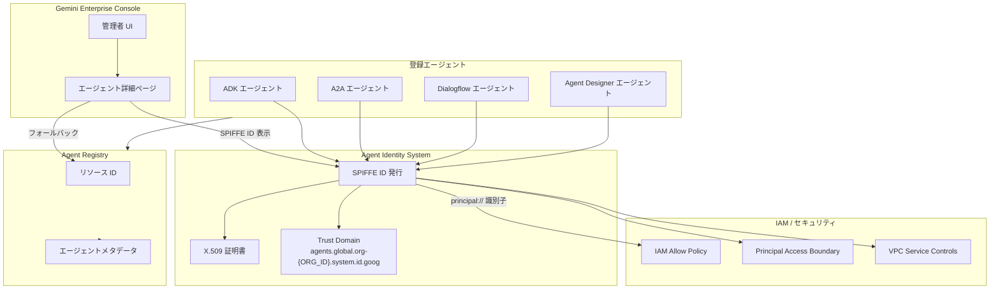

# Gemini Enterprise: エージェント ID 表示機能 GA

**リリース日**: 2026-06-25

**サービス**: Gemini Enterprise

**機能**: エージェント ID 表示機能 GA

**ステータス**: GA (Generally Available)

📊 [このアップデートのインフォグラフィックを見る](https://takech9203.github.io/google-cloud-news-summary/20260625-gemini-enterprise-agent-identity-ga.html)

## 概要

Gemini Enterprise において、管理者がエージェントの詳細ページでエージェントの ID (Identity) を確認できる機能が一般提供 (GA) となりました。この機能により、エージェントに割り当てられた SPIFFE ID を直接確認でき、エージェントのセキュリティ管理やアクセス制御の設定がより容易になります。

SPIFFE (Secure Production Identity Framework For Everyone) は、分散システムにおけるワークロード間の安全な認証を実現するための標準規格です。Gemini Enterprise では、各エージェントに一意の SPIFFE ID が割り当てられ、これがエージェントの暗号学的に証明可能な ID として機能します。パブリッシャーが SPIFFE ID を公開していない場合は、代替として Agent Registry のリソース ID が表示されます。

この機能の主な対象ユーザーは Gemini Enterprise の管理者であり、組織内で運用されるエージェント (Google 製、サードパーティ製、内部チーム製) の ID 管理とセキュリティガバナンスを強化できます。

**アップデート前の課題**

- エージェントの SPIFFE ID を確認するには、API や CLI を使用する必要があり、管理者にとって直感的ではなかった
- エージェントの ID 情報へのアクセスが容易でなく、IAM ポリシーの設定時に ID の確認に手間がかかっていた
- エージェントの身元確認と監査に追加の手順が必要だった

**アップデート後の改善**

- Google Cloud コンソールのエージェント詳細ページで SPIFFE ID を直接確認可能になった
- SPIFFE ID が未公開の場合でも Agent Registry リソース ID がフォールバックとして表示されるため、常にエージェントを一意に識別可能
- IAM ポリシー設定時に必要な principal 識別子を容易に取得できるようになった

## アーキテクチャ図



この図は、Gemini Enterprise コンソールにおけるエージェント ID 表示の仕組みを示しています。管理者はエージェント詳細ページから SPIFFE ID を確認し、その識別子を使用して IAM ポリシーやセキュリティ制御を設定できます。SPIFFE ID が未公開の場合は Agent Registry のリソース ID がフォールバックとして使用されます。

## サービスアップデートの詳細

### 主要機能

1. **エージェント SPIFFE ID の表示**
   - エージェント詳細ページで SPIFFE ID を直接確認可能
   - SPIFFE ID のフォーマット: `spiffe://TRUST_DOMAIN/resources/SERVICE/RESOURCE_PATH`
   - 例: `spiffe://agents.global.org-123456789012.system.id.goog/resources/discoveryengine/projects/9876543210/locations/global/collections/default_collection/engines/my-test-agent`

2. **Agent Registry リソース ID フォールバック**
   - パブリッシャーが SPIFFE ID を公開していない場合に Agent Registry リソース ID を表示
   - エージェントの一意な識別を常に保証

3. **IAM Principal 識別子との連携**
   - 表示された SPIFFE ID から IAM allow policy で使用する principal 識別子を容易に特定可能
   - フォーマット: `principal://TRUST_DOMAIN/resources/SERVICE/RESOURCE_PATH`

## 技術仕様

### SPIFFE ID の構成要素

| 項目 | 詳細 |
|------|------|
| Trust Domain | `agents.global.org-{ORG_ID}.system.id.goog` |
| サービス名 (Gemini Enterprise) | `discoveryengine` |
| サービス名 (Vertex AI Agent Engine) | `aiplatform` |
| リソースパス | サービス固有のリソースパス |
| 証明書タイプ | X.509 (24時間有効、自動更新) |

### エージェントタイプ別のサポート

| エージェントタイプ | 作成ツール | SPIFFE ID サポート |
|------|------|------|
| Employee-made エージェント | Agent Designer | 対応 |
| Google-made エージェント | Core Assistant, Deep Research 等 | 対応 |
| ADK エージェント | Agent Runtime | 対応 |
| A2A エージェント | Agent2Agent Protocol | 対応 |
| Dialogflow エージェント | Dialogflow | 対応 |

### IAM ポリシーでの使用例

```json
{
  "bindings": [
    {
      "role": "roles/storage.objectViewer",
      "members": [
        "principal://agents.global.org-123456789012.system.id.goog/resources/discoveryengine/projects/9876543210/locations/global/collections/default_collection/engines/my-agent"
      ]
    }
  ]
}
```

## 設定方法

### 前提条件

1. Gemini Enterprise の管理者権限を持つアカウント
2. エージェントが Gemini Enterprise に登録済みであること

### 手順

#### ステップ 1: Gemini Enterprise コンソールにアクセス

Google Cloud コンソールで Gemini Enterprise ページに移動し、エージェントが登録されているアプリを選択します。

#### ステップ 2: エージェント詳細ページを開く

```
Google Cloud Console > Gemini Enterprise > [アプリ名] > Agents > [エージェント名]
```

エージェント一覧から対象のエージェントをクリックすると、エージェント詳細ページが表示されます。

#### ステップ 3: エージェント ID を確認

エージェント詳細ページに表示される ID を確認します。通常は SPIFFE ID が表示されますが、パブリッシャーが SPIFFE ID を公開していない場合は Agent Registry リソース ID が表示されます。

## メリット

### ビジネス面

- **ガバナンス強化**: エージェントの身元を明確に把握でき、組織のセキュリティポリシーへの準拠を確認可能
- **運用効率向上**: エージェント ID を UI から直接確認でき、セキュリティ設定にかかる時間を短縮
- **監査対応の簡素化**: エージェントの一意な識別子により、監査ログとの紐付けが容易

### 技術面

- **IAM 設定の簡素化**: SPIFFE ID を直接コピーして IAM ポリシーに設定可能
- **強力な ID 分離**: サービスアカウントとは異なり、エージェント ID は他のワークロードと共有されず、なりすましが困難
- **暗号学的保証**: X.509 証明書に基づく強力な認証により、トークン窃取を防止

## デメリット・制約事項

### 制限事項

- SPIFFE ID はパブリッシャーが公開している場合のみ表示される
- SPIFFE ID が未公開の場合は Agent Registry リソース ID のフォールバックとなり、SPIFFE ID と同等のセキュリティ機能は得られない
- Agent Identity auth manager は現時点で Preview ステータス

### 考慮すべき点

- X.509 証明書は 24 時間で有効期限切れとなるため、自動更新が正常に動作していることを前提とする必要がある
- 組織の Trust Domain 設定が正しく構成されている必要がある
- VPC Service Controls でのエージェント ID の使用は Preview 段階

## ユースケース

### ユースケース 1: マルチエージェント環境のアクセス制御

**シナリオ**: 組織内で複数のカスタムエージェントが稼働しており、各エージェントがアクセスできる Cloud Storage バケットを制限したい場合。

**実装例**:
```bash
# エージェント詳細ページから取得した SPIFFE ID を使用して IAM ポリシーを設定
gcloud storage buckets add-iam-policy-binding gs://my-bucket \
  --member="principal://agents.global.org-123456789012.system.id.goog/resources/discoveryengine/projects/9876543210/locations/global/collections/default_collection/engines/sales-agent" \
  --role="roles/storage.objectViewer"
```

**効果**: 各エージェントに最小権限の原則を適用でき、セキュリティリスクを最小限に抑えながらエージェントの機能を維持

### ユースケース 2: エージェントの監査とコンプライアンス

**シナリオ**: セキュリティチームが組織内で稼働するすべてのエージェントの ID を確認し、適切なアクセス権限が付与されているかを監査する必要がある場合。

**効果**: エージェント詳細ページで SPIFFE ID を確認し、Cloud Audit Logs と照合することで、各エージェントのアクティビティを追跡可能

### ユースケース 3: サードパーティエージェントの信頼性検証

**シナリオ**: Agent Registry から A2A エージェントをインポートした際に、そのエージェントの ID が正しく割り当てられているかを確認したい場合。

**効果**: エージェント詳細ページで SPIFFE ID の存在と形式を確認することで、エージェントが正しく ID システムに登録されていることを検証可能

## 料金

Gemini Enterprise のエージェント ID 表示機能は、Gemini Enterprise ライセンスに含まれる機能であり、追加料金は発生しません。Gemini Enterprise の料金体系に従います。

## 関連サービス・機能

- **Agent Identity**: エージェントに SPIFFE ベースの暗号学的 ID を提供するプラットフォーム機能
- **Agent Registry**: エージェントの登録・管理を行うサービス。SPIFFE ID 未公開時のフォールバック ID を提供
- **Agent Identity auth manager (Preview)**: エージェントの外部認証を管理する集中型クレデンシャルボールト
- **IAM**: エージェント ID を principal として使用し、リソースへのアクセスを制御
- **Principal Access Boundary (PAB)**: エージェントがアクセスできるリソースの範囲を制限
- **VPC Service Controls**: サービス境界内でのエージェント ID の使用 (Preview)

## 参考リンク

- 📊 [インフォグラフィック](https://takech9203.github.io/google-cloud-news-summary/20260625-gemini-enterprise-agent-identity-ga.html)
- [公式ドキュメント: Agents overview](https://cloud.google.com/gemini/enterprise/docs/agents-overview#agent-identity)
- [Agent Identity overview](https://cloud.google.com/gemini-enterprise-agent-platform/govern/agent-identity-overview)
- [Agent Identity auth manager overview](https://cloud.google.com/iam/docs/auth-manager-overview)

## まとめ

Gemini Enterprise のエージェント ID 表示機能が GA になったことで、管理者はコンソールから直接エージェントの SPIFFE ID を確認でき、エージェントのセキュリティ管理とガバナンスが大幅に向上します。マルチエージェント環境を運用している組織は、この機能を活用して各エージェントのアクセス権限を適切に設定し、最小権限の原則に基づいたセキュリティ体制を構築することを推奨します。

---

**タグ**: #gemini-enterprise #agent-identity #spiffe #agent-registry #ga
