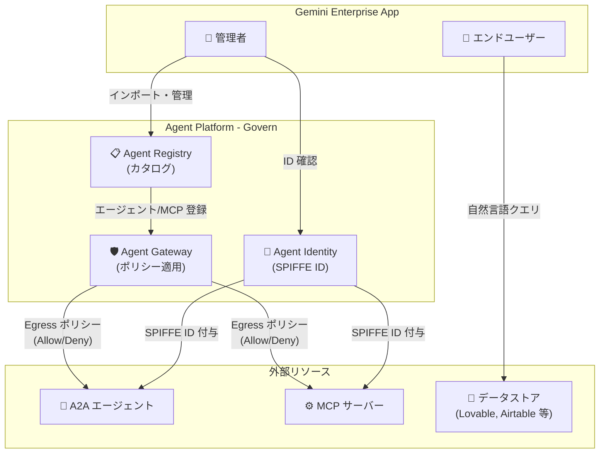

# Gemini Enterprise: エージェント・MCP サーバーのガバナンスと新コネクタ

**リリース日**: 2026-06-25

**サービス**: Gemini Enterprise

**機能**: Agent Registry からのエージェント/MCP サーバーインポートとガバナンス、新データストア・アクション対応、エージェント ID 表示

**ステータス**: GA (ガバナンス機能、エージェント ID 表示) / Public Preview (新データストア・アクション)

📊 [このアップデートのインフォグラフィックを見る](https://takech9203.github.io/google-cloud-news-summary/20260625-gemini-enterprise-governance-agents-mcp.html)

## 概要

Gemini Enterprise において、エージェントと MCP サーバーのガバナンス管理を強化する複数の機能が GA およびPublic Preview としてリリースされた。Agent Registry を通じた A2A エージェントやカスタム MCP サーバーのカタログ管理、Agent Gateway による Egress ポリシーの適用、そしてエージェント ID (SPIFFE ID) の可視化が可能となり、エンタープライズ環境におけるエージェントの統制・管理が大幅に改善される。

加えて、Lovable データストアが Public Preview で利用可能になり、Airtable、Freshservice、Google Stitch、Zoho Desk、Zoho Projects への新しいアクション対応も追加された。これにより、Gemini Enterprise アプリケーションからサードパーティサービスへの自然言語による操作の幅が拡大する。

本アップデートは、AI エージェントの導入が進む中で、セキュリティとガバナンスを確保しながらエージェント活用を拡大したい企業の IT 管理者、セキュリティ担当者、および業務効率化を推進するチームに向けたものである。

**アップデート前の課題**

- Gemini Enterprise アプリで利用するエージェントや MCP サーバーを一元的に管理・発見する仕組みがなかった
- エージェントから外部サービスや MCP サーバーへの通信に対して、きめ細かいアクセス制御ポリシーを適用する手段が限定的だった
- エージェントの身元情報 (SPIFFE ID) を管理コンソールから直接確認する方法がなかった
- Lovable や一部のサードパーティサービスとの連携が未対応だった

**アップデート後の改善**

- Agent Registry からエージェントや MCP サーバーを検索・インポートし、Gemini Enterprise アプリに追加できるようになった
- Agent Gateway を通じた Egress ポリシーで、エージェントから MCP サーバーへのトラフィックに Allow/Deny ルールを設定可能になった
- 管理者がエージェント詳細ページからエージェントの SPIFFE ID を確認できるようになった
- Lovable データストアが利用可能になり、5 つの新しいサードパーティコネクタがアクション対応した

## アーキテクチャ図



Gemini Enterprise アプリから Agent Registry を通じてエージェントと MCP サーバーを一元管理し、Agent Gateway の Egress ポリシーで通信を制御するアーキテクチャを示す。Agent Identity がすべてのエージェントに SPIFFE ベースの ID を付与し、管理者による可視化と IAM 制御を実現する。

## サービスアップデートの詳細

### 主要機能

1. **Agent Registry からのエージェント・MCP サーバーのインポートとガバナンス (GA)**
   - Agent Registry は A2A エージェント、エンドポイント、MCP サーバーを一元的に管理するカタログ
   - Google 製・カスタム製の MCP サーバーを Registry から発見し、Gemini Enterprise アプリに追加可能
   - A2A プロトコル対応エージェントも同様にインポート可能
   - Agent Gateway による Egress ポリシーで、IAM 制御やセマンティックガバナンスポリシーを適用
   - Gemini Enterprise アプリ、Agent Gateway、Agent Registry のリージョン整合性が厳格に適用される

2. **新データストア・新アクション対応 (Public Preview)**
   - **Lovable データストア**: プロジェクトの検索・閲覧、自然言語によるアクション実行が可能
   - **Lovable 対応アクション**: コネクタ追加、プロジェクトの Remix (フォーク)、ナレッジ設定、公開レベル設定
   - **新規アクション対応コネクタ**: Airtable、Freshservice、Google Stitch、Zoho Desk、Zoho Projects
   - Google マネージド OAuth を使用するため、OAuth アプリケーションの個別作成は不要

3. **エージェント ID の表示 (GA)**
   - 管理者がエージェント詳細ページから SPIFFE ID を確認可能
   - SPIFFE ID の形式: `spiffe://TRUST_DOMAIN/resources/SERVICE/RESOURCE_PATH`
   - Gemini Enterprise の場合: `principal://agents.global.org-{ORG_ID}.system.id.goog/resources/discoveryengine/projects/{PROJECT}/locations/global/collections/default_collection/engines/{AGENT}`
   - パブリッシャーが SPIFFE ID を公開していない場合は、Agent Registry リソース ID がフォールバック表示される

## 技術仕様

### リージョン整合性要件

Agent Registry、Agent Gateway、Gemini Enterprise アプリの 3 コンポーネントはリージョン整合性が必須である。

| Gemini Enterprise アプリのロケーション | Agent Gateway のロケーション | Agent Registry のロケーション |
|------|------|------|
| global | us-central1 | us-central1、us、または global |
| us | us-central1 | us-central1 または us |
| eu | europe-west1 | europe-west1 または eu |

### Lovable コネクタ仕様

| 項目 | 詳細 |
|------|------|
| 認証方式 | Google マネージド OAuth |
| 対応リージョン | global、us、eu |
| 検索対象エンティティ | Projects |
| 対応アクション | コネクタ追加、プロジェクト Remix、ナレッジ設定、公開レベル設定 |
| データ処理方式 | フェデレーション (データは Lovable 側に保持) |

### Agent Identity (SPIFFE ID) フォーマット

```
spiffe://<TRUST_DOMAIN>/resources/<SERVICE>/<RESOURCE_PATH>

例:
spiffe://agents.global.org-123456789012.system.id.goog/resources/discoveryengine/projects/9876543210/locations/global/collections/default_collection/engines/my-agent
```

## 設定方法

### 前提条件

1. Gemini Enterprise Admin ロール (`roles/discoveryengine.agentspaceAdmin`) を保有していること
2. Agent Gateway がセットアップ済みで、Gemini Enterprise アプリと同一リージョンに配置されていること
3. Agent Registry が Agent Gateway に関連付けされていること

### 手順

#### ステップ 1: Agent Registry からエージェントをインポート

1. Google Cloud コンソールで Gemini Enterprise ページに移動
2. エージェントを追加したいアプリの名前をクリック
3. 「Agents」をクリック
4. 「+ Add agents」をクリックし、「Add from Agent Registry」を選択
5. 追加するエージェントを見つけてクリック
6. エージェントの詳細を確認し「Next」をクリック
7. プロバイダー認証情報 (Client ID、Client secret、Authorization URL、Token URL、Scopes) を入力し「Finish」をクリック

#### ステップ 2: MCP サーバーをインポート

1. Agent Gateway のセットアップ完了後、関連付けされた Agent Registry 内の MCP サーバーが自動的に利用可能に
2. MCP サーバーはデータストアとして追加される
3. Google 製 MCP サーバーまたはカスタム MCP サーバーのいずれも選択可能

#### ステップ 3: Egress ポリシーの設定

Agent Gateway を使用して、以下のいずれかの方法でガバナンスポリシーを適用する:

- **IAM エージェントポリシー**: エージェントの SPIFFE ID に基づき、特定のツールやメソッドへのアクセスを制限
- **セマンティックガバナンスポリシー**: 自然言語ベースのコンテキスト認識制御でエージェント実行を管理

## メリット

### ビジネス面

- **エージェント活用の統制**: 企業全体でのエージェント・MCP サーバーの利用を一元的に可視化・管理でき、シャドー AI のリスクを低減
- **サードパーティ連携の拡大**: Lovable、Airtable、Zoho 等の外部サービスへの自然言語アクセスにより、業務プロセスの自動化を推進
- **コンプライアンス対応**: データレジデンシー要件に対応したリージョン整合性の強制適用

### 技術面

- **ゼロトラストセキュリティ**: SPIFFE ベースの強固な ID 割り当てにより、エージェントごとの最小権限原則を実現
- **きめ細かいアクセス制御**: IAM ポリシーとセマンティックポリシーの組み合わせで、ツールレベル・メソッドレベルのアクセス制御が可能
- **監査可能性の向上**: エージェント ID の可視化により、誰が (どのエージェントが) 何にアクセスしたかの追跡が容易に

## デメリット・制約事項

### 制限事項

- Agent Registry からのインポートは、同一リージョンの Agent Gateway に関連付けられた Registry からのみ可能
- Gemini Enterprise エージェント間の直接通信や、Gemini Enterprise エージェントとデータコネクタ間の直接通信は Agent Gateway のポリシー適用対象外
- ガバナンスポリシーは Agent Gateway に関連付けられた単一の Registry 内のエージェント/MCP サーバーにのみ適用可能
- Lovable データストアは global、us、eu ロケーションのみ対応
- VPC Service Controls ペリメータを既存の Lovable データストアに適用する場合、データストアの再作成が必要

### 考慮すべき点

- Agent Gateway のセットアップが前提条件となるため、未導入環境では事前準備が必要
- リージョン整合性の要件により、アプリ・Gateway・Registry を異なるリージョンに分散配置することはできない
- 新データストアのコネクタは Public Preview のため、本番環境での利用には Pre-GA の利用条件が適用される

## ユースケース

### ユースケース 1: 全社的なエージェント統制

**シナリオ**: 大企業で複数チームが独自に AI エージェントや MCP サーバーを構築・利用している。セキュリティチームはすべてのエージェントの利用状況を把握し、不正なデータアクセスを防止したい。

**効果**: Agent Registry でエージェント・MCP サーバーを一元カタログ化し、Agent Gateway の Egress ポリシーで許可されたリソースへのアクセスのみを許可。管理者はエージェント詳細ページから SPIFFE ID を確認し、IAM ポリシーで個別エージェントの権限を管理できる。

### ユースケース 2: マルチツール業務自動化

**シナリオ**: プロジェクト管理チームが Lovable でプロトタイピング、Airtable でデータ管理、Zoho Projects でタスク管理を行っている。各ツールへの操作を Gemini Enterprise の統一インターフェースから自然言語で実行したい。

**効果**: 新しいデータストアとアクション対応により、「Lovable の新しいプロジェクトを Remix して」「Airtable のレコードを更新して」「Zoho Projects のタスクステータスを変更して」といった自然言語命令で複数ツールを横断的に操作可能。

## 料金

Gemini Enterprise はサブスクリプションベースのライセンスモデルで提供される。エディションは Business、Standard、Plus、Frontline の 4 種類が存在する。

Agent Registry からのインポートやガバナンス機能は Standard 以上のエディションで「Enterprise-grade security and compliance」および「Access basic agent governance and administration」機能の一部として利用可能。

具体的な料金については、30 日間の無料トライアルが Business エディション (business.gemini.google) および Standard/Plus エディション (Google Cloud コンソール経由) で利用可能。Standard、Plus、Frontline エディションの購入は Google Cloud セールスへの問い合わせが必要。

## 利用可能リージョン

Agent Registry とガバナンス機能は以下のリージョンで利用可能:

| ロケーション | 対応リージョン |
|------|------|
| グローバル | us-central1 (Gateway) + us-central1/us/global (Registry) |
| US | us-central1 (Gateway) + us-central1/us (Registry) |
| EU | europe-west1 (Gateway) + europe-west1/eu (Registry) |

## 関連サービス・機能

- **Agent Platform**: Agent Registry、Agent Gateway、Agent Identity を含む統合ガバナンスプラットフォーム
- **Agent Gateway**: エージェントトラフィックの制御とランタイムポリシー適用を担うネットワークコンポーネント
- **Agent Identity**: SPIFFE 標準に基づくエージェント認証・認可基盤
- **Identity-Aware Proxy (IAP)**: Agent Gateway のデフォルト認証レイヤー
- **Model Armor**: プロンプトインジェクション等からの保護を提供するセキュリティガードレール
- **Vertex AI Agent Engine**: Agent Runtime 上でのエージェントデプロイ環境

## 参考リンク

- 📊 [インフォグラフィック](https://takech9203.github.io/google-cloud-news-summary/20260625-gemini-enterprise-governance-agents-mcp.html)
- [公式リリースノート](https://docs.cloud.google.com/release-notes#June_25_2026)
- [Agent Registry からエージェントをインポート](https://docs.cloud.google.com/gemini/enterprise/docs/import-govern-agent-registry)
- [Agent Registry からカスタム MCP サーバーをインポート](https://docs.cloud.google.com/gemini/enterprise/docs/connectors/custom-mcp-server/import-govern-mcp-server-agent-registry)
- [サードパーティデータソースの接続](https://docs.cloud.google.com/gemini/enterprise/docs/connectors/connect-third-party-data-source)
- [Lovable コネクタ](https://docs.cloud.google.com/gemini/enterprise/docs/connectors/lovable)
- [Agent Gateway 概要](https://docs.cloud.google.com/gemini-enterprise-agent-platform/govern/gateways/agent-gateway-overview)
- [Agent Identity 概要](https://docs.cloud.google.com/gemini-enterprise-agent-platform/govern/agent-identity-overview)
- [Gemini Enterprise エディション比較](https://docs.cloud.google.com/gemini/enterprise/docs/editions)

## まとめ

本アップデートにより、Gemini Enterprise は Agent Registry・Agent Gateway・Agent Identity の 3 本柱でエージェントと MCP サーバーの統制を実現する本格的なエンタープライズガバナンス機能を GA として提供開始した。AI エージェントの導入を検討している組織は、まず Agent Gateway のセットアップと Agent Registry の構築を行い、ガバナンスポリシーを定義した上でエージェント・MCP サーバーの段階的な展開を進めることが推奨される。

---

**タグ**: #GeminiEnterprise #AgentRegistry #AgentGateway #MCP #A2A #SPIFFE #ガバナンス #エージェント #Lovable #コネクタ #GA #PublicPreview
