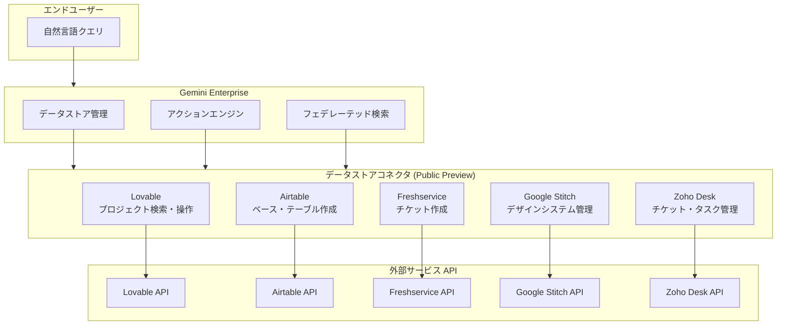

# Gemini Enterprise: Lovable データストア & 新規アクション対応 (Public Preview)

**リリース日**: 2026-06-25

**サービス**: Gemini Enterprise

**機能**: Lovable データストア & 新規アクション対応 (Public Preview)

**ステータス**: Public Preview

📊 [このアップデートのインフォグラフィックを見る](https://takech9203.github.io/google-cloud-news-summary/20260625-gemini-enterprise-lovable-data-store-preview.html)

## 概要

Gemini Enterprise に Lovable データストアが Public Preview として追加されました。これにより、エンドユーザーは Gemini Enterprise を通じて自然言語で Lovable プロジェクトの検索・閲覧・操作が可能になります。コネクタの追加、プロジェクトのリミックス（フォーク）、プロジェクトのナレッジ設定、公開範囲の設定など、開発ワークフローに直結するアクションを自然言語コマンドで実行できます。

さらに、Lovable に加えて Airtable、Freshservice、Google Stitch、Zoho Desk の各データストアにおいても新規アクションのサポートが Public Preview で提供開始されました。Airtable ではベースやフィールド、テーブルの作成およびレコードコメントの追加が可能になり、Freshservice ではチケット作成、Google Stitch ではデザインシステムやプロジェクトの管理、Zoho Desk ではチケット・タスク・イベントの作成・更新が自然言語で行えるようになりました。

このアップデートの主な対象ユーザーは、複数の SaaS ツールを横断的に利用する開発チームや IT チーム、カスタマーサポートチームです。Gemini Enterprise を統合検索・操作のハブとして活用することで、ツール間の切り替えを削減し、業務効率を大幅に向上させることができます。

**アップデート前の課題**

- Lovable プロジェクトの管理には Lovable の UI に直接アクセスする必要があり、Gemini Enterprise からの統合検索・操作ができなかった
- Airtable、Freshservice、Google Stitch、Zoho Desk への書き込み操作は各サービスの個別インターフェースでのみ可能だった
- 複数ツールを横断した作業では、ツール間の頻繁な切り替えが必要で生産性が低下していた

**アップデート後の改善**

- Gemini Enterprise から自然言語で Lovable プロジェクトの検索・閲覧・操作が可能になった
- Airtable、Freshservice、Google Stitch、Zoho Desk に対する書き込みアクションが Gemini Enterprise 内から自然言語で実行可能になった
- 統一されたインターフェースで複数のデータソースを横断的に操作でき、コンテキストスイッチが不要になった

## アーキテクチャ図

この図は、エンドユーザーの自然言語クエリが Gemini Enterprise を経由し、各コネクタを通じて外部サービス API に接続される全体アーキテクチャを示しています。

## サービスアップデートの詳細

### 主要機能

1. **Lovable データストア（新規）**
   - Lovable プロジェクトの検索・閲覧が可能
   - 自然言語コマンドによる書き込みアクション: コネクタ追加、プロジェクトのリミックス（フォーク）、ナレッジ設定、公開範囲設定（draft / private / public）
   - Google マネージド OAuth を使用し、独自の OAuth アプリケーションの作成が不要

2. **Airtable データストア（新規アクション追加）**
   - ベースの作成（指定ワークスペース内）
   - フィールドの作成（既存テーブル内）
   - テーブルの作成（既存ベース内）
   - レコードコメントの作成
   - テーブルの更新（名前や説明の変更）

3. **Freshservice データストア（新規アクション追加）**
   - チケットの作成
   - サービスカタログアイテムのリクエスト送信

4. **Google Stitch データストア（新規アクション追加）**
   - デザインシステムの作成・更新・適用
   - プロジェクトの作成

5. **Zoho Desk データストア（新規アクション追加）**
   - チケット・コール・タスク・イベントの作成
   - チケットコメントの追加
   - メール返信の送信
   - チケット・コール・タスクの更新
   - チケットの既読マーク付け

## 技術仕様

### サポートされるアクション一覧

| コネクタ | アクション | 説明 |
|----------|-----------|------|
| Lovable | Add connector | ワークスペースにコネクタを追加 |
| Lovable | Remix project | 既存プロジェクトをリミックス（フォーク） |
| Lovable | Set project knowledge | プロジェクトのナレッジコンテンツを設定 |
| Lovable | Set project visibility | 公開範囲を設定（draft / private / public） |
| Airtable | Create base | 新規ベースを作成 |
| Airtable | Create field | 既存テーブルにフィールドを追加 |
| Airtable | Create table | 既存ベースにテーブルを作成 |
| Airtable | Create record comment | レコードにコメントを追加 |
| Airtable | Update table | テーブルの名前・説明を更新 |
| Freshservice | Create ticket | 新規チケットを作成 |
| Google Stitch | Create project | 新規プロジェクトを作成 |
| Google Stitch | Create design system | デザインシステムを作成 |
| Google Stitch | Update design system | デザインシステムを更新 |
| Google Stitch | Apply design system | プロジェクトにデザインシステムを適用 |
| Zoho Desk | Create ticket | 新規チケットを作成 |
| Zoho Desk | Create ticket comment | チケットにコメントを追加 |
| Zoho Desk | Create task | タスクを作成 |
| Zoho Desk | Create event | イベントを追加 |
| Zoho Desk | Create call | コールを作成 |
| Zoho Desk | Send reply | メール返信を送信 |
| Zoho Desk | Update ticket | チケットを更新 |
| Zoho Desk | Update task | タスクを更新 |
| Zoho Desk | Update call | コールを更新 |

### 認証方式

| コネクタ | 認証方式 | 備考 |
|----------|----------|------|
| Lovable | Google マネージド OAuth | 独自の OAuth アプリ不要 |
| Airtable | OAuth | クライアント ID・シークレットが必要 |
| Freshservice | OAuth | クライアント ID・シークレットが必要 |
| Google Stitch | Google OAuth (スコープ: `googleapis.com/auth/aida`) | OAuth 同意画面の設定が必要 |
| Zoho Desk | OAuth | クライアント ID・シークレットが必要 |

## 設定方法

### 前提条件

1. Google Cloud プロジェクトが作成済みであること
2. Discovery Engine Editor ロール（`roles/discoveryengine.editor`）が付与されていること
3. 各外部サービスのアカウントが有効であること

### 手順

#### ステップ 1: データストアの作成

Google Cloud Console で Gemini Enterprise ページに移動し、ナビゲーションメニューから「Data stores」をクリックし、「Create data store」を選択します。

1. **Source** セクションで接続したいサービス（Lovable、Airtable 等）を検索して選択
2. **Data** セクションで検索対象のエンティティを選択
3. **Actions** セクションで有効にするアクションを選択
4. **Configuration** セクションでリージョン（global / us / eu）とコネクタ名を設定
5. 暗号化設定（Google マネージド暗号化キーまたは Cloud KMS キー）を選択
6. **Billing** セクションで課金プランを選択
7. 「Create」をクリック

#### ステップ 2: アプリへの接続と認証

データストアが「Active」状態になった後、以下を実施します。

1. 既存アプリにデータストアを接続するか、新規アプリを作成して接続
2. Gemini Enterprise が外部サービスにアクセスするための認証（Authorization）を実行

## メリット

### ビジネス面

- **業務効率の向上**: 複数の SaaS ツールを切り替えることなく、Gemini Enterprise の統一インターフェースから自然言語で操作が完結する
- **オンボーディングの簡素化**: 新しいツールの操作方法を学ぶ必要がなく、自然言語で指示するだけで各サービスへの操作が可能
- **ワークフロー統合**: 開発（Lovable）、データ管理（Airtable）、IT サービス管理（Freshservice）、カスタマーサポート（Zoho Desk）を一つのプラットフォームで横断的に操作

### 技術面

- **フェデレーテッド検索**: データを Gemini Enterprise にコピーする必要がなく、元のデータソースから直接検索結果を取得
- **Google マネージド OAuth（Lovable）**: 独自の OAuth アプリケーションの作成・管理が不要で設定が簡素化
- **暗号化オプション**: Google マネージド暗号化キーと Cloud KMS（顧客管理暗号化キー）の選択が可能
- **VPC Service Controls 対応**: セキュリティ要件に応じたアクセス制御が可能（ただし制約あり）

## デメリット・制約事項

### 制限事項

- Public Preview のため「Pre-GA Offerings Terms」が適用され、サポートが制限される可能性がある
- 各データストアは global、us、eu リージョンのみで利用可能
- 1 つのアプリまたはデータストアには、単一のコネクタタイプに属するアクションのみを関連付けることが推奨される
- 既存データストアへの VPC Service Controls の適用はサポートされていない（削除と再作成が必要）

### 考慮すべき点

- Lovable のクエリ実行時、LLM がクエリを書き換える場合があり、セッションのクエリ履歴が Lovable API に送信される可能性がある
- 第三者サービスにクエリが送信されるため、各サービスの利用規約とプライバシーポリシーが適用される
- 複数のフェデレーテッド検索データソースが有効な場合、クエリがすべてのデータソースに送信される可能性がある

## ユースケース

### ユースケース 1: 開発プロジェクトの統合管理

**シナリオ**: 開発チームが Lovable でフロントエンド開発を行い、関連タスクを Freshservice で管理している場合。開発者は Gemini Enterprise で「Lovable のプロジェクト X をリミックスして、Freshservice にセットアップタスクのチケットを作成して」と指示するだけで、両方の操作を完了できる。

**効果**: ツール間のコンテキストスイッチを排除し、開発フローの効率を向上

### ユースケース 2: カスタマーサポートとデータ管理の連携

**シナリオ**: サポートチームが Zoho Desk でチケット管理を行い、関連データを Airtable で追跡している場合。「顧客 Y の問い合わせについて Zoho Desk にチケットを作成し、Airtable の追跡テーブルにレコードコメントを追加して」という自然言語コマンドで一連の操作を実行。

**効果**: サポート業務のワークフローを統合し、対応速度を向上

### ユースケース 3: デザインシステムの一元管理

**シナリオ**: デザインチームが Google Stitch でデザインシステムを管理し、Lovable でプロジェクトを開発している場合。「Google Stitch で新しいデザインシステムを作成し、Lovable のプロジェクト Z の公開範囲を public に設定して」と指示できる。

**効果**: デザインと開発のワークフローをシームレスに接続

## 利用可能リージョン

| リージョン | 対応状況 |
|-----------|----------|
| Global | 対応 |
| US (米国) | 対応 |
| EU (欧州) | 対応 |

US および EU リージョンではデータ暗号化の設定が必要です（Google マネージド暗号化キーまたは Cloud KMS キー）。

## 関連サービス・機能

- **Gemini Enterprise データストア**: Lovable 以外にも Jira Cloud、Confluence、Salesforce など多数のコネクタが利用可能
- **Discovery Engine**: データストアの検索・取得エンジンとして Gemini Enterprise の基盤を提供
- **Cloud KMS**: 顧客管理暗号化キー（CMEK）によるデータ暗号化オプション
- **VPC Service Controls**: データストアのセキュリティ境界を定義するアクセス制御機能

## 参考リンク

- 📊 [インフォグラフィック](https://takech9203.github.io/google-cloud-news-summary/20260625-gemini-enterprise-lovable-data-store-preview.html)
- [Lovable コネクタ ドキュメント](https://cloud.google.com/gemini/enterprise/docs/connectors/lovable)
- [Airtable コネクタ ドキュメント](https://cloud.google.com/gemini/enterprise/docs/connectors/airtable)
- [Freshservice コネクタ ドキュメント](https://cloud.google.com/gemini/enterprise/docs/connectors/freshservice)
- [Google Stitch コネクタ ドキュメント](https://cloud.google.com/gemini/enterprise/docs/connectors/googlestitch)
- [Zoho Desk コネクタ ドキュメント](https://cloud.google.com/gemini/enterprise/docs/connectors/zohodesk)

## まとめ

今回のアップデートにより、Gemini Enterprise は Lovable を含む 5 つの新しいデータストアコネクタのアクション対応を Public Preview で提供開始しました。これにより、開発・IT サービス管理・カスタマーサポートの各領域における SaaS ツールの操作を、Gemini Enterprise の統一インターフェースから自然言語で実行できるようになりました。複数ツールを利用する組織においては、まず Lovable や Airtable など主要ツールのデータストアを作成し、統合検索・操作の効果を検証することを推奨します。

---

**タグ**: #gemini-enterprise #lovable #airtable #freshservice #data-store #preview
