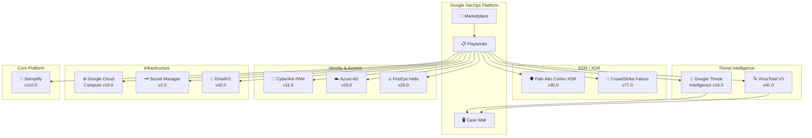

# Google SecOps Marketplace: 11 インテグレーション一括アップデート (2026年6月25日)

**リリース日**: 2026-06-25

**サービス**: Google SecOps Marketplace

**機能**: 複数インテグレーションの新機能追加・改善 (Palo Alto Cortex XDR v30.0 他)

**ステータス**: GA

📊 [このアップデートのインフォグラフィックを見る](https://takech9203.github.io/google-cloud-news-summary/20260625-google-secops-marketplace-palo-alto-xdr-v30.html)

## 概要

Google SecOps (旧 Chronicle SOAR) の Marketplace において、11 のサードパーティインテグレーションが同時にアップデートされた。今回の更新は、新しいアクションの追加、エラーハンドリングの改善、ウィジェットのレンダリング修正、認証方式の追加など多岐にわたる。

主要な新機能として、Palo Alto Cortex XDR v30.0 に「Download File」アクション、CyberArk PAM v11.0 に「Change Account Password」アクションが追加された。また、CrowdStrike Falcon v77.0 では複数のアラート ID が単一の SecOps アラートにマッピングされる際の同期ロジックが改善され、VirusTotal V3 v41.0 および Google Threat Intelligence v16.0 では Predefined Widgets の描画パフォーマンスが最適化された。

これらの更新は、セキュリティオペレーションセンター (SOC) のアナリストが日常的に使用するプレイブックの信頼性と効率性を向上させるものであり、インシデント対応ワークフロー全体の品質改善に寄与する。

**アップデート前の課題**

- Palo Alto Cortex XDR でエンドポイントからファイルをダウンロードするアクションがなく、手動操作が必要だった
- CyberArk PAM で特権アカウントのパスワード変更を SecOps プレイブックから直接実行できなかった
- CrowdStrike Falcon で複数のアラート ID が 1 つの SecOps アラートにマッピングされる場合、同期処理が正しく機能しないケースがあった
- VirusTotal V3 の Predefined Widgets でキャッシュのフォールバックレンダリングに不具合があり、正しく表示されない場合があった
- FireEye Helix (Trellix Helix) では API キーによる認証のみサポートされており、IAM OAuth 認証に対応していなかった

**アップデート後の改善**

- Palo Alto Cortex XDR から直接ファイルをダウンロードする自動化アクションが利用可能になった
- CyberArk PAM のパスワードローテーションをプレイブックに組み込むことが可能になった
- CrowdStrike Falcon のアラート同期が複数アラート ID マッピング時でも正確に動作するようになった
- VirusTotal V3 および Google Threat Intelligence のウィジェット表示が安定・高速化された
- FireEye Helix で Trellix IAM OAuth 認証がサポートされ、より柔軟な認証管理が可能になった

## アーキテクチャ図

Google SecOps Marketplace を中心に、EDR/XDR、脅威インテリジェンス、ID管理、インフラストラクチャ、コアプラットフォームの各カテゴリに分かれた 11 のインテグレーションが更新された。プレイブックを通じてこれらのインテグレーションが連携し、統合的なセキュリティオペレーションを実現する。

## サービスアップデートの詳細

### 新機能の追加

1. **Palo Alto Cortex XDR v30.0 - Download File アクション**
   - エンドポイントからファイルをダウンロードする新しいアクションが追加
   - インシデント調査時にマルウェア検体やログファイルの取得を自動化可能
   - プレイブックに組み込むことで、フォレンジック調査のワークフローを効率化

2. **CyberArk PAM v11.0 - Change Account Password アクション**
   - 特権アカウントのパスワードを変更する新しいアクションが追加
   - インシデント発生時の緊急パスワードローテーションをプレイブックから自動実行可能
   - 既存の Get Account Password Value、List Accounts、Ping アクションに加えて利用可能

3. **FireEye Helix v20.0 - Trellix IAM OAuth 認証サポート**
   - 従来の API キー認証に加えて、Trellix IAM OAuth 認証方式が追加
   - 組織の ID 管理ポリシーに準拠した認証が可能

### 同期・エラーハンドリングの改善

4. **CrowdStrike Falcon v77.0**
   - 複数のアラート ID が単一の SecOps アラートにマッピングされる場合の同期ロジックを更新
   - エラーハンドリングの全般的な改善
   - Sync Alerts ジョブの信頼性が向上

5. **Azure Active Directory v29.0**
   - Enrich User アクションでのサインインアクティビティ取得時のエラーハンドリングを更新
   - サインイン情報が取得できない場合のフォールバック処理が改善

6. **Siemplify v110.0**
   - Create Gemini Case Summary アクションの結果処理ロジックを更新
   - バックスラッシュのエスケープ処理を修正し、サマリー生成の正確性が向上

### ウィジェット・UI の改善

7. **VirusTotal V3 v41.0**
   - Predefined Widgets のキャッシュフォールバックレンダリングを修正
   - 対象アクション: Enrich Hash、Enrich IOC、Enrich IP、Enrich URL、Get Domain Details
   - キャッシュされたウィジェットデータの表示が正しく機能するようになった

8. **Google Threat Intelligence v16.0**
   - Predefined Widgets のローディングパフォーマンスを最適化
   - 対象アクション: Enrich Entities、Enrich IOCs
   - Case Wall でのウィジェット表示速度が向上

### インフラストラクチャ・設定の改善

9. **Google Cloud Compute v19.0**
   - 以下のアクションのコードがリファクタリング
     - Add IP To Firewall Rule
     - Remove External IP Addresses
     - Execute VM Patch Job
     - Update Firewall Rule
   - コードの保守性と安定性が向上

10. **EmailV2 v42.0**
    - Generic IMAP Email Connector のデフォルト値を更新
    - IMAP サーバーアドレス、ポート、ユーザー名、パスワードのデフォルト値が変更

11. **Secret Manager v2.0**
    - Ping アクションの説明文を更新
    - 機能的な変更はなし

## 技術仕様

### インテグレーション更新一覧

| インテグレーション | バージョン | 更新タイプ | 主な変更点 |
|---|---|---|---|
| Palo Alto Cortex XDR | v30.0 | 新機能 | Download File アクション追加 |
| CyberArk PAM | v11.0 | 新機能 | Change Account Password アクション追加 |
| CrowdStrike Falcon | v77.0 | 改善 | アラート同期ロジック・エラーハンドリング改善 |
| Azure Active Directory | v29.0 | 改善 | Enrich User エラーハンドリング更新 |
| Siemplify | v110.0 | 修正 | Gemini Case Summary のエスケープ処理修正 |
| VirusTotal V3 | v41.0 | 修正 | Predefined Widgets キャッシュ修正 |
| Google Threat Intelligence | v16.0 | 改善 | Predefined Widgets パフォーマンス最適化 |
| Google Cloud Compute | v19.0 | リファクタリング | ファイアウォール・VM 関連アクションのコード改善 |
| EmailV2 | v42.0 | 変更 | IMAP コネクタのデフォルト値更新 |
| Secret Manager | v2.0 | 変更 | Ping アクション説明文更新 |
| FireEye Helix | v20.0 | 新機能 | Trellix IAM OAuth 認証サポート追加 |

### Predefined Widgets について

Predefined Widgets は Google SecOps の Marketplace インテグレーションに付属する事前定義されたウィジェットで、プレイブックビューで使用される。アクションの実行結果を視覚的に表示し、アナリストの分析効率を向上させる。

VirusTotal V3 および Google Threat Intelligence で使用される Widget Theme には以下のオプションがある:
- Light
- Dark
- Chronicle

## メリット

### ビジネス面

- **インシデント対応時間の短縮**: 新しいアクション (Download File, Change Account Password) により手動作業が減少し、対応の自動化範囲が拡大
- **SOC 運用の信頼性向上**: CrowdStrike Falcon のアラート同期改善により、アラートの見落としリスクが低減
- **セキュリティポリシー準拠の強化**: Trellix IAM OAuth 認証サポートにより、組織の認証ポリシーに準拠した運用が可能

### 技術面

- **プレイブック自動化の拡張**: Palo Alto Cortex XDR からのファイルダウンロードや CyberArk PAM のパスワードローテーションをプレイブックに組み込み可能
- **UI パフォーマンス改善**: VirusTotal V3 と Google Threat Intelligence のウィジェットレンダリングが最適化され、Case Wall の表示速度が向上
- **コードベースの保守性向上**: Google Cloud Compute のリファクタリングにより、将来的な機能追加が容易に

## デメリット・制約事項

### 考慮すべき点

- EmailV2 v42.0 で IMAP コネクタのデフォルト値が変更されたため、既存のコネクタ設定がデフォルト値に依存している場合は確認が必要
- FireEye Helix v20.0 で OAuth 認証を使用する場合は、Trellix IAM の設定が事前に必要
- CrowdStrike Falcon v77.0 の同期ロジック変更により、既存のアラートマッピングの動作が変わる可能性がある

## ユースケース

### ユースケース 1: マルウェア感染インシデントの自動フォレンジック

**シナリオ**: エンドポイントでマルウェアが検出された際、Palo Alto Cortex XDR から疑わしいファイルを自動ダウンロードし、VirusTotal V3 で解析するプレイブック

**効果**: アナリストが手動でファイルを取得する時間を削減し、初動対応を高速化。Download File アクション (v30.0) と Enrich Hash ウィジェット修正 (v41.0) の組み合わせにより、検体取得から解析結果の可視化までをシームレスに実行可能。

### ユースケース 2: 侵害時の緊急パスワードローテーション

**シナリオ**: アカウント侵害が確認された場合、CyberArk PAM を通じて関連する特権アカウントのパスワードを即座に変更するプレイブック

**効果**: Change Account Password アクション (v11.0) により、侵害検出から特権アカウントの保護までの時間を大幅に短縮。CrowdStrike Falcon (v77.0) の改善されたアラート同期と組み合わせることで、検出から対応までの一貫した自動化を実現。

### ユースケース 3: マルチソースアラートの統合管理

**シナリオ**: CrowdStrike Falcon で複数のアラート ID が 1 つのインシデントに関連付けられている場合に、Google SecOps 上で正確に追跡する運用

**効果**: v77.0 の同期ロジック改善により、複数のアラート ID が単一の SecOps アラートに正しくマッピングされ、アラートの見落としや重複管理の問題が解消。

## 料金

Google SecOps Marketplace のインテグレーション自体は Google SecOps のライセンスに含まれる。各サードパーティサービス (Palo Alto Cortex XDR、CrowdStrike Falcon、CyberArk PAM、VirusTotal、Trellix Helix 等) の利用にはそれぞれのライセンスが別途必要。

## 関連サービス・機能

- **Google SecOps SOAR**: プレイブック実行基盤。今回のインテグレーション更新はすべてプレイブックから利用可能
- **Google SecOps SIEM**: アラートの検出と取り込み。CrowdStrike Falcon コネクタ等からのアラート取り込みと連携
- **Google Threat Intelligence**: 脅威インテリジェンスの提供。Predefined Widgets の最適化により分析効率が向上
- **Google Cloud Compute**: ファイアウォールルールや VM パッチ管理のアクションが利用可能
- **Secret Manager**: Google SecOps から Secret Manager への接続テスト (Ping) に使用

## 参考リンク

- 📊 [インフォグラフィック](https://takech9203.github.io/google-cloud-news-summary/20260625-google-secops-marketplace-palo-alto-xdr-v30.html)
- [公式リリースノート](https://docs.cloud.google.com/release-notes#June_25_2026)
- [Google SecOps Marketplace ドキュメント](https://docs.cloud.google.com/chronicle/docs/soar/marketplace-integrations/google-chronicle)
- [Palo Alto Cortex XDR インテグレーション](https://docs.cloud.google.com/chronicle/docs/soar/marketplace-integrations/palo-alto-cortex-xdr)
- [CrowdStrike Falcon インテグレーション](https://docs.cloud.google.com/chronicle/docs/soar/marketplace-integrations/crowdstrike-falcon)
- [CyberArk PAM インテグレーション](https://docs.cloud.google.com/chronicle/docs/soar/marketplace-integrations/cyberark-pam)
- [VirusTotal V3 インテグレーション](https://docs.cloud.google.com/chronicle/docs/soar/marketplace-integrations/virustotal-v3)
- [FireEye Helix インテグレーション](https://docs.cloud.google.com/chronicle/docs/soar/marketplace-integrations/fireeye-helix)
- [Predefined Widgets の設定](https://docs.cloud.google.com/chronicle/docs/soar/respond/working-with-playbooks/using-predefined-widgets-in-playbook-views)

## まとめ

今回の Google SecOps Marketplace 一括アップデートは、セキュリティオペレーションの自動化と信頼性を強化する重要な更新である。特に Palo Alto Cortex XDR の Download File アクションと CyberArk PAM の Change Account Password アクションは、インシデント対応プレイブックの自動化範囲を拡大する。既存の環境で CrowdStrike Falcon のアラート同期や EmailV2 の IMAP コネクタを使用している場合は、更新後の動作確認を推奨する。

---

**タグ**: #GoogleSecOps #SOAR #Marketplace #PaloAlto #CortexXDR #CrowdStrike #CyberArk #VirusTotal #ThreatIntelligence #FireEyeHelix #Trellix #SecurityAutomation
