# Google SecOps Marketplace: インテグレーションアップデート (2026年6月25日)

**リリース日**: 2026-06-25

**サービス**: Google SecOps Marketplace

**機能**: インテグレーションアップデート (2026年6月25日)

**ステータス**: GA (Generally Available)

📊 [このアップデートのインフォグラフィックを見る](https://takech9203.github.io/google-cloud-news-summary/20260625-google-secops-marketplace-updates-june-25.html)

## 概要

Google SecOps Marketplace において、2026年6月25日付で10件のインテグレーションが一斉にアップデートされた。CyberArk PAM の新アクション追加、CrowdStrike Falcon のマルチアラートID同期対応、FireEye Helix/ETP の Trellix OAuth 認証移行など、セキュリティ運用の自動化と認証基盤の近代化に焦点を当てた重要な更新が含まれている。

今回のアップデートは、SOAR (Security Orchestration, Automation and Response) プラットフォームとしての Google SecOps の連携能力を大幅に強化するものである。特に、CrowdStrike との双方向アラート同期の改善は、複数のアラートソースを統合管理する大規模 SOC チームにとって運用効率の向上に直結する。また、Trellix ブランドへの移行に伴う OAuth 認証サポートの追加は、レガシー認証からの脱却を促進する。

**アップデート前の課題**

- CrowdStrike Falcon の Sync Alerts コネクタは、1つの SecOps アラートに対して単一の CrowdStrike アラートIDしかマッピングできず、複数のアラートが関連する場合に同期漏れが発生していた
- FireEye Helix/ETP は従来の認証方式のみに対応しており、Trellix ブランド移行後の IAM OAuth 認証が利用できなかった
- CyberArk PAM インテグレーションではアカウントパスワードの自動変更ができず、特権アカウントのローテーションに手動介入が必要だった
- VirusTotal や Google Threat Intelligence のウィジェットにキャッシュ表示やパフォーマンスの問題があった

**アップデート後の改善**

- CrowdStrike Falcon で複数のアラートIDを1つの SecOps アラートにマッピング可能になり、関連アラートの一元管理が実現
- FireEye Helix/ETP で Trellix IAM OAuth 認証がサポートされ、最新の認証基盤に対応
- CyberArk PAM に「Change Account Password」アクションが追加され、SOAR プレイブックからの自動パスワードローテーションが可能に
- VirusTotal のキャッシュフォールバック表示が修正され、Google Threat Intelligence のウィジェット読み込みパフォーマンスが最適化

## アーキテクチャ図

```mermaid
flowchart TB
    subgraph SecOps["Google SecOps SOAR"]
        MP["Marketplace"]
        PB["Playbooks"]
        ALERT["Alert Management"]
    end

    subgraph Updated["アップデート対象インテグレーション"]
        subgraph PAM["特権アクセス管理"]
            CYBERARK["CyberArk PAM v11.0<br/>新: Change Account Password"]
        end

        subgraph EDR["EDR/脅威検知"]
            CS["CrowdStrike Falcon v77.0<br/>マルチアラートID同期"]
            VT["VirusTotal v3 v41.0<br/>ウィジェット修正"]
            GTI["Google Threat Intelligence v16.0<br/>パフォーマンス最適化"]
        end

        subgraph Auth["認証移行"]
            FEH["FireEye Helix v20.0<br/>Trellix IAM OAuth"]
            FEE["FireEye ETP v9.0<br/>Trellix OAuth + API v2"]
        end

        subgraph Cloud["クラウド/ID管理"]
            GCC["Google Cloud Compute v19.0<br/>コードリファクタリング"]
            AAD["Azure AD v29.0<br/>エラーハンドリング改善"]
            SM["Secret Manager v2.0"]
        end

        subgraph Platform["プラットフォーム"]
            SIEM["Siemplify v110.0<br/>Gemini要約改善"]
            EMAIL["EmailV2 v42.0<br/>IMAPデフォルト値更新"]
        end
    end

    MP --> CYBERARK
    MP --> CS
    MP --> VT
    MP --> GTI
    MP --> FEH
    MP --> FEE
    MP --> GCC
    MP --> AAD
    MP --> SM
    MP --> SIEM
    MP --> EMAIL

    PB --> MP
    CS -->|"複数アラートID同期"| ALERT
    CYBERARK -->|"パスワードローテーション"| PB
```

この図は Google SecOps SOAR の Marketplace を中心に、今回アップデートされた各インテグレーションがどのカテゴリに属し、どのように SecOps プラットフォームと連携するかを示している。

## サービスアップデートの詳細

### 主要機能

1. **CrowdStrike Falcon v77.0 - マルチアラートID同期**
   - Sync Alerts コネクタにおいて、複数の CrowdStrike アラートIDが1つの SecOps アラートにマッピングされるケースに対応
   - アラートID コンテキスト値のエラーハンドリングが改善され、不正なコンテキスト値による同期失敗を防止
   - 双方向同期 (コメント・ステータス) の信頼性が向上し、大規模環境での運用安定性が確保された

2. **Trellix OAuth 認証移行 (FireEye Helix v20.0 / FireEye ETP v9.0)**
   - FireEye Helix: Trellix IAM OAuth 認証方式のサポートを追加
   - FireEye ETP: Trellix OAuth サポートの追加に加え、パブリック API エンドポイントを v2 に更新
   - FireEye ETP: レガシー V1 API のサポートを完全に削除 (破壊的変更の可能性あり)

3. **CyberArk PAM v11.0 - パスワード変更アクション**
   - 新アクション「Change Account Password」により、特権アカウントのパスワードを SOAR プレイブックから自動ローテーション可能に
   - インシデント対応時の侵害アカウントの即時パスワードリセットや、定期的なパスワードローテーションの自動化に活用可能

4. **VirusTotal V3 v41.0 / Google Threat Intelligence v16.0 - ウィジェット改善**
   - VirusTotal: Enrich Hash、Enrich IOC、Enrich IP、Enrich URL、Get Domain Details の Predefined Widgets でキャッシュフォールバック表示の不具合を修正
   - Google Threat Intelligence: Enrich Entities、Enrich IOCs の Predefined Widgets で読み込みパフォーマンスを最適化し、レイアウトを統一

5. **Google Cloud Compute v19.0 - コードリファクタリング**
   - Add IP To Firewall Rule、Remove External IP Addresses、Execute VM Patch Job、Update Firewall Rule のアクションコードをリファクタリング
   - 保守性と拡張性の向上を目的とした内部改善

6. **その他の改善**
   - Siemplify v110.0: Create Gemini Case Summary アクションでバックスラッシュのエスケープ処理を改善
   - Secret Manager v2.0: Ping アクションの説明文を更新
   - Azure Active Directory v29.0: Enrich User アクションでサインインアクティビティ取得時のエラーハンドリングを改善
   - EmailV2 v42.0: Generic IMAP Email Connector の IMAP サーバーアドレス、ポート、ユーザー名、パスワードのデフォルト値を更新

## 技術仕様

### アップデートされたインテグレーション一覧

| インテグレーション | バージョン | 変更種別 | 主な変更内容 |
|------|------|------|------|
| CyberArk PAM | v11.0 | 新機能 | Change Account Password アクション追加 |
| CrowdStrike Falcon | v77.0 | 機能強化 | マルチアラートID同期、エラーハンドリング改善 |
| FireEye Helix | v20.0 | 認証追加 | Trellix IAM OAuth サポート |
| FireEye ETP | v9.0 | 破壊的変更 | Trellix OAuth 追加、API v2 移行、V1 API 削除 |
| VirusTotal V3 | v41.0 | バグ修正 | Predefined Widgets キャッシュ修正 |
| Google Threat Intelligence | v16.0 | パフォーマンス改善 | ウィジェット最適化、レイアウト統一 |
| Google Cloud Compute | v19.0 | リファクタリング | 4アクションのコード改善 |
| Azure Active Directory | v29.0 | バグ修正 | サインインアクティビティ取得エラー処理改善 |
| Siemplify | v110.0 | バグ修正 | バックスラッシュエスケープ処理改善 |
| EmailV2 | v42.0 | 設定変更 | IMAP コネクタデフォルト値更新 |
| Secret Manager | v2.0 | ドキュメント | Ping アクション説明文更新 |

### CrowdStrike Falcon Sync Alerts の改善詳細

CrowdStrike Falcon の Sync Alerts ジョブは、Google SecOps と CrowdStrike 間でコメントとステータスを双方向に同期する機能を提供する。従来は `Alert_ID` コンテキスト値が1対1のマッピングのみをサポートしていたが、v77.0 では以下の改善が行われた:

- 1つの SecOps アラートに複数の CrowdStrike アラートIDが関連付けられるケースに対応
- `Alert_ID` コンテキスト値が欠損・不正な場合の堅牢なエラーハンドリング
- 同期失敗時のログ出力改善による問題特定の容易化

### FireEye ETP API 移行に関する注意事項

FireEye ETP v9.0 ではレガシー V1 API のサポートが完全に削除された。これは破壊的変更であり、以下の対応が必要:

- V1 API エンドポイントを使用しているカスタム設定がある場合は、v2 への移行が必要
- Trellix OAuth 認証への切り替えが推奨される
- アップグレード前に既存の認証設定のバックアップを取得すること

## 設定方法

### 前提条件

1. Google SecOps SOAR プラットフォームへの管理者アクセス権限
2. 各サードパーティサービス (CrowdStrike、CyberArk、Trellix など) の有効なアカウントと API 認証情報
3. Marketplace からのインテグレーション更新権限

### 手順

#### ステップ 1: インテグレーションの更新

Google SecOps コンソールの Content Hub (Marketplace) から対象インテグレーションの更新を実行する。更新時に「Override (replace mapping)」または「Retain (keep existing mapping)」を選択する。カスタムマッピングを保持したい場合は「Retain」を選択すること。

#### ステップ 2: FireEye ETP の Trellix OAuth 設定 (該当する場合)

FireEye ETP v9.0 にアップグレードする場合は、Trellix IAM から OAuth クライアント資格情報を取得し、インテグレーション設定で新しい認証パラメータを構成する。V1 API を使用している場合は、v2 エンドポイントへの移行を事前に確認すること。

#### ステップ 3: CrowdStrike Falcon Sync Alerts の確認

アップグレード後、Sync Alerts ジョブが正常に動作していることを確認する。複数アラートIDが関連付けられたケースで同期が正しく行われるかをテストすること。

## メリット

### ビジネス面

- **SOC 運用効率の向上**: CrowdStrike のマルチアラートID同期により、関連アラートの一元管理が可能になり、アナリストの調査時間が短縮される
- **コンプライアンス強化**: CyberArk PAM のパスワード自動ローテーションにより、特権アクセス管理ポリシーの自動適用が可能に
- **セキュリティ態勢の近代化**: Trellix OAuth 移行により、レガシー認証方式からの脱却とゼロトラストアーキテクチャへの移行を促進

### 技術面

- **信頼性向上**: CrowdStrike および Azure AD のエラーハンドリング改善により、インテグレーションの安定性が向上
- **パフォーマンス改善**: Google Threat Intelligence ウィジェットの読み込み最適化と VirusTotal のキャッシュ修正により、ケース調査のレスポンスが改善
- **保守性向上**: Google Cloud Compute のコードリファクタリングと Siemplify のエスケープ処理改善により、長期的な運用安定性が確保

## デメリット・制約事項

### 制限事項

- FireEye ETP v9.0 は V1 API を完全に削除するため、V1 API に依存するカスタムプレイブックや設定は動作しなくなる
- CyberArk PAM の Change Account Password アクションには、CyberArk Privileged Access Manager 側で適切な権限設定が必要
- インテグレーション更新時に「Override」を選択すると、カスタムオントロジーマッピングが上書きされる

### 考慮すべき点

- FireEye ETP のアップグレードは計画的に実施し、事前に V2 API との互換性をテスト環境で検証することを推奨
- 複数インテグレーションを同時に更新する場合は、段階的にアップグレードし、各ステップで動作確認を行うこと
- Marketplace の「Roll back」機能を活用し、問題発生時に迅速にロールバックできる体制を整えること

## ユースケース

### ユースケース 1: インシデント対応時の特権アカウント自動リセット

**シナリオ**: セキュリティインシデントで特権アカウントの侵害が検知された場合、CyberArk PAM の新しい Change Account Password アクションを使用して、SOAR プレイブックから即座にパスワードをリセットする。

**効果**: インシデント対応時間の短縮 (手動介入なしで数秒以内にパスワードリセット完了)、攻撃者による横展開の防止、およびインシデント対応手順の標準化。

### ユースケース 2: CrowdStrike マルチアラート統合管理

**シナリオ**: 1つの攻撃キャンペーンに関連する複数の CrowdStrike アラート (例: 初期アクセス、権限昇格、横展開) が検知された場合、すべてのアラートIDを1つの SecOps アラートに統合して調査・対応する。

**効果**: アナリストが個別のアラートを手動で関連付ける必要がなくなり、攻撃の全体像を迅速に把握可能。コメントとステータスの双方向同期により、CrowdStrike コンソールと SecOps 間の情報の一貫性が保たれる。

### ユースケース 3: Trellix 認証基盤の近代化

**シナリオ**: FireEye から Trellix へのブランド移行に伴い、従来のレガシー認証から OAuth ベースの認証に移行する。

**効果**: トークンベースの認証により、APIキーの静的管理が不要になり、認証情報のライフサイクル管理が自動化される。API v2 への移行により、最新のセキュリティ機能とエンドポイントが利用可能になる。

## 関連サービス・機能

- **Google SecOps SIEM**: SOAR と統合されたイベント検知・分析基盤。CrowdStrike アラートの取り込みと相関分析を実行
- **Google SecOps Content Hub**: インテグレーション、ユースケース、Power Ups を管理する Marketplace プラットフォーム
- **Chronicle Security Operations**: Google SecOps の基盤となるセキュリティ分析エンジン
- **Google Threat Intelligence**: 脅威インテリジェンスフィードとエンリッチメント機能を提供

## 参考リンク

- 📊 [インフォグラフィック](https://takech9203.github.io/google-cloud-news-summary/20260625-google-secops-marketplace-updates-june-25.html)
- [Google SecOps Marketplace ドキュメント](https://cloud.google.com/chronicle/docs/soar/marketplace-integrations)
- [Content Hub の使用方法](https://cloud.google.com/chronicle/docs/soar/marketplace/using-the-marketplace)
- [CrowdStrike Falcon インテグレーション](https://cloud.google.com/chronicle/docs/soar/marketplace-integrations/crowdstrike-falcon)
- [インテグレーションの設定](https://cloud.google.com/chronicle/docs/soar/respond/integrations-setup/configure-integrations)
- [バージョンロールバック](https://cloud.google.com/chronicle/docs/soar/respond/integrations-setup/version-rollback)

## まとめ

今回の Google SecOps Marketplace アップデートは、セキュリティ運用の自動化と認証基盤の近代化を推進する重要な更新である。特に CrowdStrike Falcon のマルチアラートID同期対応は大規模 SOC の運用効率を改善し、Trellix OAuth 移行はレガシー認証からの脱却を促進する。FireEye ETP v9.0 の V1 API 削除は破壊的変更のため、アップグレード前にテスト環境での検証と移行計画の策定を推奨する。

---

**タグ**: #google-secops #marketplace #cyberark #crowdstrike #trellix #virustotal #soar-integrations
