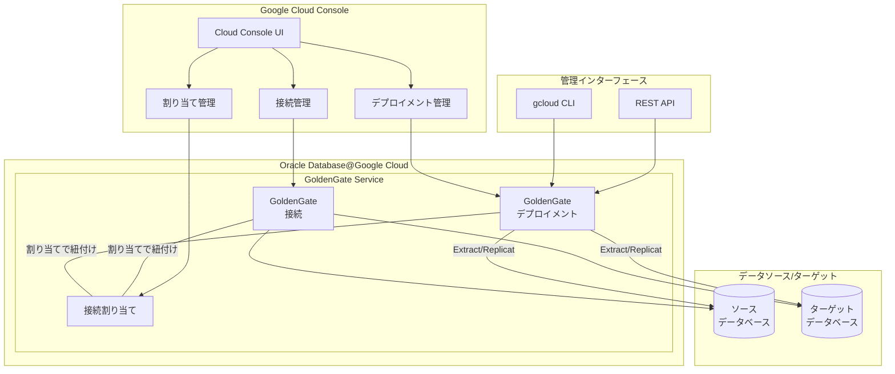

# Oracle Database@Google Cloud: GoldenGate コンソール管理機能が GA

**リリース日**: 2026-06-25

**サービス**: Oracle Database@Google Cloud

**機能**: GoldenGate デプロイメント、接続、割り当てのコンソール管理

**ステータス**: GA (Generally Available)

📊 [このアップデートのインフォグラフィックを見る](https://takech9203.github.io/google-cloud-news-summary/20260625-oracle-database-google-cloud-goldengate-console-ga.html)

## 概要

Oracle Database@Google Cloud において、GoldenGate のデプロイメント、接続（Connections）、および接続割り当て（Connection Assignments）の詳細を Google Cloud コンソールから直接確認・管理できる機能が正式に GA（一般提供）となりました。

Oracle GoldenGate は、リアルタイムのデータ統合およびレプリケーションを実現するサービスで、異なるクラウド環境やオンプレミス環境間でデータの移動・変換・同期を低レイテンシで行います。今回のアップデートにより、これらの GoldenGate リソースの管理が Google Cloud コンソールの GUI から直感的に行えるようになり、運用効率が大幅に向上します。

この機能は、Oracle Database@Google Cloud を使用してデータレプリケーションや ETL パイプラインを構築している企業のデータベース管理者やクラウドエンジニアに特に有用です。

**アップデート前の課題**

これまで GoldenGate リソースの管理には以下の課題がありました。

- gcloud CLI または REST API のみでの管理が必要で、GUI ベースの操作ができなかった
- デプロイメント、接続、割り当ての状態を確認するためにコマンドを実行する必要があり、視覚的な俯瞰が困難だった
- GoldenGate リソースの関連性（デプロイメントと接続の割り当て関係など）を把握するために複数のコマンドを実行する必要があった

**アップデート後の改善**

今回のアップデートにより以下が可能になりました。

- Google Cloud コンソールから GoldenGate デプロイメントの詳細（ステータス、CPU コア数、メモリ、ストレージ等）を視覚的に確認可能
- 接続情報（接続先データベース、認証情報設定、ネットワーク詳細）をブラウザから直接閲覧可能
- デプロイメントと接続の割り当て関係を一覧で確認でき、リソース間の依存関係を容易に把握可能

## アーキテクチャ図



Google Cloud コンソールが GoldenGate の各リソース（デプロイメント、接続、割り当て）を統合的に管理するインターフェースを提供し、CLI や API と並ぶ管理手段として機能することを示しています。

## サービスアップデートの詳細

### 主要機能

1. **デプロイメント管理（Manage Deployments）**
   - デプロイメントの一覧表示と詳細情報の確認
   - デプロイメントのステータス（実行中、停止中）の視覚的な確認
   - CPU コア数、メモリ、ストレージ、ネットワーク帯域幅の確認
   - 環境タイプ（開発/テスト、本番）やライセンスモデルの確認
   - オートスケーリング設定の確認

2. **接続管理（Manage Connections）**
   - GoldenGate 接続の一覧表示と詳細情報の確認
   - 接続先データベースの情報確認
   - 接続のステータス（Available 等）の確認
   - ネットワーク設定とセキュリティ構成の確認

3. **割り当て管理（Manage Assignments）**
   - 接続割り当て（Connection Assignments）の一覧表示と詳細確認
   - デプロイメントと接続の紐付け関係の視覚的な確認
   - 割り当てのテスト結果の確認

## 技術仕様

### IAM ロール

GoldenGate コンソール管理機能を使用するために必要な IAM ロールは以下の通りです。

| リソースタイプ | 管理者ロール | 閲覧者ロール |
|------|------|------|
| デプロイメント | `roles/oracledatabase.goldenGateDeploymentAdmin` | `roles/oracledatabase.goldenGateDeploymentViewer` |
| 接続 | `roles/oracledatabase.goldenGateConnectionAdmin` | `roles/oracledatabase.goldenGateConnectionViewer` |
| 割り当て | `roles/oracledatabase.goldenGateConnectionAssignmentAdmin` | `roles/oracledatabase.goldenGateConnectionAssignmentViewer` |

### デプロイメント環境タイプ

| 環境タイプ | OCPU | メモリ | ネットワーク帯域幅 | ストレージ |
|------|------|------|------|------|
| DEVELOPMENT_OR_TESTING | 1 | 16 GB | 1 Gbps | 500 GB |
| PRODUCTION | 4 | 64 GB | 4 Gbps | 2000 GB |

### デプロイメントタイプ

```json
{
  "supported_deployment_types": [
    "DATABASE_ORACLE",
    "BIGDATA",
    "DATABASE_MICROSOFT_SQLSERVER",
    "DATABASE_MYSQL",
    "DATABASE_POSTGRESQL",
    "DATABASE_DB2ZOS",
    "DATABASE_DB2I",
    "DATA_TRANSFORMS"
  ]
}
```

## 設定方法

### 前提条件

1. Oracle Database@Google Cloud 環境のセットアップが完了していること
2. ODB Network が作成されていること（GoldenGate デプロイメントにはクライアントサブネットが 1 つ必要）
3. 適切な IAM ロールが付与されていること

### 手順

#### ステップ 1: Google Cloud コンソールからデプロイメントを確認する

Google Cloud コンソールにログインし、Oracle Database@Google Cloud セクションから GoldenGate デプロイメントの一覧を確認します。各デプロイメントのステータス、リソース構成、接続情報が表示されます。

#### ステップ 2: gcloud CLI でデプロイメントを作成する（参考）

```bash
# GoldenGate デプロイメントの作成
gcloud oracle-database goldengate-deployments create DEPLOYMENT_ID \
  --project=PROJECT_ID \
  --location=REGION \
  --display-name="DEPLOYMENT_NAME" \
  --gcp-oracle-zone=GCP_ORACLE_ZONE \
  --odb-subnet=projects/ODB_NETWORK_PROJECT_ID/locations/ODB_NETWORK_REGION/odbNetworks/ODB_NETWORK_ID/odbSubnets/ODB_SUBNET_ID \
  --properties-license-model=license-included \
  --properties-environment-type=PRODUCTION \
  --properties-deployment-type=DATABASE_ORACLE \
  --properties-cpu-core-count=4 \
  --ogg-data-deployment=mydeployment \
  --ogg-data-admin-username=admin \
  --ogg-data-admin-password-secret-version=projects/PROJECT_ID/secrets/SECRET_ID/versions/1
```

作成後、コンソールのデプロイメント一覧に表示されます。

#### ステップ 3: コンソールから接続と割り当てを確認する

```bash
# 接続の一覧確認（CLI での確認例）
gcloud oracle-database goldengate-connections list \
  --project=PROJECT_ID \
  --location=REGION

# 割り当ての一覧確認（CLI での確認例）
gcloud oracle-database goldengate-connection-assignments list \
  --project=PROJECT_ID \
  --location=REGION
```

これらの情報はすべて Google Cloud コンソール上でも確認できるようになりました。

## メリット

### ビジネス面

- **運用効率の向上**: GUI ベースの管理により、チームメンバーの学習コストが低減し、オペレーションの迅速化が期待できる
- **可視性の向上**: データレプリケーションの状態を一目で把握でき、問題発生時の対応時間を短縮
- **ガバナンスの強化**: リソース間の関連性を視覚的に確認できるため、構成管理やコンプライアンス対応が容易になる

### 技術面

- **統合管理**: Google Cloud コンソール、gcloud CLI、REST API の 3 つの管理手段が揃い、利用シーンに応じた柔軟な管理が可能
- **IAM 統合**: Google Cloud の IAM ロールベースアクセス制御と統合されており、きめ細かなアクセス管理が可能
- **Secret Manager 連携**: 管理者パスワードを Secret Manager で安全に管理でき、コンソールからその設定状況を確認可能

## デメリット・制約事項

### 制限事項

- コンソールからの確認（閲覧）が主な機能であり、一部の高度な設定変更は引き続き CLI や API が必要な場合がある
- GoldenGate リソースは ODB Network と同じリージョン・ゾーンに作成する必要がある
- CPU コアは最大 24 コアまでの割り当て制限がある

### 考慮すべき点

- Extract、Replicat、Transform の詳細な設定は OCI コンソールでの管理が引き続き必要な場合がある
- 接続を削除すると関連する接続割り当ても同時に削除されるため、依存関係に注意が必要
- Shared VPC 環境では、ホストプロジェクトの ID を正しく指定する必要がある

## ユースケース

### ユースケース 1: マルチデータベース環境のレプリケーション監視

**シナリオ**: 大規模な企業環境で複数の Oracle データベース間のリアルタイムレプリケーションを GoldenGate で運用しており、各デプロイメントと接続の状態を定期的に監視する必要がある。

**実装例**:
```
1. Google Cloud コンソールにログイン
2. Oracle Database > GoldenGate > デプロイメント に移動
3. 各デプロイメントのステータスを一覧で確認
4. 接続割り当てから、デプロイメントに紐付いた接続を確認
5. 問題が検出された場合は、詳細ページで設定を確認
```

**効果**: 複数のコマンドを実行することなく、ブラウザ上で全リソースの状態を俯瞰的に確認でき、監視工数を削減

### ユースケース 2: 新規環境構築後の検証

**シナリオ**: 新規にデータ移行パイプラインを構築し、GoldenGate のデプロイメント、接続、割り当てが正しく設定されているかを検証する。

**効果**: コンソール上でリソース間の関連性を視覚的に確認でき、設定ミスの早期発見と修正が可能

## 料金

Oracle Database@Google Cloud の GoldenGate サービスの料金は、デプロイメントのリソース構成（OCPU 数、ストレージ容量など）およびライセンスモデルに基づきます。

### 料金モデル

| ライセンスモデル | 説明 |
|--------|-----------------|
| Bring Your Own License (BYOL) | 既存の Oracle ライセンスを使用 |
| License Included | ライセンス込みの課金 |

コンソール管理機能自体には追加料金は発生しません。詳細な料金については Oracle Database@Google Cloud の料金ページを参照してください。

## 利用可能リージョン

Oracle Database@Google Cloud の GoldenGate サービスは、Oracle Database@Google Cloud がサポートするリージョンとゾーンで利用可能です。詳細は [Supported regions and zones](https://cloud.google.com/oracle/database/docs/regions-and-zones) を参照してください。

## 関連サービス・機能

- **Oracle Database@Google Cloud Exadata Database Service**: GoldenGate と組み合わせてリアルタイムレプリケーションを構成するデータベースサービス
- **Oracle Database@Google Cloud Autonomous AI Database**: GoldenGate で接続可能な自律型データベースサービス
- **Google Cloud Secret Manager**: GoldenGate デプロイメントの管理者パスワードを安全に保管
- **Google Cloud IAM**: GoldenGate リソースへのアクセス制御を管理
- **Cloud Logging / Cloud Monitoring**: Oracle Database@Google Cloud リソースのメトリクスとログの観測

## 参考リンク

- 📊 [インフォグラフィック](https://takech9203.github.io/google-cloud-news-summary/20260625-oracle-database-google-cloud-goldengate-console-ga.html)
- [公式リリースノート](https://cloud.google.com/release-notes#June_25_2026)
- [Manage Deployments ドキュメント](https://cloud.google.com/oracle/database/docs/manage-deployments)
- [Manage Connections ドキュメント](https://cloud.google.com/oracle/database/docs/manage-connections)
- [Manage Assignments ドキュメント](https://cloud.google.com/oracle/database/docs/manage-assignments)
- [GoldenGate のデプロイと接続](https://cloud.google.com/oracle/database/docs/deploy-and-connect)
- [Oracle Database@Google Cloud 概要](https://cloud.google.com/oracle/database/docs/overview)

## まとめ

今回の GA リリースにより、Oracle Database@Google Cloud の GoldenGate リソース管理が Google Cloud コンソールで統合的に行えるようになりました。CLI や API に加えて GUI ベースの管理手段が正式に提供されたことで、運用チームの生産性向上とデータレプリケーション環境の可視性向上が期待されます。既に GoldenGate を利用している組織は、コンソールからリソース状態を確認するワークフローを取り入れることを推奨します。

---

**タグ**: #OracleDatabase #GoldenGate #DataReplication #GoogleCloudConsole #GA #DataIntegration #OracleDatabase@GoogleCloud
