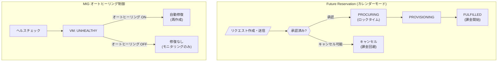

# Compute Engine: Future Reservation キャンセル機能 & MIG オートヒーリング無効化

**リリース日**: 2026-06-26

**サービス**: Compute Engine

**機能**: Future Reservation (カレンダーモード) のキャンセル / MIG オートヒーリングの無効化

**ステータス**: GA (一般提供)

📊 [このアップデートのインフォグラフィックを見る](https://takech9203.github.io/google-cloud-news-summary/20260626-compute-engine-future-reservation-cancel-mig-autohealing.html)

## 概要

Compute Engine に 2 つの機能が GA (一般提供) となった。1 つ目は、カレンダーモードの Future Reservation リクエストをキャンセルできる機能で、不要になったリソースのプロビジョニングを防ぎ、不必要な課金を回避できる。2 つ目は、マネージド インスタンス グループ (MIG) でオートヒーリングを無効化し、ヘルスチェックによるアプリケーション監視を修復トリガーなしで行える機能である。

これらの機能は、GPU/TPU を大量に利用する AI/ML ワークロードの運用者や、MIG で独自の修復ロジックやトラブルシューティングを行いたいインフラ管理者にとって、柔軟性とコスト管理の向上をもたらす。

**アップデート前の課題**

- カレンダーモードの Future Reservation リクエストは、作成・送信後にキャンセルや削除ができず、リソースが不要になっても課金が発生していた
- MIG のヘルスチェックでアプリケーションの異常を検知すると、自動的に VM が再作成 (修復) されるため、障害調査やデバッグが困難だった
- ヘルスチェックを使ったモニタリングのみの用途 (修復なし) には対応しておらず、独自の修復ロジックを実装する場合にも不都合があった

**アップデート後の改善**

- Future Reservation リクエストをロックタイム前にキャンセル可能になり、不要な課金を回避できるようになった
- MIG でオートヒーリングを個別に無効化でき、ヘルスチェックによるモニタリングを修復なしで利用可能になった
- 障害 VM のトラブルシューティングや独自修復ロジックの実装が容易になった

## アーキテクチャ図



上図は今回 GA となった 2 つの機能の動作フローを示す。Future Reservation ではロックタイム前のキャンセルによる課金回避が可能になり、MIG ではオートヒーリングの ON/OFF を制御することでモニタリングのみの運用が実現できる。

## サービスアップデートの詳細

### 主要機能

1. **Future Reservation リクエストのキャンセル (カレンダーモード)**
   - ロックタイム (PROCURING 状態) に達する前であれば、承認済みのリクエストをキャンセル可能
   - キャンセルにより、Compute Engine によるリソースのプロビジョニングと課金を防止
   - キャンセル後もリクエストの参照は可能 (新しいリクエスト作成時の参考として保持)
   - キャンセルされたリクエストを削除することで、同じプロパティでの新規リクエスト作成制限を解除可能

2. **MIG オートヒーリングの無効化**
   - ヘルスチェックを設定したまま、異常 VM の自動修復を無効化可能
   - `onFailedHealthCheck` を `DO_NOTHING` に設定することで、ヘルスチェックによるモニタリングは継続しつつ修復を停止
   - 失敗 VM の修復 (`defaultActionOnFailure`) とオートヒーリング (`onFailedHealthCheck`) を個別に制御可能

## 技術仕様

### Future Reservation キャンセルの条件

| 項目 | 詳細 |
|------|------|
| キャンセル可能な状態 | PENDING_APPROVAL、APPROVED (PROCURING 前) |
| キャンセル不可の状態 | PROCURING、PROVISIONING、FULFILLED |
| ロックタイム開始 | 開始時刻の 56 日前、または承認直後 (開始時刻が 56 日未満の場合) |
| 必要な権限 | `compute.futureReservations.cancel` |
| 必要なロール | `roles/compute.futureReservationAdmin` |

### MIG オートヒーリング制御の設定値

| 設定 | 値 | 動作 |
|------|-----|------|
| `defaultActionOnFailure` | `DO_NOTHING` | 失敗 VM を修復しない |
| `defaultActionOnFailure` | `REPAIR` | 失敗 VM を修復する (デフォルト) |
| `onFailedHealthCheck` | `DO_NOTHING` | ヘルスチェック失敗時に修復しない |
| `onFailedHealthCheck` | `REPAIR` | ヘルスチェック失敗時に修復する |
| `onFailedHealthCheck` | `DEFAULT_ACTION` | `defaultActionOnFailure` の設定に従う |

### MIG オートヒーリング無効化の制限事項

| 項目 | 詳細 |
|------|------|
| オートスケーリング設定がある MIG | `defaultActionOnFailure` を `DO_NOTHING` に設定不可 |
| 一時停止/停止 VM がある MIG | `defaultActionOnFailure` を `DO_NOTHING` に設定不可 |

## 設定方法

### Future Reservation リクエストのキャンセル

#### gcloud CLI

```bash
gcloud compute future-reservations cancel FUTURE_RESERVATION_NAME \
    --zone=ZONE
```

#### REST API

```bash
POST https://compute.googleapis.com/compute/v1/projects/PROJECT_ID/zones/ZONE/futureReservations/FUTURE_RESERVATION_NAME/cancel
```

### MIG オートヒーリングの無効化

#### gcloud CLI (オートヒーリングのみ無効化)

```bash
gcloud beta compute instance-groups managed update MIG_NAME \
    --action-on-vm-failed-health-check=do-nothing \
    --zone=ZONE
```

#### REST API (オートヒーリングのみ無効化)

```bash
PATCH https://compute.googleapis.com/compute/beta/projects/PROJECT_ID/zones/ZONE/instanceGroupManagers/MIG_NAME

{
  "instanceLifecyclePolicy": {
    "onFailedHealthCheck": "DO_NOTHING"
  }
}
```

#### gcloud CLI (すべての修復を無効化)

```bash
gcloud compute instance-groups managed update MIG_NAME \
    --default-action-on-vm-failure=do-nothing \
    --zone=ZONE
```

## メリット

### ビジネス面

- **コスト最適化**: Future Reservation のキャンセルにより、計画変更時の不要な GPU/TPU リソース課金を回避できる
- **運用柔軟性**: MIG のオートヒーリングを無効化することで、独自の運用ポリシーに基づいた障害対応が可能

### 技術面

- **障害調査の効率化**: VM が異常と判定されても自動で再作成されないため、ログやメトリクスを保持したまま原因調査が可能
- **カスタム修復ロジック**: オートヒーリングを無効にしつつヘルスチェックの結果を取得し、独自の修復・通知システムと連携可能
- **キャパシティプランニングの改善**: Future Reservation のキャンセル機能により、GPU/TPU のキャパシティ予約をより柔軟に管理可能

## デメリット・制約事項

### 制限事項

- Future Reservation はロックタイム (PROCURING 状態) 以降はキャンセル不可。ロックタイムは開始時刻の 56 日前、または承認直後に開始される場合がある
- キャンセルされた Future Reservation が存在する間は、同じプロパティでの新規リクエスト作成が制限される
- MIG にオートスケーリング設定がある場合、`defaultActionOnFailure` を `DO_NOTHING` に設定できない
- MIG に一時停止/停止状態の VM がある場合も同様

### 考慮すべき点

- オートヒーリングを無効化した場合、異常 VM の手動対応または独自の修復ロジックの実装が必要
- Future Reservation をキャンセルした後は、必要に応じてリクエストを削除し、新規リクエスト作成の制限を解除すること
- MIG オートヒーリング無効化と Cloud Monitoring のアラートを組み合わせて、異常検知時の通知を別途設定することを推奨

## ユースケース

### ユースケース 1: GPU キャパシティ計画の変更

**シナリオ**: AI モデルのトレーニングスケジュールが変更になり、予約済みの A3 Ultra GPU VM が不要になった場合。

**実装例**:
```bash
# 承認済みだがロックタイム前のリクエストをキャンセル
gcloud compute future-reservations cancel my-training-reservation \
    --zone=us-central1-a

# キャンセル後、リクエストを削除して制限を解除
gcloud compute future-reservations delete my-training-reservation \
    --zone=us-central1-a
```

**効果**: DWS 料金による高額な GPU リソースの不要課金を回避し、新しいスケジュールで再予約が可能になる。

### ユースケース 2: 異常 VM のトラブルシューティング

**シナリオ**: MIG 上のアプリケーションで間欠的なエラーが発生しているが、VM が自動修復されるため原因調査ができない場合。

**実装例**:
```bash
# オートヒーリングのみ無効化 (失敗 VM の修復は維持)
gcloud beta compute instance-groups managed update my-app-mig \
    --action-on-vm-failed-health-check=do-nothing \
    --zone=us-east1-b

# ヘルスステータスを確認して異常 VM を特定
gcloud compute instance-groups managed list-instances my-app-mig \
    --zone=us-east1-b
```

**効果**: 異常 VM が保持されるため、SSH でログインしてアプリケーションログやシステム状態を直接調査できる。

### ユースケース 3: カスタム修復ロジックの実装

**シナリオ**: ヘルスチェック結果に基づいて、段階的なリカバリ (アプリケーション再起動 → VM リブート → VM 再作成) を実装したい場合。

**効果**: Cloud Monitoring と Cloud Functions を組み合わせて、ヘルスチェックの結果に基づく段階的な修復パイプラインを構築できる。

## 料金

### Future Reservation (カレンダーモード)

- リクエストの作成・キャンセル自体に料金は発生しない
- 課金は FULFILLED 状態 (プロビジョニング完了後) から開始される
- キャンセルにより、プロビジョニング前であれば課金を完全に回避可能
- プロビジョニングされたリソースは [DWS 料金](https://cloud.google.com/products/dws/pricing) に基づいて課金される

### MIG オートヒーリング無効化

- オートヒーリングの ON/OFF 設定自体に追加料金は発生しない
- ヘルスチェックの料金は通常通り適用される

## 関連サービス・機能

- **[Dynamic Workload Scheduler (DWS)](https://cloud.google.com/products/dws)**: Future Reservation のカレンダーモードは DWS の料金体系に基づく
- **[Cloud Monitoring](https://cloud.google.com/monitoring)**: MIG のヘルスステータスの監視・アラート設定に活用
- **[Compute Engine Reservations](https://docs.cloud.google.com/compute/docs/instances/reservations-overview)**: Future Reservation で自動作成される予約の管理
- **[MIG Autoscaler](https://docs.cloud.google.com/compute/docs/autoscaler)**: オートスケーリングとオートヒーリングは互いに影響する設定項目

## 参考リンク

- 📊 [インフォグラフィック](https://takech9203.github.io/google-cloud-news-summary/20260626-compute-engine-future-reservation-cancel-mig-autohealing.html)
- [公式リリースノート](https://docs.cloud.google.com/release-notes#June_26_2026)
- [Future Reservation のキャンセル・削除ドキュメント](https://docs.cloud.google.com/compute/docs/instances/delete-future-reservations-calendar-mode)
- [MIG オートヒーリング無効化ドキュメント](https://docs.cloud.google.com/compute/docs/instance-groups/turn-off-vm-repairs-in-mig)
- [Future Reservation (カレンダーモード) 概要](https://docs.cloud.google.com/compute/docs/instances/future-reservations-calendar-mode-overview)
- [MIG のヘルスチェック設定](https://docs.cloud.google.com/compute/docs/instance-groups/autohealing-instances-in-migs)
- [DWS 料金ページ](https://cloud.google.com/products/dws/pricing)

## まとめ

今回の GA リリースにより、Compute Engine の Future Reservation と MIG の運用柔軟性が大幅に向上した。特に GPU/TPU を大量に利用する AI/ML ワークロードでは、キャパシティ予約のキャンセル機能が計画変更時のコスト管理に直結する。MIG オートヒーリングの個別制御は、障害調査やカスタム修復ロジックの実装を容易にし、より洗練された運用体制の構築を可能にする。既存の Future Reservation 運用や MIG のヘルスチェック設定を見直し、これらの新機能の活用を検討することを推奨する。

---

**タグ**: #ComputeEngine #FutureReservation #MIG #AutoHealing #HealthCheck #GA #コスト最適化 #GPU #TPU
