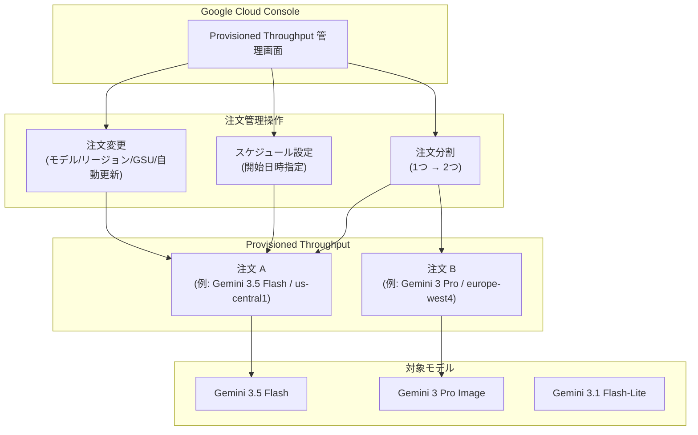

# Gemini Enterprise Agent Platform: Provisioned Throughput 注文管理機能の GA

**リリース日**: 2026-06-26

**サービス**: Gemini Enterprise Agent Platform

**機能**: Provisioned Throughput 注文管理の新機能 (変更・スケジュール・分割)

**ステータス**: GA (一般提供)

📊 [このアップデートのインフォグラフィックを見る](https://takech9203.github.io/google-cloud-news-summary/20260626-gemini-agent-platform-provisioned-throughput-ga.html)

## 概要

Gemini Enterprise Agent Platform の Provisioned Throughput において、注文管理に関する 4 つの新機能が一般提供 (GA) となった。具体的には、既存注文の変更、新規注文のスケジュール設定、既存注文の変更スケジュール設定、および注文の分割が可能になった。

Provisioned Throughput は、生成 AI モデルに対して固定コスト・固定期間でスループットを予約するサブスクリプションサービスであり、リアルタイムのチャットボットやエージェントなど、安定した高スループットが求められる本番ワークロードに適している。今回の GA によって、注文のライフサイクル管理がより柔軟に行えるようになり、運用効率が大幅に向上する。

**アップデート前の課題**

- 注文内容の変更が限定的で、オフライン注文の変更には Google Cloud アカウント担当者への問い合わせが必要だった
- 注文の開始日時を指定できず、即時開始のみの対応だった
- 1 つの注文を分割して異なるモデルやリージョンに割り当てることができなかった

**アップデート後の改善**

- Google Cloud コンソールから直接、注文のモデル・リージョン・GSU 数・自動更新設定を変更可能になった
- 新規注文および既存注文の変更に開始日時をスケジュール設定できるようになった
- アクティブな注文を 2 つに分割し、異なるモデルやリージョンに割り当て可能になった

## アーキテクチャ図

Provisioned Throughput の注文管理フローを示す。Google Cloud コンソールから変更・スケジュール・分割の各操作を行い、複数のモデルやリージョンにまたがるスループット配分を柔軟に管理できる。

## サービスアップデートの詳細

### 主要機能

1. **注文の変更 (Change an order)**
   - アクティブな注文に対して、GSU 数の増減、モデル・モデルバージョンの変更、リージョンの変更、自動更新設定の有効/無効化が可能
   - GSU の増加は承認後即時適用され、GSU の減少は自動更新時に次のタームで適用される
   - モデル変更は同一パブリッシャー内に限定 (例: Google Gemini 同士は変更可能だが、Google Gemini から Anthropic Claude への変更は不可)
   - 有効期限まで 5 日以内の注文で自動更新が無効の場合は変更不可

2. **新規注文のスケジュール (Schedule a new order)**
   - 注文作成時に開始日時を指定可能
   - 将来の特定日時からスループットの予約を開始できるため、計画的なキャパシティ確保が可能

3. **注文変更のスケジュール (Schedule a change to an order)**
   - 既存注文への変更に対して、適用開始日時を指定可能
   - 段階的なスケールアップやモデル移行を事前にスケジュールしておける

4. **注文の分割 (Split an order)**
   - アクティブな 1 つの注文を 2 つの注文に分割可能
   - 分割後の各注文に異なるモデルやリージョンを割り当てることで、スループットのより細かな配分が可能

## 技術仕様

### 権限とロール

| 権限 | 説明 |
|------|------|
| `aiplatform.provisionedThroughputs.create` | 新規 Provisioned Throughput 注文の作成 |
| `aiplatform.provisionedThroughputs.get` | 特定の注文の表示 |
| `aiplatform.provisionedThroughputs.list` | 全注文の一覧表示 |
| `aiplatform.provisionedThroughputs.update` | 注文の変更 |
| `aiplatform.provisionedThroughputs.cancel` | 保留中の注文・変更のキャンセル |

必要なロール: `roles/aiplatform.provisionedThroughputAdmin`

### 注文変更の制約

| 注文ステータス | 可能な操作 | 制約 |
|---------------|-----------|------|
| Pending review | キャンセルのみ | 変更が必要な場合はキャンセルして再注文 |
| Approved | 変更不可 | アクティベーション待ち |
| Active | GSU 増減、モデル/リージョン変更、自動更新設定 | 有効期限 5 日以内かつ自動更新無効の場合は変更不可 |

## 設定方法

### 前提条件

1. `roles/aiplatform.provisionedThroughputAdmin` ロールが付与されていること
2. Provisioned Throughput でサポートされているモデルを使用すること
3. QPM が 30,000 を超える場合は、事前にクォータ調整をリクエストすること

### 手順

#### ステップ 1: 注文の変更

1. Google Cloud コンソールで [Provisioned Throughput ページ](https://console.cloud.google.com/agent-platform/provisioned-throughput) に移動
2. 変更対象の注文の Actions 列から Edit をクリック、または注文詳細ページで Edit ボタンをクリック
3. モデル、リージョン、GSU 数、自動更新設定を必要に応じて変更
4. 変更をスケジュールする場合は開始日時を指定

#### ステップ 2: 注文の分割

1. Google Cloud コンソールで [Provisioned Throughput ページ](https://console.cloud.google.com/agent-platform/provisioned-throughput) に移動
2. 分割対象のアクティブな注文を選択
3. 分割オプションを選択し、2 つの注文それぞれの GSU 数・モデル・リージョンを指定

## メリット

### ビジネス面

- **コスト最適化**: 注文を分割して異なるモデルに割り当てることで、ワークロードに応じた適切なコスト配分が可能
- **計画的なキャパシティ管理**: スケジュール機能により、キャンペーン期間やリリース日に合わせた事前のスループット確保が可能
- **運用効率の向上**: セルフサービスで注文変更が完結し、Google Cloud 担当者への問い合わせが不要

### 技術面

- **柔軟なモデル移行**: アクティブな注文のモデルバージョンを変更でき、最新モデルへの移行がスムーズ
- **リージョン間の再配置**: レイテンシ要件やコンプライアンス要件に応じてリージョンを変更可能
- **段階的スケーリング**: スケジュール設定により、トラフィック増加に合わせた段階的なスケールアップを自動化

## デメリット・制約事項

### 制限事項

- モデル変更は同一パブリッシャー内に限定される (例: Google Gemini から Anthropic Claude への変更は不可)
- 注文の途中キャンセルはできない (コミットメントベース)
- 有効期限まで 5 日以内で自動更新が無効の注文は変更不可
- オープンモデル (Gemma 4 等) の Provisioned Throughput 注文の変更は Google Cloud アカウント担当者への問い合わせが必要
- 週次タームの注文は自動更新に非対応

### 考慮すべき点

- 変更リクエストの処理には通常 10 営業日以内を要する
- 各モデルにつき保留中の注文変更・保留中の新規注文は同時に 1 つのみ
- Provisioned Throughput はバッチ予測には対応しない
- Grounding など他のツールのクォータは別途管理が必要

## ユースケース

### ユースケース 1: モデルアップグレードの段階的移行

**シナリオ**: 本番環境で Gemini 3.5 Flash を利用中のチャットボットサービスが、新しいモデルバージョンへの移行を計画している。

**効果**: 注文変更のスケジュール機能を使って、テスト完了後の特定日時にモデルバージョンを切り替えることで、ダウンタイムなしの計画的な移行が実現できる。

### ユースケース 2: マルチモデル戦略の実現

**シナリオ**: 50 GSU の Provisioned Throughput 注文を持つ企業が、一般的なクエリ処理と画像生成の両方のワークロードを最適化したい。

**効果**: 注文分割機能で 50 GSU を 35 GSU (Gemini 3.5 Flash / テキスト処理用) と 15 GSU (Gemini 3 Pro Image / 画像生成用) に分割し、各ワークロードに最適なモデルを割り当てることで、全体のスループット効率を最大化できる。

### ユースケース 3: 季節変動への対応

**シナリオ**: EC サイトのカスタマーサポート AI が、セール期間中にトラフィックが 3 倍に増加する。

**効果**: スケジュール機能を使ってセール開始前に GSU を増加させ、セール終了後に元に戻す変更をスケジュールしておくことで、過不足のないキャパシティ確保が可能になる。

## 料金

Provisioned Throughput は GSU (Generative AI Scale Unit) 単位で課金される固定コスト・固定期間のサブスクリプション。料金は月次または週次で請求される。

詳細な料金情報は [Provisioned Throughput 料金ページ](https://cloud.google.com/gemini-enterprise-agent-platform/generative-ai/pricing#provisioned-throughput) を参照。

## 関連サービス・機能

- **Priority PayGo**: Provisioned Throughput のようなコミットメントなしで、標準 PayGo より安定したパフォーマンスを提供する消費オプション (GA)
- **Cloud Monitoring**: Provisioned Throughput の使用状況をモニタリングするダッシュボードを提供
- **GSU Estimator Tool**: Google Cloud コンソール内のスループット見積もりツールで、必要な GSU 数を計算可能

## 参考リンク

- 📊 [インフォグラフィック](https://takech9203.github.io/google-cloud-news-summary/20260626-gemini-agent-platform-provisioned-throughput-ga.html)
- [公式リリースノート](https://docs.cloud.google.com/release-notes#June_26_2026)
- [Provisioned Throughput の購入ドキュメント](https://docs.cloud.google.com/gemini-enterprise-agent-platform/models/provisioned-throughput/purchase-provisioned-throughput)
- [注文の変更](https://docs.cloud.google.com/gemini-enterprise-agent-platform/models/provisioned-throughput/purchase-provisioned-throughput#change-order)
- [注文の分割](https://docs.cloud.google.com/gemini-enterprise-agent-platform/models/provisioned-throughput/purchase-provisioned-throughput#split-order)
- [Provisioned Throughput 概要](https://docs.cloud.google.com/gemini-enterprise-agent-platform/models/provisioned-throughput)
- [サポートされるモデルとバーンダウンレート](https://docs.cloud.google.com/gemini-enterprise-agent-platform/models/provisioned-throughput/supported-models)
- [料金ページ](https://cloud.google.com/gemini-enterprise-agent-platform/generative-ai/pricing#provisioned-throughput)

## まとめ

Gemini Enterprise Agent Platform の Provisioned Throughput に注文の変更・スケジュール・分割機能が GA として追加されたことで、大規模な生成 AI ワークロードのキャパシティ管理が大幅に柔軟になった。特に注文分割とスケジュール機能は、マルチモデル戦略やトラフィック変動への対応を計画的に実行できるため、本番環境で Provisioned Throughput を利用しているユーザーは積極的に活用を検討すべきである。

---

**タグ**: #GeminiEnterpriseAgentPlatform #ProvisionedThroughput #GA #注文管理 #GSU #スループット #生成AI
