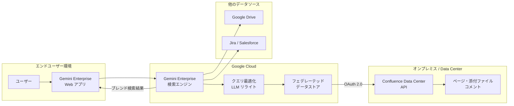

# Gemini Enterprise: Confluence Data Center フェデレーテッドデータストア GA

**リリース日**: 2026-06-26

**サービス**: Gemini Enterprise

**機能**: Confluence Data Center フェデレーテッドデータストア GA

**ステータス**: GA (Generally Available)

[このアップデートのインフォグラフィックを見る](https://takech9203.github.io/google-cloud-news-summary/20260626-gemini-enterprise-confluence-data-center-ga.html)

## 概要

Gemini Enterprise の Confluence Data Center フェデレーテッドデータストアが一般提供(GA)となりました。この機能により、オンプレミスまたはセルフホスト環境で運用されている Confluence Data Center のコンテンツを、Gemini Enterprise の統合検索プラットフォームから直接検索・活用できるようになります。

フェデレーテッドデータストアは、データを Gemini Enterprise のインデックスにコピーせず、Confluence Data Center API に直接クエリを送信してリアルタイムに検索結果を取得する方式です。これにより、データストレージの追加コストを抑えつつ、企業内のナレッジベースを Gemini Enterprise の AI 搭載検索機能と統合できます。

対象ユーザーは、Confluence Data Center（バージョン 7.19.0 以降）をオンプレミスまたはデータセンターで運用しており、Google Cloud の Gemini Enterprise を活用して社内情報検索を強化したい企業です。

**アップデート前の課題**

- Confluence Data Center のコンテンツを Gemini Enterprise で検索するには、データインジェスト（Private Preview）を利用する必要があり、一般利用が困難だった
- オンプレミスの Confluence データを Google Cloud の検索基盤と連携するための標準的な手段が限定されていた
- 社内のナレッジベースが分散しており、複数のデータソースを横断した統合検索が難しかった

**アップデート後の改善**

- フェデレーテッド方式で Confluence Data Center のコンテンツをリアルタイムに検索可能になった（GA として正式サポート）
- データをコピーせずに検索できるため、データストレージコストやデータ同期の遅延を回避できる
- 他のデータソース（Google Drive、Jira、Salesforce など）とのブレンド検索が可能になり、統合的な社内検索体験を提供できる

## アーキテクチャ図



この図は、ユーザーのクエリが Gemini Enterprise を経由して Confluence Data Center API にフェデレーテッド方式で送信され、他のデータソースの結果とブレンドされて返される全体的なデータフローを示しています。

## サービスアップデートの詳細

### 主要機能

1. **フェデレーテッド検索**
   - Confluence Data Center のページコンテンツ、添付ファイル、コメントをリアルタイムに検索
   - データを Google Cloud にコピーせず、Confluence Data Center API に直接クエリを送信
   - LLM によるクエリリライトで検索精度を向上

2. **アクション実行**
   - 自然言語コマンドによる添付ファイルのアップロード（最大 200 MB）
   - 自然言語コマンドによる添付ファイルのダウンロード（最大 200 MB）

3. **ブレンド検索対応**
   - 他のデータソース（Google Drive、Jira、Salesforce など）と組み合わせた統合検索
   - 複数データストアの結果を統合して包括的な検索結果を表示

4. **Private Service Connect 対応**
   - プライベート IP で運用される Confluence Data Center インスタンスへの安全な接続
   - VPC 内でのセキュアな通信を実現

## 技術仕様

### 対応バージョンとリージョン

| 項目 | 詳細 |
|------|------|
| 対応 Confluence バージョン | Confluence Data Center 7.19.0 以降 |
| 対応リージョン | Global、US、EU |
| 接続方式 | OAuth 2.0 |
| 最大ファイルサイズ | 200 MB（アップロード/ダウンロード） |
| データストア上限 | 1 アプリあたり最大 50 データストア |

### サポートされるアクション

| アクション | 説明 |
|------|------|
| Upload attachment | Confluence Data Center ページへの添付ファイル追加 |
| Download attachment | Confluence Data Center ページからの添付ファイルダウンロード |

### 必要なスコープ

| 接続モード | スコープ | 目的 |
|------|------|------|
| データインジェスト | READ | Confluence ページコンテンツ、添付ファイル、コメントの取り込み |
| フェデレーテッド検索とアクション | WRITE | 検索実行および添付ファイルアップロード |

## 設定方法

### 前提条件

1. Gemini Enterprise が有効化された Google Cloud プロジェクト
2. Discovery Engine Editor ロール（`roles/discoveryengine.editor`）の付与
3. Confluence Data Center での OAuth 2.0 アプリリンクの設定（クライアント ID とクライアントシークレットの取得）
4. アイデンティティプロバイダーの設定（データソースアクセス制御のため）
5. プライベート IP 環境の場合: Private Service Connect プロデューサーサービスの構成

### 手順

#### ステップ 1: OAuth 2.0 認証の設定

Confluence Data Center 側で OAuth 2.0 アプリリンクを作成し、クライアント ID とクライアントシークレットを取得します。フェデレーテッド検索とアクションには WRITE スコープが必要です。

#### ステップ 2: データストアの作成

Google Cloud コンソールで以下を実施します:

1. Gemini Enterprise ページに移動
2. データストアの作成を選択
3. Confluence Data Center を接続先として選択
4. 接続モードで「Federated search」を選択
5. OAuth 認証情報を入力
6. 必要に応じてアクション（Upload/Download attachment）を有効化
7. マルチリージョン（Global、US、または EU）を選択
8. 暗号化設定（Google マネージド鍵または Cloud KMS 鍵）を構成
9. 料金プラン（General pricing）を選択
10. 作成を実行

#### ステップ 3: アプリの作成と接続

```bash
# REST API でアプリを作成する例
curl -X POST \
  -H "Authorization: Bearer $(gcloud auth print-access-token)" \
  -H "Content-Type: application/json" \
  -H "X-Goog-User-Project: PROJECT_ID" \
  "https://discoveryengine.googleapis.com/v1/projects/PROJECT_ID/locations/global/collections/default_collection/engines?engineId=APP_ID" \
  -d '{
    "displayName": "APP_DISPLAY_NAME",
    "dataStoreIds": ["CONFLUENCE_DC_DATA_STORE_ID"],
    "solutionType": "SOLUTION_TYPE_SEARCH",
    "industryVertical": "GENERIC",
    "appType": "APP_TYPE_INTRANET"
  }'
```

#### ステップ 4: ユーザー認証

1. Gemini Enterprise アプリの Web アプリ URL を開く
2. 「Manage your data」を選択
3. アクションが設定されている場合は「Enable actions」をクリックしてサインイン
4. 検索のみの場合は「Authorize」をクリックしてサインイン

## メリット

### ビジネス面

- **社内ナレッジの即座活用**: Confluence Data Center に蓄積された膨大な社内ドキュメントを、AI 搭載の統合検索基盤から即座に活用可能
- **データ移行不要**: フェデレーテッド方式によりデータのコピーが不要で、導入のハードルが低い
- **統合検索体験**: Google Drive、Jira、Salesforce など他のデータソースと組み合わせたワンストップの社内検索を実現

### 技術面

- **リアルタイム性**: データインジェスト方式と異なり、常に最新のデータを検索可能
- **セキュリティ**: Private Service Connect によるプライベート接続、Cloud KMS による暗号化、OAuth 2.0 による認証をサポート
- **スケーラビリティ**: Google Cloud のインフラ上で動作し、大規模な組織でも安定した検索パフォーマンスを提供

## デメリット・制約事項

### 制限事項

- Confluence Data Center データストアは Global、US、EU リージョンでのみサポート
- 既存のデータストアへの VPC Service Controls 境界の適用は非サポート（削除・再作成が必要）
- 1 つのアプリケーションに同一コネクタタイプのアクション付きデータストアを複数関連付けることは非推奨
- データインジェスト（インデックス作成）モードは引き続き Private Preview
- ファイルのアップロード/ダウンロードの最大サイズは 200 MB

### 考慮すべき点

- フェデレーテッド方式はデータがインデックスされないため、データインジェスト方式と比較して検索品質が低い可能性がある
- LLM によるクエリリライトにより、セッション内のクエリ履歴の一部が Confluence Data Center API に送信される可能性がある
- サードパーティのデータソースに送信されたデータは、そのシステムの利用規約とプライバシーポリシーに準拠する

## ユースケース

### ユースケース 1: 社内技術ドキュメントの統合検索

**シナリオ**: エンジニアリングチームが Confluence Data Center に技術仕様書、設計ドキュメント、トラブルシューティングガイドを管理しており、Google Drive のプレゼン資料や Jira のチケットと合わせて横断検索したい。

**効果**: 複数ツールを個別に検索する手間が省け、関連情報を一度のクエリで包括的に取得可能。AI によるクエリ最適化で、自然言語での検索精度も向上。

### ユースケース 2: カスタマーサポートのナレッジ活用

**シナリオ**: サポートチームが顧客からの問い合わせに対して、Confluence Data Center 上の内部ナレッジベースから関連情報を迅速に検索したい。

**効果**: フェデレーテッド方式により常に最新の情報を検索可能。データ同期の遅延がないため、新しく追加されたナレッジ記事も即座に検索結果に反映される。

### ユースケース 3: セキュアなハイブリッド環境での情報統合

**シナリオ**: 金融機関や医療機関など、コンプライアンス要件の厳しい組織が、プライベートネットワーク内の Confluence Data Center を Google Cloud の検索基盤と安全に接続したい。

**効果**: Private Service Connect とCloud KMS 暗号化により、データの安全性を確保しながら AI 搭載検索を活用可能。データはオンプレミスに留まるためデータレジデンシー要件も満たせる。

## 料金

Gemini Enterprise のデータストアには以下の料金モデルが適用されます。Confluence Data Center データストアを Gemini Enterprise アプリで使用する場合は、General pricing（従量課金）モデルを選択する必要があります。

| 料金モデル | 説明 |
|--------|-----------------|
| General pricing | 従量課金制（Gemini Enterprise データストアで必須） |
| Configurable pricing | Agent Search カスタム検索向けのサブスクリプション型（Gemini Enterprise データストアでは非対応） |

また、Gemini Enterprise の利用にはユーザーライセンスが必要です。ライセンスの詳細は Gemini Enterprise のライセンスページを参照してください。

## 利用可能リージョン

| リージョン | 対応状況 |
|------|------|
| Global | 対応 |
| US | 対応（暗号化設定必須） |
| EU | 対応（暗号化設定必須） |

US および EU リージョンでは、Google マネージド暗号化鍵またはCustomer-Managed Encryption Keys（CMEK）の設定が必要です。

## 関連サービス・機能

- **Gemini Enterprise アプリ**: データストアを接続して検索結果を提供するフロントエンド
- **Private Service Connect**: プライベート IP の Confluence Data Center への安全な接続
- **Cloud KMS**: データストアの暗号化鍵管理
- **Discovery Engine API**: プログラマティックなデータストアおよびアプリの管理
- **VPC Service Controls**: セキュリティ境界の設定（新規作成時のみ対応）

## 参考リンク

- [インフォグラフィック](https://takech9203.github.io/google-cloud-news-summary/20260626-gemini-enterprise-confluence-data-center-ga.html)
- [Confluence Data Center コネクタ ドキュメント](https://cloud.google.com/gemini/enterprise/docs/connectors/confluence-dc)
- [データストアのセットアップ](https://cloud.google.com/gemini/enterprise/docs/connectors/confluence-dc/set-up-data-store)
- [Gemini Enterprise アプリとデータストア](https://cloud.google.com/gemini/enterprise/docs/apps-data-stores)
- [ライセンス管理](https://cloud.google.com/gemini/enterprise/docs/licenses)

## まとめ

Confluence Data Center フェデレーテッドデータストアの GA リリースにより、オンプレミスの Confluence 環境を持つ企業が、データ移行なしに Gemini Enterprise の AI 搭載統合検索を活用できるようになりました。既に Confluence Data Center 7.19.0 以降を運用している組織は、OAuth 2.0 の設定とデータストアの作成という比較的シンプルな手順で導入可能です。まずは検証環境での接続テストから開始し、段階的に本番環境への展開を検討することを推奨します。

---

**タグ**: #gemini-enterprise #confluence #data-center #federated-data-store #ga
