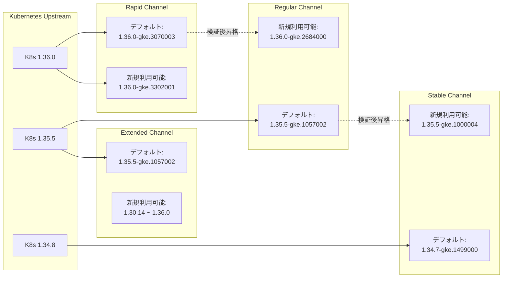

# Google Kubernetes Engine (GKE): バージョンアップデート 2026-R25 (Kubernetes 1.36.0 対応)

**リリース日**: 2026-06-26

**サービス**: Google Kubernetes Engine (GKE)

**機能**: バージョンアップデート 2026-R25 (Kubernetes 1.36.0 対応)

**ステータス**: GA (Generally Available)

📊 [このアップデートのインフォグラフィックを見る](https://takech9203.github.io/google-cloud-news-summary/20260626-gke-version-updates-2026-r25.html)

## 概要

GKE 2026-R25 バージョンアップデートでは、全リリースチャンネル (Rapid、Regular、Stable、Extended) にわたる包括的なバージョン更新が実施されました。最も注目すべき点は、Kubernetes 1.36.0 の最新パッチバージョン (1.36.0-gke.3302001) が Rapid チャンネルで利用可能になったことと、1.36.0-gke.3070003 が Rapid チャンネルのクラスタ作成時のデフォルトバージョンに設定されたことです。

Regular、Stable、Extended チャンネルでもそれぞれ新しいデフォルトバージョンが設定され、セキュリティ修正を含む Container-Optimized OS イメージの更新も同時に提供されています。このアップデートは、本番環境のクラスタを最新かつ安全な状態に保つために重要な定期リリースです。

対象ユーザーは GKE を使用する全ての組織であり、特にセキュリティパッチの適用とバージョン管理を計画的に行う必要がある運用チームにとって重要な情報です。

**アップデート前の課題**

- 以前のデフォルトバージョン (Rapid: 1.36.0-gke.2684000) では最新のセキュリティ修正が含まれていなかった
- Regular/Extended チャンネルでは 1.35.5-gke.1000000 がデフォルトで、最新のパッチが適用されていなかった
- 一部の旧バージョンにセキュリティ脆弱性が存在し、Container-Optimized OS の累積的なセキュリティ修正が必要だった

**アップデート後の改善**

- Rapid チャンネルで Kubernetes 1.36.0 の最新パッチ (gke.3302001) が利用可能になった
- 各チャンネルのデフォルトバージョンが最新のセキュリティ修正を含むバージョンに更新された
- Container-Optimized OS イメージが更新され、累積的なセキュリティ修正が適用された
- 旧バージョンの非推奨化により、ユーザーに最新バージョンへの移行が促された

## アーキテクチャ図



GKE のリリースチャンネルモデルを示す図です。Kubernetes の新バージョンは Rapid チャンネルで最初に利用可能になり、検証を経て Regular、Stable、Extended の順に昇格していきます。

## サービスアップデートの詳細

### 主要機能

1. **Rapid チャンネル: Kubernetes 1.36.0 最新パッチ**
   - 1.36.0-gke.3070003 が新しいデフォルトバージョンに設定
   - 1.36.0-gke.3302001 が新規利用可能バージョンとして追加
   - 自動アップグレードターゲット: 1.35 から 1.36.0-gke.3070003 への昇格が可能
   - 旧バージョン (1.36.0-gke.2684000、1.36.0-gke.3009002 など) の非推奨化

2. **Regular チャンネル: 1.35.5 デフォルト化と 1.36.0 導入**
   - 1.35.5-gke.1057002 が新しいデフォルトバージョンに設定
   - 1.36.0-gke.2684000 が Regular チャンネルで初めて利用可能に
   - 1.34 から 1.35.5-gke.1057002 への自動アップグレードが可能

3. **Stable チャンネル: 安定版の更新**
   - 1.34.7-gke.1499000 が新しいデフォルトバージョンに設定
   - 1.35.5-gke.1000004 が Stable チャンネルで新規利用可能
   - 1.34.8-gke.1000000 も利用可能に

4. **Extended チャンネル: 幅広いバージョンサポート**
   - 1.35.5-gke.1057002 が新しいデフォルトバージョンに設定
   - 1.30.14 から 1.36.0 まで幅広いマイナーバージョンをサポート
   - 新しいノードバージョン: 1.30.14-gke.2710000、1.31.14-gke.2116000 など

5. **セキュリティ更新: Container-Optimized OS イメージ**
   - 全チャンネルで更新された Container-Optimized OS イメージを使用する新しい GKE バージョンを提供
   - 累積的なセキュリティ修正が適用済み
   - 最新の COS バージョン: cos-129-19506-120-64 (Rapid/1.36.0 向け)

## 技術仕様

### チャンネル別デフォルトバージョン一覧

| チャンネル | デフォルトバージョン | 利用可能マイナーバージョン | COS バージョン |
|------|------|------|------|
| Rapid | 1.36.0-gke.3070003 | 1.33 ~ 1.36 | cos-129-19506-120-64 |
| Regular | 1.35.5-gke.1057002 | 1.33 ~ 1.36 | cos-125-19216-395-7 |
| Stable | 1.34.7-gke.1499000 | 1.33 ~ 1.35 | cos-125-19216-220-185 |
| Extended | 1.35.5-gke.1057002 | 1.30 ~ 1.36 | cos-125-19216-395-7 |

### 自動アップグレードターゲット (Rapid チャンネル)

| 現在のマイナーバージョン | マイナーアップグレード先 | パッチアップグレード先 |
|------|------|------|
| 1.32 | 1.33.12-gke.1165000 | - |
| 1.33 | 1.34.8-gke.1278000 | 1.33.12-gke.1165000 |
| 1.34 | 1.35.5-gke.1241004 | 1.34.8-gke.1278000 |
| 1.35 | 1.36.0-gke.3070003 | 1.35.5-gke.1241004 |
| 1.36 | - | 1.36.0-gke.3070003 |

### 非推奨化されたバージョン (Rapid チャンネル)

| バージョン | 状態 | 削除予定 |
|------|------|------|
| 1.33.12-gke.1166000 | 非推奨 | 90 日以内またはサポート終了時 |
| 1.35.5-gke.1163000 | 非推奨 | 90 日以内またはサポート終了時 |
| 1.35.5-gke.1241000 | 非推奨 | 90 日以内またはサポート終了時 |
| 1.36.0-gke.3009002 | 非推奨 | 90 日以内またはサポート終了時 |

## 設定方法

### 前提条件

1. Google Cloud プロジェクトが作成済みであること
2. GKE API が有効化されていること
3. 適切な IAM 権限 (container.admin または container.clusterAdmin) を持っていること

### 手順

#### ステップ 1: 現在のクラスタバージョンを確認

```bash
# クラスタのバージョン情報を確認
gcloud container clusters describe CLUSTER_NAME \
  --zone=ZONE \
  --format="table(name,currentMasterVersion,currentNodeVersion,releaseChannel.channel)"
```

現在のバージョンとリリースチャンネルを確認し、アップグレードの必要性を判断します。

#### ステップ 2: 利用可能なバージョンを確認

```bash
# 特定チャンネルで利用可能なバージョンを確認
gcloud container get-server-config \
  --zone=ZONE \
  --format="yaml(channels)"
```

#### ステップ 3: コントロールプレーンをアップグレード

```bash
# コントロールプレーンを指定バージョンにアップグレード
gcloud container clusters upgrade CLUSTER_NAME \
  --zone=ZONE \
  --master \
  --cluster-version=1.36.0-gke.3070003
```

コントロールプレーンのアップグレードは数分から数十分かかります。

#### ステップ 4: ノードプールをアップグレード

```bash
# ノードプールを指定バージョンにアップグレード
gcloud container clusters upgrade CLUSTER_NAME \
  --zone=ZONE \
  --node-pool=NODE_POOL_NAME \
  --cluster-version=1.36.0-gke.3070003
```

ノードプールのアップグレードではサージアップグレードまたはブルーグリーンアップグレード戦略が使用されます。

#### ステップ 5: リリースチャンネルの変更 (オプション)

```bash
# クラスタのリリースチャンネルを変更
gcloud container clusters update CLUSTER_NAME \
  --zone=ZONE \
  --release-channel=rapid
```

## メリット

### ビジネス面

- **セキュリティコンプライアンスの維持**: 最新のセキュリティパッチが適用された Container-Optimized OS イメージにより、セキュリティ監査要件を満たしやすくなる
- **サポート期間の確保**: 最新バージョンへの更新により、標準サポート期間 (14 か月) を最大限活用可能
- **運用コストの削減**: 自動アップグレード機能により、手動でのバージョン管理工数を削減

### 技術面

- **Kubernetes 1.36 の新機能活用**: Rapid チャンネルで最新の Kubernetes 1.36 機能を早期に検証・活用可能
- **セキュリティ強化**: Container-Optimized OS の累積セキュリティ修正により、ノードレベルの脅威を軽減
- **柔軟なアップグレードパス**: 各チャンネルで複数のアップグレードターゲットが提供され、段階的な移行が可能

## デメリット・制約事項

### 制限事項

- ロールアウトは公開日から開始され、全ての Google Cloud ゾーンで完了するまで数日かかる場合がある
- リリースチャンネルの自動アップグレードはメンテナンス除外や非推奨 API の使用により遅延する場合がある
- Rapid チャンネルのバージョンは GKE SLA の対象外であり、既知の回避策のない問題が含まれる可能性がある

### 考慮すべき点

- Kubernetes 1.36 は Regular チャンネルにも到達しているが、Stable チャンネルにはまだ到達していない
- No Channel (非推奨) 設定は 2027 年 6 月 14 日に廃止予定。未登録クラスタは Stable チャンネルに自動登録される
- 非推奨バージョンは 90 日以内 (またはサポート終了時) に削除されるため、早期のアップグレード計画が必要
- containerd の重大な脆弱性 (GCP-2026-037) に対する修正は別途パッチバージョン (1.36.0-gke.3545000 以降) で提供されるため、本 R25 リリースとは別途対応が必要

## ユースケース

### ユースケース 1: 本番環境の計画的アップグレード

**シナリオ**: Regular チャンネルを使用する本番クラスタで、1.34.x から 1.35.5 への計画的なマイナーバージョンアップグレードを実施したい。

**実装例**:
```bash
# メンテナンスウィンドウを設定 (深夜帯に実行)
gcloud container clusters update production-cluster \
  --zone=asia-northeast1-a \
  --maintenance-window-start=2026-06-28T18:00:00Z \
  --maintenance-window-end=2026-06-28T22:00:00Z \
  --maintenance-window-recurrence="FREQ=WEEKLY;BYDAY=SA"

# コントロールプレーンを手動アップグレード
gcloud container clusters upgrade production-cluster \
  --zone=asia-northeast1-a \
  --master \
  --cluster-version=1.35.5-gke.1057002
```

**効果**: Regular チャンネルのデフォルトバージョンへの更新により、安定性とセキュリティのバランスが取れた最新環境を維持できる。

### ユースケース 2: Kubernetes 1.36 の検証

**シナリオ**: 開発/ステージング環境で Kubernetes 1.36 の新機能を検証し、本番環境への導入を計画したい。

**実装例**:
```bash
# Rapid チャンネルで 1.36 のテストクラスタを作成
gcloud container clusters create k136-test \
  --zone=asia-northeast1-a \
  --release-channel=rapid \
  --cluster-version=1.36.0-gke.3070003 \
  --num-nodes=3
```

**効果**: 本番導入前に Kubernetes 1.36 の動作検証が可能。Rapid チャンネルにより最新パッチも自動的に適用される。

### ユースケース 3: 長期サポートが必要なワークロード

**シナリオ**: 金融系システムなど、変更を最小限に抑えたいワークロードで Extended チャンネルを活用したい。

**実装例**:
```bash
# Extended チャンネルでクラスタを作成
gcloud container clusters create fintech-cluster \
  --zone=asia-northeast1-a \
  --release-channel=extended \
  --cluster-version=1.31.14-gke.2116000 \
  --num-nodes=5
```

**効果**: 最大 24 か月のサポート期間を活用し、安定した環境を長期間維持しながらセキュリティパッチのみを受け取ることが可能。

## 料金

バージョンアップデート自体に追加料金は発生しません。ただし、Extended チャンネルの利用には追加費用が必要です。

### 料金例

| 項目 | 月額料金 (概算) |
|--------|-----------------|
| GKE Standard (Rapid/Regular/Stable) | クラスタ管理料 $0.10/時間 + ノード料金 |
| GKE Extended チャンネル追加料金 | 標準サポート終了後の延長サポート期間中はクラスタあたり追加費用が発生 |
| GKE Autopilot | Pod リソース使用量に基づく従量課金 (バージョンによる差異なし) |

## 利用可能リージョン

GKE バージョンアップデートは全ての Google Cloud リージョンおよびゾーンに適用されます。ただし、ロールアウトは公開日から開始され、全ゾーンへの展開完了には数日かかる場合があります。

## 関連サービス・機能

- **Container-Optimized OS**: GKE ノードのベース OS。本リリースでセキュリティ修正を含む更新版が提供
- **GKE Security Bulletins**: containerd の重大な脆弱性 (GCP-2026-037) に関する情報。本 R25 とは別途パッチ対応が必要
- **GKE Release Channels**: クラスタのバージョン管理戦略を決定するチャンネルシステム
- **GKE Maintenance Windows**: アップグレードのタイミングを制御するためのメンテナンスウィンドウ機能

## 参考リンク

- 📊 [インフォグラフィック](https://takech9203.github.io/google-cloud-news-summary/20260626-gke-version-updates-2026-r25.html)
- [GKE リリースノート](https://cloud.google.com/kubernetes-engine/docs/release-notes)
- [GKE バージョニングとサポート](https://cloud.google.com/kubernetes-engine/versioning)
- [GKE クラスタアップグレードについて](https://cloud.google.com/kubernetes-engine/upgrades)
- [Kubernetes 1.36 CHANGELOG](https://github.com/kubernetes/kubernetes/blob/master/CHANGELOG/CHANGELOG-1.36.md#v1360)
- [GKE リリースチャンネルの概念](https://cloud.google.com/kubernetes-engine/docs/concepts/release-channels)
- [GKE リリーススケジュール](https://cloud.google.com/kubernetes-engine/docs/release-schedule)
- [GKE セキュリティ速報](https://cloud.google.com/kubernetes-engine/docs/security-bulletins)

## まとめ

GKE 2026-R25 は、Kubernetes 1.36.0 を含む全リリースチャンネルの包括的なバージョン更新です。特に Rapid チャンネルでの 1.36.0-gke.3302001 の提供開始と、Regular/Extended チャンネルでの 1.35.5-gke.1057002 のデフォルト化が重要です。セキュリティ修正を含む Container-Optimized OS の更新も同時に行われており、全ての GKE ユーザーはアップグレード計画を確認し、特に非推奨化されたバージョンを使用している場合は早期の移行を推奨します。

---

**タグ**: #gke #kubernetes #version-update #k8s-1-36 #container-optimized-os #security
