# Google SecOps SOAR: Release 6.3.90

**リリース日**: 2026-06-27

**サービス**: Google SecOps SOAR

**機能**: Release 6.3.90 全リージョン展開完了

**ステータス**: GA (Generally Available)

📊 [このアップデートのインフォグラフィックを見る](https://takech9203.github.io/google-cloud-news-summary/20260627-google-secops-soar-release-6-3-90.html)

## 概要

Google Security Operations (SecOps) SOAR プラットフォームの Release 6.3.90 が、2026年6月27日に全リージョンへの展開を完了した。本リリースは6月21日に第1フェーズのリージョン（日本、インド、オーストラリア、カナダ、ドイツ、スイス）への展開が開始され、約1週間の段階的ロールアウトを経て、第2フェーズのリージョン（シンガポール、カタール、サウジアラビア、イスラエル、英国、イタリア、EU マルチリージョン、US マルチリージョン）を含む全リージョンで利用可能となった。

本リリースには内部修正および顧客報告のバグフィックスが含まれている。Google SecOps SOAR は Security Orchestration, Automation, and Response（セキュリティオーケストレーション、自動化、レスポンス）プラットフォームであり、脅威の検出・調査・対応を自動化するための中核的な実行環境として機能する。

## アーキテクチャ図

```mermaid
flowchart LR
    subgraph Phase1["第1フェーズ (6月21日)"]
        JP["🇯🇵 日本"]
        IN["🇮🇳 インド"]
        AU["🇦🇺 オーストラリア"]
        CA["🇨🇦 カナダ"]
        DE["🇩🇪 ドイツ"]
        CH["🇨🇭 スイス"]
    end

    subgraph Phase2["第2フェーズ (6月27日)"]
        SG["🇸🇬 シンガポール"]
        QA["🇶🇦 カタール"]
        SA["🇸🇦 サウジアラビア"]
        IL["🇮🇱 イスラエル"]
        UK["🇬🇧 英国"]
        IT["🇮🇹 イタリア"]
        EU["🇪🇺 EU マルチリージョン"]
        US["🇺🇸 US マルチリージョン"]
    end

    Release["📦 Release 6.3.90"] --> Phase1
    Phase1 -->|"1週間後"| Phase2
```

Google SecOps SOAR の段階的リリースプロセスを示す図。第1フェーズで6リージョンに展開後、1週間の検証期間を経て第2フェーズの8リージョンに展開される。

## サービスアップデートの詳細

### 主要内容

1. **全リージョン展開完了**
   - Release 6.3.90 が全14リージョンで利用可能
   - 段階的ロールアウトにより安定性を確保した上での全面展開

2. **バグフィックス**
   - 内部のバグ修正を含む
   - 顧客から報告されたバグの修正を含む

### リリーススケジュール

| フェーズ | 展開日 | 対象リージョン |
|----------|--------|---------------|
| 第1フェーズ | 2026-06-21 | 日本、インド、オーストラリア、カナダ、ドイツ、スイス |
| 第2フェーズ (全リージョン) | 2026-06-27 | シンガポール、カタール、サウジアラビア、イスラエル、英国、イタリア、EU、US |

## メリット

### 運用面

- **段階的ロールアウトによる安定性**: 第1フェーズでの検証を経てから全リージョンに展開されるため、大規模な障害リスクが低減される
- **全リージョン統一バージョン**: 全リージョンで同一バージョンが稼働することで、機能の一貫性が確保される

### セキュリティ面

- **バグフィックスの適用**: セキュリティオペレーションの安定性向上に寄与するバグ修正が全顧客に適用される

## 関連サービス・機能

- **Google SecOps SIEM**: SOAR と統合されたセキュリティ情報・イベント管理プラットフォーム。アラートの取り込みと検出ルールの実行を担当
- **Google Cloud IAM**: SOAR Permission Groups から Google Cloud IAM への移行が進行中（2026年3月に GA）
- **Remote Agents**: リモート環境でのコネクタ、アクション、ジョブの実行を担当。高可用性デプロイメントにも対応
- **Gemini in Security Operations**: プレイブック作成や調査支援を AI で効率化する機能

## 参考リンク

- 📊 [インフォグラフィック](https://takech9203.github.io/google-cloud-news-summary/20260627-google-secops-soar-release-6-3-90.html)
- [公式リリースノート](https://cloud.google.com/chronicle/docs/soar/release-notes#June_21_2026)
- [SOAR 段階的リリース計画](https://docs.cloud.google.com/chronicle/docs/soar/overview-and-introduction/soar-gradual-release)
- [Google SecOps SOAR 概要](https://docs.cloud.google.com/chronicle/docs/soar/overview-and-introduction/soar-overview)
- [Google Security Operations 料金](https://cloud.google.com/security/products/security-orchestration-automation-response)

## まとめ

Google SecOps SOAR Release 6.3.90 は、内部修正および顧客報告のバグフィックスを含むメンテナンスリリースであり、段階的ロールアウトを経て全リージョンへの展開が完了した。SOAR プラットフォームを利用中の組織は、特別な対応なしに自動的にアップデートが適用される。なお、次のリリース 6.3.91 は既に6月28日に第1フェーズのリージョンへの展開が開始されている。

---

**タグ**: #google-secops #soar #release-6-3-90 #security-operations
