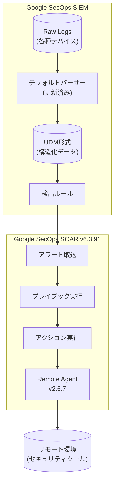

# Google SecOps: パーサーアップデートおよび SOAR リリース 6.3.91

**リリース日**: 2026-06-28

**サービス**: Google SecOps (SIEM / SOAR)

**機能**: デフォルトパーサーの更新、SOAR Release 6.3.91、Remote Agents Version 2.6.7

**ステータス**: 変更 / アナウンス

:bar_chart: [このアップデートのインフォグラフィックを見る](https://takech9203.github.io/google-cloud-news-summary/20260628-google-secops-parser-updates-soar-6-3-91.html)

## 概要

2026年6月28日に Google SecOps に関する 2 つのアップデートが発表された。1 つ目は SIEM コンポーネントのデフォルトパーサーリストの更新であり、2 つ目は SOAR プラットフォームの Release 6.3.91 と Remote Agents Version 2.6.7 のリリースである。

SIEM パーサーの更新では、サポートされるデフォルトパーサーのリストが更新された。パーサーは段階的に展開されるため、変更がリージョンに反映されるまで 1〜4 日かかる場合がある。SOAR 側では、Release 6.3.91 が第 1 フェーズのリージョン (日本、インド、オーストラリア、カナダ、ドイツ、スイス) に展開開始され、内部およびカスタマーバグの修正が含まれている。また、Remote Agents Version 2.6.7 が利用可能となり、軽微なバグ修正が含まれている。

**アップデート前の課題**

- デフォルトパーサーで対応していないログ形式があった場合、カスタムパーサーの作成が必要だった
- 以前のバージョン (6.3.90) で報告されていた内部的なバグやカスタマー報告のバグが存在していた
- Remote Agents の以前のバージョン (2.6.6) に軽微なバグが存在していた

**アップデート後の改善**

- 更新されたデフォルトパーサーにより、より多くのログソースが標準でパース可能になった
- SOAR Release 6.3.91 により内部およびカスタマー報告のバグが修正された
- Remote Agents Version 2.6.7 により軽微なバグが修正され、安定性が向上した

## アーキテクチャ図

SIEM パーサーがログを UDM 形式に正規化し、検出ルールで生成されたアラートが SOAR プラットフォームに連携される。SOAR はプレイブックを通じてリモート環境のセキュリティツールと連携する。

## サービスアップデートの詳細

### 主要機能

1. **SIEM デフォルトパーサーの更新**
   - サポートされるデフォルトパーサーのリストが更新された
   - パーサーは段階的に展開され、リージョンへの反映に 1〜4 日を要する
   - デフォルトパーサーは raw ログデータを Unified Data Model (UDM) 形式に正規化する
   - 対応するログ形式: CSV、JSON、SYSLOG、KV、XML、LEEF、CEF など

2. **SOAR Release 6.3.91**
   - 第 1 フェーズのリージョンへのロールアウトが開始
   - 内部およびカスタマーバグの修正を含む
   - 第 2 フェーズのリージョンへの展開は約 1 週間後の見込み

3. **Remote Agents Version 2.6.7**
   - 新バージョンが利用可能
   - 軽微なバグ修正を含む
   - Remote Agent はリモート環境と Google SecOps プラットフォームを接続するコンポーネント

## 技術仕様

### SOAR リリース展開スケジュール

| フェーズ | リージョン | 展開時期 |
|---------|-----------|---------|
| 第 1 フェーズ | 日本、インド、オーストラリア、カナダ、ドイツ、スイス | 2026-06-28 |
| 第 2 フェーズ | シンガポール、カタール、サウジアラビア、イスラエル、UK (London)、イタリア、EU (マルチリージョン)、US (マルチリージョン) | 約 1 週間後 |

### パーサー管理オプション

| 機能 | 説明 |
|------|------|
| 自動更新 | パーサーが新しい安定版リリースごとに自動更新される |
| 手動更新 | 自動更新オフ時に管理者が手動で最新版に更新可能 |
| 影響分析 | 新バージョンが検出ルールに与える影響を事前に評価可能 |
| ロールバック | 以前のバージョンに戻すことが可能 |

### Remote Agent 要件

| 要件 | 基本構成 | スケールアップ構成 |
|------|---------|-----------------|
| CPU | 4 コア | 8 コア |
| RAM | 8 GB | 16 GB |
| ストレージ | 100 GB | 100 GB |

## メリット

### ビジネス面

- **運用効率の向上**: デフォルトパーサーの更新により、カスタムパーサーの作成・保守の負担が軽減される
- **安定性の改善**: バグ修正によりプラットフォーム全体の信頼性が向上し、セキュリティ運用の中断リスクが低減される

### 技術面

- **ログカバレッジの拡大**: 更新されたパーサーにより、より多くのデバイスやサービスからのログが標準で UDM 形式に正規化される
- **リモート実行の安定性**: Remote Agents のバグ修正により、リモート環境でのアクション実行の信頼性が向上する

## デメリット・制約事項

### 制限事項

- パーサーの更新が全リージョンに反映されるまで最大 4 日かかる
- SOAR Release 6.3.91 は第 2 フェーズのリージョンには約 1 週間後に展開される
- パーサーの変更は新しく取り込まれたログにのみ適用され、既に取り込み済みのログには遡及適用されない

### 考慮すべき点

- パーサー更新が既存の検出ルールに影響を与える可能性があるため、影響分析機能を活用して事前に確認することを推奨
- カスタムパーサーを使用している場合、デフォルトパーサーの更新はそのログタイプに影響しない
- Remote Agents の更新はオプションであり、ダウンタイム通知が有効な場合はエージェントの状態が監視される

## ユースケース

### ユースケース 1: パーサー更新の影響評価

**シナリオ**: セキュリティチームが多数の検出ルールを運用しており、パーサー更新が既存ルールに影響を与えないか確認したい場合

**実装例**:
1. Google SecOps Console で Settings > SIEM Settings > Parsers に移動
2. 更新が保留中のパーサーを選択
3. Impact タブで "Check impact on rules" をクリック
4. 影響を受けるルールを確認し、必要に応じてルールを修正

**効果**: 検出ルールの誤動作を事前に防止し、セキュリティ監視の品質を維持できる

### ユースケース 2: Remote Agent の高可用性構成

**シナリオ**: リモートサイトでのセキュリティオペレーションの可用性を高めるため、Remote Agent のフェイルオーバーを構成する場合

**効果**: プライマリエージェントが利用できなくなった場合でも、30 秒以内にセカンダリエージェントが自動的に引き継ぎ、リモート環境でのアクション実行が継続される

## 関連サービス・機能

- **Google SecOps SIEM 検出エンジン**: パーサーで正規化された UDM データに基づいて検出ルールが動作する
- **Google SecOps SOAR プレイブック**: アラートに対する自動応答ワークフローを定義・実行する
- **Remote Agents**: リモート環境のセキュリティツールと SOAR プラットフォームを接続し、プレイブックアクションをリモート実行する
- **Cloud Logging**: SOAR の Python インテグレーションログが Google Cloud Logging に構造化形式で出力される

## 参考リンク

- :bar_chart: [インフォグラフィック](https://takech9203.github.io/google-cloud-news-summary/20260628-google-secops-parser-updates-soar-6-3-91.html)
- [公式リリースノート](https://docs.cloud.google.com/release-notes#June_28_2026)
- [Google SecOps SOAR リリースノート](https://docs.cloud.google.com/chronicle/docs/soar/release-notes)
- [サポートされるデフォルトパーサー一覧](https://docs.cloud.google.com/chronicle/docs/ingestion/parser-list/supported-default-parsers)
- [パーサー更新の管理](https://docs.cloud.google.com/chronicle/docs/event-processing/manage-parser-updates)
- [SOAR 段階的リリース計画](https://docs.cloud.google.com/chronicle/docs/soar/overview-and-introduction/soar-gradual-release)
- [Remote Agent 概要](https://docs.cloud.google.com/chronicle/docs/soar/working-with-remote-agents/what-is-a-remote-agent)

## まとめ

今回のアップデートは Google SecOps の SIEM パーサーと SOAR プラットフォームの定期メンテナンスリリースである。パーサー更新によりログ正規化のカバレッジが維持・改善され、SOAR Release 6.3.91 と Remote Agents Version 2.6.7 によりプラットフォームの安定性が向上する。第 1 フェーズのリージョン (日本を含む) のユーザーは、パーサー更新の影響分析を実施し、検出ルールへの影響がないことを確認することを推奨する。

---

**タグ**: #GoogleSecOps #SIEM #SOAR #Parser #RemoteAgent #SecurityOperations #BugFix
