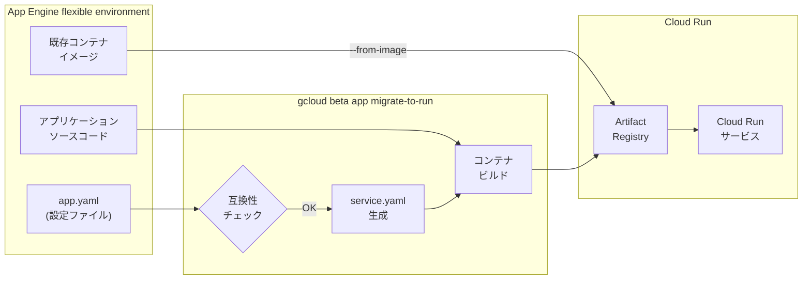

# App Engine flexible environment: Cloud Run への自動マイグレーションコマンド

**リリース日**: 2026-06-29

**サービス**: App Engine flexible environment

**機能**: gcloud beta app migrate-to-run コマンドによる Cloud Run への自動デプロイ

**ステータス**: Preview

📊 [このアップデートのインフォグラフィックを見る](https://takech9203.github.io/google-cloud-news-summary/20260629-app-engine-flexible-migrate-to-run.html)

## 概要

App Engine flexible environment で動作している既存アプリケーションを Cloud Run にデプロイするための `gcloud beta app migrate-to-run` コマンドが Preview として利用可能になった。このコマンドは、App Engine の `app.yaml` 設定を Cloud Run の `service.yaml` に自動変換し、コンテナイメージのビルドとデプロイまでを一括で実行する。

対象となるランタイムは、.NET、Go、Java、Node.js、PHP、Python、Ruby、およびカスタムランタイムの全 flexible environment ランタイムである。Google Cloud は Cloud Run をサーバーレスコンテナプラットフォームの推奨選択肢として位置付けており、本コマンドは App Engine から Cloud Run への移行を自動化する重要なツールとなる。

既存の App Engine アプリケーションの機能やトラフィックフローには影響を与えず、Cloud Run 上に独立したレプリカとして新しいサービスが作成される。これにより、移行前に Cloud Run 上での動作を安全にテストできる。

**アップデート前の課題**

- App Engine flexible environment から Cloud Run への移行は手動で構成の変換やコンテナ化が必要だった
- app.yaml の設定を Cloud Run の service.yaml に手動でマッピングする必要があり、移行作業が煩雑だった
- スケーリング設定、環境変数、リソース設定などの変換ルールを個別に把握する必要があった
- 移行の互換性チェックを事前に自動実行する手段がなかった

**アップデート後の改善**

- `gcloud beta app migrate-to-run` コマンド一つで app.yaml から Cloud Run への変換・ビルド・デプロイが自動実行される
- `--dry-run` フラグによる事前互換性チェックで、移行前に問題を検出できる
- `--export-only` フラグでデプロイせずに service.yaml の生成のみが可能で、構成を事前に確認できる
- `--from-image` フラグで既存のコンテナイメージを再利用し、ソースコードなしでの移行も可能になった

## アーキテクチャ図



App Engine の app.yaml 設定と既存ソースコードから、互換性チェック、service.yaml 変換、コンテナビルドを経て Cloud Run サービスが作成される流れを示す。`--from-image` オプションでは既存コンテナイメージを直接再利用する経路も存在する。

## サービスアップデートの詳細

### 主要機能

1. **ローカル app.yaml からのデプロイ (推奨)**
   - ローカルのソースコードと app.yaml を使用して Cloud Run にデプロイ
   - 最新のコード変更を含むコンテナイメージが新規ビルドされる
   - `gcloud beta app migrate-to-run` を app.yaml のあるディレクトリで実行

2. **既存コンテナイメージからのデプロイ**
   - App Engine 上で稼働中のバージョンのコンテナイメージを再利用
   - ソースコードへのアクセスが不要
   - `--service` と `--version` フラグでサービスとバージョンを指定
   - `--from-image` フラグで既存イメージを使用

3. **互換性チェック (--dry-run)**
   - デプロイを実行せずに互換性の問題を事前検出
   - 非互換な設定がある場合は具体的な解決策を提示
   - 移行計画の策定時に活用可能

4. **構成エクスポート (--export-only)**
   - Cloud Run の service.yaml 設定ファイルのみを生成
   - デプロイ前に構成内容を確認・カスタマイズ可能
   - CI/CD パイプラインへの組み込みに有用

## 技術仕様

### 対応ランタイム

| ランタイム | 対応状況 |
|-----------|---------|
| .NET | 対応 |
| Go | 対応 |
| Java | 対応 |
| Node.js | 対応 |
| PHP | 対応 |
| Python | 対応 |
| Ruby | 対応 |
| カスタムランタイム | 対応 |

### コマンドフラグ

| フラグ | 説明 |
|--------|------|
| `--appyaml=PATH` | app.yaml ファイルのパスを指定 (別ディレクトリにある場合) |
| `--export-only=EXPORT_PATH` | service.yaml の出力先を指定 (デプロイなし) |
| `--service=SERVICE` | App Engine サービス名を指定 |
| `--version=VERSION` | App Engine バージョン ID を指定 |
| `--from-image` | 既存のコンテナイメージを使用 |
| `--dry-run` | 互換性チェックのみ実行 (デプロイなし) |

### 非互換な機能 (flexible environment)

| 非互換設定 | 解決策 |
|-----------|--------|
| `inbound_services: warmup` | 削除する。Cloud Run はコンテナエントリーポイントでウォームアップを行う。startup probes や minimum instances で代替可能 |

## 設定方法

### 前提条件

1. App Engine アプリケーションがエラーなく動作していること
2. Cloud Run Admin API と Artifact Registry API が有効であること
3. gcloud CLI が最新バージョンに更新されていること
4. ローカル app.yaml からデプロイする場合はソースコードへのアクセスが必要

### 手順

#### ステップ 1: プロジェクトとリージョンの設定

```bash
gcloud auth login
gcloud config set project PROJECT_ID
gcloud config set run/region REGION
gcloud components update
```

PROJECT_ID を Google Cloud プロジェクト ID に、REGION を Cloud Run サービスをデプロイするリージョンに置き換える。

#### ステップ 2: 互換性チェックの実行

```bash
gcloud beta app migrate-to-run --dry-run
```

互換性チェックの結果を確認し、非互換な設定がある場合は事前に修正する。

#### ステップ 3a: ローカル設定からのデプロイ

```bash
# app.yaml があるディレクトリで実行
gcloud beta app migrate-to-run
```

プロンプト `Proceed with the deployment?` が表示されたら `Y` を入力してデプロイを実行する。

#### ステップ 3b: 既存イメージからのデプロイ (代替)

```bash
gcloud beta app migrate-to-run --service=SERVICE --version=VERSION --from-image
```

SERVICE と VERSION を対象の App Engine サービス名とバージョン ID に置き換える。

#### ステップ 4: (オプション) 構成のみエクスポート

```bash
gcloud beta app migrate-to-run --export-only=./cloud-run-config/
```

デプロイせずに service.yaml を生成し、内容を確認・カスタマイズする場合に使用する。

## メリット

### ビジネス面

- **移行コストの削減**: 手動での構成変換作業が不要になり、移行プロジェクトの工数を大幅に削減
- **リスクの最小化**: 既存の App Engine アプリに影響を与えず、Cloud Run 上で独立してテスト可能
- **Cloud Run の料金メリット享受**: Cloud Run は Committed Use Discounts (CUD) に対応し、スケールゼロによるコスト最適化が可能

### 技術面

- **自動構成変換**: app.yaml のスケーリング設定、リソース設定、環境変数などが自動的に Cloud Run 設定にマッピングされる
- **段階的な移行**: `--export-only` で構成を確認し、`--dry-run` で互換性を検証した上でデプロイできる
- **GPU やサイドカーコンテナへのアクセス**: Cloud Run に移行することで、App Engine では利用できない GPU やサイドカーコンテナ、Cloud Storage ボリュームマウントなどの機能を活用可能

## デメリット・制約事項

### 制限事項

- Preview 段階のため、本番環境での使用には注意が必要 (Pre-GA Offerings Terms が適用)
- `inbound_services: warmup` が app.yaml に含まれている場合、事前に削除が必要
- Cloud Run サービスはデフォルトでプライベート (非認証アクセスは別途設定が必要)
- App Engine の URL 形式 (appspot.com) から Cloud Run の URL 形式 (run.app) に変わる

### 考慮すべき点

- Cloud Run では「Version」ではなく「Revision」という概念を使用する
- App Engine ではサービスがデフォルトでパブリックだが、Cloud Run ではデフォルトでプライベートのため、公開設定が必要
- App Engine 固有の機能 (例: ファイアウォールルール) は Cloud Run では Google Cloud Armor での設定に置き換わる
- `--from-image` での移行は、ローカルの app.yaml の最新変更を反映しない可能性がある
- スケーリング設定 (concurrency 等) は Cloud Run のデフォルト値と異なる場合があり、負荷テストでの検証が推奨される

## ユースケース

### ユースケース 1: 既存 App Engine アプリの段階的な Cloud Run 移行

**シナリオ**: 複数のマイクロサービスを App Engine flexible environment で運用しているチームが、Cloud Run のコスト最適化やGPU 機能を活用するために段階的に移行したい。

**実装例**:
```bash
# 1. 互換性チェック
gcloud beta app migrate-to-run --dry-run

# 2. 構成確認 (デプロイなし)
gcloud beta app migrate-to-run --export-only=./migration-review/

# 3. テスト環境にデプロイ
gcloud beta app migrate-to-run

# 4. Cloud Run 上で動作確認後、トラフィックを段階的に切り替え
```

**効果**: 既存サービスに影響を与えずに移行を検証し、問題があればロールバック不要で App Engine 上のサービスに留まれる。

### ユースケース 2: ソースコードなしでの緊急移行

**シナリオ**: レガシーなアプリケーションでソースコードの管理状態が不明だが、App Engine 上で動作中のバージョンを Cloud Run に移行する必要がある。

**実装例**:
```bash
# 既存のコンテナイメージを直接 Cloud Run にデプロイ
gcloud beta app migrate-to-run --service=legacy-api --version=v1 --from-image
```

**効果**: ソースコードへのアクセスなしで、稼働中のアプリケーションを Cloud Run 上に複製できる。

## 料金

本コマンド自体の利用に追加料金は発生しない。Cloud Run へのデプロイ後は Cloud Run の料金体系が適用される。

Cloud Run は以下の料金モデルを提供:
- **リクエストベース課金**: リクエスト処理中のみ CPU を割り当て (スケールゼロ対応)
- **インスタンスベース課金**: App Engine に近い課金モデル (時間単位)

詳細は [Cloud Run 料金ページ](https://cloud.google.com/run/pricing) を参照。

## 関連サービス・機能

- **Cloud Run**: マイグレーション先のサーバーレスコンテナプラットフォーム。GPU、サイドカーコンテナ、ボリュームマウントなどの高度な機能を提供
- **Artifact Registry**: マイグレーション時にビルドされるコンテナイメージの保存先
- **App Engine Migration Center**: Google Cloud コンソールから利用可能なマイグレーションハブ。互換性チェックやコスト見積もりを UI で実行可能
- **Cloud Build**: ソースコードからのコンテナイメージビルドに使用される

## 参考リンク

- 📊 [インフォグラフィック](https://takech9203.github.io/google-cloud-news-summary/20260629-app-engine-flexible-migrate-to-run.html)
- [公式リリースノート](https://docs.cloud.google.com/release-notes#June_29_2026)
- [Deploy an App Engine app in the flexible environment to Cloud Run](https://docs.cloud.google.com/appengine/migration-center/run/migrate-app-engine-flexible-to-run)
- [App Engine と Cloud Run の比較](https://docs.cloud.google.com/appengine/migration-center/run/compare-gae-with-run)
- [gcloud beta app migrate-to-run リファレンス](https://docs.cloud.google.com/sdk/gcloud/reference/beta/app/migrate-to-run)
- [Cloud Run 料金](https://cloud.google.com/run/pricing)

## まとめ

`gcloud beta app migrate-to-run` コマンドの Preview 公開により、App Engine flexible environment から Cloud Run への移行が大幅に自動化された。全ランタイム (.NET、Go、Java、Node.js、PHP、Python、Ruby、カスタムランタイム) に対応し、互換性チェック、構成エクスポート、既存イメージからのデプロイなど柔軟なオプションを提供する。App Engine flexible environment を運用中のチームは、まず `--dry-run` で互換性を確認し、Cloud Run への移行計画を策定することを推奨する。

---

**タグ**: App Engine, Cloud Run, Migration, Serverless, gcloud CLI, Preview
