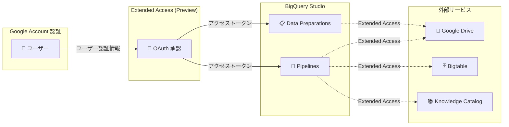

# BigQuery: Data Preparations / Pipelines の拡張アクセス (Extended Access)

**リリース日**: 2026-06-29

**サービス**: BigQuery

**機能**: Extended access for data preparations and pipelines

**ステータス**: Preview

[このアップデートのインフォグラフィックを見る](https://takech9203.github.io/google-cloud-news-summary/20260629-bigquery-extended-access-data-preparations.html)

## 概要

BigQuery の Data Preparations および Pipelines において、ユーザー認証情報 (Google Account) を使用して実行・スケジュールする際に、追加のサービスへのアクセスを付与できる「Extended Access」機能が Preview として提供開始されました。

具体的には、Data Preparations に対して Google Drive へのアクセスを付与でき、Pipelines に対しては Google Drive、Bigtable、Knowledge Catalog へのアクセスを付与できるようになります。これにより、ユーザー認証情報を利用したパイプライン実行時に、BigQuery 外部のデータソースやメタデータカタログとシームレスに連携できるようになりました。

この機能は、BigQuery Studio でデータ準備やパイプラインのワークフローを構築するデータエンジニアやデータアナリストにとって、外部サービスとの統合をより柔軟に行えるようにする重要なアップデートです。

**アップデート前の課題**

- Data Preparations で Google Drive のデータソースを使用する場合、サービスアカウントでの実行が必須であり、ユーザー認証情報では Google Drive にアクセスできなかった
- Pipelines からユーザー認証情報で Bigtable や Knowledge Catalog に直接アクセスする手段がなかった
- 外部サービスへのアクセスにはサービスアカウントの設定と権限管理が必要で、個人ユーザーにとって設定の手間が大きかった

**アップデート後の改善**

- Data Preparations をユーザー認証情報で実行する際に、Google Drive へのアクセスを付与できるようになった
- Pipelines をユーザー認証情報で実行する際に、Google Drive、Bigtable、Knowledge Catalog へのアクセスを付与できるようになった
- OAuth による手動承認フローで、ユーザーが自身の認証情報を使って外部サービスに安全にアクセスできるようになった

## アーキテクチャ図

BigQuery の Data Preparations と Pipelines が、ユーザー認証情報の OAuth フローを通じて外部サービス (Google Drive、Bigtable、Knowledge Catalog) にアクセスするデータフローを示しています。

## サービスアップデートの詳細

### 主要機能

1. **Data Preparations の Google Drive アクセス**
   - ユーザー認証情報 (Google Account) で Data Preparations を実行・スケジュールする際に、Google Drive へのアクセスを付与可能
   - Google Drive 上のスプレッドシートやファイルをデータソースとして利用する際の認証が簡素化

2. **Pipelines の拡張アクセス**
   - ユーザー認証情報で Pipelines を実行する際に、以下のサービスへのアクセスを付与可能:
     - **Google Drive**: Drive 上のファイルをパイプラインのデータソースとして利用
     - **Bigtable**: Bigtable テーブルへの読み書きをパイプライン内で実行
     - **Knowledge Catalog**: メタデータの管理・参照をパイプライン内で実行

3. **OAuth ベースの認証フロー**
   - ユーザーが OAuth ダイアログを通じて手動で BigQuery Pipelines にアクセス権限を付与
   - 一度承認すれば再承認は不要
   - Google Account ページからいつでもアクセス権限を取り消し可能

## 技術仕様

### アクセス対象サービスの比較

| 機能 | Google Drive | Bigtable | Knowledge Catalog |
|------|:---:|:---:|:---:|
| Data Preparations | 対応 | - | - |
| Pipelines | 対応 | 対応 | 対応 |

### 認証方式

| 項目 | 詳細 |
|------|------|
| 認証方式 | Google Account ユーザー認証情報 (OAuth) |
| 承認方法 | OAuth ダイアログによる手動承認 |
| 承認回数 | 初回のみ (以降は再承認不要) |
| 取り消し | Google Account ページから可能 |
| 影響範囲 | 取り消し時は全リージョンの実行が停止 |

### 前提条件と権限

| 要件 | 詳細 |
|------|------|
| 必要な API | Gemini for Google Cloud API |
| IAM ロール (Data Preparations) | BigQuery Studio User, Gemini for Google Cloud User, BigQuery Data Viewer |
| IAM ロール (Pipelines) | Dataform Admin, Service Account User |
| Dataform サービスアカウント | BigQuery Data Viewer, BigQuery Data Editor |

## 設定方法

### 前提条件

1. Gemini for Google Cloud API が有効化されていること
2. BigQuery Studio User ロールが付与されていること
3. 対象の外部サービスへのアクセス権限があること

### 手順

#### ステップ 1: Data Preparations の Extended Access 設定

1. Google Cloud コンソールで BigQuery ページに移動
2. Explorer パネルでプロジェクトを展開し「Data preparations」をクリック
3. 対象の Data Preparation を選択
4. エディターツールバーから「Schedule」をクリック
5. Authentication セクションで「Execute with my user credentials」を選択
6. Extended Access オプションで Google Drive へのアクセスを有効化

#### ステップ 2: Pipelines の Extended Access 設定

1. Google Cloud コンソールで BigQuery ページに移動
2. Explorer パネルでプロジェクトを展開し「Pipelines」をクリック
3. 対象のパイプラインを選択
4. 「Schedule」をクリック
5. Authentication セクションで「Execute with my user credentials」を選択
6. Extended Access オプションで Google Drive / Bigtable / Knowledge Catalog へのアクセスを有効化

#### ステップ 3: OAuth 承認

1. スケジュール作成時に OAuth ダイアログが表示される
2. BigQuery Pipelines にアクセストークンの取得を許可
3. 承認は一度のみで完了

## メリット

### ビジネス面

- **運用の簡素化**: サービスアカウントの作成・管理が不要になり、個人ユーザーが自身の認証情報で外部サービスにアクセス可能
- **データ活用の促進**: Google Drive 上のスプレッドシートやファイルを直接 BigQuery のパイプラインに組み込めるため、部門間のデータ連携が容易に

### 技術面

- **認証フローの統一**: ユーザー認証情報による一貫した認証体験を提供し、サービスアカウントとユーザー認証の使い分けが不要に
- **マルチサービス連携**: 1 つのパイプライン内で BigQuery、Google Drive、Bigtable、Knowledge Catalog を横断的に利用可能
- **セキュリティ**: OAuth ベースの明示的な承認により、アクセス権限の範囲が明確

## デメリット・制約事項

### 制限事項

- Preview 段階であり、本番環境での利用は推奨されない (Pre-GA Offerings Terms が適用)
- Context-Aware Access (CAA) ポリシー (IP ベース、地理ベース、デバイスコンプライアンス) はサポートされない (トークンリクエストが Google インフラから発行されるため)
- アクセス権限の取り消しは全リージョンに影響し、該当 Google Account が所有するすべてのパイプライン実行が停止する
- スケジュールオーナーの変更時には、新しい Google Account オーナーによる手動承認が必要

### 考慮すべき点

- Dataform OAuth クライアント ID を CAA ポリシーから除外する設定が必要な場合がある
- VPC Service Controls を使用している場合、Dataform と BigQuery を同一のサービス境界で保護する必要がある
- ユーザー認証情報の利用は、共有パイプラインの管理上、個人への依存を生む可能性がある

## ユースケース

### ユースケース 1: Google Drive スプレッドシートからの定期データ取り込み

**シナリオ**: マーケティング部門が Google Sheets で管理しているキャンペーンデータを、毎日自動的に BigQuery に取り込んでダッシュボードで可視化したい。

**効果**: サービスアカウントの設定やファイル共有の手間なく、ユーザー自身の認証情報で Google Drive 上のスプレッドシートに直接アクセスし、Data Preparation を通じて BigQuery テーブルに変換・ロードできる。

### ユースケース 2: BigQuery から Bigtable への低レイテンシデータ配信

**シナリオ**: BigQuery で集計した推薦データを、リアルタイムサービング用に Bigtable に定期的にエクスポートするパイプラインを構築したい。

**効果**: Pipelines の Extended Access により、ユーザー認証情報で Bigtable への書き込みが可能になり、パイプライン内で BigQuery のクエリ結果を直接 Bigtable にエクスポートするワークフローを構築できる。

### ユースケース 3: Knowledge Catalog を活用したデータガバナンス統合

**シナリオ**: パイプライン実行時に Knowledge Catalog のメタデータを参照し、データ品質ルールやリネージ情報を確認しながら処理を実行したい。

**効果**: Pipelines から Knowledge Catalog に直接アクセスでき、メタデータドリブンなデータパイプラインの構築が可能になる。

## 料金

Extended Access 機能自体に追加料金は明示されていません。BigQuery の既存の料金体系 (オンデマンドまたは容量ベース) に従い、パイプライン内で使用する各サービス (Bigtable、Google Drive、Knowledge Catalog) はそれぞれの料金体系が適用されます。

詳細は各サービスの料金ページを参照してください:
- [BigQuery 料金](https://cloud.google.com/bigquery/pricing)
- [Bigtable 料金](https://cloud.google.com/bigtable/pricing)
- [Knowledge Catalog (Dataplex) 料金](https://cloud.google.com/dataplex/pricing)

## 関連サービス・機能

- **Google Drive**: スプレッドシートやファイルを BigQuery の外部データソースとして利用
- **Bigtable**: 低レイテンシ・高スループットの NoSQL データベース。BigQuery からのデータエクスポート先として活用
- **Knowledge Catalog (Dataplex)**: データカタログ・メタデータ管理。Data Preparations のメタデータは自動的に Knowledge Catalog に登録される
- **Dataform**: BigQuery の Data Preparations と Pipelines の基盤技術。スケジューリングとオーケストレーションを担当
- **Gemini for Google Cloud**: Data Preparations の AI アシスト機能を提供

## 参考リンク

- [このアップデートのインフォグラフィック](https://takech9203.github.io/google-cloud-news-summary/20260629-bigquery-extended-access-data-preparations.html)
- [公式リリースノート](https://docs.cloud.google.com/release-notes#June_29_2026)
- [BigQuery Data Preparations の管理](https://docs.cloud.google.com/bigquery/docs/manage-data-preparations)
- [Data Preparations のオーケストレーション](https://docs.cloud.google.com/bigquery/docs/orchestrate-data-preparations)
- [Pipelines のスケジューリング](https://docs.cloud.google.com/bigquery/docs/schedule-pipelines)
- [BigQuery Pipelines 入門](https://docs.cloud.google.com/bigquery/docs/pipelines-introduction)
- [Bigtable と BigQuery の統合](https://docs.cloud.google.com/bigtable/docs/integrations)
- [BigQuery 料金](https://cloud.google.com/bigquery/pricing)

## まとめ

BigQuery の Data Preparations と Pipelines における Extended Access 機能 (Preview) は、ユーザー認証情報を使用したパイプライン実行時に Google Drive、Bigtable、Knowledge Catalog への直接アクセスを可能にする重要なアップデートです。これにより、サービスアカウントに依存しない柔軟なデータ連携ワークフローの構築が可能になります。Preview 段階のため本番環境での利用は慎重に検討すべきですが、データエンジニアやアナリストの生産性向上に大きく寄与する機能です。

---

**タグ**: #BigQuery #DataPreparations #Pipelines #GoogleDrive #Bigtable #KnowledgeCatalog #ExtendedAccess #Preview #OAuth #データ連携
