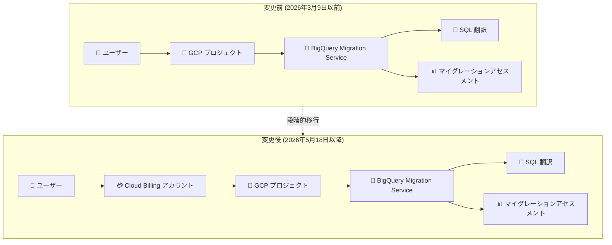

# BigQuery: Migration Service に Cloud Billing アカウントが必須化

**リリース日**: 2026-06-29

**サービス**: BigQuery

**機能**: Migration Service の課金アカウント要件変更

**ステータス**: Change (適用済み)

📊 [このアップデートのインフォグラフィックを見る](https://takech9203.github.io/google-cloud-news-summary/20260629-bigquery-migration-service-billing.html)

## 概要

2026 年 3 月 9 日より、BigQuery Migration Service を利用する新規ユーザーに対して Cloud Billing アカウントの紐付けが必須となった。この変更は、SQL 翻訳やマイグレーションアセスメントなどの BigQuery Migration Service 機能を使用する新規プロジェクトに適用される。

さらに、2026 年 5 月 18 日以降は既存ユーザーも含めすべてのユーザーに対して Cloud Billing アカウントが必要となった。重要な点として、BigQuery Migration Service 自体の利用料金は引き続き無料であり、課金アカウントの紐付けが必要になったものの、サービス利用に対する直接的な課金は発生しない。

この変更は、Google Cloud のサービス利用ポリシーの統一化の一環と考えられ、プロジェクト管理やリソース追跡の観点から課金アカウントの紐付けを標準要件とするものである。

**アップデート前の課題**

- Cloud Billing アカウントなしで BigQuery Migration Service の機能 (SQL 翻訳、マイグレーションアセスメント) を利用できたため、リソース管理やプロジェクト追跡が困難な場合があった
- 課金アカウントが不要であったため、正式な組織管理の枠組み外でサービスが利用される可能性があった

**アップデート後の改善**

- すべてのユーザーが Cloud Billing アカウントを紐付けることで、プロジェクトのガバナンスと管理が統一された
- 組織レベルでの利用状況の可視性が向上した
- 将来的な課金体系の変更にも柔軟に対応できる基盤が整備された

## アーキテクチャ図



変更前は課金アカウントなしで直接サービスを利用できたが、変更後はプロジェクトに Cloud Billing アカウントを紐付けた上で Migration Service を利用する必要がある。

## サービスアップデートの詳細

### 主要な変更点

1. **新規ユーザーへの適用 (2026 年 3 月 9 日〜)**
   - この日以降に BigQuery Migration Service を新規利用開始するユーザーは、Cloud Billing アカウントの紐付けが必須
   - 新規プロジェクトで SQL 翻訳やマイグレーションアセスメントを使用する場合に適用

2. **既存ユーザーへの適用 (2026 年 5 月 18 日〜)**
   - すべての既存ユーザーにも Cloud Billing アカウントの紐付けが必須化
   - この日以降、課金アカウントが紐付けられていないプロジェクトでは Migration Service を利用できない

3. **料金体系は変更なし**
   - BigQuery Migration API の利用自体は引き続き無料
   - 入出力ファイルに使用されるストレージに対しては通常のストレージ料金が発生

### 影響を受ける機能

| 機能 | 説明 |
|------|------|
| SQL 翻訳 (バッチ) | SQL スクリプトを一括で GoogleSQL に変換 |
| SQL 翻訳 (インタラクティブ) | 個別クエリのリアルタイム変換 |
| SQL Translation API | プログラマティックな SQL 変換 |
| マイグレーションアセスメント | データウェアハウス移行の評価・計画 |

## 技術仕様

### 対応が必要な条件

| 項目 | 詳細 |
|------|------|
| 対象サービス | BigQuery Migration Service |
| 新規ユーザー適用日 | 2026 年 3 月 9 日 |
| 既存ユーザー適用日 | 2026 年 5 月 18 日 |
| 必要なもの | プロジェクトに紐付けられた Cloud Billing アカウント |
| サービス料金 | 無料 (変更なし) |
| ストレージ料金 | 入出力ファイルに対する通常のストレージ料金が適用 |

### 必要な IAM ロール

BigQuery Migration Service を利用するには、以下のロールが必要:

- `roles/bigquerymigration.editor` (Migration Workflow Editor) - マイグレーションワークフローの作成・管理
- `roles/serviceusage.serviceUsageAdmin` - BigQuery Migration Service API の有効化

## 設定方法

### 前提条件

1. Google Cloud プロジェクトが作成済みであること
2. Cloud Billing アカウントを所有、または Billing Account User ロールを持っていること
3. BigQuery Migration Service API が有効化されていること

### 手順

#### ステップ 1: Cloud Billing アカウントの確認

```bash
# 利用可能な課金アカウントの一覧表示
gcloud billing accounts list

# プロジェクトに紐付けられた課金アカウントの確認
gcloud billing projects describe PROJECT_ID
```

#### ステップ 2: プロジェクトへの課金アカウント紐付け

```bash
# プロジェクトに課金アカウントを紐付け
gcloud billing projects link PROJECT_ID \
  --billing-account=BILLING_ACCOUNT_ID
```

課金アカウントが紐付けられていない場合、Google Cloud Console の「お支払い」ページから新規作成または既存アカウントの紐付けが可能。

#### ステップ 3: BigQuery Migration Service API の有効化

```bash
# BigQuery Migration API を有効化
gcloud services enable bigquerymigration.googleapis.com --project=PROJECT_ID
```

## デメリット・制約事項

### 制限事項

- Cloud Billing アカウントが紐付けられていないプロジェクトでは、2026 年 5 月 18 日以降 Migration Service を利用できない
- 組織ポリシーにより課金アカウントの作成が制限されている場合、管理者の対応が必要
- Migration Service 自体は無料だが、関連するストレージ使用には料金が発生する

### 考慮すべき点

- 教育・研究目的で課金アカウントなしで利用していたユーザーは対応が必要
- 無料トライアルアカウントでも課金アカウントのセットアップが求められる可能性がある
- 既存の自動化スクリプトやパイプラインが課金アカウント未設定のプロジェクトを使用している場合、動作しなくなる可能性がある

## ユースケース

### ユースケース 1: 既存ユーザーの対応

**シナリオ**: これまで課金アカウントなしで BigQuery Migration Service の SQL 翻訳機能を利用していたチームが、2026 年 5 月 18 日以降も継続利用する必要がある。

**実装例**:
```bash
# 1. 既存プロジェクトの課金状態を確認
gcloud billing projects describe my-migration-project

# 2. 課金アカウントが未設定の場合、紐付けを実行
gcloud billing projects link my-migration-project \
  --billing-account=01ABCD-234EFG-567HIJ

# 3. Migration Service が引き続き利用可能か確認
gcloud services list --project=my-migration-project \
  --filter="name:bigquerymigration.googleapis.com"
```

**効果**: サービスの継続利用が保証され、マイグレーションプロジェクトの中断を防止できる。

### ユースケース 2: 新規マイグレーションプロジェクトの開始

**シナリオ**: オンプレミスの Teradata から BigQuery への移行を新規に開始する企業が、Migration Service を活用してアセスメントと SQL 翻訳を行いたい。

**効果**: 課金アカウントのセットアップを最初に完了しておくことで、Migration Service だけでなく BigQuery Data Transfer Service やその他の関連サービスもスムーズに利用開始できる。

## 料金

BigQuery Migration Service (BigQuery Migration API) の利用自体は無料である。ただし、以下の関連コストが発生する可能性がある:

| 項目 | 料金 |
|------|------|
| BigQuery Migration API の利用 | 無料 |
| 入出力ファイルのストレージ | BigQuery ストレージ料金に準拠 |
| Cloud Storage の使用 (翻訳ファイルの保存) | Cloud Storage の標準料金 |

詳細は [BigQuery の料金ページ](https://cloud.google.com/bigquery/pricing#storage) を参照。

## 関連サービス・機能

- **BigQuery Data Transfer Service**: データソースから BigQuery へのデータロードを設定するサービス。Migration Service と組み合わせてデータ移行を実行
- **Google Cloud Migration Center**: 移行先の BigQuery 環境のコスト見積もりを生成する機能を提供
- **Cloud Storage**: SQL 翻訳の入出力ファイルの保存に使用
- **BigQuery Migration Service MCP サーバー**: OAuth 2.0 認証を使用した MCP ツール経由での Migration Service の利用

## 参考リンク

- 📊 [インフォグラフィック](https://takech9203.github.io/google-cloud-news-summary/20260629-bigquery-migration-service-billing.html)
- [公式リリースノート](https://docs.cloud.google.com/release-notes#June_29_2026)
- [BigQuery Migration Service ドキュメント](https://docs.cloud.google.com/bigquery/docs/migration-intro)
- [BigQuery Migration Service の料金](https://docs.cloud.google.com/bigquery/docs/migration-intro#pricing)
- [バッチ SQL トランスレータ](https://docs.cloud.google.com/bigquery/docs/batch-sql-translator)
- [インタラクティブ SQL トランスレータ](https://docs.cloud.google.com/bigquery/docs/interactive-sql-translator)
- [マイグレーションアセスメント](https://docs.cloud.google.com/bigquery/docs/migration-assessment)

## まとめ

BigQuery Migration Service の利用に Cloud Billing アカウントの紐付けが必須となったが、サービス自体の利用料金は引き続き無料である。既存ユーザーは 2026 年 5 月 18 日までに対応が必要であったため、現時点ですべてのユーザーが課金アカウントを紐付けている必要がある。まだ未対応のプロジェクトがある場合は、早急に `gcloud billing projects link` コマンドまたは Cloud Console から課金アカウントの紐付けを行うことを推奨する。

---

**タグ**: #BigQuery #MigrationService #Billing #SQLTranslation #MigrationAssessment #Change
