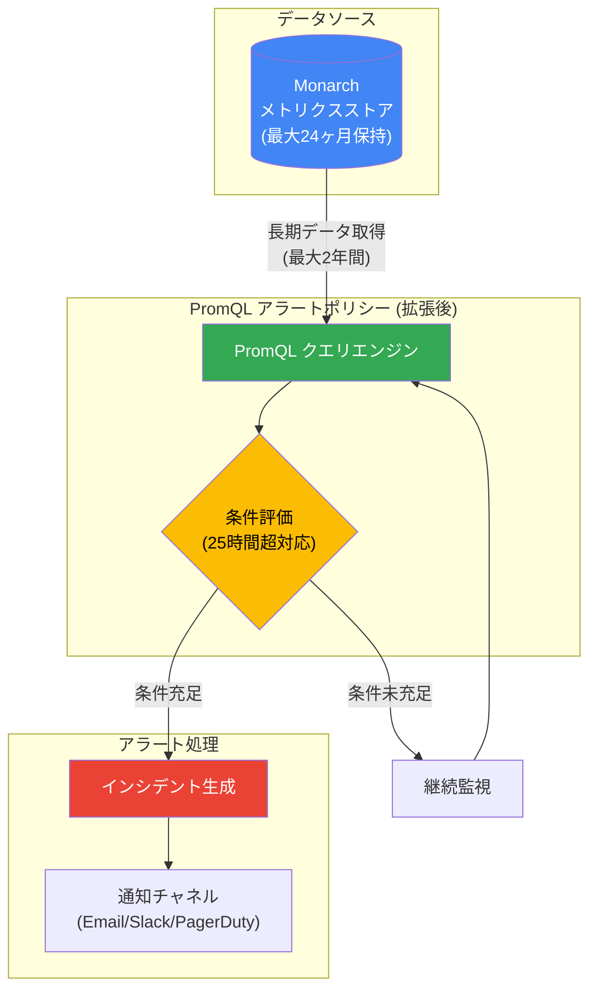

# Cloud Monitoring: PromQL アラートポリシーで 25 時間超のデータクエリが可能に

**リリース日**: 2026-06-29

**サービス**: Cloud Monitoring

**機能**: PromQL alerting policies over 25+ hours of data

**ステータス**: Feature (GA)

[このアップデートのインフォグラフィックを見る](https://takech9203.github.io/google-cloud-news-summary/20260629-cloud-monitoring-promql-alerting-extended.html)

## 概要

Cloud Monitoring の PromQL ベースのアラートポリシーにおいて、25 時間を超えるデータ範囲でのクエリ実行が可能になった。これにより、長期的なメトリクストレンドに基づくアラート条件の設定が実現し、より高度な異常検知や容量計画に基づいたアラート運用が可能となる。

従来、PromQL ベースのアラートポリシーでは「リテストウィンドウ + アライメント期間の合計が最大 25 時間」という制約があり、長期間のデータに基づく条件評価ができなかった。今回のアップデートにより、最大 2 年間のメトリクスデータに対して PromQL クエリを実行するアラートポリシーを作成できるようになり、季節性のあるトレンド分析や長期的なベースラインとの比較に基づくアラートが設定可能となった。

この機能は、大規模なインフラストラクチャを運用するチームや、メトリクスの長期的な傾向を把握してプロアクティブに問題を検知したいチームにとって特に有用である。

**アップデート前の課題**

- PromQL アラートポリシーのリテストウィンドウは最大 24 時間、アライメント期間も最大 24 時間に制限されていた
- リテストウィンドウとアライメント期間の合計が 25 時間を超えることができなかった
- 長期トレンドに基づくアラート (例: 前週比、前月比の異常検知) を PromQL アラートポリシーで直接実装できなかった
- 長期データに基づくアラートを実現するには、外部システムやカスタムソリューションが必要だった

**アップデート後の改善**

- PromQL アラートポリシーで 25 時間を超えるデータ範囲のクエリが可能になった
- 最大 2 年間のメトリクスデータ保持期間を活用したアラート条件の設定が可能に
- 長期的なベースラインとの偏差に基づくアラートが Cloud Monitoring 内で完結できるようになった
- 季節性パターンや週次・月次のトレンドを考慮した動的しきい値アラートの構築が容易に

## アーキテクチャ図



PromQL アラートポリシーが Monarch バックエンドから長期メトリクスデータ (最大 2 年間) を取得し、25 時間を超えるデータ範囲で条件を評価してインシデントを生成するフローを示す。

## サービスアップデートの詳細

### 主要機能

1. **25 時間超のデータ範囲でのクエリ実行**
   - アライメント期間とリテストウィンドウの合計制限 (25 時間) が緩和された
   - 長期的なメトリクスデータに対する PromQL クエリをアラート条件として使用可能
   - 「Query over 2 years of metric data」機能と連携

2. **既存の PromQL 機能との統合**
   - 比率計算、動的しきい値、複合メトリクスなどの PromQL 機能はそのまま利用可能
   - Google Cloud システムメトリクス、カスタムメトリクス、Prometheus メトリクスすべてに対応
   - Managed Service for Prometheus からのメトリクスにも対応

3. **長期データ保持との連携**
   - カスタムメトリクス、Prometheus メトリクス: 最大 24 ヶ月の保持データを活用
   - 主要 Google Cloud サービスメトリクス (Compute Engine, GKE, Cloud Storage 等): 最大 24 ヶ月
   - その他の Google Cloud メトリクス: 6 週間
   - ダウンサンプリングされたデータ (10 分間隔) も含めてクエリ可能

## 技術仕様

### 制限値の変更

| 項目 | 変更前 | 変更後 |
|------|--------|--------|
| リテストウィンドウ最大値 | 24 時間 | 拡張 (詳細はドキュメント参照) |
| アライメント期間最大値 | 24 時間 | 拡張 (詳細はドキュメント参照) |
| リテストウィンドウ + アライメント期間の合計 | 最大 25 時間 | 25 時間超が可能 |
| データ保持期間 (参照可能な最大範囲) | 最大 24 ヶ月 | 最大 24 ヶ月 (変更なし) |

### データのダウンサンプリング

| メトリクスタイプ | オリジナル頻度保持 | ダウンサンプリング後 |
|-----------------|-------------------|---------------------|
| カスタム/エージェントメトリクス | 6 週間 | 10 分間隔で最大 24 ヶ月 |
| Prometheus/OTLP メトリクス | 1 週間 (その後 1 分間隔で 5 週間) | 10 分間隔で最大 24 ヶ月 |
| 主要 GCP サービスメトリクス | 6 週間 | 10 分間隔で最大 24 ヶ月 |

### PromQL アラートポリシーの作成方法

PromQL ベースのアラートポリシーは以下の方法で作成できる:

- **Google Cloud Console**: コードエディタで PromQL クエリを記述
- **gcloud CLI**: `gcloud alpha monitoring policies create` コマンド
- **Monitoring API**: `AlertPolicy` リソースを使用
- **Prometheus ルールの移行**: `gcloud` CLI で既存の Prometheus アラートルールを移行

## 設定方法

### 前提条件

1. Cloud Monitoring が有効なプロジェクト
2. `monitoring.alertPolicies.create` 権限を持つ IAM ロール (例: `roles/monitoring.alertPolicyEditor`)
3. アラート対象のメトリクスが Cloud Monitoring に存在すること

### 手順

#### ステップ 1: Google Cloud Console でのアラートポリシー作成

1. Google Cloud Console で **Monitoring > アラート** に移動
2. **ポリシーの作成** をクリック
3. 条件定義で **PromQL** エディタを選択
4. 25 時間を超える範囲を指定する PromQL クエリを記述

#### ステップ 2: 長期データ範囲を指定した PromQL クエリの例

```promql
# 過去 7 日間の平均 CPU 使用率と比較して 2 標準偏差以上の異常を検知
(
  avg_over_time({\"compute.googleapis.com/instance/cpu/utilization\"}[1h])
  - avg_over_time({\"compute.googleapis.com/instance/cpu/utilization\"}[7d])
) > 2 * stddev_over_time({\"compute.googleapis.com/instance/cpu/utilization\"}[7d])
```

#### ステップ 3: API を使用した作成

```bash
gcloud alpha monitoring policies create \
  --notification-channels="projects/PROJECT_ID/notificationChannels/CHANNEL_ID" \
  --condition-display-name="Long-range PromQL alert" \
  --condition-promql-query='avg_over_time({"compute.googleapis.com/instance/cpu/utilization"}[7d]) > 0.8' \
  --condition-promql-duration=3600s
```

## メリット

### ビジネス面

- **プロアクティブな容量管理**: 長期トレンドに基づいてリソース不足を事前に検知し、サービス停止を未然に防止
- **コスト最適化**: 長期的な使用パターンを監視し、過剰プロビジョニングや想定外のコスト増加をアラートで検知
- **SLA 管理の強化**: 長期間のパフォーマンスデータに基づいて SLO 違反の傾向を早期に把握

### 技術面

- **外部ツール依存の削減**: 長期データに基づくアラートが Cloud Monitoring 内で完結し、外部の分析基盤やカスタムジョブが不要に
- **季節性パターンの検知**: 週次・月次の周期パターンからの逸脱を検知する動的しきい値アラートが容易に構築可能
- **Prometheus 互換性**: 既存の Prometheus アラートルールを活用しつつ、Cloud Monitoring の長期データ保持機能を享受可能

## デメリット・制約事項

### 制限事項

- メトリクスのデータ保持期間を超えるクエリは実行不可 (最大 24 ヶ月)
- 6 週間を超えるデータはダウンサンプリング (10 分間隔) されているため、細かい粒度のデータは利用不可
- Prometheus/OTLP メトリクスは 1 週間を超えると 1 分間隔にダウンサンプリングされる
- PromQL で system metadata labels を使用するフィルタはアラートポリシーでは使用不可

### 考慮すべき点

- 長期データ範囲のクエリはコンピュートリソースを多く消費する可能性があり、API Read コストに影響する場合がある
- アライメント期間が長いほど、アラート発火までのレイテンシが増加する
- ダウンサンプリングされたデータでのクエリ結果は、オリジナル頻度のデータと若干異なる場合がある

## ユースケース

### ユースケース 1: 週次比較による異常検知

**シナリオ**: E コマースプラットフォームで、同曜日・同時間帯の前週比でトラフィックやレイテンシの異常を検知したい。

**実装例**:
```promql
# 前週同時間帯と比較して 50% 以上のレイテンシ増加を検知
(
  avg_over_time({"custom.googleapis.com/http/request_latency"}[1h])
  / avg_over_time({"custom.googleapis.com/http/request_latency"}[1h] offset 7d)
) > 1.5
```

**効果**: 絶対値のしきい値では捉えきれない相対的な異常 (例: 通常は低トラフィックの深夜帯でのレイテンシ増加) を検知できる。

### ユースケース 2: 長期的な容量トレンドアラート

**シナリオ**: ディスク使用量やメモリ使用量が過去 30 日間の平均と比較して急増している場合にアラートを発火させ、リソース枯渇前に対処したい。

**効果**: 従来は外部の分析基盤で定期バッチ処理が必要だった長期トレンド監視を、Cloud Monitoring のリアルタイムアラートとして実装できる。

### ユースケース 3: クォータ消費率の長期予測

**シナリオ**: API クォータの消費率を過去数日間のトレンドから算出し、クォータ上限に到達する前にアラートを発火させたい。

**効果**: 単純な「クォータの 80% に到達」というアラートではなく、消費速度のトレンドに基づく予測的なアラートが実現する。

## 料金

Cloud Monitoring のアラートポリシーに関する料金体系は以下の通り:

| 項目 | 料金 |
|------|------|
| アラートポリシー内のメトリック参照ごと | $0.35/月 |
| メトリックアラートポリシー条件のクエリで返されたポイントごと | $0.50/100 万ポイント |
| Monitoring API Read 呼び出し | $0.50/100 万タイムシリーズ (返却分) |

長期データ範囲のクエリは返却されるデータポイント数が増加する可能性があるため、API Read コストへの影響を考慮する必要がある。

詳細は [Google Cloud Observability 料金ページ](https://cloud.google.com/products/observability/pricing) を参照。

## 利用可能リージョン

Cloud Monitoring はグローバルサービスとして提供されており、特定のリージョン制限なくすべての Google Cloud リージョンのリソースを監視可能。

## 関連サービス・機能

- **Managed Service for Prometheus**: Prometheus メトリクスを Cloud Monitoring に取り込み、同じ長期データ保持とアラート機能を利用可能
- **Cloud Monitoring Metrics Explorer**: PromQL を使用したメトリクスの可視化とダッシュボード作成
- **Cloud Logging**: ログベースメトリクスを生成し、PromQL アラートポリシーの対象として使用可能
- **Google Cloud Managed Service for Prometheus**: Prometheus 互換の収集・クエリ基盤として、本機能と直接連携

## 参考リンク

- [このアップデートのインフォグラフィック](https://takech9203.github.io/google-cloud-news-summary/20260629-cloud-monitoring-promql-alerting-extended.html)
- [公式リリースノート](https://docs.cloud.google.com/release-notes#June_29_2026)
- [PromQL in Cloud Monitoring アラートポリシー](https://docs.cloud.google.com/monitoring/promql/promql-in-alerting)
- [Cloud Monitoring のアラートに関する制限](https://docs.cloud.google.com/monitoring/quotas#alerting_uptime_limits)
- [PromQL in Cloud Monitoring](https://docs.cloud.google.com/monitoring/promql)
- [アラートポリシーの動作](https://docs.cloud.google.com/monitoring/alerts/concepts-indepth)
- [Google Cloud Observability 料金](https://cloud.google.com/products/observability/pricing)

## まとめ

Cloud Monitoring の PromQL アラートポリシーにおける 25 時間超のデータクエリ対応は、長期トレンドに基づく高度なアラート運用を Cloud Monitoring 内で完結させる重要なアップデートである。季節性パターンの異常検知、容量計画に基づくプロアクティブなアラート、前週比・前月比の動的しきい値など、これまで外部ツールや複雑なカスタムソリューションを必要としたユースケースが大幅に簡素化される。既に PromQL ベースのアラートポリシーを使用しているチームは、既存のクエリを拡張して長期データ範囲を活用するアラートの追加を検討すべきである。

---

**タグ**: #CloudMonitoring #PromQL #Alerting #Observability #ManagedPrometheus #LongTermMetrics #GA
