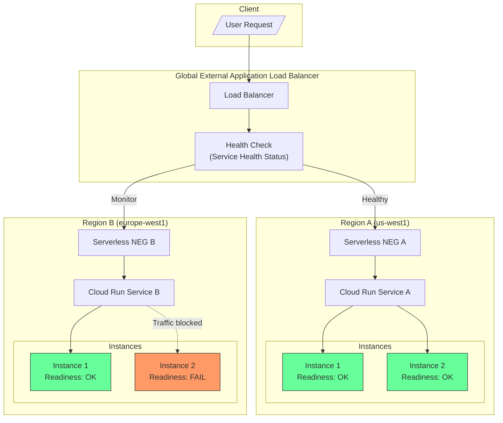

# Cloud Run: マルチリージョンサービスと Readiness Probe の GA

**リリース日**: 2026-06-29

**サービス**: Cloud Run

**機能**: マルチリージョン自動フェイルオーバー / HTTP・gRPC Readiness Probe

**ステータス**: GA (General Availability)

[このアップデートのインフォグラフィックを見る](https://takech9203.github.io/google-cloud-news-summary/20260629-cloud-run-multi-region-health-readiness-probes-ga.html)

## 概要

Cloud Run の 2 つの重要な機能が GA (一般提供) に昇格した。1 つ目は、Cloud Run サービスヘルスを利用した自動フェイルオーバー・フェイルバック対応のマルチリージョンサービスデプロイ。2 つ目は、HTTP および gRPC Readiness Probe の構成サポートである。

マルチリージョンサービスは、Cloud Run のサービスヘルス機能を活用し、リージョン間の自動フェイルオーバーとフェイルバックを実現する。グローバル外部アプリケーションロードバランサーまたはクロスリージョン内部アプリケーションロードバランサーと Serverless NEG を組み合わせ、内部・外部トラフィックの両方に対して高可用性を提供する。

Readiness Probe は、コンテナインスタンスがトラフィックを受信する準備ができているかどうかを判定する仕組みである。初期化が完了していないインスタンスにリクエストが送信されることを防ぎ、サービスの安定性と信頼性を向上させる。これら 2 つの機能は密接に関連しており、マルチリージョンフェイルオーバーの健全性判定は各インスタンスの Readiness Probe の結果を集約して行われる。

**アップデート前の課題**

- Cloud Run サービスのマルチリージョン展開には手動でのトラフィック管理やフェイルオーバー設定が必要だった
- リージョン障害時の自動的なトラフィック切り替えが組み込みで提供されていなかった
- コンテナの初期化完了を Cloud Run プラットフォームに通知する標準的な仕組みが Preview 段階だった
- 初期化に時間のかかるサービスでは、準備完了前にリクエストが到達する可能性があった

**アップデート後の改善**

- マルチリージョン Cloud Run サービスを GA として本番環境で安心して利用可能になった
- リージョン障害時の自動フェイルオーバーとリカバリ後の自動フェイルバックが標準機能として提供
- HTTP/gRPC Readiness Probe が GA となり、サービスの準備状態を正確に制御可能に
- Readiness Probe の結果をリージョン単位で集約し、ロードバランサーへの健全性レポートを自動化

## アーキテクチャ図



マルチリージョン構成では、各リージョンのインスタンスが Readiness Probe を実行し、その結果を Cloud Run がリージョン単位で集約してロードバランサーに報告する。リージョンが unhealthy になると、ロードバランサーが自動的にトラフィックを健全なリージョンへ転送する。

## サービスアップデートの詳細

### 主要機能

1. **マルチリージョン自動フェイルオーバー**
   - 複数リージョンへの Cloud Run サービスデプロイ
   - Serverless NEG を通じたリージョン間の自動トラフィックルーティング
   - リージョン障害時の自動フェイルオーバー
   - 障害回復後の自動フェイルバック (段階的にトラフィックを復帰)

2. **Cloud Run サービスヘルス**
   - 各リージョンのサービスの集約的な健全性ステータスを公開
   - 個別インスタンスの Readiness Probe 結果をリージョン単位で集約
   - ロードバランサーへのヘルスレポート自動化
   - Cloud Monitoring メトリクス (`run.googleapis.com/service_health_count`) による監視

3. **HTTP/gRPC Readiness Probe (GA)**
   - HTTP GET リクエストによるヘルスチェック (カスタムパス、カスタムヘッダー対応)
   - gRPC Health Checking Protocol 対応
   - 設定可能なパラメータ: period、timeout、successThreshold、failureThreshold
   - Probe 失敗時にインスタンスへのトラフィック送信を停止

## 技術仕様

### Readiness Probe パラメータ

| パラメータ | デフォルト値 | 設定範囲 | 説明 |
|-----------|-------------|---------|------|
| path (HTTP) | `/` | 任意のパス | ヘルスチェックエンドポイントのパス |
| port | メインIngress ポート | - | プローブ対象のコンテナポート |
| periodSeconds | 10 秒 | 1〜300 秒 | プローブ実行間隔 |
| timeoutSeconds | 1 秒 | 1〜300 秒 | タイムアウト (periodSeconds 以下) |
| successThreshold | 2 | - | 成功と判定するまでの連続成功回数 |
| failureThreshold | 3 | - | 失敗と報告するまでのリトライ回数 |

### マルチリージョンフェイルオーバーの制限事項

| 項目 | 制限 |
|------|------|
| 最小インスタンス数 | 各リージョンに 1 以上必須 (サービスヘルス計算のため) |
| 最小リージョン数 | フェイルオーバーには 2 リージョン以上が必要 |
| Serverless NEG バックエンド数 | 最大 5 |
| URL マスク/タグ | Serverless NEG では使用不可 |
| IAP | ロードバランサーからの設定不可 (Cloud Run 直接設定のみ) |

### gcloud CLI でのデプロイ例

```bash
# マルチリージョンデプロイ + Readiness Probe (HTTP)
gcloud run deploy my-service \
  --source=. \
  --regions=us-west1,europe-west1 \
  --min=1 \
  --readiness-probe httpGet.path="/are_you_ready"

# gRPC Readiness Probe の設定
gcloud run deploy my-service \
  --image=IMAGE_URL \
  --readiness-probe grpc.port=8080,grpc.service=my.health.Service,failureThreshold=3,periodSeconds=10
```

### YAML での設定例

```yaml
apiVersion: serving.knative.dev/v1
kind: Service
metadata:
  name: my-service
spec:
  template:
    metadata:
    spec:
      containers:
        - image: us-docker.pkg.dev/my-project/my-repo/my-image:latest
          readinessProbe:
            httpGet:
              path: /are_you_ready
              port: 8080
            successThreshold: 2
            failureThreshold: 3
            timeoutSeconds: 1
            periodSeconds: 10
```

## 設定方法

### 前提条件

1. Cloud Run Admin API、Network Services API、Compute Engine API が有効化されていること
2. Artifact Registry にコンテナイメージが存在すること
3. gcloud CLI が最新バージョンにアップデートされていること
4. サービスコードに HTTP ヘルスチェックエンドポイント (例: `/are_you_ready`) が実装されていること

### 手順

#### ステップ 1: Readiness Probe 付きでマルチリージョンデプロイ

```bash
# プロジェクト設定
PROJECT_ID=my-project
SERVICE=my-service
REGION_A=us-west1
REGION_B=europe-west1

# マルチリージョンデプロイ (最小インスタンス 1 以上必須)
gcloud run deploy $SERVICE \
  --source=. \
  --regions=$REGION_A,$REGION_B \
  --min=1 \
  --readiness-probe httpGet.path="/are_you_ready"
```

#### ステップ 2: グローバル外部アプリケーションロードバランサーの設定

```bash
# バックエンドサービス作成
gcloud compute backend-services create $SERVICE-bs \
  --load-balancing-scheme=EXTERNAL_MANAGED \
  --global

# 静的 IP アドレスの予約
gcloud compute addresses create $SERVICE-ip \
  --network-tier=PREMIUM \
  --ip-version=IPV4 \
  --global

# URL マップ作成
gcloud compute url-maps create $SERVICE-lb \
  --default-service $SERVICE-bs

# ターゲット HTTP プロキシ作成
gcloud compute target-http-proxies create $SERVICE-hp \
  --url-map=$SERVICE-lb

# 転送ルール作成
gcloud compute forwarding-rules create $SERVICE-fr \
  --load-balancing-scheme=EXTERNAL_MANAGED \
  --network-tier=PREMIUM \
  --address=$SERVICE-ip \
  --target-http-proxy=$SERVICE-hp \
  --global \
  --ports=80
```

#### ステップ 3: Serverless NEG の作成とバックエンドへの追加

```bash
# 各リージョンの Serverless NEG 作成
gcloud compute network-endpoint-groups create $SERVICE-neg-$REGION_A \
  --region $REGION_A \
  --network-endpoint-type=serverless \
  --cloud-run-service=$SERVICE

gcloud compute network-endpoint-groups create $SERVICE-neg-$REGION_B \
  --region $REGION_B \
  --network-endpoint-type=serverless \
  --cloud-run-service=$SERVICE

# バックエンドサービスに NEG を追加
gcloud compute backend-services add-backend $SERVICE-bs \
  --global \
  --network-endpoint-group=$SERVICE-neg-$REGION_A \
  --network-endpoint-group-region=$REGION_A

gcloud compute backend-services add-backend $SERVICE-bs \
  --global \
  --network-endpoint-group=$SERVICE-neg-$REGION_B \
  --network-endpoint-group-region=$REGION_B
```

## メリット

### ビジネス面

- **高可用性の実現**: リージョン障害時でもサービスが継続稼働し、SLA 向上とダウンタイムの最小化が可能
- **グローバル展開の簡素化**: マルチリージョン展開がプラットフォームレベルで管理され、運用コストの削減に寄与
- **GA による安心感**: SLA の対象となり、本番ワークロードへの適用に対してエンタープライズレベルのサポートが保証される

### 技術面

- **自動フェイルオーバー/フェイルバック**: 手動介入なしでのリージョン間トラフィック切り替え
- **きめ細かなヘルスチェック**: Readiness Probe によりインスタンスレベルの準備状態を正確に制御
- **段階的ロールアウト対応**: Readiness Probe、トラフィック分割、最小インスタンスを組み合わせた安全なデプロイ戦略が可能
- **標準プロトコル対応**: HTTP/1 と gRPC Health Checking Protocol の両方をサポート

## デメリット・制約事項

### 制限事項

- 各リージョンに最低 1 つの最小インスタンスが必要 (常時課金が発生)
- Serverless NEG バックエンドは最大 5 つまで
- Serverless NEG で URL マスクやタグの設定不可
- ロードバランサーからの IAP 設定不可 (Cloud Run から直接設定する必要あり)
- 削除されたサービスについては unhealthy ステータスが報告されない
- セッションアフィニティが有効な場合、Readiness Check が失敗しても同じインスタンスにリクエストが送信され続ける

### 考慮すべき点

- 最小インスタンス数の設定はコストに直接影響する (リージョン数 x 最小インスタンス数が常時課金)
- インスタンスが急速にクラッシュしている場合、サービスヘルスの計算が不正確になる可能性がある
- 新しいインスタンスの起動時に最初の Readiness Probe がカウントされないため、一時的にトラフィックがルーティングされる可能性がある
- Readiness Probe のないリビジョンは unknown として扱われ、ロードバランサーはこれを healthy として処理する

## ユースケース

### ユースケース 1: グローバル EC サイトの高可用性

**シナリオ**: 日本と欧米にユーザーを持つ EC サイトで、リージョン障害が発生しても購入フローを中断させたくない。

**実装例**:
```bash
# 東京と US West にデプロイ
gcloud run deploy ecommerce-api \
  --source=. \
  --regions=asia-northeast1,us-west1 \
  --min=2 \
  --readiness-probe httpGet.path="/health"
```

**効果**: 一方のリージョンで障害が発生しても、もう一方のリージョンが自動的にトラフィックを引き受け、ユーザーへの影響を最小限に抑える。

### ユースケース 2: gRPC マイクロサービスの安全なデプロイ

**シナリオ**: 初期化に時間のかかる ML モデルをロードする gRPC マイクロサービスで、モデルロード完了前にリクエストを受け付けることを防ぎたい。

**実装例**:
```bash
gcloud run deploy ml-inference \
  --image=us-docker.pkg.dev/my-project/ml/inference:v2 \
  --readiness-probe grpc.service=inference.Health,periodSeconds=5,failureThreshold=5
```

**効果**: モデルのロードが完了し gRPC Health Check が成功するまでトラフィックが転送されず、500 エラーやタイムアウトを防止する。

### ユースケース 3: 段階的カナリアロールアウト

**シナリオ**: マルチリージョン環境で新しいリビジョンを安全にロールアウトしたい。

**効果**: 1 つのリージョンでカナリアデプロイを行い、Readiness Probe とサービスヘルスメトリクスで健全性を確認してから他のリージョンに展開することで、リスクを最小化する。

## 料金

Cloud Run の基本料金体系 (従量課金) に加え、マルチリージョン構成では以下の追加コストを考慮する必要がある:

- **最小インスタンスの常時課金**: 各リージョンで最低 1 インスタンスが常時稼働するため、アイドル時もコストが発生
- **ロードバランサー料金**: グローバル外部アプリケーションロードバランサーの転送ルールおよびデータ処理料金
- **Serverless NEG**: 追加料金なし (ロードバランサー料金に含まれる)

### 料金例

| 項目 | 月額料金 (概算) |
|------|-----------------|
| Cloud Run CPU ($0.000018/vCPU-sec) | 使用量に応じて変動 |
| Cloud Run メモリ ($0.000002/GiB-sec) | 使用量に応じて変動 |
| 最小インスタンス 1 (1 vCPU, 512 MiB) x 2 リージョン | 約 $94/月 |
| グローバル外部 ALB 転送ルール | 約 $18/月 |
| 無料枠 (CPU) | 月 240,000 vCPU 秒 |
| 無料枠 (メモリ) | 月 450,000 GiB 秒 |

## 利用可能リージョン

マルチリージョンサービスは Cloud Run が利用可能なすべてのリージョンで展開可能。フェイルオーバーを構成するには、異なる 2 つ以上のリージョンにサービスをデプロイする必要がある。詳細は [Cloud Run のロケーションドキュメント](https://cloud.google.com/run/docs/locations) を参照。

## 関連サービス・機能

- **Cloud Load Balancing**: グローバル外部/クロスリージョン内部アプリケーションロードバランサーによるトラフィックルーティング
- **Serverless NEG**: Cloud Run サービスをロードバランサーのバックエンドとして接続
- **Cloud Monitoring**: サービスヘルスメトリクス (`run.googleapis.com/service_health_count`, `run.googleapis.com/container/instance_count_with_readiness`) による監視
- **Cloud Run Startup Probe / Liveness Probe**: Readiness Probe と組み合わせた包括的なヘルスチェック戦略
- **Pub/Sub**: マルチリージョンデプロイで認証付き Push サブスクリプションを使用する場合の特別な構成が必要

## 参考リンク

- [インフォグラフィック](https://takech9203.github.io/google-cloud-news-summary/20260629-cloud-run-multi-region-health-readiness-probes-ga.html)
- [公式リリースノート](https://docs.cloud.google.com/release-notes#June_29_2026)
- [Cloud Run サービスヘルス構成ドキュメント](https://docs.cloud.google.com/run/docs/configuring/configure-service-health)
- [Cloud Run ヘルスチェック構成](https://docs.cloud.google.com/run/docs/configuring/healthchecks)
- [マルチリージョンサービスのチュートリアル](https://docs.cloud.google.com/run/docs/tutorials/configure-service-health)
- [Cloud Run 料金ページ](https://cloud.google.com/run/pricing)

## まとめ

Cloud Run のマルチリージョン自動フェイルオーバーと HTTP/gRPC Readiness Probe の GA は、Cloud Run を本番グレードの高可用性プラットフォームとして確立する重要なマイルストーンである。グローバルに展開するサービスや高い SLA を要求されるワークロードを運用するチームは、これらの機能を活用してリージョン障害耐性を組み込みのプラットフォーム機能として享受すべきである。まず既存サービスに Readiness Probe を追加し、次にマルチリージョン展開を検討することを推奨する。

---

**タグ**: #CloudRun #MultiRegion #Failover #ReadinessProbe #HealthCheck #HighAvailability #GA #ServerlessNEG #LoadBalancing
