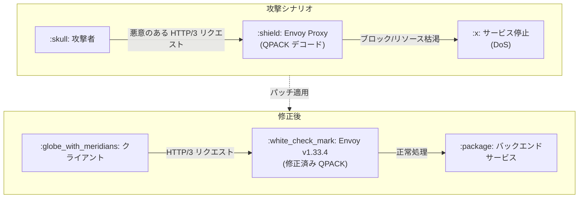

# Cloud Service Mesh: セキュリティパッチ GCP-2026-045 (QPACK デコード DoS 脆弱性修正)

**リリース日**: 2026-06-29

**サービス**: Cloud Service Mesh

**機能**: セキュリティパッチリリース 1.29.5-asm.5

**ステータス**: セキュリティパッチ (重大度: High)

:bar_chart: [このアップデートのインフォグラフィックを見る](https://takech9203.github.io/google-cloud-news-summary/20260629-cloud-service-mesh-security-gcp-2026-045.html)

## 概要

Cloud Service Mesh 1.29.5-asm.5 がインクラスター Cloud Service Mesh 向けにリリースされました。このパッチリリースは、セキュリティ脆弱性 GCP-2026-045 (GHSA-p7c7-7c47-pwch) の修正を含んでいます。

この脆弱性は、Envoy Proxy における QPACK デコードのブロックにより、HTTP/3 スタックに対する Denial-of-Service (DoS) 攻撃が可能となるものです。攻撃者が悪意のある HTTP/3 リクエストを送信することで、Envoy プロキシのリソースを枯渇させ、サービスの可用性に影響を与える可能性があります。

本パッチは Envoy v1.33.4 を使用しており、すべてのインクラスター Cloud Service Mesh バージョンが影響を受けます。ただし、Managed Cloud Service Mesh はこの脆弱性の影響を受けません。

**アップデート前の課題**

- すべてのインクラスター Cloud Service Mesh バージョンで QPACK デコードのブロックによる DoS 攻撃に対して脆弱であった
- HTTP/3 スタックが悪意のあるリクエストによりサービス停止する可能性があった
- 攻撃者が特別に細工したリクエストでプロキシのリソースを枯渇させることが可能であった

**アップデート後の改善**

- QPACK デコードの脆弱性が修正され、HTTP/3 スタックへの DoS 攻撃が防止された
- Envoy v1.33.4 により、脆弱性のあるコードパスが修正された
- パッチ適用後はセキュリティリスクなく HTTP/3 通信を継続可能

## アーキテクチャ図



上図は、パッチ適用前の DoS 攻撃シナリオと、パッチ適用後の正常なリクエスト処理フローを示しています。

## サービスアップデートの詳細

### 主要機能

1. **QPACK デコード DoS 脆弱性の修正**
   - QPACK (HTTP/3 のヘッダー圧縮プロトコル) のデコード処理におけるブロッキング問題を修正
   - HTTP/3 スタック全体の耐障害性を向上
   - Envoy Proxy のリソース管理を改善

2. **パッチ対象バージョン**
   - Cloud Service Mesh 1.29.5-asm.5 (Envoy v1.33.4)
   - Cloud Service Mesh 1.28.9-asm.4
   - Cloud Service Mesh 1.27.9-asm.9

3. **影響範囲**
   - すべてのインクラスター Cloud Service Mesh バージョンが影響を受ける
   - Managed Cloud Service Mesh は影響を受けない
   - Cloud Service Mesh v1.26 以前はサポート終了のため、バックポートなし

## 技術仕様

### 脆弱性情報

| 項目 | 詳細 |
|------|------|
| セキュリティ情報 ID | GCP-2026-045 |
| 重大度 | High |
| 関連アドバイザリ | GHSA-p7c7-7c47-pwch |
| 影響を受けるプロトコル | HTTP/3 (QUIC) |
| 脆弱性の種類 | Denial-of-Service (DoS) |
| 攻撃ベクトル | ネットワーク経由 (QPACK デコードのブロック) |
| Envoy バージョン (修正済み) | v1.33.4 |

### パッチ対象バージョン一覧

| Cloud Service Mesh バージョン | パッチバージョン | 対応状況 |
|------|------|------|
| 1.29.x | 1.29.5-asm.5 | 修正済み |
| 1.28.x | 1.28.9-asm.4 | 修正済み |
| 1.27.x | 1.27.9-asm.9 | 修正済み |
| 1.26 以前 | - | サポート終了 (バックポートなし) |
| Managed Cloud Service Mesh | - | 影響なし |

## 設定方法

### 前提条件

1. インクラスター Cloud Service Mesh を使用していること
2. GKE クラスターへのアクセス権限があること
3. `asmcli` ツールがインストールされていること

### 手順

#### ステップ 1: 現在のバージョンを確認

```bash
# インストールされている Cloud Service Mesh のバージョンを確認
kubectl get pods -n istio-system -o jsonpath='{.items[*].spec.containers[*].image}' | tr ' ' '\n' | sort -u
```

#### ステップ 2: asmcli を使用してアップグレード

```bash
# asmcli install でアップグレードを実行
./asmcli install \
  --project_id PROJECT_ID \
  --cluster_name CLUSTER_NAME \
  --cluster_location CLUSTER_LOCATION \
  --output_dir OUTPUT_DIR \
  --enable_all
```

アップグレード後、サイドカーの再注入のためにワークロードを再デプロイする必要があります。

#### ステップ 3: ワークロードの再デプロイ

```bash
# 名前空間内のすべてのデプロイメントをローリング再起動
kubectl rollout restart deployment -n YOUR_NAMESPACE
```

## メリット

### ビジネス面

- **サービス可用性の確保**: DoS 攻撃リスクを排除し、サービスの安定稼働を維持
- **コンプライアンス対応**: 既知の脆弱性に対する迅速なパッチ適用によりセキュリティポリシーを遵守

### 技術面

- **HTTP/3 スタックの堅牢化**: QPACK デコード処理の脆弱性を根本的に修正
- **最新 Envoy の適用**: Envoy v1.33.4 による安定性とセキュリティの向上

## デメリット・制約事項

### 制限事項

- Cloud Service Mesh v1.26 以前のバージョンにはバックポートされない (サポート終了のため)
- インクラスター環境のみが対象 (Managed Cloud Service Mesh は元々影響なし)
- アップグレード後にワークロードの再デプロイが必要

### 考慮すべき点

- アップグレード中は一時的にサービスに影響が出る可能性があるため、メンテナンスウィンドウでの実施を推奨
- マルチクラスター構成の場合、すべてのクラスターでアップグレードが必要
- v1.26 以前を使用している場合は、まず v1.27 以降へのメジャーアップグレードが必要

## ユースケース

### ユースケース 1: HTTP/3 を有効化したサービスメッシュ環境

**シナリオ**: HTTP/3 (QUIC) を使用してクライアントとサービス間の通信を高速化している環境で、外部からの攻撃リスクを軽減する必要がある。

**効果**: パッチ適用により、HTTP/3 通信を安全に継続でき、DoS 攻撃によるサービス停止リスクを排除できる。

### ユースケース 2: セキュリティコンプライアンスが求められる環境

**シナリオ**: 金融機関や医療機関など、セキュリティコンプライアンスが厳しく求められる環境で、既知の脆弱性に対する迅速なパッチ適用が義務付けられている。

**効果**: High 重大度の脆弱性に対する公式パッチを適用することで、監査要件を満たし、セキュリティリスクを最小化できる。

## 関連サービス・機能

- **GKE (Google Kubernetes Engine)**: Cloud Service Mesh のインフラストラクチャ基盤。アップグレードは GKE クラスター上で実行される
- **Envoy Proxy**: Cloud Service Mesh のデータプレーンとして使用されるプロキシ。今回の脆弱性は Envoy の QPACK デコード処理に起因
- **Cloud Monitoring**: メッシュのトラフィック異常やエラーレートの監視に活用可能
- **Cloud Armor**: HTTP/3 レイヤーの追加的な DDoS 防御として併用可能

## 参考リンク

- :bar_chart: [インフォグラフィック](https://takech9203.github.io/google-cloud-news-summary/20260629-cloud-service-mesh-security-gcp-2026-045.html)
- [公式リリースノート](https://docs.cloud.google.com/release-notes#June_29_2026)
- [Cloud Service Mesh セキュリティ情報](https://docs.cloud.google.com/service-mesh/docs/security-bulletins#gcp-2026-045)
- [Google Cloud セキュリティ情報](https://docs.cloud.google.com/support/bulletins#gcp-2026-045)
- [GHSA-p7c7-7c47-pwch (Envoy セキュリティアドバイザリ)](https://github.com/envoyproxy/envoy/security/advisories/GHSA-p7c7-7c47-pwch)
- [Cloud Service Mesh アップグレードガイド](https://docs.cloud.google.com/service-mesh/docs/upgrade/upgrade)

## まとめ

GCP-2026-045 は、Envoy Proxy の QPACK デコード処理における DoS 脆弱性を修正する重要なセキュリティパッチです。インクラスター Cloud Service Mesh を使用しているすべての環境で、速やかに 1.29.5-asm.5、1.28.9-asm.4、または 1.27.9-asm.9 へのアップグレードを実施することを強く推奨します。Managed Cloud Service Mesh を使用している場合は対応不要です。

---

**タグ**: #CloudServiceMesh #Security #GCP-2026-045 #Envoy #HTTP3 #QPACK #DoS #PatchRelease
