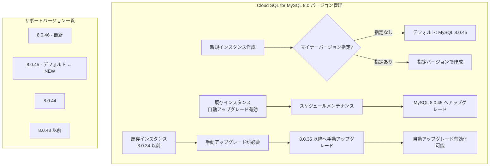

# Cloud SQL for MySQL: MySQL 8.0.45 がデフォルトマイナーバージョンに変更

**リリース日**: 2026-06-29

**サービス**: Cloud SQL for MySQL

**機能**: MySQL 8.0.45 デフォルトマイナーバージョン変更

**ステータス**: GA (一般提供)

📊 [このアップデートのインフォグラフィックを見る](https://takech9203.github.io/google-cloud-news-summary/20260629-cloud-sql-mysql-8-0-45-default.html)

## 概要

Cloud SQL for MySQL 8.0 において、MySQL 8.0.45 がデフォルトのマイナーバージョンとして設定されました。これにより、新規に Cloud SQL for MySQL 8.0 インスタンスを作成する際、マイナーバージョンを指定しない場合は MySQL 8.0.45 がプロビジョニングされます。

Cloud SQL for MySQL 8.0 のデフォルトマイナーバージョンは「最新のマイナーバージョンの1つ前」のバージョンに設定されるポリシーに基づいています。現在、Cloud SQL がサポートする MySQL 8.0 の最新マイナーバージョンは 8.0.46 であるため、8.0.45 がデフォルトとして選択されています。

自動マイナーバージョンアップグレードが有効化されているインスタンスは、次回のスケジュールされたメンテナンスウィンドウで自動的にこのデフォルトバージョン (8.0.45) にアップグレードされます。これにより、最新のセキュリティパッチやバグ修正が自動的に適用されます。

**アップデート前の課題**

- 以前のデフォルトマイナーバージョン (8.0.44 以前) では、MySQL 8.0.45 で提供されるセキュリティパッチやバグ修正が適用されていなかった
- 新規インスタンス作成時に最新に近いバージョンを利用するには、明示的にマイナーバージョンを指定する必要があった
- 自動マイナーバージョンアップグレード対象のインスタンスも、以前のデフォルトバージョンまでしかアップグレードされなかった

**アップデート後の改善**

- 新規インスタンスはバージョン指定なしで MySQL 8.0.45 が自動的にプロビジョニングされる
- 自動マイナーバージョンアップグレードが有効なインスタンスは、次回メンテナンス時に 8.0.45 へ自動アップグレードされる
- MySQL 8.0.45 に含まれるセキュリティ修正やバグ修正が広く適用される

## アーキテクチャ図



この図は、Cloud SQL for MySQL 8.0 のバージョン管理の仕組みを示しています。新規インスタンスのデフォルトバージョンと、既存インスタンスの自動/手動アップグレードのフローを表現しています。

## サービスアップデートの詳細

### 主要機能

1. **デフォルトマイナーバージョンの更新**
   - MySQL 8.0.45 が Cloud SQL for MySQL 8.0 の新しいデフォルトマイナーバージョンに設定
   - デフォルトバージョンは最新版 (8.0.46) の1つ前のバージョンとして選択されるポリシーに基づく

2. **自動マイナーバージョンアップグレード**
   - 自動マイナーバージョンアップグレードが有効なインスタンスは、次回のスケジュールメンテナンス時に 8.0.45 へアップグレード
   - アップグレードはスケジュールされたメンテナンスイベント時のみ実行され、セルフサービスメンテナンスでは実行されない
   - Cloud SQL Enterprise Plus エディションではほぼゼロダウンタイムでアップグレードが完了

3. **新規インスタンスのプロビジョニング**
   - マイナーバージョンを指定せずに MySQL 8.0 インスタンスを作成すると、8.0.45 でプロビジョニングされる
   - マイナーバージョン未指定で作成されたインスタンスは、デフォルトで自動マイナーバージョンアップグレードが有効

## 技術仕様

### Cloud SQL for MySQL 8.0 サポートバージョン一覧

| バージョン | ステータス | 備考 |
|------|------|------|
| MySQL 8.0.46 | 最新サポートバージョン | 手動指定で利用可能 |
| MySQL 8.0.45 | デフォルト (今回変更) | 新規インスタンスのデフォルト |
| MySQL 8.0.44 | サポート中 | - |
| MySQL 8.0.43 | サポート中 | - |
| MySQL 8.0.42 | サポート中 | - |
| MySQL 8.0.41 | サポート中 | - |
| MySQL 8.0.40 | サポート中 | - |
| MySQL 8.0.39 | サポート中 | - |
| MySQL 8.0.37 | サポート中 | - |
| MySQL 8.0.36 | サポート中 | - |
| MySQL 8.0.35 | サポート中 | 自動アップグレード有効化の最低要件 |
| MySQL 8.0.34 以前 | サポート中 | 手動アップグレードのみ |

### MySQL 8.0 のサポートライフサイクル

| 項目 | 詳細 |
|------|------|
| 通常サポート開始日 | 2020年8月30日 |
| 延長サポート開始日 | 2027年1月1日 |
| 廃止日 | 2029年7月1日 |
| 推奨メジャーバージョン | MySQL 8.4 (Cloud SQL デフォルトメジャーバージョン) |

### 自動アップグレードの有効化確認

```bash
# インスタンスの自動アップグレード状態を確認
gcloud sql instances describe INSTANCE_NAME \
  --project=PROJECT_ID

# 出力で以下を確認:
# - databaseVersion: MYSQL_8_0
# - databaseInstalledVersion: 現在のマイナーバージョン
```

## 設定方法

### 前提条件

1. Google Cloud プロジェクトが作成済みであること
2. Cloud SQL Admin API が有効化されていること
3. 適切な IAM 権限 (roles/cloudsql.admin) を持つアカウントでログインしていること

### 手順

#### ステップ 1: 新規インスタンスをデフォルトバージョン (8.0.45) で作成

```bash
# マイナーバージョンを指定せずに作成 (8.0.45 がプロビジョニングされる)
gcloud sql instances create my-instance \
  --database-version=MYSQL_8_0 \
  --tier=db-n1-standard-2 \
  --region=asia-northeast1
```

マイナーバージョンを指定しない場合、デフォルトの 8.0.45 でインスタンスが作成されます。

#### ステップ 2: 既存インスタンスの自動アップグレードを有効化

```bash
# 既存インスタンス (8.0.35 以降) で自動アップグレードを有効化
gcloud sql instances patch INSTANCE_NAME \
  --database-version=MYSQL_8_0
```

Google Cloud コンソールからも設定可能です: Cloud SQL Instances ページ > インスタンス選択 > 編集 > 「Enable automatic minor version upgrades」を選択 > 保存。

#### ステップ 3: アップグレード可能なバージョンの確認

```bash
# 利用可能なアップグレード先バージョンを確認
gcloud sql instances describe INSTANCE_NAME

# upgradableDatabaseVersions セクションで確認
```

## メリット

### ビジネス面

- **セキュリティリスクの軽減**: 最新のセキュリティパッチが自動的に適用されることで、データベースの脆弱性リスクを低減
- **運用負荷の削減**: 自動アップグレードにより、DBA チームの手動作業が不要になる

### 技術面

- **バグ修正の適用**: MySQL 8.0.45 に含まれるバグ修正やパフォーマンス改善が自動的に適用される
- **ほぼゼロダウンタイム**: Cloud SQL Enterprise Plus エディションでは、マイナーバージョンアップグレード時のダウンタイムがほぼゼロ
- **一貫性のあるバージョン管理**: フリート全体で統一されたバージョンが維持される

## デメリット・制約事項

### 制限事項

- MySQL 8.0 はダウングレードをサポートしていないため、アップグレード後に以前のバージョンに戻すことはできない
- 自動マイナーバージョンアップグレードを一度有効化すると、無効化することはできない
- 8.0.34 以前のインスタンスは手動で 8.0.35 以降にアップグレードしてからでないと、自動アップグレードを有効化できない

### 考慮すべき点

- アップグレード前にステージング環境でワークロードテストを実施することを推奨
- マイナーバージョンアップグレード中は、ディスクサイズやメモリの同時変更はできない
- アップグレードはスケジュールされたメンテナンスウィンドウでのみ実行されるため、メンテナンスウィンドウの設定を確認すること

## ユースケース

### ユースケース 1: 本番環境のセキュリティ強化

**シナリオ**: 金融機関が Cloud SQL for MySQL 8.0 を本番環境で使用しており、セキュリティパッチの適用を自動化したい。

**実装例**:
```bash
# 自動アップグレードが有効なインスタンスの確認
gcloud sql instances describe production-db --project=my-project

# メンテナンスウィンドウを営業時間外に設定
gcloud sql instances patch production-db \
  --maintenance-window-day=SUN \
  --maintenance-window-hour=2
```

**効果**: 次回のメンテナンスウィンドウで自動的に MySQL 8.0.45 にアップグレードされ、最新のセキュリティパッチが適用される。

### ユースケース 2: 新規プロジェクトでの最新バージョン利用

**シナリオ**: 新規 Web アプリケーションの開発で、Cloud SQL for MySQL 8.0 を使用する。最新に近い安定バージョンをデフォルトで利用したい。

**実装例**:
```bash
# バージョン指定なしで作成 - 自動的に 8.0.45 が選択される
gcloud sql instances create webapp-db \
  --database-version=MYSQL_8_0 \
  --tier=db-custom-4-16384 \
  --region=asia-northeast1 \
  --availability-type=REGIONAL
```

**効果**: 追加設定なしで MySQL 8.0.45 がプロビジョニングされ、今後の自動アップグレードも有効な状態でインスタンスが作成される。

## 料金

デフォルトマイナーバージョンの変更自体に追加料金は発生しません。Cloud SQL for MySQL の料金は通常通り適用されます。

### 料金例

| エディション | コンピュート (vCPU/時間) | メモリ (GB/時間) | ストレージ SSD (GB/月) |
|--------|-----------------|-----------------|-----------------|
| Cloud SQL Enterprise | $0.0413 から | $0.007 から | $0.17 |
| Cloud SQL Enterprise Plus | $0.05369 から | $0.0091 から | $0.17 (SSD) / $0.16 (Local SSD) |

注: MySQL 8.0 は 2027年1月1日から延長サポートに移行します。延長サポート期間中は追加料金が発生する可能性があります。メジャーバージョン MySQL 8.4 への移行を計画的に検討することを推奨します。

## 利用可能リージョン

Cloud SQL for MySQL は全ての Cloud SQL 対応リージョンで MySQL 8.0.45 をデフォルトバージョンとして利用可能です。リージョン固有の制限はありません。

## 関連サービス・機能

- **Cloud SQL for MySQL 8.4**: Cloud SQL の新しいデフォルトメジャーバージョン。新規プロジェクトでは MySQL 8.4 の採用を推奨
- **Cloud SQL Enterprise Plus エディション**: ほぼゼロダウンタイムでのマイナーバージョンアップグレードをサポート
- **Database Migration Service (DMS)**: メジャーバージョンアップグレードやオンプレミスからの移行に対応
- **Cloud SQL メンテナンスウィンドウ**: アップグレードのタイミングを制御するための設定

## 参考リンク

- 📊 [インフォグラフィック](https://takech9203.github.io/google-cloud-news-summary/20260629-cloud-sql-mysql-8-0-45-default.html)
- [公式リリースノート](https://docs.cloud.google.com/release-notes#June_29_2026)
- [データベースバージョンサポートポリシー](https://docs.cloud.google.com/sql/docs/mysql/db-versions#database-version-support)
- [MySQL 8.0 バージョン情報](https://docs.cloud.google.com/sql/docs/mysql/db-versions#mysql-8.0)
- [マイナーバージョンアップグレード手順](https://docs.cloud.google.com/sql/docs/mysql/upgrade-minor-db-version)
- [Cloud SQL 料金ページ](https://cloud.google.com/sql/pricing)

## まとめ

Cloud SQL for MySQL 8.0 のデフォルトマイナーバージョンが 8.0.45 に更新されました。自動マイナーバージョンアップグレードが有効なインスタンスは次回のメンテナンスウィンドウで自動的にアップグレードされます。MySQL 8.0 は 2027年1月に延長サポートに移行するため、中長期的には MySQL 8.4 へのメジャーバージョンアップグレードを計画することを推奨します。

---

**タグ**: #CloudSQL #MySQL #DatabaseManagement #MinorVersionUpgrade #SecurityPatch
