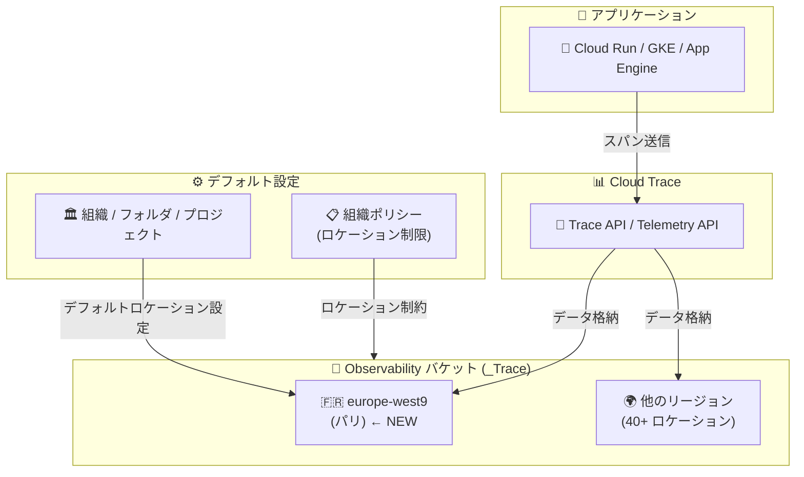

# Cloud Trace: Observability バケットの europe-west9 (パリ) リージョン対応

**リリース日**: 2026-06-29

**サービス**: Cloud Trace

**機能**: Observability バケットのリージョン拡張 (europe-west9)

**ステータス**: Feature

📊 [このアップデートのインフォグラフィックを見る](https://takech9203.github.io/google-cloud-news-summary/20260629-cloud-trace-observability-buckets-europe-west9.html)

## 概要

Google Cloud Observability が、トレースデータを格納する Observability バケットのサポートロケーションとして europe-west9 (パリ、フランス) を追加した。これにより、フランスおよび EU 圏内でのデータレジデンシー要件を持つ顧客が、トレースデータをフランス国内に保持できるようになった。

Observability バケットはリージョナルリソースであり、Cloud Trace が生成するトレースデータの格納に使用される。今回の拡張により、フランスのデータ保護規制 (CNIL) や GDPR に準拠したトレースデータの地理的管理が可能になり、特に金融、医療、公共セクターの組織にとって重要な機能追加となる。

**アップデート前の課題**

- europe-west9 (パリ) リージョンでトレースデータを格納する Observability バケットを作成できなかった
- フランス国内でのデータレジデンシー要件を満たすために、トレースデータの保存先として他のヨーロッパリージョン (ベルギー、フランクフルト等) やマルチリージョン (eu) を選択する必要があった
- フランスの規制要件を厳密に遵守する必要がある組織では、トレースデータの国外保存が法的リスクとなる可能性があった

**アップデート後の改善**

- europe-west9 (パリ) で Observability バケットを作成し、トレースデータをフランス国内に保持可能になった
- フランスのデータ保護規制に準拠したトレースデータ管理が実現できるようになった
- 組織ポリシーと組み合わせることで、新規プロジェクトのトレースデータを自動的にパリリージョンに格納するよう強制できるようになった

## アーキテクチャ図



Cloud Trace のトレースデータが Observability バケットに格納される流れを示している。組織ポリシーやデフォルト設定により、新規バケットの作成先を europe-west9 に限定することが可能。

## サービスアップデートの詳細

### 主要機能

1. **europe-west9 リージョンでの Observability バケット作成**
   - トレースデータをパリリージョンに格納可能
   - `_Trace` という名前のバケットが自動作成される
   - バケット上に `Spans` データセットと `_AllSpans` ビューが自動構成される

2. **デフォルトストレージロケーション設定**
   - 組織、フォルダ、プロジェクト単位で europe-west9 をデフォルトロケーションに指定可能
   - リソース階層で設定が継承される (子リソースは親の設定を自動継承)
   - 個別に設定を上書きすることも可能

3. **CMEK (顧客管理暗号鍵) との組み合わせ**
   - europe-west9 に格納するトレースデータを CMEK で暗号化可能
   - Cloud KMS キーを europe-west9 リージョンに配置して利用
   - 2026年6月1日以降、バケット作成時に組織ポリシーの CMEK 制約が強制される

## 技術仕様

### 対応リージョン (ヨーロッパ)

| リージョン名 | ロケーション |
|------|------|
| europe-central2 | ワルシャワ |
| europe-north1 | フィンランド |
| europe-north2 | ストックホルム |
| europe-southwest1 | マドリード |
| europe-west1 | ベルギー |
| europe-west2 | ロンドン |
| europe-west3 | フランクフルト |
| europe-west4 | オランダ |
| europe-west6 | チューリッヒ |
| europe-west8 | ミラノ |
| europe-west9 | パリ (今回追加) |
| europe-west10 | ベルリン |
| europe-west12 | トリノ |

### データストレージモデル

| 項目 | 詳細 |
|------|------|
| バケット名 | `_Trace` |
| データセット名 | `Spans` |
| ビュー名 | `_AllSpans` |
| リソースタイプ | リージョナル (ゾーン間冗長) |
| 暗号化 | Google マネージド鍵 または CMEK |
| 組織ポリシー適用 | 2026年6月1日以降、ロケーション制限・CMEK 要件が強制 |

## 設定方法

### 前提条件

1. gcloud CLI バージョン 563.0.0 以降がインストールされていること
2. `roles/observability.admin` (設定変更の場合) または `roles/observability.viewer` (設定確認の場合) IAM ロールが付与されていること
3. CMEK を使用する場合、europe-west9 に Cloud KMS キーリングとキーが作成済みであること

### 手順

#### ステップ 1: デフォルトストレージロケーションを europe-west9 に設定

```bash
gcloud beta observability settings update \
  --default-storage-location=europe-west9 \
  --update-mask=default-storage-location \
  --location=global \
  --project=PROJECT_ID
```

この設定により、指定したプロジェクト内の新規 Observability バケットが europe-west9 に作成される。

#### ステップ 2: 設定の確認

```bash
gcloud beta observability settings describe \
  --location=global \
  --project=PROJECT_ID
```

レスポンスの `defaultStorageLocation` フィールドが `europe-west9` であることを確認する。

#### ステップ 3: (オプション) CMEK の設定

```bash
# サービスアカウントに KMS キーへのアクセス権を付与
gcloud kms keys add-iam-policy-binding KMS_KEY_NAME \
  --project=KMS_PROJECT_ID \
  --member=serviceAccount:SERVICE_ACCT_NAME@gcp-sa-observability.iam.gserviceaccount.com \
  --role=roles/cloudkms.cryptoKeyEncrypterDecrypter \
  --location=europe-west9 \
  --keyring=KMS_KEY_RING

# デフォルト KMS キーを設定
gcloud beta observability settings update \
  --kms-key-name=projects/PROJECT_ID/locations/europe-west9/keyRings/KEY_RING/cryptoKeys/KEY_NAME \
  --update-mask=kms-key-name \
  --location=europe-west9 \
  --project=PROJECT_ID
```

## メリット

### ビジネス面

- **フランス規制対応**: CNIL (フランスデータ保護機関) の要件やフランス国内のデータ主権規制に準拠したトレースデータ管理が可能
- **EU コンプライアンス強化**: GDPR のデータローカリゼーション要件に加え、フランス固有の規制にも対応
- **公共セクター要件対応**: フランスの政府・公共機関が求めるデータレジデンシー要件を満たすことが可能

### 技術面

- **低レイテンシ**: フランスおよび西ヨーロッパのワークロードからのトレースデータ書き込みレイテンシが低減
- **組織ポリシーとの統合**: `constraints/gcp.resourceLocations` 制約と組み合わせて、europe-west9 へのデータ配置を強制可能
- **CMEK サポート**: europe-west9 の Cloud KMS キーを使用した顧客管理暗号化に対応

## デメリット・制約事項

### 制限事項

- Observability バケットのロケーションは作成後に変更できない (既存バケットの移行は不可)
- Gemini Cloud Assist などグローバルロケーションにクエリ結果を保存するサービスを有効にすると、データレジデンシー保証が損なわれる可能性がある
- CMEK を使用する場合、デフォルトストレージロケーションの設定が必須

### 考慮すべき点

- eu マルチリージョンとは異なり、europe-west9 はリージョナルリソースであるためゾーン間冗長は提供されるが、リージョン間冗長は提供されない
- 組織ポリシーによるロケーション制限を設定する場合、CMEK のデフォルト設定も合わせて構成する必要がある (2026年6月1日以降)
- Cloud Run functions、Cloud Run、App Engine からのスパンは、Observability バケットが存在する場合のみ格納される

## ユースケース

### ユースケース 1: フランスの金融機関のトレース監視

**シナリオ**: フランスの金融機関が、顧客取引に関連するマイクロサービスのパフォーマンスを Cloud Trace で監視しており、金融規制 (ACPR) によりトレースデータのフランス国内保存が求められている。

**実装例**:
```bash
# 組織レベルでデフォルトロケーションを設定
gcloud beta observability settings update \
  --default-storage-location=europe-west9 \
  --update-mask=default-storage-location \
  --location=global \
  --organization=ORG_ID

# 組織ポリシーでロケーションを制限
gcloud resource-manager org-policies allow \
  --organization=ORG_ID \
  constraints/gcp.resourceLocations \
  in:europe-west9-locations
```

**効果**: 組織配下の全プロジェクトで、トレースデータが自動的にパリリージョンに格納され、規制要件への準拠を組織的に保証できる。

### ユースケース 2: フランスの医療機関の分散トレーシング

**シナリオ**: フランスの医療機関が、患者情報を扱うアプリケーションの分散トレーシングを Cloud Trace で実施しており、HDS (Health Data Hosting) 認証要件に基づきデータのフランス国内保存が必要。

**効果**: europe-west9 に Observability バケットを配置し CMEK で暗号化することで、医療データ保護要件に準拠しながら分散トレーシングによるパフォーマンス分析が可能になる。

## 料金

Cloud Trace の料金はスパンの取り込み量に基づく。Observability バケットのロケーション選択による追加料金は発生しない。

### 料金例

| 項目 | 料金 | 無料枠 |
|--------|-----------------|---------|
| Trace インジェスト | $0.20 / 100万スパン | 月間 250万スパン/プロジェクト |

詳細は [Cloud Trace 料金ページ](https://cloud.google.com/products/observability#pricing) を参照。

## 利用可能リージョン

Observability バケットは以下のロケーションカテゴリで利用可能:

- **マルチリージョン**: eu, us
- **アフリカ**: africa-south1
- **アメリカ**: northamerica-northeast1, northamerica-northeast2, northamerica-south1, southamerica-east1, southamerica-west1, us-central1, us-east1, us-east4, us-east5, us-south1, us-west1, us-west2, us-west3, us-west4
- **アジア太平洋**: asia-east1, asia-east2, asia-northeast1, asia-northeast2, asia-northeast3, asia-south1, asia-south2, asia-southeast1, asia-southeast2, asia-southeast3, australia-southeast1, australia-southeast2
- **ヨーロッパ**: europe-central2, europe-north1, europe-north2, europe-southwest1, europe-west1, europe-west2, europe-west3, europe-west4, europe-west6, europe-west8, **europe-west9 (今回追加)**, europe-west10, europe-west12
- **中東**: me-central1, me-central2, me-west1

## 関連サービス・機能

- **Cloud Logging**: ログデータの regionalization に同様の仕組みを提供。ログバケットのリージョン設定と連携して統合的なデータレジデンシー管理が可能
- **Cloud Monitoring**: メトリクスデータのリージョナルストレージ。Observability スイート全体でのデータレジデンシー管理に関連
- **Cloud KMS**: CMEK による暗号化に使用。europe-west9 のキーリングとキーを作成し、Observability バケットのデータを顧客管理鍵で暗号化
- **Telemetry API**: トレースデータの取り込み API。europe-west9 へのリージョナルエンドポイントでのデータ送信に対応
- **組織ポリシーサービス**: `constraints/gcp.resourceLocations` を使用して Observability バケットのロケーションを制限

## 参考リンク

- 📊 [インフォグラフィック](https://takech9203.github.io/google-cloud-news-summary/20260629-cloud-trace-observability-buckets-europe-west9.html)
- [公式リリースノート](https://docs.cloud.google.com/release-notes#June_29_2026)
- [Observability バケットのロケーション一覧](https://docs.cloud.google.com/stackdriver/docs/observability/observability-bucket-locations)
- [Observability バケットのデフォルト設定](https://docs.cloud.google.com/stackdriver/docs/observability/set-defaults-for-observability-buckets)
- [Cloud Trace ストレージ概要](https://docs.cloud.google.com/trace/docs/storage-overview)
- [Cloud Trace 料金](https://cloud.google.com/products/observability#pricing)

## まとめ

今回のアップデートにより、Cloud Trace の Observability バケットが europe-west9 (パリ) リージョンに対応し、フランス国内でのトレースデータ保存が可能になった。フランスの金融規制、医療データ保護、公共セクターのデータレジデンシー要件を持つ組織は、組織ポリシーとデフォルトストレージロケーション設定を組み合わせることで、トレースデータのパリリージョンへの配置を組織的に保証できる。デフォルトストレージロケーションの設定や CMEK の構成を含め、早期に対応することを推奨する。

---

**タグ**: #CloudTrace #Observability #DataResidency #europe-west9 #GDPR #リージョン拡張 #コンプライアンス
