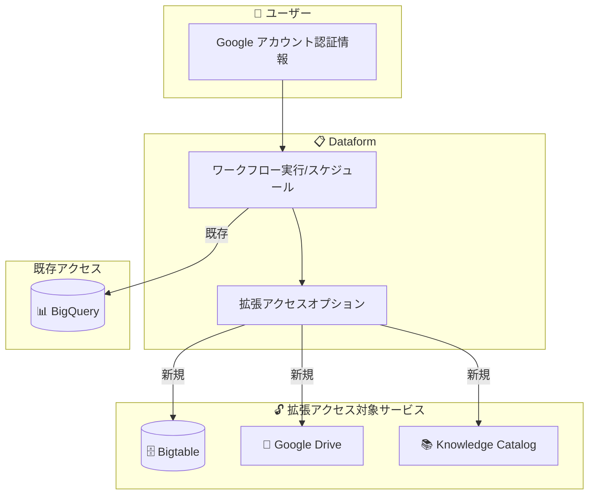

# Dataform: ワークフローの拡張アクセス (Extended Access for Workflows)

**リリース日**: 2026-06-29

**サービス**: Dataform

**機能**: Extended access for workflows

**ステータス**: Preview

📊 [このアップデートのインフォグラフィックを見る](https://takech9203.github.io/google-cloud-news-summary/20260629-dataform-extended-access-workflows.html)

## 概要

Dataform ワークフローに対して、Google アカウントのユーザー認証情報を使用してワークフローを実行またはスケジュールする際に、Bigtable、Google Drive、Knowledge Catalog へのアクセスを付与できるようになりました。この「拡張アクセス (Extended Access)」オプションにより、Dataform ワークフローが BigQuery 以外のデータソースやメタデータサービスと連携できる範囲が大幅に拡大されます。

これまで Dataform ワークフローは主に BigQuery との連携に焦点を当てており、他の Google Cloud サービスやデータソースへのアクセスは制限されていました。今回の Preview リリースにより、ユーザーは自身の Google アカウント認証情報を活用して、Bigtable のデータ読み取り、Google Drive 上のスプレッドシートやファイルへのアクセス、Knowledge Catalog (旧 Dataplex Universal Catalog) のメタデータ管理といった操作をワークフロー内から直接行えるようになります。

この機能は、データパイプラインの構築において複数のデータソースを統合する必要があるデータエンジニアやデータアナリストを主な対象としています。特に、BigQuery を中心としたデータウェアハウス環境で Bigtable の運用データや Drive 上の非構造化データを組み合わせた分析パイプラインを構築する場合に有用です。

**アップデート前の課題**

- Dataform ワークフローから Bigtable、Google Drive、Knowledge Catalog へ直接アクセスする手段がなかった
- BigQuery 以外のデータソースとの連携には、別途 ETL パイプラインやカスタムスクリプトを構築する必要があった
- ワークフローのアクセス範囲が BigQuery 関連のリソースに限定されていた

**アップデート後の改善**

- Google アカウントのユーザー認証情報を使用して、ワークフローから Bigtable へのアクセスが可能になった
- Google Drive 上のファイルやスプレッドシートへのアクセスをワークフローに付与できるようになった
- Knowledge Catalog のメタデータにワークフローからアクセスし、データガバナンスとの統合が実現可能になった

## アーキテクチャ図

Dataform ワークフローが Google アカウント認証情報を通じて、従来の BigQuery に加え、Bigtable、Google Drive、Knowledge Catalog への拡張アクセスを取得するフローを示しています。

## サービスアップデートの詳細

### 主要機能

1. **Bigtable アクセスの付与**
   - ワークフロー実行時に Bigtable インスタンスおよびテーブルへの読み取り/書き込みアクセスを付与可能
   - BigQuery と Bigtable のデータを統合したパイプライン構築が容易に

2. **Google Drive アクセスの付与**
   - Google Drive 上のスプレッドシートやファイルへのアクセスをワークフローに付与
   - Drive 上の非構造化データやスプレッドシートを BigQuery パイプラインに統合可能

3. **Knowledge Catalog アクセスの付与**
   - Knowledge Catalog (旧 Dataplex Universal Catalog) のメタデータへのアクセスを付与
   - データカタログのメタデータをワークフロー内で活用し、データガバナンスとの統合を実現

### 認証方式

- この拡張アクセスは **Google アカウントのユーザー認証情報** を使用する場合にのみ利用可能
- ワークフローの実行時またはスケジュール設定時に拡張アクセスオプションを指定

## 技術仕様

### 認証と権限

| 項目 | 詳細 |
|------|------|
| 認証方式 | Google アカウントユーザー認証情報 (Preview) |
| 対象操作 | ワークフローの実行およびスケジュール |
| 拡張アクセス対象 | Bigtable、Google Drive、Knowledge Catalog |
| ステータス | Preview |

### 前提条件

- Strict act-as モードが全リポジトリで適用されている環境
- Google アカウントのユーザー認証情報による認証が有効であること
- 各サービスに対する適切な IAM ロールがユーザーに付与されていること

## 設定方法

### 前提条件

1. Dataform リポジトリが作成済みであること
2. ワークフロー構成で Google アカウントユーザー認証情報を使用する設定がされていること
3. 拡張アクセス対象サービス (Bigtable、Drive、Knowledge Catalog) に対する IAM 権限がユーザーアカウントに付与されていること

### 手順

#### ステップ 1: ワークフロー構成の作成/編集

1. Google Cloud コンソールで Dataform ページに移動
2. 対象のリポジトリを選択
3. **Releases & Scheduling** に移動
4. ワークフロー構成を作成または編集

#### ステップ 2: 認証方式の選択

1. Authentication セクションで **Execute with my user credentials** を選択
2. 拡張アクセスオプションで、アクセスを付与するサービスを選択:
   - Bigtable
   - Google Drive
   - Knowledge Catalog

#### ステップ 3: Google アカウントの承認

1. OAuth ダイアログで BigQuery Pipelines がアクセストークンを取得する権限を承認
2. 承認は一度のみ必要

## メリット

### ビジネス面

- **データ統合の簡素化**: 複数のデータソースを単一の Dataform ワークフロー内で統合でき、パイプライン構築のコストと時間を削減
- **データガバナンスの強化**: Knowledge Catalog との統合により、メタデータ管理とデータ品質管理をワークフローに組み込み可能

### 技術面

- **アーキテクチャの簡素化**: Bigtable や Drive のデータを取り込むための追加 ETL ツールが不要に
- **ユーザーコンテキストの活用**: Google アカウント認証情報を使用するため、ユーザー固有のアクセス権限がそのまま適用され、最小権限の原則を維持

## デメリット・制約事項

### 制限事項

- Preview ステータスのため、本番環境での利用は推奨されない (Pre-GA Offerings Terms が適用)
- Google アカウントのユーザー認証情報を使用する場合、スケジュール付きのリリース構成を参照するワークフロー構成には設定できない
- カスタムサービスアカウントではなく、ユーザー認証情報のみで拡張アクセスが利用可能
- Context-Aware Access (CAA) ポリシー (IP ベース、地理的位置ベース、デバイスコンプライアンスポリシー) はユーザー認証情報でのパイプライン実行時にサポートされない

### 考慮すべき点

- ユーザー認証情報の利用は、そのユーザーがアクセス権限を失うとワークフローが失敗するリスクがある
- 別のユーザーの認証情報が関連付けられたワークフロー構成を変更するには、自身の認証情報を関連付け直す必要がある
- Preview 機能のため、GA までに仕様変更の可能性がある

## ユースケース

### ユースケース 1: Bigtable の運用データと BigQuery の分析データの統合

**シナリオ**: EC サイトのリアルタイムユーザー行動データが Bigtable に格納されており、売上分析データが BigQuery にある。両方のデータソースを組み合わせてユーザーセグメンテーション分析を行いたい。

**効果**: 拡張アクセスにより、Dataform ワークフロー内で Bigtable のユーザー行動データにアクセスし、BigQuery の売上データと統合した分析テーブルを一つのパイプラインで構築可能。

### ユースケース 2: Google Drive のスプレッドシートデータの自動取り込み

**シナリオ**: ビジネス部門が Google スプレッドシートで管理している予算データやマスターデータを、定期的に BigQuery のデータウェアハウスに取り込みたい。

**効果**: Drive へのアクセスを付与することで、Dataform ワークフローがスプレッドシートのデータを直接参照し、BigQuery テーブルとして自動更新するパイプラインを構築可能。

### ユースケース 3: Knowledge Catalog を活用したデータ品質管理パイプライン

**シナリオ**: Knowledge Catalog に登録されたデータアセットのメタデータ (分類、所有者、品質基準) を参照し、ワークフロー内でデータ品質チェックを実施したい。

**効果**: Knowledge Catalog へのアクセスにより、カタログのメタデータに基づいた動的なデータ品質チェックやデータリネージ管理をワークフローに組み込み可能。

## 料金

Dataform 自体は無料のサービスです。ただし、ワークフロー実行時に利用する BigQuery、Bigtable、Google Drive、Knowledge Catalog の使用量に応じた料金が別途発生します。

詳細は [Dataform 料金ページ](https://cloud.google.com/dataform/pricing) を参照してください。

## 関連サービス・機能

- **BigQuery**: Dataform ワークフローの主要なデプロイ先。SQL ベースのデータ変換を実行
- **Bigtable**: 拡張アクセスの対象。大規模な NoSQL データベースとして運用データを格納
- **Google Drive**: 拡張アクセスの対象。スプレッドシートや非構造化データの格納先
- **Knowledge Catalog (旧 Dataplex Universal Catalog)**: 拡張アクセスの対象。メタデータ管理とデータガバナンスサービス
- **Strict act-as mode**: 全 Dataform リポジトリで適用されるセキュリティモデル。ワークフロー実行時の権限管理を強化
- **Cloud IAM**: ユーザーおよびサービスアカウントへのアクセス権限管理

## 参考リンク

- 📊 [インフォグラフィック](https://takech9203.github.io/google-cloud-news-summary/20260629-dataform-extended-access-workflows.html)
- [公式リリースノート](https://docs.cloud.google.com/release-notes#June_29_2026)
- [Dataform アクセス制御ドキュメント](https://docs.cloud.google.com/dataform/docs/access-control)
- [Dataform ワークフローのスケジュール実行](https://docs.cloud.google.com/dataform/docs/schedule-runs)
- [Knowledge Catalog 概要](https://docs.cloud.google.com/dataplex/docs/introduction)
- [Bigtable と Knowledge Catalog の連携](https://docs.cloud.google.com/bigtable/docs/manage-data-assets-using-knowledge-catalog)
- [料金ページ](https://cloud.google.com/dataform/pricing)

## まとめ

Dataform ワークフローの拡張アクセス機能により、BigQuery を中心としたデータパイプラインが Bigtable、Google Drive、Knowledge Catalog とシームレスに連携できるようになりました。現在 Preview ステータスですが、マルチソースデータ統合やデータガバナンスの強化を検討しているチームは、開発・テスト環境での検証を開始することを推奨します。GA への昇格時にはスケジュール実行との組み合わせなど、さらなる機能拡張が期待されます。

---

**タグ**: #Dataform #BigQuery #Bigtable #GoogleDrive #KnowledgeCatalog #DataPipeline #Preview #ExtendedAccess #DataGovernance #ワークフロー
