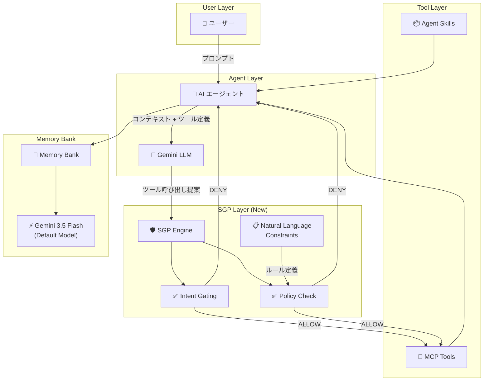

# Gemini Enterprise Agent Platform: Semantic Governance Policies (SGP)、Memory Bank モデル更新、Provisioned Throughput 通知 GA

**リリース日**: 2026-06-29

**サービス**: Gemini Enterprise Agent Platform

**機能**: Semantic Governance Policies (Public Preview)、Memory Bank デフォルトモデル変更、Provisioned Throughput メール通知 GA

**ステータス**: Preview / GA

:bar_chart: [このアップデートのインフォグラフィックを見る](https://takech9203.github.io/google-cloud-news-summary/20260629-gemini-agent-platform-sgp-memory-bank.html)

## 概要

Gemini Enterprise Agent Platform に対する 3 つの重要なアップデートが同時に発表された。最も注目すべきは **Semantic Governance Policies (SGP)** の Public Preview 提供開始で、AI エージェントのツール呼び出しをランタイムで評価し、ユーザーの意図や組織のビジネスルールに違反するアクションをブロックするインテリジェントなセキュリティ・コンプライアンスレイヤーが利用可能になった。

Memory Bank では、メモリ生成に使用されるデフォルトモデルが Gemini 2.5 Flash から **Gemini 3.5 Flash** にアップグレードされ、メモリの抽出・統合処理の品質向上が期待できる。また、**Provisioned Throughput のメール通知機能**が GA となり、注文の送信・有効化・期限切れなどのイベントについてメール通知を受信できるようになった。

**アップデート前の課題**

- AI エージェントのツール呼び出しに対するランタイムでのセキュリティ制御が存在せず、コンテキストポイズニングやデータ流出のリスクがあった
- エージェントのビジネスルール遵守を保証するには、アプリケーションコードに直接ロジックを埋め込む必要があり、変更のたびに再デプロイが必要だった
- Memory Bank のデフォルトモデルが Gemini 2.5 Flash であり、最新の言語モデルの性能を活用できなかった
- Provisioned Throughput の注文状態変更をプロアクティブに把握するにはコンソールを手動で確認する必要があった

**アップデート後の改善**

- SGP により、自然言語で記述したビジネスルールやセキュリティガードレールをコード変更なしでエージェントに適用可能になった
- Layered Intent Gating がランタイムでツール呼び出しをインターセプトし、不正アクション・ローグツール使用・データ流出を防止
- Memory Bank が Gemini 3.5 Flash を使用することで、より高品質なメモリ抽出・統合が可能になった
- Provisioned Throughput のイベントについてメール通知が GA となり、運用管理の効率が向上した

## アーキテクチャ図



SGP はエージェントの LLM が返したツール呼び出し提案を Agent Gateway 経由でインターセプトし、ユーザーの意図との整合性チェック（Intent Gating）と組織ポリシーへの準拠チェック（Policy Check）の両方を通過した場合にのみツール実行を許可する。

## サービスアップデートの詳細

### 主要機能

1. **Semantic Governance Policies (SGP) - Public Preview**
   - AI エージェントのツール呼び出しをランタイムで評価するセキュリティ・コンプライアンスレイヤー
   - SGP Policy（自然言語ルール）と SGP Engine（マネージドインフラ）の 2 コンポーネントで構成
   - Agent Gateway と統合し、エージェントのすべてのツール呼び出しを検査
   - IAM のような静的セキュリティメカニズムを補完する動的なガバナンス層

2. **Natural Language Constraints (NLC)**
   - プレーンな英語でビジネスルールやセキュリティガードレールを記述
   - コード変更や再デプロイなしでルールを追加・変更可能
   - LLM がランタイムでセマンティック分析により制約を評価
   - 評価結果は ALLOW または DENY（拒否理由付き）で返却

3. **Layered Intent Gating**
   - ユーザーの信頼された意図とエージェントのアクションの整合性を検証
   - コンテキストポイズニング攻撃（悪意あるプロンプトインジェクション）を検出・ブロック
   - ユーザー意図チェックとポリシー準拠チェックの両方を通過した場合のみ許可

4. **Granular Scoping**
   - エージェントの全ツールにグローバルに適用、または特定のツール・パラメータにターゲット適用
   - 例: 金融取引の上限額制限、地理的制約の強制
   - MCP サーバーとツールを指定した粒度の細かい制御

5. **Agent Skills Lifecycle Governance**
   - セッション中の Agent Skills（ツールパッケージ）の動的ロードを統治
   - コンテキストポイズニングやサプライチェーン攻撃からエージェントを保護

6. **Dry Run Mode**
   - ポリシーの判定結果を Log Explorer で確認しながら、実際のトラフィックには影響を与えない
   - 本番適用前にポリシーの動作を検証するためのテストモード

7. **Memory Bank デフォルトモデルの Gemini 3.5 Flash への更新**
   - メモリ生成（抽出・統合）に使用されるデフォルト LLM が Gemini 3.5 Flash に変更
   - 2026年6月29日以前に作成されたインスタンスは引き続き Gemini 2.5 Flash を使用
   - リージョンに応じてマルチリージョンエンドポイント（us、eu）またはグローバルエンドポイントを使用

8. **Provisioned Throughput メール通知 GA**
   - Essential Contacts API を使用したメール通知機能が一般提供開始
   - 注文送信、注文有効化、注文変更、期限切れ事前通知などのイベントに対応

## 技術仕様

### SGP コンポーネント構成

| コンポーネント | 説明 |
|------|------|
| SGP Policy | 自然言語で記述したビジネスルール・セキュリティ制約 |
| SGP Engine | VPC ネットワーク内にプロビジョニングされるマネージドインフラ |
| Authorization Extension | Agent Gateway から SGP Engine へトラフィックを転送する仕組み |
| Authorization Policy | Authorization Extension を Agent Gateway にバインドするポリシー |

### SGP 評価フロー

| ステップ | 説明 |
|------|------|
| 1. ツール呼び出し提案 | LLM がエージェントにツール呼び出しを指示 |
| 2. SGP インターセプト | Agent Gateway 経由で SGP Engine にトラフィックが転送される |
| 3. 意図整合性チェック | ユーザーの元のプロンプトとツール呼び出しの整合性を検証 |
| 4. ポリシー準拠チェック | NLC に基づくビジネスルール準拠を検証 |
| 5. 判定 | ALLOW（実行許可）または DENY（理由付きブロック） |

### Memory Bank デフォルトモデル設定

| 条件 | 使用されるエンドポイント |
|------|------|
| us マルチリージョンまたは us-* シングルリージョン | マルチリージョン us の Gemini 3.5 エンドポイント |
| eu マルチリージョンまたは eu-* シングルリージョン | マルチリージョン eu の Gemini 3.5 エンドポイント |
| その他のリージョン | グローバル Gemini 3.5 エンドポイント |

### Provisioned Throughput メール通知イベント

| イベント | 通知タイミング |
|------|------|
| 注文送信 | 数分以内 |
| 注文有効化 | 数分以内 |
| 注文変更送信 | 数分以内 |
| 注文変更有効化 | 数分以内 |
| 1か月/3か月/1年注文の期限切れ | 期限切れ日の 2 週間前 |
| 1週間注文の期限切れ | 期限切れ日の 3 日前 |
| 1か月/3か月/1年の自動更新 | 自動更新日の 2 週間前 |

### SGP ポリシー作成（gcloud CLI）

```bash
# エージェントスコープのポリシー作成（全ツールに適用）
gcloud beta ai semantic-governance-policies create POLICY_ID \
  --location=LOCATION \
  --display-name="SGP for ShippingAgent-1" \
  --description="Applies to all tool calls from the Cymbal shipping assistant agent" \
  --agent=AGENT_ID \
  --natural-language-constraint="Always use UPS as the shipping provider for shipments within the USA. Always use DHL as the shipping provider for shipments within the EU." \
  --project=PROJECT_ID

# ツールスコープのポリシー作成（特定ツールに適用）
gcloud beta ai semantic-governance-policies create POLICY_ID \
  --location=LOCATION \
  --display-name="Refund Limit Policy" \
  --description="Limits refund amounts" \
  --agent=AGENT_ID \
  --mcp-tools="mcp-server=MCP_SERVER,tools=request_refund" \
  --natural-language-constraint="Accept refund requests only where the amount is $80 or less." \
  --project=PROJECT_ID
```

### Memory Bank 設定例（Gemini 3.5 Flash 指定）

```python
memory_bank_config = {
    "generation_config": {
        "model": "projects/{PROJECT}/locations/{LOCATION}/publishers/google/models/gemini-3.5-flash"
    },
    "similarity_search_config": {
        "embedding_model": "projects/{PROJECT}/locations/{LOCATION}/publishers/google/models/text-embedding-005"
    },
    "ttl_config": {
        "memory_revision_default_ttl": f"{365 * 24 * 60 * 60}s"
    }
}
```

## 設定方法

### 前提条件

1. Google Cloud プロジェクトが作成済みであること
2. Agent Gateway が設定済みであること
3. 必要な API が有効化されていること（`aiplatform.googleapis.com`、`networkservices.googleapis.com`、`networksecurity.googleapis.com`、`compute.googleapis.com`、`dns.googleapis.com`）
4. Agent Platform SDK v1.111.0 以上がインストール済みであること

### 手順

#### ステップ 1: SGP 用 API の有効化

```bash
gcloud services enable \
  aiplatform.googleapis.com \
  agentregistry.googleapis.com \
  networkservices.googleapis.com \
  networksecurity.googleapis.com \
  compute.googleapis.com \
  dns.googleapis.com \
  --project=PROJECT_ID
```

#### ステップ 2: SGP Engine のプロビジョニングとネットワーク構成

SGP Engine は VPC ネットワーク内にプロビジョニングする。プライベート DNS ゾーンの作成、サブネットの設定、SGP Engine の有効化を行う。セットアップには約 20 分を要する。

#### ステップ 3: Agent Gateway との接続

Authorization Extension と Authorization Policy を作成し、Agent Gateway からのトラフィックを SGP Engine 経由で評価する構成を確立する。

```bash
# Authorization Extension の作成
curl -X POST \
  "https://networkservices.googleapis.com/v1beta1/projects/PROJECT_ID/locations/LOCATION/authzExtensions?authzExtensionId=AUTHZ_EXTENSION_NAME" \
  -H "Authorization: Bearer $(gcloud auth application-default print-access-token)" \
  -H "Content-Type: application/json" \
  -d '{
    "service": "SGP_DNS_HOSTNAME",
    "authority": "SGP_DNS_HOSTNAME",
    "failOpen": false,
    "loadBalancingScheme": "LOAD_BALANCING_SCHEME_UNSPECIFIED"
  }'
```

#### ステップ 4: Dry Run Mode でのテスト（推奨）

```bash
# Dry Run Mode の有効化
curl -X PATCH \
  "https://networkservices.googleapis.com/v1beta1/projects/PROJECT_ID/locations/LOCATION/authzExtensions/AUTHZ_EXTENSION_NAME?updateMask=metadata" \
  -H "Authorization: Bearer $(gcloud auth application-default print-access-token)" \
  -H "Content-Type: application/json" \
  -d '{
    "metadata": {
      "sgpEnforcementMode": "DRY_RUN"
    }
  }'
```

Log Explorer で判定結果を確認し、期待通りの動作を確認してから本番適用する。

#### ステップ 5: Provisioned Throughput メール通知の設定

1. Essential Contacts API を有効化
2. Google Cloud コンソールの Provisioned Throughput ページで「Notifications」をクリック
3. Essential Contacts ページで連絡先を追加し、「Product updates」を選択

## メリット

### ビジネス面

- **コード不要のガバナンス**: セキュリティチームやコンプライアンスチームが自然言語でルールを記述でき、開発者への依存なしにポリシーを変更可能
- **リスク低減**: AI エージェントの不正動作（データ流出、権限外操作）をランタイムで検出・ブロック
- **コンプライアンス対応の迅速化**: ビジネスルールの変更を再デプロイなしで即時反映
- **運用効率向上**: Provisioned Throughput の状態変更をメールで自動通知

### 技術面

- **多層防御の実現**: IAM による静的アクセス制御に加え、セマンティックレベルでの動的制御を追加
- **サプライチェーン保護**: Agent Skills の動的ロードを統治し、悪意あるスキルの注入を防止
- **メモリ品質向上**: Gemini 3.5 Flash による高品質なメモリ抽出・統合処理
- **安全なロールアウト**: Dry Run Mode により本番影響なしにポリシーを検証可能

## デメリット・制約事項

### 制限事項

- SGP は **VPC-SC をサポートしていない**
- SGP は LLM ベースの判定のため、確率的であり判定が正確でない場合がある
- SGP ポリシーは Service Data として扱われ、拒否理由にポリシーの内容が引用される可能性があるため、機密情報をポリシーに含めるべきではない
- SGP は現在 Preview であり、本番ワークロードでの使用には Pre-GA 利用規約が適用される
- 2026年6月29日以前に作成された Memory Bank インスタンスは自動的に Gemini 3.5 Flash に移行されない（手動でモデル指定の更新が必要）

### 考慮すべき点

- SGP Engine のプロビジョニングにはネットワーク構成（VPC、DNS、サブネット）が必要で、初期セットアップに約 20 分を要する
- NLC はセマンティック評価のため、曖昧な表現のルールは意図しない判定結果を招く可能性がある
- Dry Run Mode で十分なテストを行ってから本番適用することが強く推奨される
- Authorization Policy の httpRules に gRPC トラフィック除外の CEL 式を含めないと、エージェント起動が失敗する
- SGP 管理操作（ポリシー作成、エンジン有効化）には管理クォータが消費される

## ユースケース

### ユースケース 1: カスタマーサポートエージェントの返金制限

**シナリオ**: カスタマーサービスエージェントが返金処理を行う際に、金額上限を超える返金を自動承認しないよう制御する。

**実装例**:
```bash
gcloud beta ai semantic-governance-policies create refund-limit-policy \
  --location=us-central1 \
  --display-name="Refund Limit Policy" \
  --agent=customer-service-agent-id \
  --mcp-tools="mcp-server=payment-mcp,tools=request_refund" \
  --natural-language-constraint="Disallow automated processing of refund requests for amounts in excess of $75." \
  --project=my-project
```

**効果**: 高額返金リクエストが自動処理されることを防止し、人間の承認フローへエスカレーションされる。

### ユースケース 2: データ流出防止

**シナリオ**: メール処理エージェントに対して、ユーザーの意図と無関係なメール送信（プロンプトインジェクション攻撃による転送指示）をブロックする。

**実装例**:
```bash
gcloud beta ai semantic-governance-policies create email-exfil-guard \
  --location=us-central1 \
  --display-name="Email Exfiltration Guard" \
  --agent=email-assistant-agent-id \
  --natural-language-constraint="Only allow sending emails to recipients that are explicitly mentioned or clearly implied by the user's original request. Never forward emails to addresses not specified by the user." \
  --project=my-project
```

**効果**: コンテキストポイズニング攻撃によるデータ流出を SGP の Intent Gating がブロックする。

### ユースケース 3: 地理的制約の適用

**シナリオ**: 配送エージェントに対して、地域ごとに使用する配送業者を制限する。

**実装例**:
```bash
gcloud beta ai semantic-governance-policies create shipping-geo-policy \
  --location=us-central1 \
  --display-name="Geographic Shipping Policy" \
  --agent=shipping-agent-id \
  --mcp-tools="mcp-server=logistics-mcp,tools=new_shipping_request" \
  --natural-language-constraint="Always use UPS as the shipping provider for shipments within the USA. Always use DHL as the shipping provider for shipments within the EU." \
  --project=my-project
```

**効果**: ビジネス契約に基づく配送業者の使い分けをコード変更なしで適用可能。

## 利用可能リージョン

### SGP 対応リージョン

| 地域 | 利用可能リージョン |
|------|------|
| Americas | us-central1, us-east1, us-east4, us-east5, us-south1, us-west1, us-west4 |
| Europe | europe-central2, europe-north1, europe-southwest1, europe-west1, europe-west4, europe-west8, europe-west9 |

### Memory Bank 対応リージョン

Memory Bank はマルチリージョン（us、eu）、グローバル、および各シングルリージョンエンドポイントに対応。

## 関連サービス・機能

- **Agent Gateway**: SGP が統合されるゲートウェイ。エージェントへのトラフィックを SGP Engine にルーティングする
- **Agent Registry**: エージェント ID の管理・検索に使用。SGP ポリシーのターゲット指定に必要
- **Cloud Logging / Log Explorer**: SGP の評価結果（Verdict、Rationale）のログを確認するために使用
- **Essential Contacts API**: Provisioned Throughput のメール通知設定に使用
- **IAM**: SGP と補完関係にある静的アクセス制御。SGP は動的なセマンティックレベルの制御を追加
- **Network Services / Network Security API**: SGP Engine の Authorization Extension と Policy の構成に使用
- **Cloud DNS**: SGP Engine のプライベート DNS ゾーン設定に使用

## 参考リンク

- :bar_chart: [インフォグラフィック](https://takech9203.github.io/google-cloud-news-summary/20260629-gemini-agent-platform-sgp-memory-bank.html)
- [公式リリースノート](https://docs.cloud.google.com/release-notes#June_29_2026)
- [Semantic Governance Policies 概要](https://docs.cloud.google.com/gemini-enterprise-agent-platform/govern/policies/semantic-governance-overview)
- [SGP 構成ガイド](https://docs.cloud.google.com/gemini-enterprise-agent-platform/govern/policies/configure-semantic-governance)
- [Memory Bank セットアップ](https://docs.cloud.google.com/gemini-enterprise-agent-platform/scale/memory-bank/setup)
- [Provisioned Throughput メール通知](https://docs.cloud.google.com/gemini-enterprise-agent-platform/models/provisioned-throughput/use-provisioned-throughput#email-notifications)
- [Agent Gateway セットアップ](https://docs.cloud.google.com/gemini-enterprise-agent-platform/govern/gateways/set-up-agent-gateway)

## まとめ

今回のアップデートの中で最も重要なのは Semantic Governance Policies (SGP) の Public Preview 提供開始である。エンタープライズにおける AI エージェント導入の最大の懸念事項であるセキュリティとコンプライアンスに対して、自然言語ベースのランタイム制御という革新的なアプローチを提供する。従来の IAM では対応できなかった「エージェントの意図的な逸脱」や「プロンプトインジェクション攻撃」に対する防御が可能となり、AI エージェントの本番環境への安全なデプロイを大きく前進させる。まずは Dry Run Mode でポリシーの動作を検証し、段階的に本番適用を進めることが推奨される。

---

**タグ**: #GeminiEnterpriseAgentPlatform #SGP #SemanticGovernancePolicy #MemoryBank #ProvisionedThroughput #AIAgent #Security #Compliance #NaturalLanguageConstraints #Preview #GA
