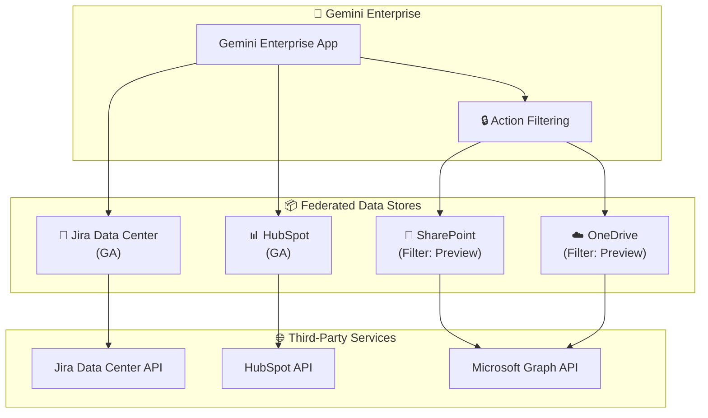

# Gemini Enterprise: データストア機能拡張 (Jira Data Center GA / SharePoint・OneDrive アクションフィルタリング / HubSpot GA)

**リリース日**: 2026-06-29

**サービス**: Gemini Enterprise

**機能**: フェデレーテッドデータストアの拡張

**ステータス**: GA / Preview

📊 [このアップデートのインフォグラフィックを見る](https://takech9203.github.io/google-cloud-news-summary/20260629-gemini-enterprise-data-stores-update.html)

## 概要

Gemini Enterprise のフェデレーテッドデータストアに関する複数のアップデートが発表された。Jira Data Center および HubSpot のフェデレーテッドデータストアが一般提供 (GA) となり、本番環境での利用が正式にサポートされる。また、Microsoft SharePoint および OneDrive のデータストアに対するアクションフィルタリング機能がプレビューとして提供され、検索クエリだけでなくアクション実行にもフィルタが適用されるようになった。

これらのアップデートにより、Gemini Enterprise が接続できるサードパーティデータソースの選択肢が広がるとともに、既存のMicrosoft コネクタにおけるデータアクセス制御が強化される。企業の情報検索基盤として Gemini Enterprise を活用する際の柔軟性とセキュリティが向上する。

**アップデート前の課題**

- Jira Data Center のフェデレーテッドデータストアはプレビュー段階であり、本番ワークロードでの利用に SLA が保証されていなかった
- HubSpot のフェデレーテッドデータストアもプレビュー段階で、限定的なサポートのみが提供されていた
- SharePoint および OneDrive のフィルタ設定は検索クエリにのみ適用され、アクション (ミューテーションやデータ取得) には適用されなかったため、スコープ外のデータに対する操作が可能であった

**アップデート後の改善**

- Jira Data Center フェデレーテッドデータストアが GA となり、SLA 付きの本番利用が可能になった
- HubSpot フェデレーテッドデータストアが GA となり、CRM データの安定的な検索・アクション実行が保証される
- SharePoint および OneDrive のフィルタが検索とアクション実行の両方に適用されるようになり、スコープ外のデータへのミューテーションや取得が失敗または結果なしとなることでセキュリティが強化された

## アーキテクチャ図



Gemini Enterprise がフェデレーテッドデータストアを通じて各サードパーティサービスの API に直接クエリを送信する構成を示す。SharePoint/OneDrive についてはアクションフィルタリング層が検索とアクション両方に適用される。

## サービスアップデートの詳細

### 主要機能

1. **Jira Data Center フェデレーテッドデータストア (GA)**
   - オンプレミスの Jira Data Center インスタンスへのフェデレーテッド検索が GA
   - OAuth 認証による安全な接続 (Instance URI、Client ID、Client Secret)
   - パブリックおよびプライベート (Private Service Connect 経由) の接続モードをサポート
   - SSL 設定: Public、Private、Insecure の各トラストモデルに対応
   - フェデレーテッド検索とデータインジェスションの両方のコネクタモードをサポート
   - アクション機能により、自然言語での Jira 操作が可能

2. **Microsoft SharePoint/OneDrive アクションフィルタリング (Preview)**
   - フィルタが検索クエリだけでなくアクション実行にも適用されるようになった
   - SharePoint: Site フィルタと Path フィルタの 2 種類のフィルタキーをサポート
   - OneDrive: Path フィルタでの URL プレフィックスベースのスコープ制御
   - 包含フィルタ (`admin_filter`) と除外フィルタ (`admin_exclusion_filter`) の 2 種類
   - スコープ外データへのミューテーションや取得は失敗または結果なしとなる
   - Google Cloud コンソールおよび REST API の両方から設定可能

3. **HubSpot フェデレーテッドデータストア (GA)**
   - HubSpot CRM データへのフェデレーテッド検索が GA
   - Google マネージド OAuth アプリを使用し、手動での OAuth アプリ設定が不要
   - CRM オブジェクトの管理アクションをサポート
   - global、us、eu のロケーションで利用可能

## 技術仕様

### フィルタ設定 (SharePoint/OneDrive)

| 項目 | SharePoint | OneDrive |
|------|-----------|----------|
| フィルタキー | Site, Path | Path |
| 包含フィルタ | `admin_filter` | `admin_filter` |
| 除外フィルタ | `admin_exclusion_filter` | `admin_exclusion_filter` |
| レガシーフィルタ | `structured_search_filter` | `structured_search_filter` |
| フィルタ適用範囲 | 検索 + アクション | 検索 + アクション |

### SharePoint フィルタの組み合わせ動作

| フィルタ組み合わせ | 動作 |
|-------------------|------|
| Path (包含) + Site (空) | Path 包含フィルタのみとして機能 |
| Site (包含) + Path (空) | Site 包含フィルタのみとして機能 |
| Site (包含) + Path (除外) | 広いサイトを含みつつ特定パスを除外 |
| Path (包含) + Site (包含) | 両フィルタの積集合のみ含める |
| Site (除外) + Path (除外) | いずれかに一致するパスを除外 |

### フィルタ設定 API 例

```json
{
  "params": {
    "admin_filter": {
      "Site": [
        "https://tenant1.sharepoint.com/sites/engineering"
      ],
      "Path": [
        "https://tenant1.sharepoint.com/sites/engineering/Documents/"
      ]
    }
  }
}
```

### コネクタ仕様比較

| 項目 | Jira Data Center | HubSpot |
|------|-----------------|---------|
| ステータス | GA | GA |
| 認証方式 | OAuth (Client ID/Secret) | Google マネージド OAuth |
| 接続モード | フェデレーテッド検索 / データインジェスション | フェデレーテッド検索 |
| プライベート接続 | Private Service Connect 対応 | 非対応 |
| 利用可能リージョン | global, us, eu | global, us, eu |
| VPC SC | 対応 | 再作成が必要 |
| CMEK | 対応 (us, eu) | 対応 (us, eu) |

## 設定方法

### 前提条件

1. Google Cloud プロジェクトで Gemini Enterprise が有効化されていること
2. Discovery Engine Editor ロール (`roles/discoveryengine.editor`) が付与されていること
3. Gemini Enterprise のサブスクリプションとライセンスが配布済みであること
4. 各サードパーティサービスの管理者アクセス権限

### 手順

#### ステップ 1: Jira Data Center データストアの作成

```bash
# Google Cloud コンソールで Gemini Enterprise > Data stores に移動
# Create data store > Source で "Jira Data Center" を選択
# 認証情報を設定:
#   - Instance URI: https://jira.yourcompany.com
#   - Client ID: (OAuth アプリケーションの Client ID)
#   - Client Secret: (Secret Manager に保存した Client Secret)
# 接続タイプ: Public または Private を選択
# エンティティを選択して作成
```

#### ステップ 2: HubSpot データストアの作成

```bash
# Google Cloud コンソールで Gemini Enterprise > Data stores に移動
# Create data store > Source で "HubSpot" を選択
# Google マネージド OAuth を使用 (手動設定不要)
# エンティティを選択
# アクションを選択 (CRM Objects の管理)
# ロケーションを選択して作成
```

#### ステップ 3: SharePoint/OneDrive フィルタの更新

```bash
# REST API を使用してフィルタを更新
curl -X PATCH \
  -H "Authorization: Bearer $(gcloud auth print-access-token)" \
  -H "Content-Type: application/json" \
  -H "X-Goog-User-Project: PROJECT_ID" \
  "https://ENDPOINT_LOCATION-discoveryengine.googleapis.com/v1alpha/projects/PROJECT_ID/locations/LOCATION/collections/COLLECTION_ID/dataConnector?updateMask=params" \
  -d '{
    "params": {
      "admin_filter": {
        "Site": ["https://tenant1.sharepoint.com/sites/allowed-site"],
        "Path": ["https://tenant1.sharepoint.com/sites/allowed-site/Documents/"]
      }
    }
  }'
```

## メリット

### ビジネス面

- **エンタープライズデータの統合検索**: Jira Data Center (オンプレミス) と HubSpot (CRM) のデータが Gemini Enterprise から一元的に検索可能になり、情報のサイロ化を解消
- **コンプライアンス強化**: SharePoint/OneDrive のアクションフィルタリングにより、機密データへの不正アクセスリスクを低減
- **本番運用の信頼性**: GA 昇格により SLA が保証され、ミッションクリティカルなワークフローでの利用が可能

### 技術面

- **セキュリティ境界の一貫性**: フィルタが検索とアクション両方に適用されることで、データガバナンスポリシーの一貫した適用が可能
- **プライベート接続**: Jira Data Center は Private Service Connect を通じたプライベート接続をサポートし、オンプレミス環境との安全な統合を実現
- **簡素化された認証**: HubSpot は Google マネージド OAuth アプリを使用し、手動での OAuth アプリ管理が不要

## デメリット・制約事項

### 制限事項

- SharePoint/OneDrive のアクションフィルタリングはプレビュー段階であり、Pre-GA の利用規約が適用される
- HubSpot データストアは global、us、eu ロケーションのみサポート
- HubSpot で既存データストアに VPC Service Controls を適用するには、データストアの再作成が必要
- HubSpot では 1 つのアプリに対して 1 つのコネクタタイプのデータストアのみ推奨

### 考慮すべき点

- Jira Data Center のプライベート接続を使用する場合、Private Service Connect プロデューサーサービスの事前設定が必要
- フィルタ更新時は、更新しないフィルタも含めてすべてのフィルタをリクエストボディに含める必要がある
- 包含フィルタから除外フィルタへ切り替える際は、不要になったフィルタを明示的に空に設定する必要がある

## ユースケース

### ユースケース 1: エンジニアリングチームの統合ナレッジ検索

**シナリオ**: エンジニアリングチームがオンプレミスの Jira Data Center でプロジェクト管理を行い、SharePoint でドキュメントを共有している。Gemini Enterprise を通じて両方のデータソースを横断検索し、関連するチケットとドキュメントを一括で取得する。

**効果**: 複数のツールを個別に検索する必要がなくなり、情報検索の効率が大幅に向上。アクションフィルタリングにより、チームがアクセス権を持つプロジェクトのデータのみが返される。

### ユースケース 2: セールスチームの CRM データ活用

**シナリオ**: セールスチームが HubSpot で顧客管理を行い、Gemini Enterprise を通じて自然言語で顧客情報を検索・操作する。「先月コンタクトした顧客のリストを表示」などの自然言語コマンドで CRM データにアクセスする。

**効果**: CRM の操作スキルに依存せず、チームメンバー全員が効率的に顧客データを活用可能。Google マネージド OAuth により管理者の設定負荷も最小限。

### ユースケース 3: セキュリティポリシーに基づく SharePoint アクセス制御

**シナリオ**: 組織内で人事部門のSharePoint サイトには機密情報が含まれており、一般ユーザーの Gemini Enterprise アシスタントからのアクセスを制限する必要がある。

**実装例**:
```json
{
  "params": {
    "admin_exclusion_filter": {
      "Site": [
        "https://tenant1.sharepoint.com/sites/hr-confidential"
      ]
    }
  }
}
```

**効果**: 除外フィルタにより、検索だけでなくアクション実行時にも HR サイトのデータが返されなくなり、情報漏洩リスクを軽減。

## 料金

Gemini Enterprise の利用にはサブスクリプションとライセンスが必要。ライセンスはユーザー単位で割り当てられ、月額または年額のサブスクリプションで購入する。データストアのコネクタ利用は General pricing または Configurable pricing から選択可能。

詳細な料金については公式ドキュメントを参照: [Gemini Enterprise ライセンス](https://docs.cloud.google.com/gemini/enterprise/docs/licenses)

## 利用可能リージョン

全コネクタ共通で以下のマルチリージョンをサポート:

- global
- us (米国)
- eu (欧州)

us または eu を選択した場合は暗号化設定 (Google マネージド暗号化キーまたは Cloud KMS キー) の構成が必要。

## 関連サービス・機能

- **Gemini Enterprise App**: フェデレーテッドデータストアに接続してユーザーに検索インターフェースを提供
- **Private Service Connect**: Jira Data Center のプライベート接続で使用されるネットワーキングサービス
- **Cloud KMS**: データストアの暗号化キー管理 (CMEK) に使用
- **Secret Manager**: Jira Data Center の Client Secret 保管に使用
- **VPC Service Controls**: データストアのセキュリティ境界設定に使用
- **Discovery Engine API**: データストアの作成・管理に使用される基盤 API

## 参考リンク

- 📊 [インフォグラフィック](https://takech9203.github.io/google-cloud-news-summary/20260629-gemini-enterprise-data-stores-update.html)
- [公式リリースノート](https://docs.cloud.google.com/release-notes#June_29_2026)
- [Jira Data Center データストアの設定](https://docs.cloud.google.com/gemini/enterprise/docs/connectors/jira-dc/set-up-data-store)
- [Microsoft SharePoint データストアの設定](https://docs.cloud.google.com/gemini/enterprise/docs/connectors/ms-sharepoint/set-up-data-store)
- [SharePoint フィルタの追加](https://docs.cloud.google.com/gemini/enterprise/docs/connectors/ms-sharepoint/add-filters-to-sharepoint-data-store)
- [Microsoft OneDrive データストアの設定](https://docs.cloud.google.com/gemini/enterprise/docs/connectors/ms-onedrive/set-up-data-store)
- [OneDrive フィルタの追加](https://docs.cloud.google.com/gemini/enterprise/docs/connectors/ms-onedrive/add-filters-to-onedrive-data-store)
- [HubSpot データストアの設定](https://docs.cloud.google.com/gemini/enterprise/docs/connectors/hubspot/set-up-data-store)
- [Gemini Enterprise ライセンス](https://docs.cloud.google.com/gemini/enterprise/docs/licenses)

## まとめ

今回のアップデートにより、Gemini Enterprise のサードパーティデータ連携が大きく強化された。Jira Data Center と HubSpot の GA 昇格によりエンタープライズ環境での本番利用が正式に可能となり、SharePoint/OneDrive のアクションフィルタリングによりデータガバナンスが一層厳格になった。特にオンプレミスの Jira Data Center を運用する組織や、HubSpot CRM を活用するセールスチームにとって、Gemini Enterprise を全社的な情報検索ハブとして活用する際の重要な基盤アップデートである。

---

**タグ**: #GeminiEnterprise #DataStores #FederatedSearch #JiraDataCenter #HubSpot #SharePoint #OneDrive #ActionFiltering #GA #Preview
