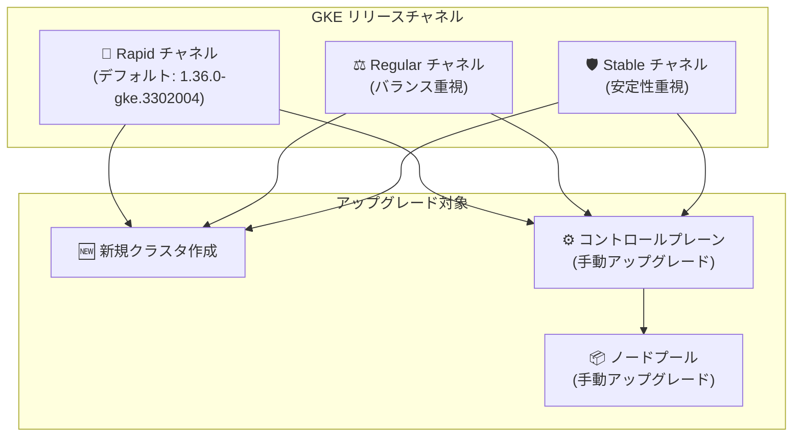

# Google Kubernetes Engine: バージョンアップデート (2026-R26)

**リリース日**: 2026-06-29

**サービス**: Google Kubernetes Engine (GKE)

**機能**: クラスタバージョンアップデート (2026-R26)

**ステータス**: Change

[このアップデートのインフォグラフィックを見る](https://takech9203.github.io/google-cloud-news-summary/20260629-gke-version-updates-2026-r26.html)

## 概要

Google Kubernetes Engine (GKE) のクラスタバージョンが更新され、新しいバージョンが利用可能になった。今回の 2026-R26 リリースでは、Rapid、Regular、Stable の各リリースチャネルで新しいバージョンが提供されている。

特に注目すべき点として、Rapid チャネルではバージョン 1.36.0-gke.3302004 がクラスタ作成時のデフォルトバージョンとして設定された。これにより、Rapid チャネルで新規クラスタを作成する場合、Kubernetes 1.36 系の最新機能が標準で利用可能になる。

新しいバージョンは、新規クラスタの作成だけでなく、既存クラスタのコントロールプレーンおよびノードの手動アップグレードにも利用できる。

**アップデート前の課題**

- 以前のデフォルトバージョンでは Kubernetes 1.36 の最新パッチが含まれていなかった
- 最新のセキュリティ修正やバグ修正を適用するには、明示的にバージョンを指定してアップグレードする必要があった

**アップデート後の改善**

- Rapid チャネルで 1.36.0-gke.3302004 がデフォルトになり、新規クラスタで最新バージョンが自動的に適用される
- 各チャネルで新しいパッチバージョンが利用可能になり、手動アップグレードで最新のセキュリティ修正を適用可能

## アーキテクチャ図



GKE のリリースチャネルごとに新しいバージョンが提供され、新規クラスタ作成時のデフォルトとして、または既存クラスタの手動アップグレードのターゲットとして利用できる。

## サービスアップデートの詳細

### 主要機能

1. **Rapid チャネルのデフォルトバージョン更新**
   - バージョン 1.36.0-gke.3302004 が Rapid チャネルの新しいデフォルトバージョンとして設定
   - 新規クラスタ作成時に自動的にこのバージョンが適用される
   - Kubernetes 1.36 の最新機能とセキュリティ修正が含まれる

2. **複数チャネルでの新バージョン提供**
   - Rapid、Regular、Stable の各チャネルで新しいバージョンが利用可能
   - 各チャネルの品質基準に基づいて検証済みのバージョンが提供される

3. **既存クラスタへのアップグレードパス**
   - 新バージョンへのコントロールプレーンの手動アップグレードが可能
   - ノードプールの手動アップグレードも対応
   - 自動アップグレードのターゲットとしても順次適用される

## 技術仕様

### リリースチャネルの特性

| チャネル | 特徴 | 推奨用途 |
|---------|------|---------|
| Rapid | 最新バージョンをいち早く提供。GKE SLA 対象外の場合あり | プレプロダクション環境での検証 |
| Regular (デフォルト) | Rapid リリース後約 2 か月で提供 | 本番環境 (バランス重視) |
| Stable | Regular リリース後 3-4 か月で提供 | 本番環境 (安定性重視) |
| Extended | Regular と同時期に提供。最大 24 か月のサポート | 長期サポートが必要な環境 |

### バージョンスキューポリシー

| 項目 | 詳細 |
|------|------|
| ノードとコントロールプレーンの差異 | ノードはコントロールプレーンより最大 2 マイナーバージョン古いバージョンまで許容 |
| マイナーバージョンスキップ | コントロールプレーンは不可。ノードプールは可能 |
| パッチバージョンスキップ | コントロールプレーン、ノードプールともに可能 |

### バージョン確認コマンド

```bash
# Rapid チャネルのデフォルトバージョンを確認
gcloud container get-server-config \
  --flatten="channels" \
  --filter="channels.channel=RAPID" \
  --format="yaml(channels.channel,channels.defaultVersion)" \
  --location=COMPUTE_LOCATION

# Rapid チャネルの利用可能バージョン一覧
gcloud container get-server-config \
  --flatten="channels" \
  --filter="channels.channel=RAPID" \
  --format="yaml(channels.channel,channels.validVersions)" \
  --location=COMPUTE_LOCATION
```

## 設定方法

### 前提条件

1. Google Kubernetes Engine API が有効であること
2. gcloud CLI がインストール済みで最新バージョンであること
3. 対象クラスタが既に存在すること (既存クラスタのアップグレードの場合)

### 手順

#### ステップ 1: 利用可能なバージョンの確認

```bash
# 対象チャネルの利用可能バージョンを確認
gcloud container get-server-config \
  --flatten="channels" \
  --filter="channels.channel=RAPID" \
  --format="yaml(channels.channel,channels.validVersions)" \
  --location=us-central1
```

対象チャネルで利用可能なバージョンの一覧が表示される。

#### ステップ 2: コントロールプレーンのアップグレード

```bash
# コントロールプレーンを指定バージョンにアップグレード
gcloud container clusters upgrade CLUSTER_NAME \
  --master \
  --location=CONTROL_PLANE_LOCATION \
  --cluster-version=1.36.0-gke.3302004
```

コントロールプレーンのアップグレードが完了するまで数分かかる場合がある。

#### ステップ 3: ノードプールのアップグレード

```bash
# ノードプールをアップグレード
gcloud container clusters upgrade CLUSTER_NAME \
  --node-pool=NODE_POOL_NAME \
  --location=CONTROL_PLANE_LOCATION \
  --cluster-version=1.36.0-gke.3302004
```

ノードプールのアップグレード中は、Pod が他のノードに再スケジュールされる。PodDisruptionBudget が最大 1 時間尊重される。

## メリット

### ビジネス面

- **最新のセキュリティパッチ適用**: 最新のセキュリティ修正が含まれるバージョンにアップグレードすることで、セキュリティリスクを低減
- **サポート期間の延長**: 新しいバージョンに移行することで、サポート期間をリセットし長期的な安定運用を確保

### 技術面

- **Kubernetes 1.36 の新機能**: Rapid チャネルでは Kubernetes 1.36 の最新 API や機能を利用可能
- **バグ修正**: 既知の問題に対する修正が含まれ、クラスタの安定性が向上
- **チャネル間のバージョン選択**: ワークロードの要件に応じて適切なチャネルのバージョンを選択可能

## デメリット・制約事項

### 制限事項

- Rapid チャネルのバージョンは GKE SLA の対象外となる場合がある
- コントロールプレーンのマイナーバージョンスキップは不可 (1 つずつアップグレードする必要がある)
- ノードプールのアップグレード中はワークロードへの一時的な影響がある

### 考慮すべき点

- アップグレード前に PodDisruptionBudget を適切に設定しておくこと
- 本番環境のアップグレード前に、プレプロダクション環境で検証を行うこと
- メンテナンスウィンドウを設定し、自動アップグレードのタイミングを制御すること
- アップグレード後のバージョンスキューポリシーに違反しないよう、ノードのバージョンも確認すること

## ユースケース

### ユースケース 1: プレプロダクション環境での最新バージョン検証

**シナリオ**: Rapid チャネルの新しいデフォルトバージョン 1.36.0-gke.3302004 を使用して、プレプロダクション環境で新機能や互換性を検証する。

**実装例**:
```bash
# Rapid チャネルで新規クラスタを作成 (新デフォルトバージョンが自動適用)
gcloud container clusters create-auto test-cluster \
  --location=us-central1 \
  --release-channel=rapid
```

**効果**: 本番環境への適用前に、アプリケーションの互換性や新機能の動作を安全に確認できる。

### ユースケース 2: 本番環境の段階的アップグレード

**シナリオ**: Regular チャネルの本番クラスタを、新しく利用可能になったバージョンに段階的にアップグレードする。

**効果**: メンテナンスウィンドウ内で計画的にアップグレードを実施し、ワークロードへの影響を最小限に抑えながら最新のセキュリティ修正を適用できる。

## 料金

GKE のバージョンアップデート自体には追加料金は発生しない。GKE の標準的な料金体系が適用される。

| 項目 | 料金 (USD) |
|------|-----------|
| クラスタ管理料金 | $0.10 / クラスタ / 時間 |
| GKE Free Tier | $74.40 / 月 の無料クレジット (ゾーナルおよび Autopilot クラスタ) |
| コンピュート | Compute Engine インスタンスの料金に準拠 |

## 関連サービス・機能

- **Cloud Monitoring**: クラスタのバージョン情報やアップグレード状態の監視
- **Cloud Logging**: アップグレードプロセスのログ記録
- **GKE Recommender**: バージョンスキューの検出と推奨事項の提示
- **メンテナンスウィンドウ/除外**: 自動アップグレードのタイミング制御
- **クラスタ通知**: 新バージョン利用可能時の通知機能

## 参考リンク

- [インフォグラフィック](https://takech9203.github.io/google-cloud-news-summary/20260629-gke-version-updates-2026-r26.html)
- [公式リリースノート](https://docs.cloud.google.com/release-notes#June_29_2026)
- [GKE バージョニングとサポート](https://docs.cloud.google.com/kubernetes-engine/versioning)
- [GKE クラスタアップグレードについて](https://docs.cloud.google.com/kubernetes-engine/upgrades)
- [リリースチャネル](https://docs.cloud.google.com/kubernetes-engine/docs/concepts/release-channels)
- [GKE リリーススケジュール](https://docs.cloud.google.com/kubernetes-engine/docs/release-schedule)
- [料金ページ](https://cloud.google.com/kubernetes-engine/pricing)

## まとめ

GKE 2026-R26 バージョンアップデートにより、Rapid チャネルで Kubernetes 1.36.0-gke.3302004 がデフォルトバージョンとなり、各チャネルで新しいバージョンが利用可能になった。既存クラスタを運用している場合は、プレプロダクション環境で新バージョンの検証を行い、計画的にアップグレードを実施することを推奨する。特にセキュリティ修正が含まれるため、適切なタイミングでの適用を検討すべきである。

---

**タグ**: #GoogleKubernetesEngine #GKE #Kubernetes #バージョンアップデート #リリースチャネル #クラスタ管理
