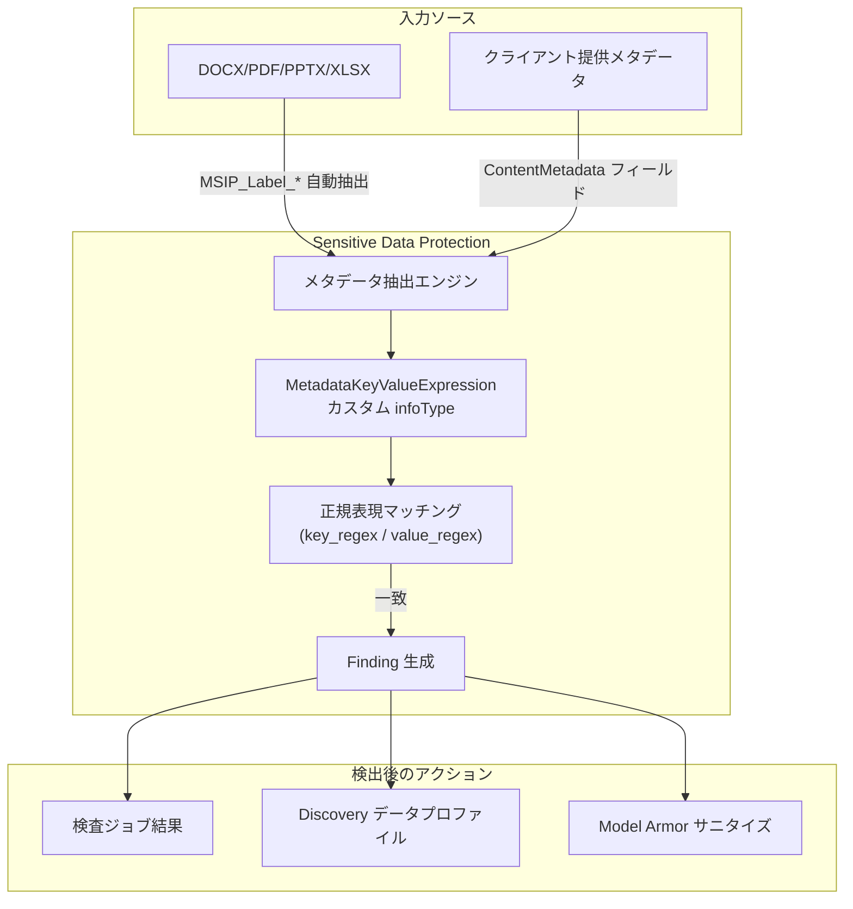

# Sensitive Data Protection: カスタムメタデータラベル検出機能

**リリース日**: 2026-06-29

**サービス**: Sensitive Data Protection

**機能**: カスタムメタデータラベル検出 (Custom Metadata Label Detector)

**ステータス**: Feature

:chart_with_upwards_trend: [このアップデートのインフォグラフィックを見る](https://takech9203.github.io/google-cloud-news-summary/20260629-sensitive-data-protection-file-labels.html)

## 概要

Sensitive Data Protection に、ファイルのメタデータラベルを検出するカスタム infoType 検出機能が追加された。この機能により、Google Drive ラベルや Microsoft 感度ラベル (Microsoft Purview Information Protection ラベル) など、既存のファイル分類システムで付与されたメタデータラベルを Sensitive Data Protection の検査対象として認識できるようになる。

メタデータは対応ファイル形式から自動抽出されるか、アプリケーションから InspectContent リクエストで直接提供できる。Sensitive Data Protection がメタデータ条件に一致するコンテンツを検出すると、finding (検出結果) を生成する。これにより、組織は既存の分類体系を Sensitive Data Protection の検査・ポリシー適用に活用でき、より包括的なデータガバナンスと分類ポリシーを実現できる。

**アップデート前の課題**

- Sensitive Data Protection はファイルの内容 (テキスト、画像など) のみを検査対象としており、ファイルに付与されたメタデータラベルを検出条件として利用できなかった
- Microsoft 感度ラベルや Google Drive ラベルなど既存の分類システムと Sensitive Data Protection の検出を統合するには、別途カスタムワークフローの構築が必要だった
- ファイルの分類情報とコンテンツの機密性検査を一元的に管理する手段がなかった

**アップデート後の改善**

- MetadataKeyValueExpression 型のカスタム infoType を定義することで、メタデータラベルのキーと値を正規表現で検出可能になった
- DOCX、PDF、PPTX、XLSX ファイルから Microsoft Purview Information Protection メタデータを自動抽出して検出できる
- クライアント提供メタデータとして、任意のキー・バリューペアを InspectContent リクエストに含めて検査可能になった
- Model Armor と連携して、メタデータラベルに基づくドキュメントのサニタイズが実現可能になった

## アーキテクチャ図



Sensitive Data Protection がファイルからメタデータを抽出し、カスタム infoType の正規表現と照合して finding を生成するまでのデータフローを示す。

## サービスアップデートの詳細

### 主要機能

1. **MetadataKeyValueExpression カスタム infoType**
   - InspectConfig 内に `metadata_key_value_expression` フィールドを持つ CustomInfoType を定義
   - `key_regex` と `value_regex` の正規表現でメタデータのキーと値をマッチング
   - Likelihood と SensitivityScore をカスタム設定可能

2. **Microsoft Purview Information Protection メタデータの自動検出**
   - `MSIP_Label_GUID_ATTRIBUTE` 形式のメタデータを自動的に認識
   - 対応属性: ActionId、ContentBits、Enabled、Method、Name、SetDate、SiteId
   - 対応ファイル形式: DOCX、PDF、PPTX、XLSX

3. **クライアント提供メタデータのスキャン**
   - InspectContent リクエストの `ContentMetadata` フィールドにカスタムメタデータを提供可能
   - ファイルに埋め込まれていないメタデータも検査対象にできる
   - Finding の MetadataType で検出元 (CONTENT_METADATA / CLIENT_PROVIDED_METADATA) を区別

4. **Model Armor 連携**
   - メタデータラベルに基づくドキュメントのサニタイズに対応
   - Model Armor の Advanced Sensitive Data Protection 設定でカスタムメタデータラベル検出を参照可能
   - Gemini Enterprise など Model Armor を利用するサービスとの統合

## 技術仕様

### カスタム infoType 定義

| 項目 | 詳細 |
|------|------|
| タイプ | `metadata_key_value_expression` (MetadataKeyValueExpression) |
| key_regex | メタデータキーを検索する正規表現 |
| value_regex | メタデータ値を検索する正規表現 |
| デフォルト Likelihood | VERY_LIKELY |
| デフォルト SensitivityScore | HIGH |

### 対応ファイル形式

| ファイル形式 | 説明 |
|-------------|------|
| DOCX | Microsoft Word 文書 |
| PDF | PDF ドキュメント |
| PPTX | Microsoft PowerPoint プレゼンテーション |
| XLSX | Microsoft Excel スプレッドシート |

### 設定例: Microsoft 感度ラベルの検出

```json
{
  "inspect_config": {
    "custom_info_types": [
      {
        "info_type": {
          "name": "CUSTOM_MIP_HIGHLY_CONFIDENTIAL"
        },
        "likelihood": "VERY_LIKELY",
        "metadata_key_value_expression": {
          "key_regex": "MSIP_Label_12345678-9012-3456-7890-123456789012_Enabled",
          "value_regex": "true"
        }
      }
    ],
    "min_likelihood": "POSSIBLE"
  }
}
```

### 設定例: クライアント提供メタデータのスキャン

```json
{
  "inspect_config": {
    "custom_info_types": [
      {
        "info_type": {
          "name": "CUSTOM_MIP_CONFIDENTIAL_INTERNAL_USE"
        },
        "likelihood": "VERY_LIKELY",
        "metadata_key_value_expression": {
          "key_regex": "MSIP_Label_.*_Name",
          "value_regex": "Confidential|Internal Use"
        }
      }
    ]
  },
  "item": {
    "byte_item": {
      "type": "PDF",
      "data": "BASE64_ENCODED_PDF"
    },
    "content_metadata": {
      "properties": [
        {
          "key": "MSIP_Label_174b6716-c2ea-4041-b631-5633733fbe46_Name",
          "value": "Confidential"
        }
      ]
    }
  }
}
```

## 設定方法

### 前提条件

1. Sensitive Data Protection API が有効化されたプロジェクト
2. DLP API を呼び出すための適切な IAM ロール (roles/dlp.user)
3. 検査対象ファイルへのアクセス権限

### 手順

#### ステップ 1: カスタム infoType の定義

InspectConfig 内に `metadata_key_value_expression` を含むカスタム infoType を定義する。

```json
{
  "inspect_config": {
    "custom_info_types": [
      {
        "info_type": {
          "name": "MY_CUSTOM_LABEL_DETECTOR"
        },
        "likelihood": "VERY_LIKELY",
        "sensitivity_score": {
          "score": "HIGH"
        },
        "metadata_key_value_expression": {
          "key_regex": "MSIP_Label_.*_Name",
          "value_regex": "Highly Confidential"
        }
      }
    ]
  }
}
```

#### ステップ 2: 検査ジョブまたは Discovery スキャンへの適用

定義したカスタム infoType を含む InspectConfig を、検査ジョブ、検査テンプレート、または Discovery スキャン構成に設定する。

#### ステップ 3: Model Armor との連携 (オプション)

Model Armor でメタデータラベル検出を利用する場合は、カスタムメタデータラベル検出を参照する Advanced Sensitive Data Protection 設定を Model Armor テンプレートに構成する。

## メリット

### ビジネス面

- **既存分類体系の活用**: Microsoft Purview や Google Drive で既に運用している分類ラベルをそのまま Sensitive Data Protection のポリシーに統合可能
- **マルチレイヤーなデータ保護**: コンテンツベースの検出とメタデータベースの検出を組み合わせることで、より精度の高いデータ分類を実現
- **コンプライアンス対応の強化**: 既存のラベリングシステムとの統合により、規制要件への対応を一元化

### 技術面

- **正規表現による柔軟なマッチング**: key_regex と value_regex により、複数のラベル GUID やラベル名を1つの検出ルールでカバー可能
- **ファイル埋め込みメタデータの自動抽出**: 対応ファイル形式から Microsoft Purview ラベルを自動的に抽出して検査
- **API 経由のメタデータ提供**: ContentMetadata フィールドにより、ファイルに埋め込まれていないメタデータも検査対象に追加可能

## デメリット・制約事項

### 制限事項

- MetadataKeyValueExpression 型のカスタム infoType は Inspection Rule Sets (検査ルールセット) では使用不可
- MetadataKeyValueExpression 型のカスタム infoType は De-identification Transformations (匿名化変換) では使用不可
- 対応ファイル形式は DOCX、PDF、PPTX、XLSX の4種類に限定

### 考慮すべき点

- Microsoft Purview ラベルの GUID はテナントごとに異なるため、正規表現パターンを環境に合わせて設定する必要がある
- クライアント提供メタデータを利用する場合、アプリケーション側でメタデータの抽出・提供ロジックの実装が必要

## ユースケース

### ユースケース 1: Microsoft 感度ラベル付きドキュメントの検出

**シナリオ**: 組織が Microsoft Purview Information Protection を使用してドキュメントに「Highly Confidential」ラベルを付与している。Cloud Storage に保存されたこれらのファイルを Discovery スキャンで自動検出し、Security Command Center にアラートを送信したい。

**実装例**:
```json
{
  "inspect_config": {
    "custom_info_types": [
      {
        "info_type": {
          "name": "MIP_HIGHLY_CONFIDENTIAL"
        },
        "likelihood": "VERY_LIKELY",
        "metadata_key_value_expression": {
          "key_regex": "MSIP_Label_.*_Name",
          "value_regex": "Highly Confidential"
        }
      }
    ]
  }
}
```

**効果**: Cloud Storage 内の機密ドキュメントを自動的に識別し、データプロファイルの感度レベルに反映。Security Command Center でハイリスクリソースとして可視化される。

### ユースケース 2: Model Armor によるメタデータベースのサニタイズ

**シナリオ**: Gemini Enterprise を利用する環境で、「Internal Use Only」とラベル付けされたドキュメントがLLMプロンプトに含まれた場合にサニタイズしたい。

**効果**: 機密分類されたドキュメントの内容がLLMに送信される前に、Model Armor がメタデータラベルに基づいて検出・サニタイズを実行し、情報漏洩リスクを低減。

### ユースケース 3: マルチレイヤー分類の実現

**シナリオ**: 標準的な infoType 検出 (クレジットカード番号、SSN など) とメタデータラベル検出を組み合わせ、コンテンツとメタデータの両面からデータを分類する。

**効果**: コンテンツに機密情報が含まれていなくても、メタデータラベルで「Confidential」と分類されたファイルを検出でき、網羅的なデータガバナンスを実現。

## 料金

Sensitive Data Protection の既存の料金体系が適用される。

| カテゴリ | 料金 |
|---------|------|
| Discovery (消費モード) | $0.03/GB |
| Discovery (固定レートサブスクリプション) | $2,500/ユニット |
| 検査 (1GB まで) | 無料 |
| Google Cloud ストレージの検査 | $1.00/GB から (ボリューム割引あり) |
| インライン コンテンツ検査 | $3.00/GB から (ボリューム割引あり) |

詳細は [Sensitive Data Protection pricing](https://cloud.google.com/sensitive-data-protection/pricing) を参照。

## 関連サービス・機能

- **Model Armor**: Advanced Sensitive Data Protection 設定でメタデータラベル検出を参照し、プロンプト/レスポンスのサニタイズに活用
- **Security Command Center**: Discovery で生成されたデータプロファイルに基づくリスク評価とアラート
- **Microsoft Purview Information Protection**: 感度ラベルのソースとして連携 (MSIP_Label メタデータを検出)
- **Cloud Storage**: Discovery スキャンの対象ストレージとして、メタデータラベル付きファイルの自動プロファイリング
- **Gemini Enterprise**: Model Armor 経由でメタデータラベル検出を活用した安全なLLM利用

## 参考リンク

- :chart_with_upwards_trend: [インフォグラフィック](https://takech9203.github.io/google-cloud-news-summary/20260629-sensitive-data-protection-file-labels.html)
- [公式リリースノート](https://docs.cloud.google.com/release-notes#June_29_2026)
- [ドキュメント: Create a custom metadata label detector](https://docs.cloud.google.com/sensitive-data-protection/docs/create-custom-infotypes-metadata-labels)
- [ドキュメント: Creating custom infoType detectors](https://docs.cloud.google.com/sensitive-data-protection/docs/creating-custom-infotypes)
- [料金ページ](https://cloud.google.com/sensitive-data-protection/pricing)

## まとめ

Sensitive Data Protection のカスタムメタデータラベル検出機能は、Microsoft 感度ラベルや Google Drive ラベルなど既存のファイル分類システムを DLP 検出パイプラインに統合する重要なアップデートである。これにより、コンテンツベースの検出とメタデータベースの検出を組み合わせたマルチレイヤーなデータガバナンスが可能になる。Microsoft Purview を既に運用している組織は、まず Highly Confidential ラベルの検出ルールから導入し、Discovery スキャンでの活用を推奨する。

---

**タグ**: #SensitiveDataProtection #DLP #MetadataLabels #MicrosoftPurview #DataGovernance #ModelArmor #CustomInfoType #DataClassification
