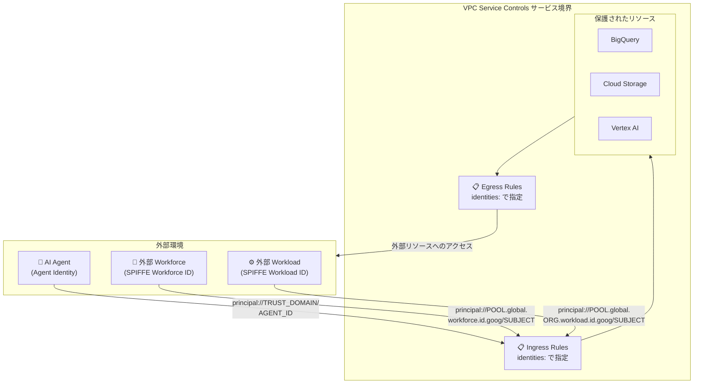

# VPC Service Controls: Agent Identity および SPIFFE 形式サードパーティ ID の Ingress/Egress ルール対応 (GA)

**リリース日**: 2026-06-29

**サービス**: VPC Service Controls

**機能**: Agent Identity および SPIFFE 形式のサードパーティ ID を Ingress/Egress ルールで使用可能に (GA)

**ステータス**: Generally Available (GA)

📊 [このアップデートのインフォグラフィックを見る](https://takech9203.github.io/google-cloud-news-summary/20260629-vpc-service-controls-agent-spiffe-identities-ga.html)

## 概要

VPC Service Controls の Ingress/Egress ルールにおいて、Agent Identity および SPIFFE (Secure Production Identity Framework For Everyone) 形式のサードパーティ Workforce/Workload Identity のサポートが一般提供 (GA) となりました。これにより、サービス境界で保護されたリソースへのアクセス制御において、従来のユーザーアカウントやサービスアカウントに加え、AI エージェントや外部 IdP のワークロードに対してもきめ細かいアクセス制御が可能になります。

この機能は 2026 年 3 月 16 日に Preview として提供が開始され、約 3 か月半の Preview 期間を経て GA に昇格しました。エンタープライズにおける AI エージェントの台頭とマルチクラウド/ハイブリッド環境でのゼロトラストセキュリティ強化のニーズに応える重要なアップデートです。

対象ユーザーは、VPC Service Controls を利用してデータ境界を構築しているセキュリティ管理者、Vertex AI Agent Engine などで AI エージェントを運用する開発者、および外部 IdP (Okta、Azure AD など) を利用して Workforce/Workload Identity Federation を構成している組織です。

**アップデート前の課題**

- Agent Identity (AI エージェント固有の ID) を VPC Service Controls の Ingress/Egress ルールで指定できず、エージェントのアクセスには共有サービスアカウントを使用する必要があった
- サードパーティの Workforce/Workload Identity を SPIFFE 形式で指定できなかったため、外部 IdP からのアクセスを Trust Domain 単位で制御することが困難だった
- AI エージェントがサービス境界内のリソースにアクセスするには `ANY_IDENTITY` や `ANY_SERVICE_ACCOUNT` といった広範な許可設定が必要で、最小権限の原則に反する運用を強いられていた

**アップデート後の改善**

- Agent Identity を `principal://TRUST_DOMAIN/AGENT_UNIQUE_IDENTIFIER` 形式で直接指定し、個別エージェント単位のきめ細かいアクセス制御が可能になった
- SPIFFE 形式 (`principal://POOL_ID.global.workforce.id.goog/SUBJECT`) で Workforce/Workload Identity を指定でき、Trust Domain ベースの統一的なアクセス管理が実現
- `principalSet://` を使用したグループ/属性ベースの一括制御により、大規模環境でのポリシー管理が効率化された

## アーキテクチャ図



VPC Service Controls のサービス境界に対して、Agent Identity および SPIFFE 形式の ID を Ingress/Egress ルールの `identities` フィールドに指定することで、各種プリンシパルからのアクセスを制御する構成を示しています。

## サービスアップデートの詳細

### 主要機能

1. **Agent Identity のサポート**
   - 個別エージェントの指定: `principal://TRUST_DOMAIN/AGENT_UNIQUE_IDENTIFIER`
   - Trust Domain 内の属性ベースの一括指定: `principalSet://TRUST_DOMAIN/attribute.ATTRIBUTE_NAME/ATTRIBUTE_VALUE`
   - Trust Domain 内の全エージェント指定: `principalSet://TRUST_DOMAIN/*`
   - Vertex AI Agent Engine、Gemini Enterprise などでホストされるエージェントに対応

2. **SPIFFE 形式の Workforce Identity サポート**
   - 個別 ID: `principal://POOL_ID.global.workforce.id.goog/SUBJECT_ATTRIBUTE_VALUE`
   - 属性ベースの一括指定: `principalSet://POOL_ID.global.workforce.id.goog/attribute.ATTRIBUTE_NAME/ATTRIBUTE_VALUE`
   - Trust Domain 内の全 ID: `principalSet://POOL_ID.global.workforce.id.goog/*`

3. **SPIFFE 形式の Workload Identity サポート**
   - 個別 ID: `principal://POOL_ID.global.ORGANIZATION_ID.workload.id.goog/SUBJECT_ATTRIBUTE_VALUE`
   - 属性ベースの一括指定: `principalSet://POOL_ID.global.ORGANIZATION_ID.workload.id.goog/attribute.ATTRIBUTE_NAME/ATTRIBUTE_VALUE`
   - Trust Domain 内の全 ID: `principalSet://POOL_ID.global.ORGANIZATION_ID.workload.id.goog/*`

## 技術仕様

### サポートされる ID 形式一覧

| ID タイプ | プリンシパルタイプ | 識別子形式 |
|-----------|-------------------|------------|
| Agent Identity (単一) | principal | `principal://TRUST_DOMAIN/AGENT_UNIQUE_IDENTIFIER` |
| Agent Identity (属性) | principalSet | `principalSet://TRUST_DOMAIN/attribute.ATTRIBUTE_NAME/ATTRIBUTE_VALUE` |
| Agent Identity (全体) | principalSet | `principalSet://TRUST_DOMAIN/*` |
| SPIFFE Workforce (単一) | principal | `principal://POOL_ID.global.workforce.id.goog/SUBJECT` |
| SPIFFE Workforce (属性) | principalSet | `principalSet://POOL_ID.global.workforce.id.goog/attribute.ATTR/VALUE` |
| SPIFFE Workforce (全体) | principalSet | `principalSet://POOL_ID.global.workforce.id.goog/*` |
| SPIFFE Workload (単一) | principal | `principal://POOL_ID.global.ORG_ID.workload.id.goog/SUBJECT` |
| SPIFFE Workload (属性) | principalSet | `principalSet://POOL_ID.global.ORG_ID.workload.id.goog/attribute.ATTR/VALUE` |
| SPIFFE Workload (全体) | principalSet | `principalSet://POOL_ID.global.ORG_ID.workload.id.goog/*` |

### クォータと制限

| 項目 | 制限値 | 備考 |
|------|--------|------|
| Agent Identity 数 (アクセスポリシー全体) | 3,000 | Ingress/Egress ルールで設定される Agent Identity の合計数 |
| Identity Group 数 (アクセスポリシー全体) | 1,000 | Ingress/Egress ルールで設定される Identity Group の合計数 |
| 属性数 (サービス境界あたり) | 6,000 | Ingress/Egress ルールの全属性の合計 (identities 含む) |

### Agent Identity の SPIFFE ID 形式

```
spiffe://agents.global.org-ORGANIZATION_ID.system.id.goog/resources/SERVICE/RESOURCE_PATH
```

例 (Vertex AI Agent Engine):
```
spiffe://agents.global.org-123456789012.system.id.goog/resources/aiplatform/projects/9876543210/locations/us-central1/reasoningEngines/my-agent
```

## 設定方法

### 前提条件

1. VPC Service Controls のサービス境界が構成済みであること
2. Agent Identity を使用する場合: Vertex AI Agent Engine または対応サービスでエージェントがデプロイ済みであること
3. SPIFFE Workforce ID を使用する場合: Workforce Identity Pool が構成済みであること
4. SPIFFE Workload ID を使用する場合: Workload Identity Pool が構成済みであること

### 手順

#### ステップ 1: Ingress ルールに Agent Identity を追加 (YAML)

```yaml
- ingressFrom:
    identities:
      - principal://agents.global.org-123456789012.system.id.goog/resources/aiplatform/projects/9876543210/locations/us-central1/reasoningEngines/my-agent
    sources:
      - accessLevel: "*"
  ingressTo:
    operations:
      - serviceName: bigquery.googleapis.com
        methodSelectors:
          - method: "*"
    resources:
      - projects/111222333
```

Agent Identity を指定して、特定の AI エージェントからサービス境界内の BigQuery リソースへのアクセスを許可します。

#### ステップ 2: Egress ルールに SPIFFE Workforce Identity を追加 (YAML)

```yaml
- egressFrom:
    identities:
      - principalSet://my-pool.global.workforce.id.goog/attribute.department/engineering
  egressTo:
    operations:
      - serviceName: storage.googleapis.com
        methodSelectors:
          - method: "*"
    resources:
      - projects/444555666
```

SPIFFE 形式の Workforce Identity (属性ベース) を指定して、エンジニアリング部門の全メンバーに対して外部プロジェクトの Cloud Storage へのアクセスを許可します。

#### ステップ 3: サービス境界にポリシーを適用

```bash
# Ingress ポリシーの更新
gcloud access-context-manager perimeters update PERIMETER_ID \
    --set-ingress-policies=ingress.yaml

# Egress ポリシーの更新
gcloud access-context-manager perimeters update PERIMETER_ID \
    --set-egress-policies=egress.yaml
```

## メリット

### ビジネス面

- **AI エージェントのセキュアな運用**: 共有サービスアカウントに依存せず、エージェントごとに固有の ID を付与してアクセスを制御できるため、エージェント運用のガバナンスが向上
- **マルチクラウド環境の統合管理**: SPIFFE 標準に基づくため、異なる環境 (AWS、Azure、オンプレミス) からのワークロードも統一的な形式で管理可能
- **コンプライアンス強化**: 個別エージェントの監査証跡が明確になり、規制要件 (金融、医療など) への準拠を容易に実現

### 技術面

- **最小権限の原則の徹底**: 個別エージェントや特定属性を持つ ID グループに対してのみアクセスを許可でき、過度な権限付与を排除
- **属性ベースのアクセス制御 (ABAC)**: `principalSet://` と属性指定を組み合わせることで、動的にスケールする環境でも宣言的なポリシー管理が可能
- **IAM v1 API との統合**: 既存の IAM プリンシパル識別子形式と整合性があり、学習コストが低い

## デメリット・制約事項

### 制限事項

- Egress ルールで Identity Group を使用する場合、`egressTo` の `resources` フィールドにワイルドカード `"*"` は使用不可
- Workload Identity を使用した Apache Airflow Web Interface (Cloud Composer) への Ingress/Egress ルールでの操作は非対応
- Workload Identity Federation for GKE はサポート対象外 (通常の Workload Identity Federation のみ対応)

### 考慮すべき点

- Agent Identity 数の上限はアクセスポリシー全体で 3,000 個。大規模なエージェント環境では `principalSet://` による属性ベースの指定を推奨
- サービス境界あたりの属性数上限 (6,000) に identities のエントリも含まれるため、既存ルールの属性数を考慮した設計が必要
- Dry-run モードと Enforced モードそれぞれで属性制限が適用されるため、テスト環境での検証時に注意

## ユースケース

### ユースケース 1: AI エージェントによるデータ分析パイプライン

**シナリオ**: Vertex AI Agent Engine でデプロイされた分析エージェントが、VPC Service Controls で保護された BigQuery データセットにアクセスして分析を実行する。

**実装例**:
```yaml
- ingressFrom:
    identities:
      - principal://agents.global.org-123456789012.system.id.goog/resources/aiplatform/projects/9876543210/locations/us-central1/reasoningEngines/data-analyst-agent
    sources:
      - accessLevel: "*"
  ingressTo:
    operations:
      - serviceName: bigquery.googleapis.com
        methodSelectors:
          - method: "google.cloud.bigquery.v2.JobService.InsertJob"
          - method: "google.cloud.bigquery.v2.JobService.GetQueryResults"
    resources:
      - projects/111222333
```

**効果**: 特定の分析エージェントのみが BigQuery のジョブ実行とクエリ結果取得を許可され、他のエージェントや不正なアクセスはサービス境界でブロックされる。

### ユースケース 2: 外部 IdP ユーザーのハイブリッドクラウドアクセス

**シナリオ**: Azure AD で管理されている外部パートナー企業のエンジニアが、Workforce Identity Federation を経由して Google Cloud のサービス境界内リソースにアクセスする。

**実装例**:
```yaml
- ingressFrom:
    identities:
      - principalSet://partner-pool.global.workforce.id.goog/attribute.team/data-engineering
    sources:
      - accessLevel: accessPolicies/222/accessLevels/PartnerVPN
  ingressTo:
    operations:
      - serviceName: storage.googleapis.com
        methodSelectors:
          - method: "*"
    resources:
      - projects/777888999
```

**効果**: VPN 接続かつ特定チーム属性を持つ外部パートナーのみがストレージリソースにアクセス可能となり、SPIFFE ベースの Trust Domain で統一的に管理される。

### ユースケース 3: マルチエージェント環境の一括制御

**シナリオ**: 組織内の全 AI エージェントに対して、特定のサービスへのアクセスを Trust Domain 単位で制御する。

**実装例**:
```yaml
- ingressFrom:
    identities:
      - principalSet://agents.global.org-123456789012.system.id.goog/*
    sources:
      - accessLevel: "*"
  ingressTo:
    operations:
      - serviceName: aiplatform.googleapis.com
        methodSelectors:
          - method: "*"
    resources:
      - projects/111222333
```

**効果**: 組織の Trust Domain に属する全エージェントが Vertex AI API にアクセスでき、新しいエージェントのデプロイ時にルールの追加が不要。

## 料金

VPC Service Controls の利用に追加料金は発生しません。Agent Identity および SPIFFE 形式の ID を Ingress/Egress ルールで使用する場合も、追加費用なしで利用できます。

ただし、関連サービス (Workforce Identity Federation、Workload Identity Federation、Vertex AI Agent Engine など) には個別の料金体系が適用される場合があります。

## 利用可能リージョン

VPC Service Controls はグローバルサービスであり、すべての Google Cloud リージョンで利用可能です。Ingress/Egress ルールでの Agent Identity および SPIFFE 形式 ID の指定も、全リージョンで対応しています。

## 関連サービス・機能

- **Vertex AI Agent Engine**: AI エージェントのホスティング基盤。Agent Identity が自動的に付与される
- **Workforce Identity Federation**: 外部 IdP のユーザーを Google Cloud にフェデレーションする機能。SPIFFE Workforce ID の基盤
- **Workload Identity Federation**: 外部ワークロードを Google Cloud にフェデレーションする機能。SPIFFE Workload ID の基盤
- **IAM (Identity and Access Management)**: プリンシパル識別子の統一的な管理基盤
- **Certificate Authority Service**: Agent Identity の X.509 証明書を発行する基盤
- **Principal Access Boundary (PAB)**: Agent Identity と組み合わせてリソースアクセスの境界を制限
- **Access Context Manager**: VPC Service Controls のアクセスレベルとポリシー管理

## 参考リンク

- 📊 [インフォグラフィック](https://takech9203.github.io/google-cloud-news-summary/20260629-vpc-service-controls-agent-spiffe-identities-ga.html)
- [公式リリースノート](https://docs.cloud.google.com/release-notes#June_29_2026)
- [Supported identities for ingress and egress rules](https://docs.cloud.google.com/vpc-service-controls/docs/supported-identities)
- [Configure identity groups and third-party identities in ingress and egress rules](https://docs.cloud.google.com/vpc-service-controls/docs/configure-identity-groups)
- [Ingress and egress rules](https://docs.cloud.google.com/vpc-service-controls/docs/ingress-egress-rules)
- [Agent Identity overview](https://docs.cloud.google.com/iam/docs/agent-identity-overview)
- [Managed workload identities](https://docs.cloud.google.com/iam/docs/managed-workload-identity)
- [VPC Service Controls quotas and limits](https://docs.cloud.google.com/vpc-service-controls/quotas)

## まとめ

VPC Service Controls における Agent Identity と SPIFFE 形式サードパーティ ID の GA は、AI エージェント時代のデータ境界セキュリティにおける重要なマイルストーンです。従来の共有サービスアカウントベースの制御から、エージェントごと・Trust Domain ごとのきめ細かいアクセス制御への移行を可能にします。特に AI エージェントを本番環境で運用している組織は、既存の `ANY_SERVICE_ACCOUNT` 設定をレビューし、Agent Identity ベースの個別制御への移行を検討することを推奨します。

---

**タグ**: #VPCServiceControls #AgentIdentity #SPIFFE #Security #ZeroTrust #IngressEgressRules #WorkforceIdentity #WorkloadIdentity #IAM #GA
