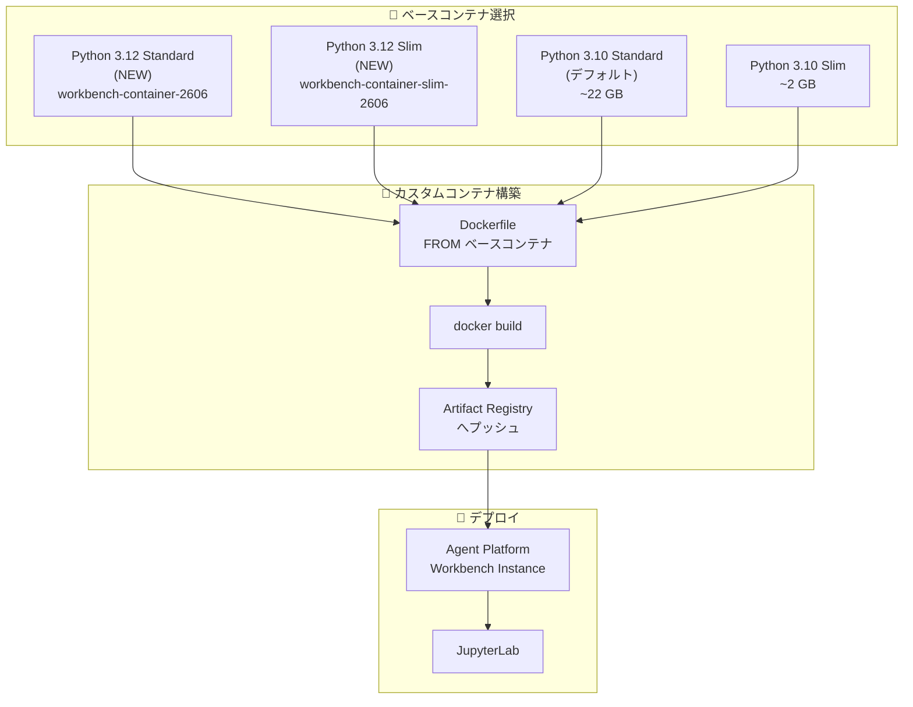

# Agent Platform Workbench: Python 3.12 ベースコンテナのサポート

**リリース日**: 2026-06-30

**サービス**: Agent Platform Workbench (Gemini Enterprise Agent Platform)

**機能**: Python 3.12 ベースコンテナ (Standard / Slim)

**ステータス**: GA (一般提供)

📊 [このアップデートのインフォグラフィックを見る](https://takech9203.github.io/google-cloud-news-summary/20260630-agent-platform-workbench-python-3-12.html)

## 概要

Agent Platform Workbench のカスタムコンテナ機能において、Python 3.12 をベースとした新しいベースコンテナが利用可能になりました。従来のデフォルトである Python 3.10 ベースコンテナに加え、Python 3.12 の Standard および Slim バリアントが提供されます。

新しい Python 3.12 ベースコンテナは、`us-docker.pkg.dev/workbench-images/gcr.io/` リポジトリから取得可能で、カスタムコンテナの構築に使用できます。これにより、Python 3.12 の新しい言語機能やパフォーマンス改善を活用したカスタム開発環境を構築できるようになります。

**アップデート前の課題**

- Agent Platform Workbench のカスタムコンテナ用ベースイメージは Python 3.10 のみがデフォルトで提供されていた
- Python 3.12 の新機能 (パターンマッチングの改善、パフォーマンス最適化、型ヒントの強化など) を利用するには、ベースコンテナ上に手動で Python 3.12 環境を構築する必要があった
- 最新のライブラリやフレームワークが Python 3.12 以上を要求するケースに対応しづらかった

**アップデート後の改善**

- Python 3.12 をネイティブに含むベースコンテナが公式に提供され、そこからカスタムコンテナを派生できるようになった
- Standard (フル機能) と Slim (軽量) の両バリアントが用意され、ユースケースに応じて選択可能
- Python 3.12 対応ライブラリとの互換性が標準的に確保された

## アーキテクチャ図



カスタムコンテナ構築のフローを示します。ユーザーは Python 3.10 または Python 3.12 のベースコンテナ (Standard/Slim) を選択し、Dockerfile で拡張した後、Artifact Registry 経由で Agent Platform Workbench インスタンスにデプロイします。

## サービスアップデートの詳細

### 主要機能

1. **Python 3.12 Standard ベースコンテナ**
   - URI: `us-docker.pkg.dev/workbench-images/gcr.io/workbench-container-2606:latest`
   - Agent Platform Workbench の全機能をサポート
   - データサイエンスパッケージ、CUDA ライブラリ、Google Cloud JupyterLab 統合を含む
   - Micromamba ベースのカーネル管理を搭載

2. **Python 3.12 Slim ベースコンテナ**
   - URI: `us-docker.pkg.dev/workbench-images/gcr.io/workbench-container-slim-2606:latest`
   - 最小限の構成でプロキシ接続を提供
   - JupyterLab、メタデータベースの設定、Micromamba カーネル管理のみ含む
   - 追加パッケージや拡張は独自にインストール・管理が必要

3. **既存の Python 3.10 ベースコンテナとの共存**
   - 従来の Python 3.10 ベースコンテナ (deeplearning-platform-release リポジトリ) も引き続き利用可能
   - 既存のカスタムコンテナに影響なし

## 技術仕様

### ベースコンテナの比較

| 項目 | Python 3.12 Standard | Python 3.12 Slim | Python 3.10 Standard (既存) | Python 3.10 Slim (既存) |
|------|---------------------|-------------------|---------------------------|------------------------|
| URI | workbench-container-2606:latest | workbench-container-slim-2606:latest | workbench-container:latest | workbench-container-slim:latest |
| リポジトリ | us-docker.pkg.dev/workbench-images/gcr.io/ | us-docker.pkg.dev/workbench-images/gcr.io/ | us-docker.pkg.dev/deeplearning-platform-release/gcr.io/ | us-docker.pkg.dev/deeplearning-platform-release/gcr.io/ |
| データサイエンスパッケージ | 含む | 含まない | 含む | 含まない |
| CUDA ライブラリ | 含む (予想) | 含まない | 含む | 含まない |
| JupyterLab 統合 | 含む | 含む | 含む | 含む |
| Micromamba | 含む | 含む | 含む | 含む |

### カスタムコンテナの制限事項

| 項目 | 詳細 |
|------|------|
| ベースコンテナ要件 | Google 提供のベースコンテナから派生する必要がある |
| コンテナ数 | インスタンスあたり 1 コンテナのみ |
| ホスト OS | Container-Optimized OS (パッケージマネージャなし) |
| コンテナランタイム | nerdctl (containerd CLI) |
| レジストリ | Artifact Registry またはパブリックリポジトリ |

## 設定方法

### 前提条件

1. Google Cloud プロジェクトが設定済みであること
2. Artifact Registry API が有効化されていること
3. Docker がローカル環境にインストールされていること

### 手順

#### ステップ 1: Python 3.12 ベースコンテナからカスタムコンテナを作成

```dockerfile
# Python 3.12 Standard ベースコンテナを使用
FROM us-docker.pkg.dev/workbench-images/gcr.io/workbench-container-2606:latest

# カスタムパッケージのインストール
ENV MAMBA_ROOT_PREFIX=/opt/micromamba
RUN micromamba create -n my-env -c conda-forge python=3.12 -y
SHELL ["micromamba", "run", "-n", "my-env", "/bin/bash", "-c"]
RUN micromamba install -c conda-forge pip -y
RUN pip install your-package
RUN pip install ipykernel
RUN python -m ipykernel install --prefix /opt/micromamba/envs/my-env --name my-env --display-name "My Python 3.12 Kernel"
```

#### ステップ 2: Artifact Registry へプッシュ

```bash
# Artifact Registry 認証設定
gcloud auth configure-docker REGION-docker.pkg.dev

# ビルドとプッシュ
docker build -t REGION-docker.pkg.dev/PROJECT_ID/REPOSITORY_NAME/IMAGE_NAME .
docker push REGION-docker.pkg.dev/PROJECT_ID/REPOSITORY_NAME/IMAGE_NAME:latest
```

#### ステップ 3: カスタムコンテナを使用してインスタンスを作成

```bash
gcloud workbench instances create INSTANCE_NAME \
  --project=PROJECT_ID \
  --location=ZONE \
  --container-repository=REGION-docker.pkg.dev/PROJECT_ID/REPOSITORY_NAME/IMAGE_NAME \
  --container-tag=latest
```

## メリット

### ビジネス面

- **最新エコシステムの活用**: Python 3.12 を要求するライブラリやフレームワークを即座に利用可能になり、開発スピードが向上
- **環境構築コストの削減**: 公式ベースコンテナとして提供されることで、Python 3.12 環境のセットアップや互換性テストのオーバーヘッドが軽減

### 技術面

- **パフォーマンス向上**: Python 3.12 のインタプリタ最適化による処理速度の改善
- **言語機能の活用**: 構造的パターンマッチング、型ヒント強化、エラーメッセージ改善など Python 3.12 の新機能が利用可能
- **Standard/Slim の選択肢**: フル機能が必要な場合は Standard、軽量で高速な起動が必要な場合は Slim を選択できる

## デメリット・制約事項

### 制限事項

- カスタムコンテナは Google 提供のベースコンテナから派生する必要がある (任意のコンテナは非サポート)
- 1 インスタンスにつき 1 コンテナのみサポート
- ホスト VM は Container-Optimized OS で動作するため、ホストマシンとの対話に制約がある

### 考慮すべき点

- 既存の Python 3.10 ベースのカスタムコンテナからの移行時に、パッケージの互換性を確認する必要がある
- `/home/USER` ディレクトリ外の変更はエフェメラル (再起動で失われる) である点は Python 3.12 コンテナでも同様

## ユースケース

### ユースケース 1: 最新 AI/ML フレームワークの利用

**シナリオ**: Python 3.12 以上を要求する最新バージョンの AI/ML ライブラリ (例: 新しいバージョンの PyTorch、JAX、LangChain) を使用したい場合

**実装例**:
```dockerfile
FROM us-docker.pkg.dev/workbench-images/gcr.io/workbench-container-2606:latest

RUN micromamba create -n ml-env -c conda-forge python=3.12 -y
SHELL ["micromamba", "run", "-n", "ml-env", "/bin/bash", "-c"]
RUN pip install torch torchvision langchain
RUN pip install ipykernel
RUN python -m ipykernel install --prefix /opt/micromamba/envs/ml-env --name ml-env --display-name "ML Python 3.12"
```

**効果**: 最新のフレームワークバージョンをネイティブサポートされた環境で利用でき、互換性問題を回避

### ユースケース 2: 軽量なカスタム分析環境

**シナリオ**: データ分析チームが必要最小限のパッケージのみを含む軽量な環境を迅速にデプロイしたい場合

**実装例**:
```dockerfile
FROM us-docker.pkg.dev/workbench-images/gcr.io/workbench-container-slim-2606:latest

RUN micromamba create -n analysis -c conda-forge python=3.12 pandas numpy matplotlib -y
SHELL ["micromamba", "run", "-n", "analysis", "/bin/bash", "-c"]
RUN pip install ipykernel google-cloud-bigquery
RUN python -m ipykernel install --prefix /opt/micromamba/envs/analysis --name analysis --display-name "Analysis"
```

**効果**: Slim ベースにより起動時間が短縮され、必要なパッケージのみを含む軽量環境を実現

## 料金

Agent Platform Workbench の料金は、インスタンスで使用するコンピュートリソース (VM、GPU) およびその他の Google Cloud サービスの利用に基づきます。ベースコンテナ自体の追加料金はありません。

詳細は [Agent Platform Workbench 料金ページ](https://cloud.google.com/vertex-ai/pricing#notebooks) を参照してください。

## 関連サービス・機能

- **Artifact Registry**: カスタムコンテナイメージの保存・管理に使用
- **Colab Enterprise**: Agent Platform Notebooks のもう一つの選択肢 (ゼロ設定のサーバーレスノートブック環境)
- **Deep Learning Containers**: GPU 対応の深層学習コンテナイメージ群
- **Container-Optimized OS**: Agent Platform Workbench インスタンスのホスト VM で使用される OS
- **Image Streaming (GKE)**: 大規模コンテナのプル高速化に利用可能

## 参考リンク

- 📊 [インフォグラフィック](https://takech9203.github.io/google-cloud-news-summary/20260630-agent-platform-workbench-python-3-12.html)
- [公式リリースノート](https://docs.cloud.google.com/release-notes#June_30_2026)
- [カスタムコンテナ ドキュメント](https://docs.cloud.google.com/gemini-enterprise-agent-platform/notebooks/workbench/instances/create-custom-container)
- [Agent Platform Workbench 概要](https://docs.cloud.google.com/gemini-enterprise-agent-platform/notebooks/workbench/introduction)
- [料金ページ](https://cloud.google.com/vertex-ai/pricing#notebooks)

## まとめ

Agent Platform Workbench に Python 3.12 ベースコンテナが追加されたことで、最新の Python エコシステムを活用したカスタム開発環境の構築が容易になりました。Standard と Slim の 2 つのバリアントが提供されており、ユースケースに応じて選択できます。Python 3.12 を要求する最新ライブラリを利用する場合や、パフォーマンスを重視する場合は、新しいベースコンテナへの移行を検討してください。

---

**タグ**: #AgentPlatformWorkbench #Python3.12 #CustomContainers #JupyterLab #GeminiEnterpriseAgentPlatform #Notebooks
