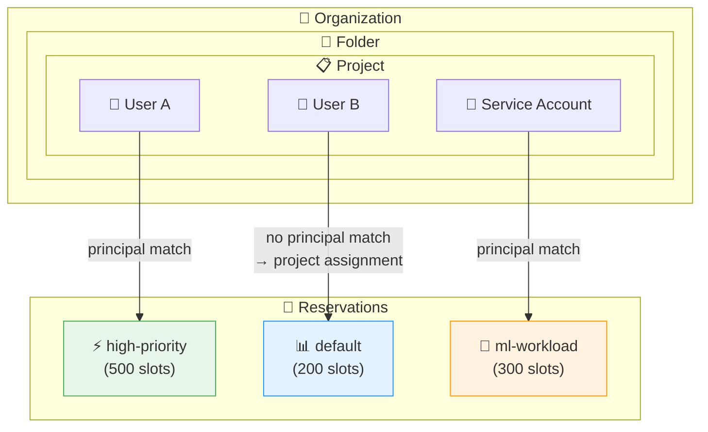

# BigQuery: Reservation Assignment の Principal プロパティによるユーザーベースルーティング

**リリース日**: 2026-06-30

**サービス**: BigQuery

**機能**: Reservation Assignment Principal Property

**ステータス**: Preview

📊 [このアップデートのインフォグラフィックを見る](https://takech9203.github.io/google-cloud-news-summary/20260630-bigquery-reservation-principal-property.html)

## 概要

BigQuery の Reservation Assignment に新たにオプションの `principal` プロパティが追加された。このプロパティを使用することで、ジョブを実行するユーザー、サービスアカウント、またはサードパーティ ID に基づいて、クエリを特定のリザベーションにルーティングできるようになった。

従来の Reservation Assignment はプロジェクト、フォルダ、または組織レベルでのみ割り当てが可能であり、同一プロジェクト内の異なるユーザーに対して異なるリザベーションを割り当てることはできなかった。今回のアップデートにより、同じプロジェクト内であっても、特定のユーザーやサービスアカウントのワークロードを専用のリザベーションにルーティングし、よりきめ細かいキャパシティ管理が実現できる。

この機能は現在 Preview ステータスであり、「Pre-GA Offerings Terms」が適用される。

**アップデート前の課題**

- リザベーションの割り当てはプロジェクト、フォルダ、組織レベルでしか行えず、同一プロジェクト内のユーザーごとのリソース分離ができなかった
- 特定のユーザーやサービスアカウントに優先的にスロットを割り当てたい場合、プロジェクトを分ける必要があった
- マルチテナント環境で、テナントごとに異なるキャパシティを保証することが困難だった

**アップデート後の改善**

- ユーザー、サービスアカウント、Workforce/Workload Identity Pool のアイデンティティ単位でリザベーションを割り当て可能になった
- 同一プロジェクト内で、重要なワークロードを実行するプリンシパルに専用リザベーションを割り当てることが可能になった
- リソース階層とプリンシパルの組み合わせで、より柔軟なワークロード管理が実現した

## アーキテクチャ図



BigQuery は Assignment の解決時に、まずプリンシパルに一致する割り当てを確認し、見つからない場合はリソース階層に沿って一般的な割り当てにフォールバックする。

## サービスアップデートの詳細

### 主要機能

1. **ユーザー固有のリザベーション割り当て (User-specific assignments)**
   - 特定のプリンシパル (ユーザー、サービスアカウント、サードパーティ ID) をリザベーションに割り当て可能
   - プロジェクト、フォルダ、組織内の特定ユーザーのワークロードを専用リザベーションにルーティング

2. **階層的な解決ロジック**
   - BigQuery はジョブ実行時に以下の順序でリザベーションを決定する:
     1. リソース階層をプロジェクトから評価 (プロジェクト → 親フォルダ → 組織)
     2. 各レベルで、ジョブを実行するプリンシパルに一致する割り当てを確認
     3. プリンシパルに一致する割り当てがなければ、同レベルのプリンシパルなし一般割り当てを確認
     4. 割り当てが見つからなければ、階層の次のレベルに移動
   - **重要**: プロジェクトレベルのプリンシパルなし割り当ては、フォルダレベルのプリンシパル付き割り当てよりも優先される

3. **IAM v2 プリンシパル形式のサポート**
   - ユーザー、サービスアカウント、Workforce Identity Pool、Workload Identity Pool の 4 種類のアイデンティティに対応

## 技術仕様

### サポートされるプリンシパル形式

| アイデンティティタイプ | プリンシパル形式 |
|------|------|
| ユーザー | `principal://goog/subject/EMAIL_ADDRESS` |
| サービスアカウント | `principal://iam.googleapis.com/projects/-/serviceAccounts/EMAIL_ADDRESS` |
| Workforce Identity Pool | `principal://iam.googleapis.com/locations/global/workforcePools/POOL_ID/subject/SUBJECT_ID` |
| Workload Identity Pool | `principal://iam.googleapis.com/projects/PROJECT_NUMBER/locations/global/workloadIdentityPools/POOL_ID/subject/SUBJECT_ID` |

### 解決優先順位

| 優先順位 | 条件 |
|------|------|
| 1 (最高) | プロジェクトレベル + プリンシパル一致 |
| 2 | プロジェクトレベル + プリンシパルなし (一般割り当て) |
| 3 | フォルダレベル + プリンシパル一致 |
| 4 | フォルダレベル + プリンシパルなし |
| 5 | 組織レベル + プリンシパル一致 |
| 6 (最低) | 組織レベル + プリンシパルなし |

### 必要な IAM 権限

- `bigquery.reservationAssignments.create` (管理プロジェクトおよび割り当て先に対して)
- 対応する事前定義ロール: BigQuery Admin、BigQuery Resource Admin、BigQuery Resource Editor

## 設定方法

### 前提条件

1. BigQuery Reservation API が有効なプロジェクト
2. Enterprise または Enterprise Plus エディションのリザベーションが作成済み
3. `bigquery.reservationAssignments.create` 権限を持つ IAM ロール

### 手順

#### ステップ 1: SQL による割り当ての作成

```sql
CREATE ASSIGNMENT
  `ADMIN_PROJECT_ID.region-LOCATION.RESERVATION_NAME.ASSIGNMENT_ID`
OPTIONS (
  assignee = 'projects/PROJECT_ID',
  principal = 'principal://goog/subject/EMAIL_ADDRESS',
  job_type = 'QUERY'
);
```

#### ステップ 2: bq コマンドによる割り当ての作成

```bash
bq mk \
  --project_id=ADMIN_PROJECT_ID \
  --location=LOCATION \
  --reservation_assignment \
  --reservation_id=RESERVATION_NAME \
  --assignee_id=PROJECT_ID \
  --assignee_type=PROJECT \
  --principal=principal://goog/subject/EMAIL_ADDRESS \
  --job_type=QUERY
```

#### ステップ 3: 割り当ての確認

```bash
bq show \
  --project_id=ADMIN_PROJECT_ID \
  --location=LOCATION \
  --reservation_assignment \
  --job_type=QUERY \
  --assignee_id=PROJECT_ID \
  --assignee_type=PROJECT \
  --principal=principal://goog/subject/EMAIL_ADDRESS
```

## メリット

### ビジネス面

- **マルチテナント環境でのコスト配分**: テナントごとに異なるリザベーションを割り当て、コストの透明性を向上
- **SLA の差別化**: 重要なユーザーやサービスアカウントに対して、より大きなキャパシティを保証可能
- **プロジェクト統合の促進**: ユーザーごとのリソース分離のためにプロジェクトを分ける必要性が低減

### 技術面

- **きめ細かいワークロード管理**: プロジェクト内の個別ユーザーレベルでスロット割り当てを制御
- **柔軟なルーティング**: IAM v2 プリンシパル形式により、多様なアイデンティティタイプに対応
- **段階的な解決ロジック**: リソース階層とプリンシパルの組み合わせによる予測可能なルーティング動作

## デメリット・制約事項

### 制限事項

- 現在 Preview ステータスであり、「Pre-GA Offerings Terms」が適用される
- Preview 機能のため、サポートが限定的な場合がある
- `unknown_or_deleted_user` のセンチネル値は使用不可 (削除または無効化されたユーザーアカウント)
- プロジェクトレベルのプリンシパルなし割り当てが、フォルダレベルのプリンシパル付き割り当てよりも優先されるため、階層設計に注意が必要

### 考慮すべき点

- 割り当て作成後、クエリを実行するまで少なくとも 5 分待つ必要がある (オンデマンド課金になる可能性あり)
- Standard エディションではフォルダ・組織レベルの割り当てが利用できないため、Enterprise 以上が必要
- プリンシパル形式は IAM v2 に準拠する必要があり、正確な形式で指定しなければならない

## ユースケース

### ユースケース 1: データサイエンスチームの優先リソース確保

**シナリオ**: 同一プロジェクト内で、データサイエンティストが大規模な ML トレーニングクエリを実行する際に、BI ダッシュボードのクエリと競合してパフォーマンスが低下している。

**実装例**:
```sql
-- データサイエンティスト用の高優先度リザベーション割り当て
CREATE ASSIGNMENT
  `admin-project.region-us.ds-reservation.ds-assignment`
OPTIONS (
  assignee = 'projects/analytics-project',
  principal = 'principal://goog/subject/data-scientist@company.com',
  job_type = 'QUERY'
);
```

**効果**: データサイエンティストのクエリは専用の 500 スロットリザベーションにルーティングされ、他のユーザーのワークロードと分離される。

### ユースケース 2: サービスアカウントごとの ETL ワークロード分離

**シナリオ**: 複数の ETL パイプラインが同じプロジェクトで実行されており、重要なパイプラインのレイテンシを保証したい。

**実装例**:
```sql
-- 重要な ETL パイプライン用サービスアカウントに専用リザベーション
CREATE ASSIGNMENT
  `admin-project.region-us.critical-etl.etl-assignment`
OPTIONS (
  assignee = 'projects/etl-project',
  principal = 'principal://iam.googleapis.com/projects/-/serviceAccounts/critical-pipeline@etl-project.iam.gserviceaccount.com',
  job_type = 'PIPELINE'
);
```

**効果**: 重要な ETL パイプラインは専用リザベーションで実行され、他の低優先度パイプラインの影響を受けない。

### ユースケース 3: Workforce Identity を使用したマルチテナント環境

**シナリオ**: Workforce Identity Pool を使用して外部組織のユーザーがアクセスする環境で、テナントごとに異なるキャパシティを割り当てたい。

**実装例**:
```sql
-- テナント A の Workforce Identity ユーザー
CREATE ASSIGNMENT
  `admin-project.region-us.tenant-a-reservation.tenant-a-assign`
OPTIONS (
  assignee = 'projects/shared-project',
  principal = 'principal://iam.googleapis.com/locations/global/workforcePools/tenant-pool/subject/tenant-a-user',
  job_type = 'QUERY'
);
```

**効果**: テナントごとに専用スロットが確保され、ノイジーネイバー問題を防止できる。

## 料金

BigQuery のリザベーション料金はエディションとスロット数に基づく。Principal プロパティの使用自体に追加料金は発生しない。

### 料金例

| エディション | スロット単価 (PAYG) | 1 年コミットメント | 3 年コミットメント |
|--------|-----------------|-----------------|-----------------|
| Standard | $0.04/スロット時間 | - | - |
| Enterprise | $0.06/スロット時間 | 20% 割引 | 40% 割引 |
| Enterprise Plus | $0.10/スロット時間 | 20% 割引 | 40% 割引 |

※ 最新の料金は [BigQuery 料金ページ](https://cloud.google.com/bigquery/pricing) を参照。

## 利用可能リージョン

BigQuery リザベーションが利用可能なすべてのリージョンおよびマルチリージョンで使用可能。詳細は [BigQuery ロケーション](https://cloud.google.com/bigquery/docs/locations) を参照。

## 関連サービス・機能

- **BigQuery Reservations**: スロットプールの管理とワークロード分離の基盤機能
- **BigQuery Editions (Enterprise / Enterprise Plus)**: フォルダ・組織レベル割り当てに必要
- **IAM v2 Principal Identifiers**: プリンシパル形式の仕様を定義
- **Workforce Identity Federation**: 外部 IdP のユーザーに対するプリンシパルベースのルーティングに利用
- **Workload Identity Federation**: GCP 外のワークロードに対するプリンシパルベースのルーティングに利用
- **Cloud Monitoring**: リザベーションのスロット使用率やジョブパフォーマンスの監視

## 参考リンク

- 📊 [インフォグラフィック](https://takech9203.github.io/google-cloud-news-summary/20260630-bigquery-reservation-principal-property.html)
- [公式リリースノート](https://docs.cloud.google.com/release-notes#June_30_2026)
- [BigQuery Reservation Assignments ドキュメント](https://docs.cloud.google.com/bigquery/docs/reservations-assignments)
- [BigQuery Reservations ワークロード管理](https://docs.cloud.google.com/bigquery/docs/reservations-workload-management)
- [BigQuery Editions](https://docs.cloud.google.com/bigquery/docs/editions-intro)
- [IAM Principal Identifiers](https://docs.cloud.google.com/iam/docs/principal-identifiers)
- [料金ページ](https://cloud.google.com/bigquery/pricing)

## まとめ

BigQuery Reservation Assignment の Principal プロパティにより、ユーザーやサービスアカウント単位でのきめ細かいキャパシティ管理が可能になった。マルチテナント環境やチーム間のリソース分離が求められる組織にとって、プロジェクトを分割せずにワークロードを制御できる強力な機能である。現在 Preview であるため、本番環境への適用前に十分な検証を行い、GA 昇格を確認することを推奨する。

---

**タグ**: #BigQuery #Reservations #WorkloadManagement #IAM #Preview #CapacityPlanning
