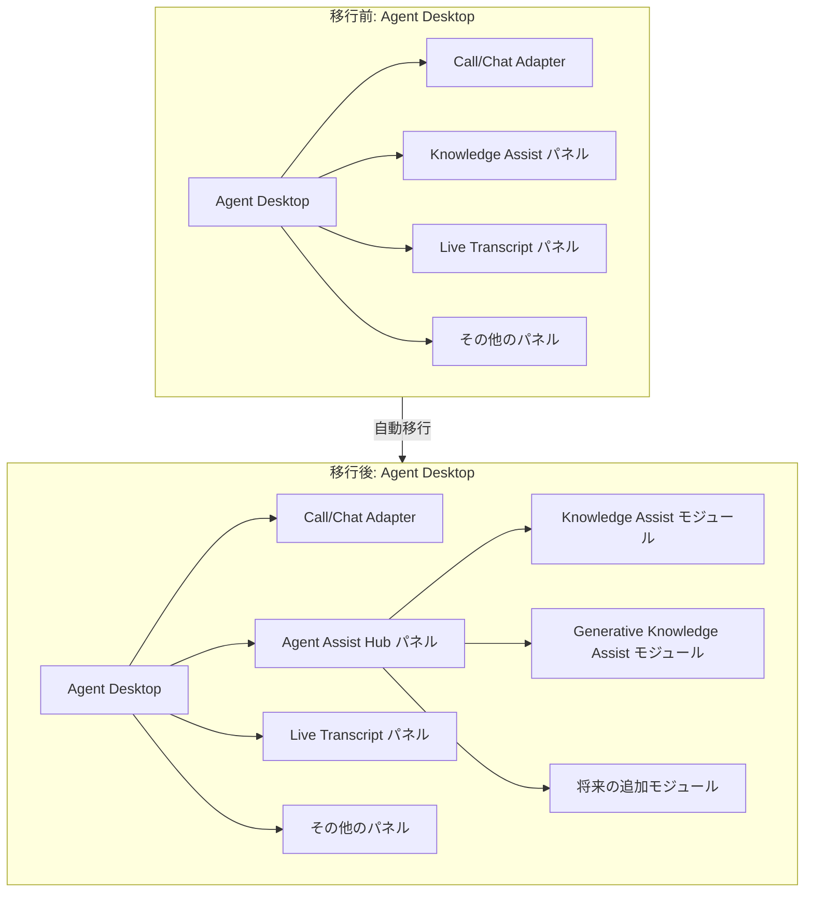

# Google Cloud CCaaS: Agent Desktop の Knowledge Assist パネルが Agent Assist Hub パネルに置き換え

**リリース日**: 2026-06-30

**サービス**: Google Cloud Contact Center as a Service (CCaaS)

**機能**: Agent Assist Hub パネルへの移行

**ステータス**: 予定 (2026年Q3早期、7月中旬〜下旬に実施予定)

[このアップデートのインフォグラフィックを見る](https://takech9203.github.io/google-cloud-news-summary/20260630-ccaas-agent-assist-hub-panel.html)

## 概要

Google Cloud Contact Center as a Service (CCaaS) の Agent Desktop において、従来の Knowledge Assist パネルが新しい Agent Assist Hub パネルに置き換えられることが発表された。Agent Assist Hub パネルには Knowledge Assist モジュールが含まれており、従来の Knowledge Assist パネルと 1:1 で同等の機能を提供する。

この変更は、Agent Desktop のデスクトップレイアウトで Knowledge Assist パネルを使用しているすべての顧客に影響する。更新は自動的に行われ、設定変更は不要だが、更新時にサインインしているエージェントについては、新しい Knowledge Assist モジュールが動作しなくなるため、一度サインアウトしてから再度サインインする必要がある。

Agent Assist Hub は、これまで個別に提供されていた Agent Assist の各機能（Knowledge Assist、Generative Knowledge Assist、Sentiment Analysis、Session Summarization など）を統合的に管理するためのハブパネルとして位置付けられ、エージェント支援機能の統合的なアクセスポイントを提供する。

**アップデート前の課題**

- Knowledge Assist が独立したパネルとして提供されており、他の Agent Assist 機能と分離されていた
- エージェントが複数の Agent Assist 機能にアクセスするには、異なるパネルやインターフェースを切り替える必要があった
- Agent Assist の各機能が個別に管理されており、統一的な操作体験が提供されていなかった

**アップデート後の改善**

- Agent Assist Hub パネルにより、Agent Assist の各機能がモジュールとして統合的に管理される
- Knowledge Assist モジュールは従来と同等の機能を維持しつつ、Hub 内で他の機能と統合される
- 設定変更不要で自動的に移行が行われるため、管理者の負担が最小限に抑えられる

## アーキテクチャ図

この図は、Agent Desktop において Knowledge Assist パネルが Agent Assist Hub パネルに統合される移行の前後を示している。Hub パネルは複数のモジュールを包含する構造となり、Knowledge Assist はその中の一つのモジュールとして提供される。

## サービスアップデートの詳細

### 主要機能

1. **Agent Assist Hub パネル**
   - Agent Assist の各機能を統合的に管理するハブパネル
   - デスクトップレイアウト内で Knowledge Assist パネルの位置を自動的に置き換え
   - 複数の Agent Assist モジュールへの統一的なアクセスポイントを提供

2. **Knowledge Assist モジュール**
   - 従来の Knowledge Assist パネルと 1:1 で同等の機能を提供
   - 会話中にリアルタイムで関連ドキュメントを提案
   - エージェントがナレッジベースを手動で検索する機能を維持
   - エンドユーザーへのドキュメント共有機能を維持

3. **自動移行**
   - 管理者による設定変更は不要
   - デスクトップレイアウトの既存設定は自動的に新パネルに移行
   - 移行時にサインイン中のエージェントは再サインインが必要

## 技術仕様

### 影響範囲

| 項目 | 詳細 |
|------|------|
| 対象サービス | Google Cloud CCaaS (CCAI Platform) |
| 対象コンポーネント | Agent Desktop |
| 影響を受けるユーザー | デスクトップレイアウトで Knowledge Assist パネルを使用している顧客 |
| 実施時期 | 2026年Q3早期 (7月中旬〜下旬) |
| 移行方法 | 自動 (設定変更不要) |

### Agent Assist Hub の構成

| コンポーネント | 説明 |
|------|------|
| Knowledge Assist モジュール | 会話に基づくドキュメント提案 (従来パネルの 1:1 置き換え) |
| Generative Knowledge Assist | 生成 AI によるナレッジ提案 |
| Hub フレームワーク | 複数モジュールを統合管理するコンテナ |

## 設定方法

### 前提条件

1. CCAI Platform インスタンスで Agent Desktop エクステンションが有効化されていること
2. Agent Assist が設定済みであること (サービスアカウント、会話プロファイル含む)

### 手順

#### ステップ 1: 移行前の確認

管理者は以下を確認する:

1. CCAI Platform ポータルで **Settings > Operation Management** に移動
2. **Agent Desktop** ペインで **Manage Desktop Layout Lists** をクリック
3. Knowledge Assist ウィジェットを使用しているレイアウトを確認

#### ステップ 2: 移行後のエージェント対応

更新が適用された後、エージェントに以下の対応を依頼する:

1. Agent Desktop からサインアウト
2. 再度サインイン
3. Agent Assist Hub パネル内の Knowledge Assist モジュールが正常に動作することを確認

**注意**: 更新時にサインイン中のエージェントは、Knowledge Assist モジュールが動作しなくなる。サインアウト/サインインで解決する。

## メリット

### ビジネス面

- **運用負荷の低減**: 自動移行により管理者の作業が不要。設定変更やレイアウトの再構築は必要ない
- **エージェント体験の統一化**: Agent Assist の各機能が一箇所に統合されることで、エージェントのワークフローが効率化される

### 技術面

- **機能の完全互換**: Knowledge Assist モジュールは従来パネルと 1:1 の機能互換性を維持
- **拡張性の向上**: Hub 構造により、将来的な Agent Assist 機能の追加が容易になる
- **統合管理**: 複数の AI アシスト機能を単一のパネルで管理可能

## デメリット・制約事項

### 制限事項

- 更新時にサインインしているエージェントの Knowledge Assist モジュールが一時的に動作停止する
- エージェントの再サインインが必要なため、通話中やチャット対応中のエージェントには即時適用できない

### 考慮すべき点

- 移行のタイミング（7月中旬〜下旬）に向けて、エージェントへの事前通知を計画する必要がある
- 繁忙時間帯を避けてエージェントの再サインインを計画することが望ましい
- カスタムパネルを使用している場合、Agent Assist Hub パネルとの位置関係を確認する

## ユースケース

### ユースケース 1: コンタクトセンターの通常運用

**シナリオ**: 音声通話やチャットで顧客対応を行うエージェントが、会話中にリアルタイムで Knowledge Assist の提案を受け取る。

**効果**: 移行後も従来と同じ方法でドキュメント提案を受け取ることができる。Agent Assist Hub パネル内の Knowledge Assist モジュールは、従来の Knowledge Assist パネルと同じ操作感を提供する。

### ユースケース 2: 移行タイミングの運用管理

**シナリオ**: 管理者がエージェントのシフト切り替えタイミングに合わせて、再サインインを促す運用を計画する。

**効果**: 通話中のエージェントへの影響を最小限に抑えつつ、全エージェントが新しい Agent Assist Hub パネルに円滑に移行できる。

## 料金

CCaaS (CCAI Platform) の料金はカスタム見積もりベースで提供される。Agent Assist Hub パネルへの移行に伴う追加料金は発生しない。詳細な料金については Google Cloud の営業担当に問い合わせが必要。

## 利用可能リージョン

CCAI Platform が利用可能なすべてのリージョンおよび国で適用される。詳細なロケーション情報は [CCAI Platform のロケーションページ](https://docs.cloud.google.com/contact-center/ccai-platform/docs/localities) を参照。

## 関連サービス・機能

- **Agent Assist (Dialogflow)**: CCAI Platform と連携してエージェントにリアルタイムの支援を提供するサービス
- **Dialogflow CX**: 高度なバーチャルエージェントの構築に使用。Agent Assist の会話プロファイルと連携
- **Customer Experience Insights**: 顧客インタラクションの分析。Agent Assist と組み合わせてエージェント支援を最適化
- **Gemini Enterprise for CX**: CCaaS、Agent Assist、Dialogflow CX を含む統合顧客体験ソリューション

## 参考リンク

- [インフォグラフィック](https://takech9203.github.io/google-cloud-news-summary/20260630-ccaas-agent-assist-hub-panel.html)
- [公式リリースノート](https://docs.cloud.google.com/release-notes#June_30_2026)
- [Agent Desktop 概要ドキュメント](https://docs.cloud.google.com/contact-center/ccai-platform/docs/agent-desktop-overview)
- [Agent Assist 設定ガイド](https://docs.cloud.google.com/contact-center/ccai-platform/docs/agent-assist)
- [デスクトップレイアウトの作成](https://docs.cloud.google.com/contact-center/ccai-platform/docs/agent-desktop-create-desktop-layouts)
- [CCAI Platform ドキュメント](https://docs.cloud.google.com/contact-center/ccai-platform/docs)

## まとめ

今回のアップデートは、CCaaS の Agent Desktop における Agent Assist 機能の統合化に向けた重要なステップである。Knowledge Assist パネルが Agent Assist Hub パネルに統合されることで、将来的に追加される AI アシスト機能も含めた統一的なエージェント体験が実現される。管理者は設定変更不要だが、エージェントへの事前通知と再サインインの計画を早めに行うことが推奨される。

---

**タグ**: #CCaaS #CCAI-Platform #Agent-Desktop #Agent-Assist #Knowledge-Assist #コンタクトセンター #自動移行
