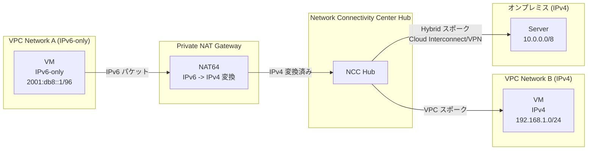

# Cloud NAT: Private NAT で IPv6 to IPv4 (NAT64) アドレス変換をサポート

**リリース日**: 2026-06-30

**サービス**: Cloud NAT

**機能**: Private NAT NAT64 (IPv6 to IPv4 変換)

**ステータス**: Preview

[このアップデートのインフォグラフィックを見る](https://takech9203.github.io/google-cloud-news-summary/20260630-cloud-nat-private-nat-ipv6-to-ipv4.html)

## 概要

Cloud NAT の Private NAT ゲートウェイが IPv6 to IPv4 ネットワークアドレス変換 (NAT64) をサポートした。これにより、IPv6 のみのネットワークインターフェースを持つ VM インスタンスが、Private NAT を経由して接続先ネットワーク内の IPv4 宛先と通信できるようになる。

従来、NAT64 は Public NAT でのみサポートされており、IPv6 専用ワークロードからインターネット上の IPv4 宛先への通信に利用されていた。今回のアップデートにより、Private NAT (NCC スポーク間通信および Hybrid NAT) でも NAT64 が利用可能となり、プライベートネットワーク間での IPv6 to IPv4 変換が実現する。

この機能は、IPv6 への移行を段階的に進めている組織にとって重要である。IPv6 専用のワークロードを導入しつつ、VPC ネットワーク間やオンプレミスネットワークとの接続先で IPv4 のみをサポートしている環境との通信を維持できる。

**アップデート前の課題**

- Private NAT は IPv4 to IPv4 (NAT44) のみをサポートしており、IPv6 専用 VM はプライベートネットワーク経由で IPv4 宛先にアクセスできなかった
- IPv6 to IPv4 変換 (NAT64) は Public NAT でのみ利用可能であり、インターネット経由の通信に限定されていた
- IPv6 移行を進める組織では、NCC で接続された VPC ネットワークやオンプレミスの IPv4 リソースへのアクセスのために IPv4 アドレスの維持が必要だった

**アップデート後の改善**

- Private NAT ゲートウェイで NAT64 がサポートされ、IPv6 専用 VM が NCC スポーク経由で IPv4 宛先に到達可能になった
- オンプレミスや他クラウドの IPv4 ネットワークへの通信に Public NAT (インターネット経由) を使う必要がなくなった
- IPv6 移行の段階的な実施が容易になり、プライベートネットワーク内で IPv6/IPv4 の混在環境を管理できるようになった

## アーキテクチャ図



IPv6 専用 VM が Private NAT ゲートウェイの NAT64 機能を使用して、NCC Hub 経由で接続された IPv4 ネットワーク (他の VPC やオンプレミス) と通信するフローを示す。

## サービスアップデートの詳細

### 主要機能

1. **Private NAT での NAT64 サポート**
   - IPv6 専用ネットワークインターフェースを持つ VM から、接続先の IPv4 宛先への通信を Private NAT ゲートウェイが変換
   - Public NAT のように外部 IP アドレスではなく、Private NAT サブネット (purpose: PRIVATE_NAT) から割り当てられた内部 IPv4 アドレスを使用

2. **NCC スポーク間での NAT64**
   - NCC Hub に接続された VPC スポーク間で IPv6 to IPv4 変換が可能
   - IPv6 専用の VPC ネットワークと IPv4 のみの VPC ネットワーク間の通信を実現

3. **Hybrid NAT での NAT64**
   - Cloud Interconnect または Cloud VPN 経由で接続されたオンプレミスネットワークへの IPv6 to IPv4 変換
   - IPv6 移行中のワークロードがオンプレミスの IPv4 リソースにアクセス可能

## 技術仕様

### Private NAT NAT64 の仕様

| 項目 | 詳細 |
|------|------|
| NAT タイプ | PRIVATE (type=PRIVATE) |
| 変換方向 | IPv6 to IPv4 (NAT64) |
| ステータス | Preview |
| サポートプロトコル | TCP, UDP |
| 最大同時接続数 | 64,000 (エンドポイントごと) |
| Well-Known Prefix | 64:ff9b::/96 |
| NAT IP ソース | PRIVATE_NAT purpose のサブネット |

### Private NAT の一般仕様 (既存)

| 項目 | 詳細 |
|------|------|
| VPC ネットワークタイプ | カスタムモードのみ (自動モード非対応) |
| ポート割り当て | 動的 (デフォルト) または静的 |
| Endpoint-Independent Mapping | 非サポート |
| SLA | 99.99% |

## 設定方法

### 前提条件

1. カスタムモードの VPC ネットワーク (IPv6 サブネットを含む)
2. Cloud Router の作成
3. NCC Hub の作成と VPC スポークの設定 (NCC スポーク間通信の場合)
4. Cloud Interconnect または Cloud VPN の設定 (Hybrid NAT の場合)
5. PRIVATE_NAT purpose のサブネットの作成

### 手順

#### ステップ 1: Cloud Router の作成

```bash
gcloud compute routers create ROUTER_NAME \
  --network=NETWORK \
  --region=REGION
```

NAT ゲートウェイに関連付ける Cloud Router を作成する。

#### ステップ 2: Private NAT ゲートウェイの作成 (NAT64 対応)

```bash
gcloud compute routers nats create NAT_CONFIG \
  --router=ROUTER_NAME \
  --type=PRIVATE \
  --region=REGION \
  --nat-custom-subnet-ip-ranges=SUBNETWORK:ALL
```

`--type=PRIVATE` フラグを指定して Private NAT ゲートウェイを作成する。

#### ステップ 3: NAT ルールの作成

```bash
# NCC スポーク向けの NAT ルール
gcloud compute routers nats rules create NAT_RULE_PRIORITY \
  --router=ROUTER_NAME \
  --region=REGION \
  --nat=NAT_CONFIG \
  --match='nexthop.hub == "//networkconnectivity.googleapis.com/projects/PROJECT_ID/locations/global/hubs/HUB"' \
  --source-nat-active-ranges=NAT_SUBNET
```

トラフィックのマッチ条件に基づいて NAT ルールを作成する。

## メリット

### ビジネス面

- **IPv6 移行の加速**: IPv4 専用のプライベートリソースとの通信を維持しながら、段階的に IPv6 移行を実施可能
- **コスト最適化**: Public NAT やインターネット経由のルーティングを使わずにプライベートネットワーク内で完結するため、Egress コストを削減

### 技術面

- **ネットワーク設計の簡素化**: IPv6 専用ワークロードと IPv4 レガシーシステムの共存をプライベートネットワーク内で実現
- **セキュリティ向上**: インターネットを経由せずにプライベートネットワーク内で IPv6/IPv4 変換が完結するため、攻撃面を削減
- **既存 Private NAT との一貫性**: 既存の Private NAT (NAT44) と同じゲートウェイ管理モデルで NAT64 を追加設定可能

## デメリット・制約事項

### 制限事項

- Preview ステータスのため、本番環境での使用には SLA が適用されない可能性がある
- Private NAT は自動モード VPC ネットワークをサポートしていない
- TCP と UDP のみサポート (ICMP その他のプロトコルは非対応)
- 最大 64,000 同時接続/エンドポイントの制限

### 考慮すべき点

- DNS64 の設定が合わせて必要な場合がある (IPv6 クライアントが IPv4 宛先を名前解決する場合)
- Private NAT サブネット (purpose: PRIVATE_NAT) の事前作成が必要
- NCC Hub と VPC スポークの設定が前提となるため、ネットワーク設計の事前計画が重要

## ユースケース

### ユースケース 1: IPv6 移行中のマルチ VPC 環境

**シナリオ**: 新規ワークロードを IPv6 専用 VPC に配置し、既存の IPv4 VPC 内のデータベースやサービスにアクセスする必要がある。両方の VPC は NCC Hub に VPC スポークとして接続されている。

**効果**: IPv6 専用の新規 VPC 内の VM が、Private NAT NAT64 を通じて既存 IPv4 VPC 内のリソースにシームレスにアクセスできる。IPv4 アドレスの追加割り当てが不要。

### ユースケース 2: IPv6 ワークロードからオンプレミス IPv4 システムへの接続

**シナリオ**: クラウド上の IPv6 専用ワークロードが、Cloud Interconnect 経由で接続されたオンプレミスの IPv4 データセンター内のレガシーシステムにアクセスする必要がある。

**効果**: Hybrid NAT + NAT64 により、プライベート接続 (Cloud Interconnect/Cloud VPN) 経由でオンプレミスの IPv4 リソースに安全にアクセスでき、インターネット経由のルーティングが不要。

## 料金

Cloud NAT の料金体系に基づく。

| 項目 | 料金 (USD) |
|------|------------|
| NAT ゲートウェイ (32 VM 以下) | $0.0014 x VM 数/時間 |
| NAT ゲートウェイ (32 VM 超) | $0.044/時間 |
| データ処理 (送受信) | $0.045/GiB |

Private NAT の NAT64 固有の追加料金については、[Cloud NAT 料金ページ](https://cloud.google.com/nat/pricing)を参照。

## 利用可能リージョン

Cloud NAT は Google Cloud の全リージョンで利用可能。Private NAT NAT64 (Preview) の利用可能リージョンの詳細については、[公式ドキュメント](https://docs.google.com/nat/docs/private-nat#nat64)を参照。

## 関連サービス・機能

- **Cloud NAT (Public NAT)**: インターネット上の IPv4 宛先への NAT64 をサポート (既存機能)
- **Network Connectivity Center (NCC)**: VPC スポークと Hybrid スポークを Hub で接続するサービス。Private NAT の前提基盤
- **Cloud DNS (DNS64)**: IPv4 宛先に対して合成 IPv6 アドレスを返す DNS サービス。NAT64 と組み合わせて使用
- **Cloud Interconnect / Cloud VPN**: オンプレミスネットワークとの接続。Hybrid NAT の基盤
- **Cloud Router**: Private NAT ゲートウェイの管理に使用されるコントロールプレーン

## 参考リンク

- [インフォグラフィック](https://takech9203.github.io/google-cloud-news-summary/20260630-cloud-nat-private-nat-ipv6-to-ipv4.html)
- [公式リリースノート](https://docs.cloud.google.com/release-notes#June_30_2026)
- [NAT64 in Private NAT ドキュメント](https://docs.cloud.google.com/nat/docs/private-nat#nat64)
- [Private NAT 概要](https://docs.cloud.google.com/nat/docs/private-nat)
- [Private NAT セットアップガイド](https://docs.cloud.google.com/nat/docs/set-up-private-nat)
- [DNS64 と NAT64 による 6to4 接続](https://docs.cloud.google.com/vpc/docs/ipv6-to-ipv4-overview)
- [Cloud NAT 料金](https://cloud.google.com/nat/pricing)

## まとめ

Cloud NAT の Private NAT における NAT64 サポート (Preview) は、IPv6 移行を進める組織にとって重要な機能追加である。従来 Public NAT (インターネット経由) でのみ可能だった IPv6 to IPv4 変換が、プライベートネットワーク (NCC スポーク間、Hybrid NAT) で利用可能になったことで、セキュリティを維持しつつ IPv6/IPv4 混在環境での段階的な移行が容易になる。IPv6 専用ワークロードの導入を検討している場合は、NCC Hub の設計と合わせて Private NAT NAT64 の評価を推奨する。

---

**タグ**: #CloudNAT #PrivateNAT #NAT64 #IPv6 #IPv4 #NetworkConnectivityCenter #ネットワーク #Preview
