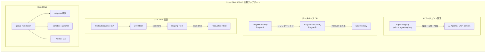

# Cloud SDK: バージョン 575.0.0 リリース

**リリース日**: 2026-06-30

**サービス**: Cloud SDK (gcloud CLI)

**機能**: Cloud SDK 575.0.0 - 多数のサービスにわたる新コマンド・GA 昇格・機能追加

**ステータス**: GA / Beta / Alpha (サービスにより異なる)

[このアップデートのインフォグラフィックを見る](https://takech9203.github.io/google-cloud-news-summary/20260630-cloud-sdk-575-0-0.html)

## 概要

Cloud SDK 575.0.0 が 2026 年 6 月 30 日にリリースされた。本リリースは 30 以上のサービスにまたがる大規模なアップデートであり、Agent Registry の新コマンドグループ追加、AlloyDB のクロスリージョンフェイルオーバー対応、Cloud Run の多数の機能改善、Compute Engine の GA 昇格、GKE Hub Fleet ロールアウトの GA 昇格など、インフラストラクチャからAI エージェント管理まで幅広い改善が含まれている。

特に注目すべきは、AI エージェントのガバナンスを実現する Agent Registry コマンドグループの追加、エンタープライズデータベースの災害復旧を強化する AlloyDB クロスリージョンフェイルオーバー機能、および GKE クラスタの段階的アップグレードを管理する Fleet Rollouts の GA 昇格である。これらの機能は、マルチリージョン・マルチクラスタ環境の運用を大幅に改善する。

**アップデート前の課題**

- Agent Registry の管理はコンソールや REST API に限定されており、CLI からの自動化が困難だった
- AlloyDB のクロスリージョンフェイルオーバーは手動でのプロモーション操作のみで、自動フェイルオーバーの仕組みがなかった
- GKE Fleet ロールアウトはプレビュー段階であり、本番環境での段階的クラスタアップグレードに対する公式サポートが限定的だった
- Cloud Run のデプロイ前検証にはサードパーティツールや独自スクリプトが必要だった
- Compute Engine の regional MIG resize-requests はベータ段階であり、GA ワークロードでの利用に制約があった

**アップデート後の改善**

- `gcloud agent-registry` コマンドグループにより、AI エージェント・MCP サーバー・エンドポイントの CLI 管理が可能に
- `--failover` フラグにより AlloyDB クロスリージョンフェイルオーバーが CLI から直接実行可能に
- Fleet Rollouts/RolloutSequences が GA となり、本番環境での段階的クラスタアップグレードが正式サポート
- Cloud Run に `--dry-run` フラグが追加され、デプロイ前の変更確認が可能に
- regional MIG resize-requests が GA に昇格し、リージョン MIG での VM 一括作成が正式サポート

## アーキテクチャ図



Cloud SDK 575.0.0 の主要アップデートの関係性を示す。Agent Registry による AI エージェント管理、AlloyDB のクロスリージョン DR、GKE Fleet の段階的ロールアウト、Cloud Run のデプロイ改善が今回のハイライトである。

## サービスアップデートの詳細

### 主要機能

1. **Agent Registry コマンドグループの追加**
   - `gcloud agent-registry` コマンドグループが新規追加された
   - AI エージェント、MCP サーバー、エンドポイントの登録・検索・管理が CLI から可能に
   - Agent Registry は Gemini Enterprise Agent Platform のガバナンスレイヤーとして、組織内のエージェント統合管理を実現する
   - `agents list`, `agents describe`, `services update` などのサブコマンドを提供
   - IAM ロール: `roles/agentregistry.admin`, `roles/agentregistry.editor`, `roles/agentregistry.viewer`

2. **AlloyDB クロスリージョンフェイルオーバー (`--failover` フラグ)**
   - `gcloud beta alloydb clusters promote` に `--failover` フラグが追加された
   - セカンダリクラスタをプライマリに昇格させる際に、フェイルオーバーモードを指定可能に
   - 災害復旧 (DR) シナリオにおいて、リージョン障害時のクロスリージョン切り替えを CLI から実行可能
   - AlloyDB のクロスリージョンレプリケーションは最大 5 つのセカンダリクラスタをサポート
   - ゼロデータロスのスイッチオーバーも引き続きサポート

3. **GKE Hub Fleet Rollouts / RolloutSequences GA 昇格**
   - `gcloud container fleet rollouts` が GA に昇格
   - `gcloud container fleet rolloutsequences` が GA に昇格
   - フリートベースのロールアウトシーケンスにより、開発 → ステージング → 本番の段階的クラスタアップグレードが正式サポート
   - 各フリート間で soak time を設定し、アップグレードの安全性を確保可能
   - Lightweight membership によりロールアウトシーケンス専用のフリート利用も可能

4. **Cloud Run の多数の改善**
   - `--dry-run` フラグ: `deploy`, `update`, `delete` の実行前に変更内容を確認可能 (Beta)
   - `--sandbox-launcher` フラグ: セキュリティ強化されたサンドボックス環境でのコンテナ起動 (Beta)
   - `--workdir` フラグ: コンテナのワーキングディレクトリ指定が GA に昇格
   - `--tail` フラグ: ジョブ実行のログをリアルタイムで追跡可能 (Beta)
   - `describe-latest` コマンド: 最新のジョブ実行情報を取得
   - Regional inference が Beta に昇格: リージョン未指定時に全リージョンからリソースを検索

5. **Compute Engine GA 昇格・新コマンド群**
   - Regional MIG resize-requests (`create`, `cancel`, `delete`, `describe`, `list`) が GA に昇格
   - `gcloud compute instances set-machine-resources` が全トラック (alpha/beta/GA) で追加
   - `gcloud compute target-https-proxies set-quic-override` が追加
   - `gcloud compute network-attachments set-iam-policy` が追加
   - `gcloud compute instances list-referrers` が追加
   - 各種 `test-iam-permissions` コマンドの追加 (storage-pools, reservations, instance-templates, interconnects attachments groups)

### その他の注目アップデート

6. **Apigee API Proxy インポート**
   - `gcloud apigee apis import` コマンドが追加
   - ZIP アーカイブまたは YAML テンプレート形式で API Proxy バンドルをアップロード可能

7. **Cloud Data Lineage プロセス管理**
   - `gcloud datalineage processes` コマンドグループが新規追加
   - データリネージのプロセスを CLI から管理可能

8. **Cloud Storage のデータ整合性強化**
   - ストリーミングダウンロードで MD5 ハッシュ検証が追加 (`cp`, `mv`, `cat`)
   - RAPID ストレージでのストリーミングアップロード・ダウンロード対応

9. **Cluster Director 破壊的変更**
   - `staticNodeCount` のデフォルト値 1 が廃止され、明示的な指定が必須に

10. **Kubernetes Engine カスタムイメージ GA 昇格**
    - `--image` および `--image-project` フラグがクラスタ・ノードプール作成で GA に昇格

## 技術仕様

### 主要な新コマンド一覧

| コマンド | トラック | 説明 |
|---------|---------|------|
| `gcloud agent-registry` | GA | Agent Registry リソースの管理 |
| `gcloud datalineage processes` | GA | データリネージプロセスの管理 |
| `gcloud apigee apis import` | GA | API Proxy バンドルのインポート |
| `gcloud compute instances set-machine-resources` | Alpha/Beta/GA | インスタンスのマシンリソース設定 |
| `gcloud compute target-https-proxies set-quic-override` | Beta/GA | HTTPS プロキシの QUIC 設定 |
| `gcloud run jobs executions describe-latest` | GA | 最新ジョブ実行の詳細取得 |

### GA 昇格一覧

| 機能 | 以前のステータス | 説明 |
|------|----------------|------|
| Fleet Rollouts / RolloutSequences | Beta → GA | フリートベースの段階的ロールアウト |
| Regional MIG resize-requests | Beta → GA | リージョン MIG での VM 一括作成 |
| Cloud Run `--workdir` | Beta → GA | コンテナワーキングディレクトリ指定 |
| Cloud Workstations `--pd-disk-size` | Beta → GA | PD ディスクサイズ指定 |
| GKE カスタムイメージ (`--image`, `--image-project`) | Beta → GA | ノードプールのカスタムイメージ |
| Cloud Access Context Manager サービスアカウント | Beta → GA | cloud-bindings でのサービスアカウント指定 |

### 破壊的変更

| サービス | 変更内容 | 対応方法 |
|---------|---------|---------|
| Cluster Director | `staticNodeCount` のデフォルト値 1 が廃止 | 明示的に `staticNodeCount` を指定する |

## 設定方法

### 前提条件

1. Cloud SDK がインストールされていること
2. 認証済みであること (`gcloud auth login`)

### 手順

#### ステップ 1: Cloud SDK のアップデート

```bash
# Cloud SDK を最新版 (575.0.0) にアップデート
gcloud components update
```

#### ステップ 2: Agent Registry の利用開始

```bash
# Agent Registry API の有効化
gcloud services enable agentregistry.googleapis.com --project=PROJECT_ID

# エージェント一覧の確認
gcloud agent-registry agents list \
  --project=PROJECT_ID \
  --location=REGION
```

#### ステップ 3: AlloyDB クロスリージョンフェイルオーバー

```bash
# セカンダリクラスタのフェイルオーバー昇格
gcloud beta alloydb clusters promote SECONDARY_CLUSTER_ID \
  --region=REGION_ID \
  --project=PROJECT_ID \
  --failover
```

#### ステップ 4: Cloud Run dry-run の利用

```bash
# デプロイ前の変更確認
gcloud beta run deploy SERVICE_NAME \
  --image=IMAGE_URL \
  --dry-run
```

## メリット

### ビジネス面

- **AI エージェントのガバナンス強化**: Agent Registry により組織全体のエージェント資産を一元管理でき、重複開発の削減とセキュリティポリシーの統一が可能
- **災害復旧の迅速化**: AlloyDB クロスリージョンフェイルオーバーにより、リージョン障害時の復旧時間を大幅短縮
- **本番環境の安定性向上**: Fleet Rollouts GA により、GKE クラスタアップグレードのリスクを段階的に検証してから本番適用可能

### 技術面

- **デプロイの安全性向上**: Cloud Run `--dry-run` により、本番デプロイ前に変更の影響を確認可能
- **大規模 VM プロビジョニングの GA サポート**: Regional MIG resize-requests の GA 昇格により、大規模バッチワークロードやHPC での VM 一括確保が正式サポート
- **CLI 自動化の拡充**: Agent Registry、Data Lineage、Apigee Import など新コマンドにより CI/CD パイプラインからの自動化が拡大

## デメリット・制約事項

### 制限事項

- AlloyDB `--failover` フラグは Beta トラックのみで利用可能 (GA トラックでは未対応)
- Cloud Run `--dry-run` および `--sandbox-launcher` は Beta トラックのみ
- Cluster Director の `staticNodeCount` デフォルト値廃止は破壊的変更であり、既存のスクリプトに影響する可能性がある

### 考慮すべき点

- Fleet Rollouts を本番導入する際は、全クラスタが同一リリースチャネルおよび同一マイナーバージョンである必要がある
- Agent Registry は現時点でプロジェクトレベルのスコープであり、組織レベルの一元管理には各プロジェクトでの API 有効化が必要
- Cloud Run の Regional inference (Beta) は全リージョンを検索するため、レスポンスタイムに影響する可能性がある

## ユースケース

### ユースケース 1: マルチエージェント環境のガバナンス

**シナリオ**: 複数のチームが独自に AI エージェントを開発・デプロイしている組織で、エージェントの一覧管理・重複検出・セキュリティ監査を行いたい。

**実装例**:
```bash
# 全エージェントの一覧取得
gcloud agent-registry agents list \
  --project=my-project \
  --location=us-central1

# 特定エージェントの詳細確認
gcloud agent-registry agents describe my-support-agent \
  --project=my-project \
  --location=us-central1

# エージェントのエンドポイント更新
gcloud agent-registry services update my-support-agent \
  --project=my-project \
  --location=us-central1 \
  --interfaces=url=https://new-api.example.com/agent,protocolBinding=HTTP_JSON
```

**効果**: 組織全体のエージェント資産の可視化、重複実装の発見、セキュリティポリシーの統一適用が可能に。

### ユースケース 2: AlloyDB マルチリージョン DR

**シナリオ**: ミッションクリティカルなデータベースワークロードにおいて、リージョン障害時に自動的にセカンダリリージョンにフェイルオーバーさせたい。

**実装例**:
```bash
# セカンダリクラスタへのフェイルオーバー
gcloud beta alloydb clusters promote my-secondary-cluster \
  --region=us-east4 \
  --project=my-project \
  --failover
```

**効果**: RTO (Recovery Time Objective) の短縮と、DR 手順の自動化による運用負荷軽減。

### ユースケース 3: GKE 段階的アップグレード

**シナリオ**: 数百のクラスタを運用する組織で、新バージョンを dev → staging → production の順に段階的に適用し、各段階で検証時間を確保したい。

**効果**: バージョンアップに起因する障害の早期検出と、本番環境への影響最小化。

## 関連サービス・機能

- **Agent Registry / Gemini Enterprise Agent Platform**: AI エージェントの統合管理基盤
- **AlloyDB for PostgreSQL**: クロスリージョンレプリケーションによる高可用性データベース
- **GKE Fleet Management**: マルチクラスタ管理と段階的アップグレード
- **Cloud Run**: サーバーレスコンテナプラットフォーム
- **Compute Engine MIG**: マネージドインスタンスグループによる VM 自動管理
- **Cloud Storage**: RAPID ストレージクラスによる高速データアクセス

## 参考リンク

- [インフォグラフィック](https://takech9203.github.io/google-cloud-news-summary/20260630-cloud-sdk-575-0-0.html)
- [公式リリースノート](https://docs.cloud.google.com/release-notes#June_30_2026)
- [Cloud SDK リリースノート](https://cloud.google.com/sdk/docs/release-notes)
- [Agent Registry ドキュメント](https://cloud.google.com/agent-registry/docs)
- [AlloyDB クロスリージョンレプリケーション](https://cloud.google.com/alloydb/docs/cross-region-replication/about-cross-region-replication)
- [GKE Rollout Sequencing](https://cloud.google.com/kubernetes-engine/docs/concepts/rollout-sequencing/about-rollout-sequencing)
- [Cloud Run ドキュメント](https://cloud.google.com/run/docs)
- [Compute Engine MIG resize-requests](https://cloud.google.com/compute/docs/instance-groups/manage-resize-requests-mig)

## まとめ

Cloud SDK 575.0.0 は、AI エージェント管理 (Agent Registry)、データベース DR (AlloyDB クロスリージョンフェイルオーバー)、コンテナオーケストレーション (GKE Fleet Rollouts GA) という 3 つの柱で、エンタープライズ運用の成熟度を大きく引き上げるリリースである。特に Agent Registry の追加は、急速に拡大する AI エージェント活用において組織的なガバナンスを実現する重要な一歩であり、早期に導入を検討すべきである。まず `gcloud components update` で最新版に更新し、Cluster Director の破壊的変更への対応を確認した上で、各チームの CI/CD パイプラインを更新することを推奨する。

---

**タグ**: #CloudSDK #gcloud #AgentRegistry #AlloyDB #CloudRun #ComputeEngine #GKE #FleetManagement #DisasterRecovery #GA昇格
