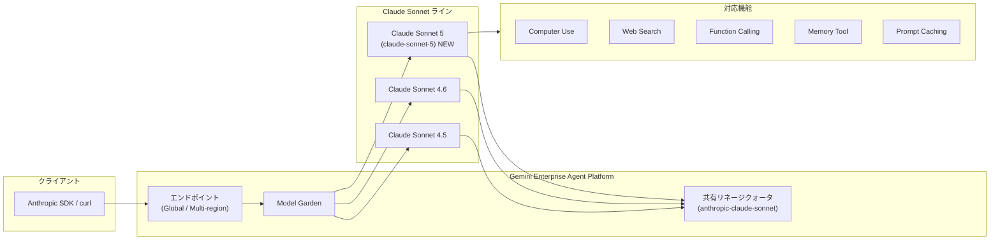

# Gemini Enterprise Agent Platform: Claude Sonnet 5 が Model Garden で利用可能に

**リリース日**: 2026-06-30

**サービス**: Gemini Enterprise Agent Platform

**機能**: Claude Sonnet 5 (Model Garden パートナーモデル)

**ステータス**: GA (一般提供)

[このアップデートのインフォグラフィックを見る](https://takech9203.github.io/google-cloud-news-summary/20260630-gemini-agent-platform-claude-sonnet-5.html)

## 概要

Anthropic の最新モデル Claude Sonnet 5 が、Gemini Enterprise Agent Platform の Model Garden でパートナーモデルとして一般提供 (GA) を開始した。Model ID は `claude-sonnet-5` で、コーディング、エージェント、プロフェッショナルワークに特化した Anthropic の中規模モデルの最新バージョンとなる。

Claude Sonnet 5 は Sonnet ラインの次世代モデルであり、前世代の Claude Sonnet 4.6 から進化した機能を提供する。入力として Text、Image、PDF をサポートし、最大 100 万トークンのコンテキスト長と 128,000 トークンの最大出力を備えている。Computer Use、Web Search、Function Calling、Extended Thinking (暗黙的)、Prompt Caching、Memory Tool など、幅広い機能に対応する。

Google Cloud ユーザーは、既存の Gemini Enterprise Agent Platform のエンドポイントを通じて Claude Sonnet 5 を利用できる。Anthropic SDK または curl コマンドを使用したリクエスト送信が可能で、Google Cloud のセキュリティ、ガバナンス、請求機能と統合された形でモデルを活用できる。

**アップデート前の課題**

- Claude Sonnet 4.6 が Sonnet ラインの最新版であり、それ以降の Sonnet モデルの進化を Google Cloud 上で活用できなかった
- コーディングやエージェントワークフローでより高い性能を求めるユーザーは、Opus ラインの高コストモデルを選択する必要があった
- Memory Tool のような最新機能は一部のモデルでのみ利用可能だった

**アップデート後の改善**

- Sonnet ラインの最新モデルである Claude Sonnet 5 が利用可能になり、コーディング・エージェント・プロフェッショナルワークの性能が向上
- Computer Use、Web Search、Memory Tool を含む最新の全機能セットに対応
- 共有モデルリネージクォータにより、新バージョンの追加時に別途クォータ申請が不要

## アーキテクチャ図



Claude Sonnet 5 は Gemini Enterprise Agent Platform のパートナーモデルとして、既存のエンドポイントインフラストラクチャを通じて提供される。同じ Sonnet リネージ内のモデルは共有クォータバケットを使用する。

## サービスアップデートの詳細

### 主要機能

1. **Computer Use 対応**
   - デスクトップ操作やブラウザ操作をモデルが実行可能
   - GUI ベースのタスク自動化に活用

2. **Web Search 統合**
   - リアルタイムの Web データでモデルの知識を補強
   - RAG アプリケーションでのソース引用に最適
   - サードパーティの検索プロバイダーを使用

3. **Memory Tool**
   - エージェントがセッション間で情報を記憶・参照可能
   - 長期的なコンテキスト保持により、複雑なワークフローを支援

4. **Function Calling (ツール使用)**
   - 外部 API やツールとの連携
   - エージェントアプリケーションの構築に不可欠

5. **Prompt Caching**
   - 頻繁に使用されるプロンプトのキャッシュによるコスト削減とレイテンシ改善

6. **Batch Predictions**
   - 大量リクエストの一括処理に対応

## 技術仕様

### モデル基本情報

| 項目 | 詳細 |
|------|------|
| Model ID | `claude-sonnet-5` |
| Launch Stage | GA (一般提供) |
| リリース日 | 2026-06-30 |
| 退役予定日 | 2026-12-24 以降 |
| サポート入力 | Text, Image, PDF |
| サポート出力 | Text |
| 最大入力トークン | 1,000,000 |
| 最大出力トークン | 128,000 |

### 使用方法 (Anthropic SDK)

```python
import anthropic

client = anthropic.AnthropicVertex(
    region="us-east5",
    project_id="your-project-id",
)

message = client.messages.create(
    model="claude-sonnet-5",
    max_tokens=1024,
    messages=[
        {"role": "user", "content": "Hello, Claude Sonnet 5!"}
    ],
)
print(message.content)
```

## 設定方法

### 前提条件

1. Agent Platform API (`aiplatform.googleapis.com`) が有効化されていること
2. パートナーモデルの使用に必要な権限が付与されていること
3. Model Garden で Claude Sonnet 5 のモデルカードから「Enable」をクリックし、利用規約に同意していること

### 手順

#### ステップ 1: モデルの有効化

Google Cloud Console で Model Garden にアクセスし、Claude Sonnet 5 のモデルカードから有効化する。

```
https://console.cloud.google.com/agent-platform/publishers/anthropic/model-garden/claude-sonnet-5
```

#### ステップ 2: Anthropic SDK のインストール

```bash
pip install anthropic[vertex]
```

#### ステップ 3: API リクエストの送信

```bash
curl -X POST \
  -H "Authorization: Bearer $(gcloud auth print-access-token)" \
  -H "Content-Type: application/json" \
  "https://us-east5-aiplatform.googleapis.com/v1/projects/PROJECT_ID/locations/us-east5/publishers/anthropic/models/claude-sonnet-5:rawPredict" \
  -d '{
    "anthropic_version": "vertex-2023-10-16",
    "messages": [{"role": "user", "content": "Hello"}],
    "max_tokens": 1024
  }'
```

## メリット

### ビジネス面

- **モデル選択肢の拡大**: Google Cloud 上で Anthropic の最新 Sonnet モデルを利用でき、ユースケースに最適なモデルを選択可能
- **統合請求**: Google Cloud の既存の請求アカウントで一元管理、追加の Anthropic 契約が不要
- **エンタープライズガバナンス**: Google Cloud の IAM、VPC Service Controls、監査ログなどのセキュリティ機能と統合

### 技術面

- **大容量コンテキスト**: 100 万トークンの入力により、大規模なコードベースやドキュメントの処理が可能
- **高スループット**: グローバルエンドポイントで QPM 2,500、入力 TPM 25,000,000 の高いクォータ制限
- **共有リネージクォータ**: 新モデルバージョンの追加時にクォータ再申請が不要で、運用負荷を軽減
- **マルチモーダル入力**: テキスト、画像、PDF をネイティブにサポート

## デメリット・制約事項

### 制限事項

- Anthropic の再販禁止ポリシーにより、特定のリセラーが管理する請求アカウントでは利用できない場合がある
- Web Search 機能はパブリックインターネットアクセスが必要で、組織ポリシーによるデフォルト無効化あり
- 画像の最大ファイルサイズは 5 MB、1 リクエストあたり最大 100 画像

### 考慮すべき点

- 共有リネージクォータのため、同じ Sonnet リネージの他バージョン (4.5, 4.6 など) とクォータを共有する
- Assured Workloads 環境では追加の例外設定が必要な場合がある
- 30 日間のログ記録 (プロンプトおよび応答) の有効化が Anthropic により推奨されている

## ユースケース

### ユースケース 1: エージェント型コーディングアシスタント

**シナリオ**: 大規模コードベースの理解と修正を自動化するエージェントの構築

**実装例**:
```python
import anthropic

client = anthropic.AnthropicVertex(region="us-east5", project_id="my-project")

# Computer Use と Function Calling を組み合わせたエージェント
message = client.messages.create(
    model="claude-sonnet-5",
    max_tokens=64000,
    tools=[
        {"type": "computer_20241022", "name": "computer", "display_width_px": 1920, "display_height_px": 1080},
        {"type": "function", "function": {"name": "run_tests", "description": "Run test suite"}}
    ],
    messages=[{"role": "user", "content": "Fix the failing tests in the auth module"}],
)
```

**効果**: 100 万トークンのコンテキストにより、大規模リポジトリ全体を把握した上でのコード修正が可能

### ユースケース 2: ドキュメント分析と要約

**シナリオ**: 大量の PDF ドキュメントを処理し、構造化された要約を生成する業務

**効果**: PDF ネイティブサポートと大容量コンテキストにより、複数ドキュメントの横断的分析が可能。Batch Predictions を活用すれば大量処理も効率的に実行できる

### ユースケース 3: Web 調査を伴うリサーチエージェント

**シナリオ**: 最新の市場動向や技術情報を Web から収集し、分析レポートを生成するエージェント

**効果**: Web Search 機能により、モデルの知識カットオフ日以降の最新情報も取得・統合でき、常に最新のリサーチ結果を提供

## 料金

料金の詳細は [Gemini Enterprise Agent Platform の料金ページ](https://cloud.google.com/gemini-enterprise-agent-platform/generative-ai/pricing) を参照。

## 利用可能リージョン

| カテゴリ | リージョン |
|----------|-----------|
| モデル利用 (Fixed Quota & Provisioned Throughput) | US Multi-region, EU Multi-region, Global endpoint |
| ML 処理 | US Multi-region, EU Multi-region, Asia Pacific (asia-southeast1) |

### クォータ制限

| エンドポイント | QPM | 入力 TPM | 出力 TPM | コンテキスト長 |
|---------------|-----|----------|----------|---------------|
| US Multi-region | 1,250 | 12,500,000 | 1,250,000 | 1,000,000 |
| EU Multi-region | 1,250 | 12,500,000 | 1,250,000 | 1,000,000 |
| Global endpoint | 2,500 | 25,000,000 | 2,500,000 | 1,000,000 |

## 関連サービス・機能

- **Claude Fable 5**: Anthropic の最上位モデル。自律的な知識ワークやコーディングに特化し、複数日にわたるプロジェクトに対応 (2026-06-09 GA)
- **Claude Opus 4.8**: 高知能 Opus モデル。より深い推論が必要なエンタープライズワークフロー向け (2026-05-28 GA)
- **Claude Sonnet 4.6**: Sonnet ラインの前世代モデル。既存ワークロードからの移行候補元
- **Gemini 3.1 Flash**: Google 独自の高速モデル。低レイテンシが求められるユースケースに最適
- **Agent Platform Memory Bank & Sessions**: エージェントの長期記憶とセッション管理機能 (2026-06-17 GA)

## 参考リンク

- [インフォグラフィック](https://takech9203.github.io/google-cloud-news-summary/20260630-gemini-agent-platform-claude-sonnet-5.html)
- [公式リリースノート](https://docs.cloud.google.com/release-notes#June_30_2026)
- [Claude Sonnet 5 ドキュメント](https://docs.cloud.google.com/gemini-enterprise-agent-platform/models/partner-models/claude/sonnet-5)
- [Claude モデルの使用方法](https://docs.cloud.google.com/gemini-enterprise-agent-platform/models/partner-models/claude/use-claude)
- [パートナーモデル概要](https://docs.cloud.google.com/gemini-enterprise-agent-platform/models/partner-models/use-partner-models)
- [料金ページ](https://cloud.google.com/gemini-enterprise-agent-platform/generative-ai/pricing)
- [クォータ管理](https://docs.cloud.google.com/gemini-enterprise-agent-platform/models/partner-models/claude/quotas)

## まとめ

Claude Sonnet 5 の Model Garden での一般提供は、Google Cloud ユーザーに Anthropic の最新中規模モデルへのアクセスを提供する重要なアップデートである。100 万トークンのコンテキスト、Computer Use、Memory Tool 対応など、エージェント構築に必要な全機能を備えており、コーディング支援やプロフェッショナルワークの自動化に即座に活用可能である。既存の Sonnet ユーザーは共有リネージクォータにより追加申請なく移行でき、迅速な導入が期待できる。

---

**タグ**: #GeminiEnterpriseAgentPlatform #ModelGarden #Claude #Sonnet5 #Anthropic #PartnerModels #AI #LLM #GA
