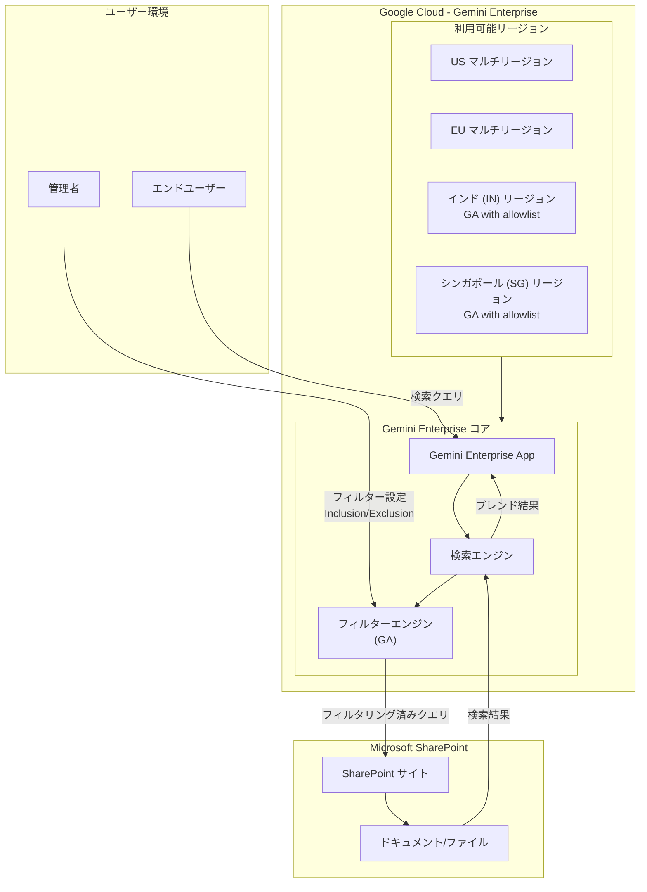

# Gemini Enterprise: SharePoint フィルター GA 化およびインド・シンガポールリージョン対応

**リリース日**: 2026-06-30

**サービス**: Gemini Enterprise

**機能**: Microsoft SharePoint データストアフィルターの GA 化 / インド・シンガポールリージョンの追加

**ステータス**: GA (SharePoint フィルター) / GA with allowlist (インド・シンガポールリージョン)

📊 [このアップデートのインフォグラフィックを見る](https://takech9203.github.io/google-cloud-news-summary/20260630-gemini-enterprise-sharepoint-filters.html)

## 概要

Gemini Enterprise において、2 つの重要なアップデートが発表されました。1 つ目は、Microsoft SharePoint フェデレーテッドデータストア向けのフィルター機能が一般提供 (GA) となったこと。2 つ目は、Gemini Enterprise アプリがインド (IN) およびシンガポール (SG) リージョンで利用可能になったことです。

SharePoint フィルター機能の GA 化により、管理者はフェデレーテッド検索接続において、どの SharePoint サイトやパスの情報を検索対象に含めるか、または除外するかを細かく制御できるようになりました。これにより、機密情報の保護と検索精度の向上を両立できます。

インド・シンガポールリージョンの追加は、アジア太平洋地域のデータレジデンシー要件を持つ組織にとって大きな進展です。at-rest データレジデンシー (DRZ) と機械学習処理 (MLP) がリージョン内で完結し、最新の Gemini 3.5 Flash モデルもこれらのリージョンで利用可能です。

**アップデート前の課題**

- SharePoint フェデレーテッドデータストアのフィルター機能はプレビュー段階であり、本番環境での利用に制約があった
- アジア太平洋地域 (特にインド・シンガポール) のユーザーは、データレジデンシー要件を満たすリージョンで Gemini Enterprise を利用できなかった
- インド・シンガポールの規制要件を持つ企業は、US/EU リージョンへのデータ転送が必要であった

**アップデート後の改善**

- SharePoint フィルターが GA となり、本番ワークロードで安定して利用可能になった
- インド (IN) とシンガポール (SG) のリージョンで at-rest DRZ と MLP が利用可能になった
- Gemini 3.5 Flash モデルがインド・シンガポールリージョンでリージョン内処理として利用可能になった
- アジア太平洋地域の規制要件 (データローカライゼーション) への準拠が容易になった

## アーキテクチャ図



Gemini Enterprise が Microsoft SharePoint フェデレーテッドデータストアに対してフィルターを適用し、リージョン内でデータ処理を完結させるアーキテクチャを示しています。管理者がフィルターを設定し、エンドユーザーの検索クエリが適切にフィルタリングされた上で SharePoint に送信されます。

## サービスアップデートの詳細

### 主要機能

1. **SharePoint フェデレーテッドデータストア向けフィルター (GA)**
   - Inclusion フィルター (`admin_filter`): 特定の SharePoint サイトやパスのみを検索対象に含める
   - Exclusion フィルター (`admin_exclusion_filter`): 特定のサイトやパスを検索対象から除外する
   - レガシーフィルター (`structured_search_filter`): 既存の API 設定済みコネクタとの後方互換性を維持

2. **フィルターキーによる細粒度制御**
   - Site フィルター: SharePoint サイト URL レベルでのフィルタリング
   - Path フィルター: サブサイト、フォルダー、ファイルレベルでの細粒度制御
   - フィルターの組み合わせ (例: サイト全体を含めつつ、特定パスを除外) が可能

3. **インド・シンガポールリージョン対応 (GA with allowlist)**
   - at-rest データレジデンシー (DRZ) のリージョン内保証
   - 機械学習処理 (MLP) のリージョン内実行
   - Gemini 3.5 Flash モデルのリージョン内利用

## 技術仕様

### フィルタータイプと動作

| フィルタータイプ | パラメータ名 | 用途 |
|------|------|------|
| Inclusion フィルター | `admin_filter` | 検索対象の包含指定 |
| Exclusion フィルター | `admin_exclusion_filter` | 検索対象からの除外指定 |
| レガシーフィルター | `structured_search_filter` | 既存コネクタとの互換性 |

### フィルターキー

| フィルター名 | キー | URL 形式 |
|------|------|------|
| Site | `Site` | `https://{tenant}.sharepoint.com/sites/{site-name}` |
| Path | `Path` | `https://{tenant}.sharepoint.com/sites/{site-name}/Documents/` |

### フィルター組み合わせの動作

| 組み合わせ | 動作 |
|------|------|
| Path (Inclusion) + Site (空) | Path inclusion フィルターのみ適用 |
| Site (Inclusion) + Path (空) | Site inclusion フィルターのみ適用 |
| Site (Inclusion) + Path (Exclusion) | サイト全体を含めつつ特定パスを除外 |
| Path (Inclusion) + Site (Inclusion) | 両フィルターの交差部分のみ含む |
| Site (Exclusion) + Path (Exclusion) | いずれかに一致するパスを全て除外 |

### リージョン対応状況

| リージョン | ステータス | at-rest DRZ | MLP | Gemini 3.5 Flash |
|------|------|------|------|------|
| US マルチリージョン | GA | 対応 | 対応 | 対応 |
| EU マルチリージョン | GA | 対応 | 対応 | 対応 |
| インド (IN) | GA with allowlist | 対応 | 対応 | 対応 |
| シンガポール (SG) | GA with allowlist | 対応 | 対応 | 対応 |
| カナダ (CA) | GA with allowlist | 対応 | 対応 | - |

### フィルター設定例 (API)

```json
{
  "params": {
    "admin_filter": {
      "Site": [
        "https://contoso.sharepoint.com/sites/engineering",
        "https://contoso.sharepoint.com/sites/product"
      ]
    },
    "admin_exclusion_filter": {
      "Path": [
        "https://contoso.sharepoint.com/sites/engineering/Confidential/"
      ]
    }
  }
}
```

## 設定方法

### 前提条件

1. Gemini Enterprise のサブスクリプション (Standard 以上推奨)
2. Microsoft Entra ID での OAuth 2.0 アプリケーション登録済み
3. Discovery Engine Editor ロール (`roles/discoveryengine.editor`) の付与
4. Microsoft SharePoint の API パーミッション設定 (`Sites.Search.All`, `AllSites.Read`)

### 手順

#### ステップ 1: フィルター付きデータストアの作成 (コンソール)

Google Cloud コンソールからの設定:

1. ナビゲーションメニューから **Data stores** をクリック
2. Microsoft SharePoint データストアを選択
3. **Federated search** モードを選択
4. **Advanced options** セクションで Inclusion/Exclusion フィルターを設定
5. Site URL フィルターまたは Path フィルターに対象 URL を入力
6. **Save** をクリック

#### ステップ 2: API によるフィルター追加・更新

```bash
curl -X PATCH \
  -H "Authorization: Bearer $(gcloud auth print-access-token)" \
  -H "Content-Type: application/json" \
  -H "X-Goog-User-Project: PROJECT_ID" \
  "https://ENDPOINT_LOCATION-discoveryengine.googleapis.com/v1alpha/projects/PROJECT_ID/locations/LOCATION/collections/COLLECTION_ID/dataConnector?updateMask=params" \
  -d '{
    "params": {
      "admin_filter": {
        "Site": [
          "https://contoso.sharepoint.com/sites/engineering"
        ]
      },
      "admin_exclusion_filter": {
        "Path": [
          "https://contoso.sharepoint.com/sites/engineering/Confidential/"
        ]
      }
    }
  }'
```

`ENDPOINT_LOCATION` には `us`, `eu`, または `global` を指定します。

#### ステップ 3: フィルター設定の検証

```bash
curl -X GET \
  -H "Authorization: Bearer $(gcloud auth print-access-token)" \
  -H "X-Goog-User-Project: PROJECT_ID" \
  "https://ENDPOINT_LOCATION-discoveryengine.googleapis.com/v1alpha/projects/PROJECT_ID/locations/LOCATION/collections/COLLECTION_ID/dataConnector"
```

レスポンスの `params` 内の `admin_filter` / `admin_exclusion_filter` フィールドを確認します。

#### ステップ 4: インド・シンガポールリージョンの利用開始

1. Google アカウントチームに連絡し、allowlist への追加を依頼
2. アクセスが付与されたら、データストア作成時にリージョンとして `in` または `sg` を選択
3. API エンドポイントを該当リージョンに変更

## メリット

### ビジネス面

- **データガバナンスの強化**: SharePoint フィルターにより、機密情報が意図しない検索結果に表示されることを防止できる
- **アジア太平洋地域でのコンプライアンス対応**: インド・シンガポールリージョンにより、PDPA (シンガポール個人データ保護法) や IT Act (インド情報技術法) などの地域規制への準拠が容易になる
- **エンドユーザー体験の向上**: リージョン内処理によるレイテンシー低減と、フィルターによる関連性の高い検索結果の提供

### 技術面

- **細粒度のアクセス制御**: Site レベルと Path レベルでのフィルター組み合わせにより、柔軟なデータスコープ制御が可能
- **API によるプログラマティック管理**: REST API を通じたフィルター設定の自動化が可能
- **データレジデンシー保証**: at-rest DRZ と MLP の両方がリージョン内で完結するため、データ越境転送のリスクを排除

## デメリット・制約事項

### 制限事項

- インド・シンガポールリージョンは GA with allowlist であり、利用には Google アカウントチームへの連絡が必要
- インド (IN) リージョンでは Gemini 2.5 Pro モデルが利用できない
- インド (IN) リージョンでは Model Armor の MLP が非対応
- CMEK (顧客管理暗号鍵) はインカントリーリージョンでは利用不可
- Dynamic facets はグローバルリージョンでのみ利用可能
- Grounding with Google Search はグローバルリージョンでのみ利用可能
- Web Grounding for Enterprise はインカントリーリージョンでは at-rest DRZ / MLP 非対応

### 考慮すべき点

- フィルターの Inclusion と Exclusion を切り替える際は、不要になったフィルターを明示的に空に設定する必要がある
- フィルター更新時は、既存のフィルター設定も含めた全フィルターをリクエストボディに含める必要がある
- フェデレーテッド検索ではクエリ文字列が Microsoft API に送信されるため、Microsoft 側のプライバシーポリシーも確認が必要
- LLM によるクエリ書き換えにより、セッション履歴の一部が Microsoft API に送信される可能性がある

## ユースケース

### ユースケース 1: 部門別情報アクセス制御

**シナリオ**: 大手企業で、人事部門の機密情報を含む SharePoint サイトを全社検索から除外しつつ、技術文書サイトのみを検索対象としたい。

**実装例**:
```json
{
  "params": {
    "admin_filter": {
      "Site": [
        "https://company.sharepoint.com/sites/engineering",
        "https://company.sharepoint.com/sites/documentation"
      ]
    },
    "admin_exclusion_filter": {
      "Path": [
        "https://company.sharepoint.com/sites/engineering/HR-Confidential/"
      ]
    }
  }
}
```

**効果**: エンジニアリングチームは必要な技術ドキュメントに素早くアクセスでき、機密性の高い人事情報は検索結果から完全に除外される。

### ユースケース 2: インドでのデータレジデンシー準拠

**シナリオ**: インドに拠点を持つ金融サービス企業が、インド準備銀行 (RBI) のデータローカライゼーション規制に準拠しつつ、Gemini Enterprise の AI 機能を活用したい。

**効果**: インド (IN) リージョンを利用することで、顧客データの at-rest 保存と ML 処理がインド国内で完結し、RBI のデータローカライゼーション要件を満たしながら Gemini Enterprise の全機能を活用できる。

### ユースケース 3: APAC 拠点でのレイテンシー最適化

**シナリオ**: シンガポールを APAC ハブとする多国籍企業が、従業員向け AI アシスタントのレスポンス時間を改善したい。

**効果**: シンガポール (SG) リージョンを利用することで、APAC 地域の従業員は低レイテンシーで Gemini Enterprise を利用でき、Gemini 3.5 Flash モデルによる高速なレスポンスを体験できる。

## 料金

Gemini Enterprise はサブスクリプションベースのシート課金です。

### 料金例

| エディション | 月額料金 (1 シートあたり) |
|--------|-----------------|
| Business | $21 USD から |
| Standard | $30 USD から |
| Plus | $30 USD から (上位機能付き) |
| Frontline | Standard/Plus のアドオン |

注: SharePoint フィルター機能は全エディションの SharePoint コネクタ利用者が使用可能です。リージョン利用に追加料金は発生しませんが、allowlist への登録が必要です。

## 利用可能リージョン

Gemini Enterprise は以下のリージョンで利用可能です:

| リージョン種別 | リージョン名 | ステータス |
|------|------|------|
| マルチリージョン | Global | GA |
| マルチリージョン | US | GA |
| マルチリージョン | EU | GA |
| インカントリー | カナダ (CA) | GA with allowlist |
| インカントリー | インド (IN) | GA with allowlist (新規追加) |
| インカントリー | シンガポール (SG) | GA with allowlist (新規追加) |

## 関連サービス・機能

- **Gemini Enterprise Agent Platform**: エージェント開発基盤。Gemini Enterprise アプリとは別に購入が必要
- **NotebookLM Enterprise**: 同じリージョン制約が適用される関連サービス
- **Discovery Engine API**: SharePoint フィルターの設定に使用される API
- **Microsoft Entra ID**: SharePoint コネクタの認証に必要な ID プロバイダー
- **Model Armor**: AI セーフティ機能 (インドリージョンでは MLP 非対応)

## 参考リンク

- 📊 [インフォグラフィック](https://takech9203.github.io/google-cloud-news-summary/20260630-gemini-enterprise-sharepoint-filters.html)
- [公式リリースノート](https://docs.cloud.google.com/release-notes#June_30_2026)
- [SharePoint フィルター ドキュメント](https://docs.cloud.google.com/gemini/enterprise/docs/connectors/ms-sharepoint/add-filters-to-sharepoint-data-store)
- [Gemini Enterprise リージョン情報](https://docs.cloud.google.com/gemini/enterprise/docs/locations)
- [Gemini Enterprise エディション比較](https://docs.cloud.google.com/gemini/enterprise/docs/editions)

## まとめ

今回のアップデートにより、Gemini Enterprise は Microsoft SharePoint 連携のデータガバナンスが強化され、アジア太平洋地域でのデータレジデンシー対応が大幅に前進しました。特に SharePoint フィルターの GA 化は、大規模組織でのフェデレーテッド検索の本番運用を支える重要なマイルストーンです。インド・シンガポールリージョンの利用を検討する組織は、早期に Google アカウントチームへ連絡し、allowlist への登録を進めることを推奨します。

---

**タグ**: #GeminiEnterprise #SharePoint #フィルター #データレジデンシー #インド #シンガポール #GA #フェデレーテッド検索 #APAC #コンプライアンス
