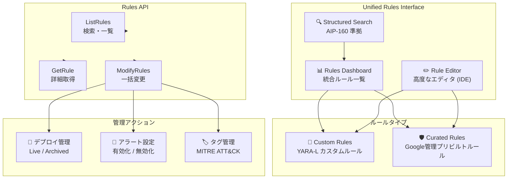

# Google SecOps: Unified Rules Interface (Public Preview)

**リリース日**: 2026-06-30

**サービス**: Google SecOps (Google Security Operations)

**機能**: Unified Rules Interface

**ステータス**: Public Preview

:chart_with_upwards_trend: [このアップデートのインフォグラフィックを見る](https://takech9203.github.io/google-cloud-news-summary/20260630-google-secops-unified-rules-interface.html)

## 概要

Google SecOps に新しい Unified Rules Interface (統合ルールインターフェース) が Public Preview として提供開始された。この機能は、カスタムルールとキュレーテッドルール (Google セキュリティエキスパートが管理するプリビルトの検出ルール) の管理を単一の統合されたワークフローに統合するものである。

従来、カスタム YARA-L ルールとキュレーテッドルールは別々のインターフェースで管理されていたが、Unified Rules Interface により、検出エンジニアはすべてのルールを一元的に管理・検索・デプロイできるようになった。これにより、脅威検出の平均時間 (MTTD: Mean-Time-To-Detect) の短縮と、検出エンジニアリングの効率化が実現される。

本機能は、セキュリティエンジニア、SOC アナリスト、検出エンジニアを主な対象ユーザーとし、組織のセキュリティ運用における検出ルールのライフサイクル全体を一元管理することを目的としている。

**アップデート前の課題**

- カスタムルールとキュレーテッドルールが別々のインターフェースで管理されており、ルール管理が分散していた
- キュレーテッドルールのテキスト内容の確認や個別の有効化/無効化が容易ではなかった
- 複数ルールの一括操作 (ライブ状態やアラート設定の変更) に手間がかかっていた
- ルールの検索が限定的で、構造化されたクエリによる高度なフィルタリングができなかった

**アップデート後の改善**

- カスタムルールとキュレーテッドルールを単一のダッシュボードで一元管理可能になった
- 高度なルールエディタにより、リアルタイムのコンテキスト支援 (UDM フィールド定義のホバー表示、エラーハイライト) が利用可能になった
- Rules API の拡張により、プログラマティックなルール管理 (検索、一括変更、キュレーテッドルール詳細取得) が可能になった
- AIP-160 準拠の構造化検索で、ルールテキスト・メタデータ・タグによる高度なフィルタリングが可能になった

## アーキテクチャ図



Unified Rules Interface は、UI (ダッシュボード・エディタ・検索) と API の両方から、カスタムルールとキュレーテッドルールの統合管理を提供するアーキテクチャとなっている。

## サービスアップデートの詳細

### 主要機能

1. **統合ルールダッシュボード (Redesigned Dashboard)**
   - カスタムルールとキュレーテッドルールを単一のリストに統合表示
   - クイックフィルター: All rules / Live rules / Alerting rules / Custom rules / Non-archived rules
   - カラムのカスタマイズ: 表示列の追加・非表示を設定可能
   - ルールプレビュー: 行をクリックするとルールサマリーを表示
   - マルチセレクトアクション: 複数ルールの一括設定変更

2. **高度なルールエディタ (Advanced Rule Editor)**
   - カスタムルールとキュレーテッドルールの両方をサポート
   - リアルタイムのコンテキスト支援 (UDM フィールドのホバー定義表示、エラーハイライト)
   - Overview タブ: メタデータ表示、MITRE タグの追加・削除
   - Logic タブ: ルールテキスト表示・編集、スコープ設定、ルールテスト実行
   - カスタムルールの作成・編集・テスト実行が統合環境で完結

3. **拡張 Rules API (Expanded API Capabilities)**
   - `rules.list`: 構造化検索、ソート、拡張ルールリソースの取得 (CONFIG_ONLY / TRENDS ビュー)
   - `rules.getRule`: キュレーテッドルールの詳細 (メタデータ、タグ、ルールテキスト) 取得
   - `rules.modifyRules`: 複数ルールの一括設定変更 (ライブ状態、アラート状態、タグ、アーカイブ状態)
   - ページサイズ最大 5,000 件 (CONFIG_ONLY ビュー)

4. **構造化検索 (Structured Search)**
   - AIP-160 準拠のフィルタ構文
   - 検索対象フィールド: `display_name`, `text`, `tags`, `rule_owner`, `author`, `severity`, `create_time`, `revision_create_time` など
   - 演算子: `:` (部分一致)、`=` (完全一致)、`!=`, `>`, `>=`, `<`, `<=`
   - ルールテキスト内のキーワード検索もサポート

## 技術仕様

### 対応する検索フィールドと演算子

| フィールド | 型 | 説明 |
|------|------|------|
| `rule_owner` | enum | ルール作成者 (`customer` / `google` / `*`) |
| `display_name` | string | ルールの表示名 |
| `text` | string | ルールテキスト (YARA-L コード) |
| `tags` | repeated string | MITRE ATT&CK タグ |
| `author` | string | ルール作成者名 |
| `severity` | message | ルールの重要度 |
| `create_time` | timestamp | ルール作成日時 |
| `revision_create_time` | timestamp | 最新リビジョン作成日時 |
| `alerting_enabled` | bool | アラート有効状態 |
| `live_mode_enabled` | bool | ライブモード有効状態 |
| `archived` | bool | アーカイブ状態 |

### Rules API エンドポイント

```
# ルール一覧取得 (構造化検索)
GET https://chronicle.googleapis.com/v1alpha/projects/{PROJECT_ID}/locations/{LOCATION}/instances/{INSTANCE_ID}/rules?filter={FILTER}&pageSize=100&view=TRENDS

# キュレーテッドルール詳細取得
GET https://chronicle.googleapis.com/v1alpha/projects/{PROJECT_ID}/locations/{LOCATION}/instances/{INSTANCE_ID}/rules/{RULE_ID}?view=BASIC

# 一括変更
POST https://chronicle.googleapis.com/v1alpha/projects/{PROJECT_ID}/locations/{LOCATION}/instances/{INSTANCE_ID}/rules:modifyRules
```

### IAM 権限

| 権限 | 用途 |
|------|------|
| `chronicle.featuredContentRules.list` | キュレーテッドルールの表示に必要 |

## 設定方法

### 前提条件

1. Google SecOps インスタンスが有効であること
2. 適切な IAM ロールが割り当てられていること (キュレーテッドルール表示には `chronicle.featuredContentRules.list` 権限が必要)
3. キュレーテッドルールの状態変更には、対象ルールパックへのエンタイトルメントが有効であること

### 手順

#### ステップ 1: Unified Rules Interface へのアクセス

Google SecOps コンソールで **Detections > Rules & detections** に移動する。新しい Unified Rules Interface がデフォルトで表示される。

#### ステップ 2: キュレーテッドルールの検索と有効化

```
# 検索バーで構造化検索を使用
alerting_enabled = true AND tags:"TA0001"

# キュレーテッドルールのみ表示
rule_owner: "google"

# キュレーテッドルール内のキーワード検索
text:"keyword" rule_owner:GOOGLE
```

#### ステップ 3: API 経由での一括操作

```json
{
  "parent": "projects/{PROJECT_ID}/locations/{LOCATION}/instances/{INSTANCE_ID}",
  "requests": [
    {
      "update_mask": "liveModeEnabled",
      "rule": {
        "name": "projects/{PROJECT_ID}/locations/{LOCATION}/instances/{INSTANCE_ID}/rules/{RULE_ID}",
        "liveModeEnabled": true
      }
    },
    {
      "update_mask": "alertingEnabled",
      "rule": {
        "name": "projects/{PROJECT_ID}/locations/{LOCATION}/instances/{INSTANCE_ID}/rules/{RULE_ID}",
        "alertingEnabled": true
      }
    }
  ]
}
```

#### レガシーインターフェースへの切り替え

画面右上の「Switch to the legacy experience」をクリックすることで、従来のインターフェースに戻すことが可能。

## メリット

### ビジネス面

- **MTTD の短縮**: キュレーテッドルールの迅速な発見・有効化により、新たな脅威への対応時間を短縮
- **運用効率の向上**: 一元管理による運用オーバーヘッドの削減、複数ツール間の切り替え不要
- **セキュリティ体制の強化**: Google セキュリティエキスパートが管理するキュレーテッドルールの活用促進

### 技術面

- **統合検索**: AIP-160 準拠の構造化検索により、数千のルールから目的のルールを瞬時に特定
- **IDE 機能**: リアルタイムのコンテキスト支援により、YARA-L ルール開発の生産性向上
- **API 自動化**: プログラマティックな一括操作により、大規模環境でのルール管理を自動化可能
- **きめ細かい制御**: キュレーテッドルールの個別制御 (親ルールセットから独立した状態管理)

## デメリット・制約事項

### 制限事項

- Public Preview 段階のため、Pre-GA Offerings Terms が適用される (機能の互換性が保証されない場合がある)
- キュレーテッドルールは Retro Hunt として実行不可
- Retro Hunt はデータ保持ティアに基づくルックバックウィンドウ制限あり
- ルール保存後に Rules Editor / Rules Dashboard からの削除は不可
- API のデフォルトフィルターは `rule_owner: "customer"` が適用される (キュレーテッドルールの取得にはワイルドカード指定が必要)

### 考慮すべき点

- ルール保存後、ダッシュボードで最初の実行メトリクスが表示されるまで数分の伝播遅延が発生する可能性がある
- テストルールの検出結果は永続化されず、アラートも生成されない (本番環境に影響しない設計)
- 一括更新 (modifyRules) は非アトミックで実行され、個々の失敗が他のリクエストに影響しない

## ユースケース

### ユースケース 1: MITRE ATT&CK 戦術に基づく迅速なルール有効化

**シナリオ**: 新たな Initial Access (TA0001) 攻撃の脅威情報を受け、関連するキュレーテッドルールを即座に有効化する必要がある。

**実装例**:
```
# Rules Dashboard の検索バーで実行
alerting_enabled = true AND tags:"TA0001"
```

1. 検索結果からルールを選択
2. Actions メニューから Live rule と Alerting のトグルを有効化
3. ダッシュボードでルールの実行状態とアラート履歴を監視

**効果**: 手動でのルール開発なしに、共通的な攻撃ベクターに対する検出を迅速にデプロイ可能。

### ユースケース 2: CI/CD パイプラインによるルール管理の自動化

**シナリオ**: 大規模環境で数百のカスタムルールを管理しており、デプロイメントの自動化が必要。

**実装例**:
```bash
# Rules API でルール一覧を取得
curl -X GET \
  "https://chronicle.googleapis.com/v1alpha/projects/${PROJECT_ID}/locations/us/instances/${INSTANCE_ID}/rules?filter=archived%3Dfalse&pageSize=5000&view=CONFIG_ONLY" \
  -H "Authorization: Bearer $(gcloud auth print-access-token)"

# 一括でライブ状態を更新
curl -X POST \
  "https://chronicle.googleapis.com/v1alpha/projects/${PROJECT_ID}/locations/us/instances/${INSTANCE_ID}/rules:modifyRules" \
  -H "Authorization: Bearer $(gcloud auth print-access-token)" \
  -H "Content-Type: application/json" \
  -d @rules_update.json
```

**効果**: ルールのデプロイ・設定変更を自動化し、一貫性のあるセキュリティポリシー管理を実現。

### ユースケース 3: キュレーテッドルールの可視化とカスタマイズ

**シナリオ**: Google が提供するキュレーテッドルールの検出ロジックを確認し、自社環境に合わせて有効化/無効化を細かく制御したい。

**実装例**:
```
# キュレーテッドルールのみ表示
rule_owner: "google"

# 特定のキーワードを含むキュレーテッドルールを検索
text:"invoke-web" rule_owner:GOOGLE
```

**効果**: キュレーテッドルールのブラックボックス化を解消し、自社のセキュリティ要件に合わせたきめ細かいチューニングが可能。

## 関連サービス・機能

- **Google Threat Intelligence (GTI)**: Applied Threat Intelligence (ATI) のキュレーテッドルールと連携し、IOC マッチングによる脅威検出を強化
- **YARA-L 2.0**: Unified Rules Interface で使用される検出ルール言語。カスタムルールの記述に使用
- **Google SecOps SOAR**: 検出されたアラートに対する自動応答プレイブックとの連携
- **Cloud Monitoring / Cloud Logging**: セキュリティイベントのインジェスト元としてのデータソース

## 参考リンク

- :chart_with_upwards_trend: [インフォグラフィック](https://takech9203.github.io/google-cloud-news-summary/20260630-google-secops-unified-rules-interface.html)
- [公式リリースノート](https://docs.cloud.google.com/release-notes#June_30_2026)
- [Unified Rules 管理ドキュメント](https://docs.cloud.google.com/chronicle/docs/detection/unified-rules/manage-unified-rules)
- [Unified Rules で脅威を検出する](https://docs.cloud.google.com/chronicle/docs/detection/unified-rules/get-started)
- [ルールリストの検索](https://docs.cloud.google.com/chronicle/docs/detection/unified-rules/search-rules-list)
- [Unified Rules API](https://docs.cloud.google.com/chronicle/docs/detection/unified-rules/unified-rules-api)

## まとめ

Google SecOps の Unified Rules Interface は、検出エンジニアリングのワークフローを根本的に改善する重要なアップデートである。カスタムルールとキュレーテッドルールの一元管理、高度な検索・エディタ機能、拡張 API により、セキュリティチームはルール管理の効率化と脅威検出の迅速化を同時に達成できる。Public Preview 段階であるため本番環境への導入は慎重に検討する必要があるが、レガシーインターフェースへの切り替えも可能なため、早期に評価を開始することを推奨する。

---

**タグ**: #GoogleSecOps #SIEM #DetectionEngineering #UnifiedRules #YARA-L #SecurityOperations #PublicPreview #ThreatDetection
