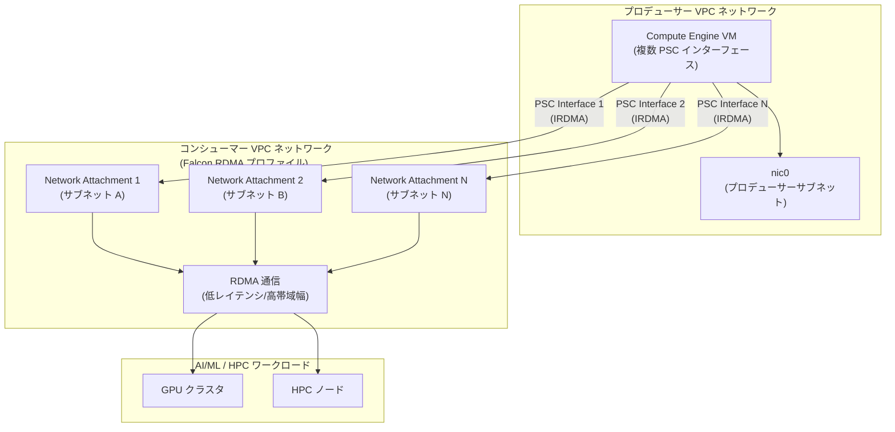

# Virtual Private Cloud: Falcon VPC ネットワークで複数の Private Service Connect インターフェースをサポート

**リリース日**: 2026-06-30

**サービス**: Virtual Private Cloud (VPC)

**機能**: RDMA Falcon VPC ネットワークにおける複数 PSC インターフェース接続

**ステータス**: General Availability (GA)

:bar_chart: [このアップデートのインフォグラフィックを見る](https://takech9203.github.io/google-cloud-news-summary/20260630-vpc-rdma-psc-multiple-interfaces-ga.html)

## 概要

Google Cloud は、RDMA ネットワークプロファイルを使用する Falcon VPC ネットワークにおいて、単一の Compute Engine インスタンスから複数の仮想 Private Service Connect (PSC) インターフェースを使用して接続する機能を General Availability (GA) としてリリースした。これにより、コンシューマー VPC ネットワークが Falcon VPC 用の RDMA ネットワークプロファイルを使用している場合、プロデューサー側の単一 VM が複数の PSC インターフェースを介してそのネットワークに接続できるようになる。

この機能は、HPC (High Performance Computing) や AI/ML ワークロードにおいて、高帯域幅・低レイテンシの RDMA 通信を必要とするシナリオで特に重要である。Falcon VPC ネットワークは H4D マシンシリーズで使用される IRDMA NIC をサポートしており、今回の GA リリースにより、マネージドサービスプロデューサーが RDMA 対応のコンシューマーネットワークに対してスケーラブルな接続を確立できるようになった。

**アップデート前の課題**

- Falcon VPC ネットワークでは PSC (Private Service Connect) が `PSC_BLOCKED` としてブロックされており、PSC インターフェース経由での接続ができなかった
- RDMA 対応ネットワークへのマネージドサービスからの接続手段が限定されていた
- 単一 VM から RDMA ネットワークプロファイルを使用するコンシューマー VPC への複数接続を確立する標準的な方法がなかった

**アップデート後の改善**

- コンシューマー VPC ネットワークが Falcon VPC 用 RDMA ネットワークプロファイルを使用している場合、複数の PSC インターフェースを介した接続が GA として利用可能になった
- 単一の Compute Engine インスタンスから複数の PSC インターフェースを使用して RDMA 対応コンシューマーネットワークに接続可能になった
- マネージドサービスプロデューサーが RDMA 通信の恩恵を受けながら、PSC の安全な接続モデルを活用できるようになった

## アーキテクチャ図



プロデューサー VM が複数の PSC インターフェースを介して、Falcon VPC ネットワーク (RDMA ネットワークプロファイル) 内のコンシューマーリソースに接続する構成を示す。各 PSC インターフェースは異なるネットワークアタッチメントに接続し、RDMA による高速通信を実現する。

## サービスアップデートの詳細

### 主要機能

1. **複数 PSC インターフェースによる RDMA 接続**
   - 単一の Compute Engine インスタンスから複数の PSC インターフェースを使用して Falcon VPC ネットワークに接続
   - 各 PSC インターフェースは異なるネットワークアタッチメント (異なるコンシューマー VPC ネットワーク) に接続
   - RDMA over Falcon transport プロトコルによる低レイテンシ通信を実現

2. **Falcon VPC ネットワークとの統合**
   - Falcon VPC ネットワークは IRDMA NIC タイプのみをサポート
   - ゾーン制約: RDMA ネットワークプロファイルと同じゾーン内のリソースに限定
   - 推奨 MTU: 8896 バイト (Falcon VPC ネットワークのデフォルト)

3. **PSC インターフェースの接続モデル**
   - プロデューサー VPC からコンシューマー VPC への接続を開始 (マネージドサービスエグレス)
   - 接続は双方向かつトランジティブ (コンシューマーネットワークに接続された他のワークロードへのアクセスが可能)
   - ネットワークアタッチメントによるアクセス制御 (手動承認または自動承認)

## 技術仕様

### Falcon VPC ネットワークの仕様

| 項目 | 詳細 |
|------|------|
| プロトコル | RDMA over Falcon transport |
| NIC タイプ | IRDMA のみ |
| 対応マシンタイプ | H4D シリーズ (h4d-standard-192, h4d-highmem-192, h4d-highmem-192-lssd) |
| ネットワークプロファイル名 | `ZONE-vpc-falcon` |
| MTU | 8896 バイト (推奨/デフォルト) |
| サブネットタイプ | IPv4 のみ |
| ゾーン制約 | あり (RDMA プロファイルと同一ゾーン) |

### PSC インターフェースの仕様

| 項目 | 詳細 |
|------|------|
| 仮想 PSC インターフェース上限 | VM あたり最大 9 (vCPU 数に依存) |
| 動的 PSC インターフェース上限 | VM あたり最大 15 (vCPU 数に依存) |
| nic0 の制約 | PSC インターフェースとして使用不可 (プロデューサーサブネット接続用) |
| 外部 IP | PSC インターフェースには割り当て不可 |
| ルーティング設定 | ゲスト OS での手動設定が必要 |

### Falcon VPC の制限事項

| 機能 | サポート状況 |
|------|-------------|
| VPC ネットワークピアリング | 非サポート |
| Cloud Load Balancing | 非サポート |
| Cloud NAT | 非サポート |
| Cloud VPN | 非サポート |
| Cloud Interconnect | 非サポート |
| Cloud NGFW | 非サポート |
| 外部 IP アドレス | 非サポート |
| IP フォワーディング | 非サポート |
| 動的 NIC (Dynamic NICs) | 非サポート |
| エイリアス IP 範囲 | 非サポート |

## 設定方法

### 前提条件

1. Falcon VPC ネットワークが作成済みであること (`ZONE-vpc-falcon` プロファイルを使用)
2. コンシューマー側でネットワークアタッチメントが作成済みであること
3. プロデューサープロジェクトがネットワークアタッチメントの承認リストに含まれていること
4. H4D マシンシリーズが利用可能なゾーンであること

### 手順

#### ステップ 1: Falcon VPC ネットワークの作成 (コンシューマー側)

```bash
# Falcon VPC ネットワークの作成
gcloud compute networks create rdma-falcon-network \
  --network-profile=ZONE-vpc-falcon \
  --subnet-mode custom

# サブネットの作成
gcloud compute networks subnets create rdma-falcon-subnet \
  --network=rdma-falcon-network \
  --region=REGION \
  --range=10.0.0.0/16
```

#### ステップ 2: ネットワークアタッチメントの作成 (コンシューマー側)

```bash
# ネットワークアタッチメントの作成
gcloud compute network-attachments create consumer-attachment \
  --region=REGION \
  --subnets=rdma-falcon-subnet \
  --connection-preference=ACCEPT_MANUAL \
  --producer-accept-list=PRODUCER_PROJECT_ID
```

#### ステップ 3: 複数 PSC インターフェースを持つ VM の作成 (プロデューサー側)

```bash
# 複数の PSC インターフェースを持つ VM を作成
gcloud compute instances create producer-vm \
  --zone=ZONE \
  --machine-type=MACHINE_TYPE \
  --network-interface='subnet=producer-subnet,no-address' \
  --network-interface='network-attachment=projects/CONSUMER_PROJECT/regions/REGION/networkAttachments/consumer-attachment-1' \
  --network-interface='network-attachment=projects/CONSUMER_PROJECT/regions/REGION/networkAttachments/consumer-attachment-2'
```

#### ステップ 4: ルーティングの設定

VM 作成後、ゲスト OS 内でルーティングを手動設定し、PSC インターフェースを経由するトラフィックを適切にルーティングする必要がある。

## メリット

### ビジネス面

- **マネージドサービスの拡張性**: サービスプロデューサーが RDMA 対応コンシューマーネットワークに対してスケーラブルな接続を提供可能
- **HPC/AI ワークロードの加速**: 高帯域幅・低レイテンシ通信により、分散処理の性能が向上
- **セキュアな接続モデル**: PSC のアクセス制御モデルにより、ネットワーク分離を維持しながら高性能通信を実現

### 技術面

- **RDMA による高性能通信**: カーネルバイパスによる低レイテンシ・高スループットのデータ転送
- **マルチ NIC サポート**: Falcon VPC ネットワークでは同一ネットワーク内の複数 NIC をサポート
- **トランジティブ接続**: PSC インターフェース経由でコンシューマーネットワークに接続された他のリソースにもアクセス可能

## デメリット・制約事項

### 制限事項

- Falcon VPC ネットワークはゾーン制約があり、RDMA プロファイルと同一ゾーン内のリソースに限定される
- nic0 を Falcon VPC ネットワークにアタッチすることはできない (RDMA NIC は nic0 以外である必要がある)
- Falcon VPC ネットワークでは VPC ネットワークピアリング、Cloud Load Balancing、Cloud NAT、Cloud VPN、Cloud Interconnect が利用不可
- 外部 IP アドレスの割り当てが不可のため、RDMA NIC はインターネットアクセスを持たない
- Cloud NGFW によるファイアウォールポリシーの設定が不可 (暗黙の許可ルールが適用)

### 考慮すべき点

- PSC インターフェースの接続後、ゲスト OS でのルーティング設定が手動で必要
- マルチテナントアーキテクチャでは、1 つのコンシューマーのアクション (接続終了) が同じ VM に接続された他のコンシューマーに影響を与える可能性がある
- 各 PSC インターフェースは異なるネットワークアタッチメント (異なるコンシューマー VPC) に接続する必要がある

## ユースケース

### ユースケース 1: AI/ML 分散学習基盤

**シナリオ**: マネージドサービスプロバイダーが、複数のコンシューマー組織に対して AI モデルの分散学習サービスを提供する。各コンシューマーは Falcon VPC ネットワーク上に H4D インスタンスの GPU クラスタを保有しており、プロデューサーのオーケストレーション VM が複数の PSC インターフェースを介して各コンシューマーの学習ノードと RDMA で通信する。

**効果**: RDMA による低レイテンシ通信により、パラメータサーバーと学習ノード間のグラディエント同期が高速化され、分散学習のスループットが大幅に向上する。

### ユースケース 2: HPC クラスタのマネージドサービス

**シナリオ**: HPC サービスプロバイダーが、コンシューマーの Falcon VPC ネットワーク内の計算ノードに対してジョブスケジューリングやデータ配信を行う。単一の管理 VM から複数の PSC インターフェースを使用して、異なるコンシューマーの HPC クラスタに接続する。

**効果**: PSC のセキュリティモデルを維持しながら、RDMA の高帯域幅を活用した効率的なデータ転送とジョブ管理が可能になる。

## 料金

PSC インターフェースの料金体系については、VPC の料金ページを参照。

- サービスコンシューマー: PSC エンドポイントごとの課金
- サービスプロデューサー: 処理された GB ごとの課金

詳細は [VPC 料金ページ](https://cloud.google.com/vpc/pricing#psc-forwarding-rules) を参照。

## 利用可能リージョン

Falcon VPC ネットワーク用の RDMA ネットワークプロファイルは、H4D マシンシリーズが利用可能なゾーンで提供される。利用可能なゾーンを確認するには以下のコマンドを実行する:

```bash
gcloud compute network-profiles list
```

## 関連サービス・機能

- **Compute Engine (H4D シリーズ)**: Falcon VPC ネットワークでサポートされるマシンタイプ。IRDMA NIC による Cloud RDMA 通信が可能
- **AI Hypercomputer**: RDMA ネットワークプロファイルは AI ワークロード向けに設計されており、AI Hypercomputer のインフラストラクチャの一部として機能
- **Private Service Connect**: PSC インターフェースはプロデューサーからコンシューマーへの接続 (マネージドサービスエグレス) を提供
- **GKE (Google Kubernetes Engine)**: H4D ノードプールで Falcon VPC ネットワークへの接続をサポートし、Pod レベルで RDMA 通信が可能
- **Cloud RDMA (RoCE VPC ネットワーク)**: A3 Ultra / A4 / A4X マシンタイプ向けの別の RDMA 実装 (MRDMA NIC 使用)

## 参考リンク

- :bar_chart: [インフォグラフィック](https://takech9203.github.io/google-cloud-news-summary/20260630-vpc-rdma-psc-multiple-interfaces-ga.html)
- [公式リリースノート](https://docs.cloud.google.com/release-notes#June_30_2026)
- [RDMA network profiles for Falcon VPC networks](https://docs.cloud.google.com/vpc/docs/rdma-network-profiles#falcon-supported-features)
- [Create VMs with Private Service Connect interfaces](https://docs.cloud.google.com/vpc/docs/create-manage-private-service-connect-interfaces#create)
- [About Private Service Connect interfaces](https://docs.cloud.google.com/vpc/docs/about-private-service-connect-interfaces)
- [RDMA ネットワークプロファイルの概要](https://docs.cloud.google.com/vpc/docs/rdma-network-profiles)
- [H4D マシンシリーズ](https://docs.cloud.google.com/compute/docs/compute-optimized-machines#h4d_series)
- [料金ページ](https://cloud.google.com/vpc/pricing#psc-forwarding-rules)

## まとめ

今回の GA リリースにより、Falcon VPC ネットワーク (RDMA ネットワークプロファイル) を使用するコンシューマー環境に対して、プロデューサー側の単一 VM から複数の PSC インターフェースを介した RDMA 接続が本番環境で利用可能になった。HPC や AI/ML ワークロードで高帯域幅・低レイテンシ通信を必要とするマネージドサービスプロバイダーは、PSC のセキュリティモデルを維持しながら RDMA の性能を活用できる。H4D マシンシリーズを使用した AI Hypercomputer 環境を構築している場合は、この機能の活用を検討することを推奨する。

---

**タグ**: #VPC #RDMA #PrivateServiceConnect #Falcon #H4D #HPC #AI #ML #HighPerformanceComputing #Networking #GA
