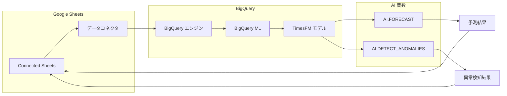

# BigQuery: TimesFM モデルが Connected Sheets から利用可能に (GA)

**リリース日**: 2026-07-01

**サービス**: BigQuery

**機能**: TimesFM モデルの Connected Sheets 統合

**ステータス**: GA (一般提供)

[このアップデートのインフォグラフィックを見る](https://takech9203.github.io/google-cloud-news-summary/20260701-bigquery-timesfm-connected-sheets-ga.html)

## 概要

BigQuery ML の事前学習済み TimesFM モデルが、Connected Sheets から直接利用可能になりました。これにより、Google Sheets のインターフェースから SQL を記述することなく、AI.FORECAST 関数による時系列予測と AI.DETECT_ANOMALIES 関数による異常検知を実行できるようになります。本機能は一般提供 (GA) ステータスとなりました。

TimesFM は Google Research が開発した時系列予測の基盤モデルであり、数十億のリアルワールドデータポイントで事前学習されています。従来の ARIMA のような統計手法と同等の精度を持ちながら、モデルの作成やトレーニングが不要であるという大きな利点があります。Connected Sheets との統合により、ビジネスアナリストやデータアナリストが、使い慣れた Google Sheets のインターフェースから高度な時系列分析を実行できるようになりました。

**アップデート前の課題**

- TimesFM モデルを使用するには BigQuery コンソールまたは API から SQL クエリを記述する必要があった
- ビジネスユーザーが時系列予測や異常検知を行うには SQL の知識が必須だった
- Connected Sheets から BigQuery ML の AI 関数を直接呼び出すことができなかった

**アップデート後の改善**

- Connected Sheets から直接 TimesFM モデルを使用した予測・異常検知が可能になった
- SQL の知識がなくても Google Sheets の操作で高度な時系列分析が実行可能になった
- GA リリースにより本番環境での利用が公式にサポートされ、SLA の対象となった

## アーキテクチャ図



ユーザーが Connected Sheets からリクエストを送信すると、BigQuery ML が内部的に TimesFM モデルを使用して予測または異常検知を実行し、結果を Google Sheets に返します。

## サービスアップデートの詳細

### 主要機能

1. **AI.FORECAST 関数 (時系列予測)**
   - 過去のデータに基づいて将来の値を予測する
   - 予測期間 (horizon) は 1 から 10,000 データポイントまで指定可能
   - 信頼区間 (confidence_level) の指定が可能 (デフォルト: 0.95)
   - 複数の時系列を一括で予測可能 (id_cols パラメータ使用)

2. **AI.DETECT_ANOMALIES 関数 (異常検知)**
   - 時系列データ内の異常なスパイクやドロップを検出する
   - 履歴データと対象データを分離して分析可能
   - anomaly_prob_threshold パラメータで検出感度を調整可能
   - 最大 1,024 タイムポイントの異常検知に対応

3. **TimesFM モデル (TimesFM 2.0 / 2.5)**
   - Google Research が開発した事前学習済み時系列基盤モデル
   - モデルの作成・トレーニングが不要 (ゼロショット予測)
   - TimesFM 2.0: 最大 2,048 データポイントのコンテキストウィンドウ
   - TimesFM 2.5: 最大 15,360 データポイントのコンテキストウィンドウ

## 技術仕様

### TimesFM モデルのコンテキストウィンドウ

| モデル | 対応コンテキストウィンドウ長 |
|--------|------|
| TimesFM 2.0 | 64, 128, 256, 512, 1024, 2048 |
| TimesFM 2.5 | 64, 128, 256, 512, 1024, 2048, 4096, 8192, 15360 |

### AI.FORECAST 関数の主要パラメータ

| パラメータ | 型 | 説明 |
|------|------|------|
| data_col | STRING | 予測対象のデータ列名 |
| timestamp_col | STRING | タイムスタンプ列名 |
| horizon | INT64 | 予測するデータポイント数 (1-10,000) |
| model | STRING | 使用モデル名 ("TimesFM 2.0" または "TimesFM 2.5") |
| id_cols | ARRAY<STRING> | 複数時系列の識別列 |
| confidence_level | FLOAT64 | 信頼区間 (0-1、デフォルト: 0.95) |
| context_window | INT64 | コンテキストウィンドウ長 |

### AI.DETECT_ANOMALIES 関数の主要パラメータ

| パラメータ | 型 | 説明 |
|------|------|------|
| data_col | STRING | 分析対象のデータ列名 |
| timestamp_col | STRING | タイムスタンプ列名 |
| target_last_n_points | INT64 | 対象データの最後 N ポイント (1-10,000) |
| target_start_timestamp | TIMESTAMP | 対象データの開始タイムスタンプ |
| model | STRING | 使用モデル名 |
| anomaly_prob_threshold | FLOAT64 | 異常判定の閾値 |

## 設定方法

### 前提条件

1. Google Cloud プロジェクトで BigQuery API が有効化されていること
2. Connected Sheets が利用可能な Google Workspace ライセンスを持っていること
3. BigQuery データセットへの適切なアクセス権限が付与されていること

### 手順

#### ステップ 1: Connected Sheets からの BigQuery 接続

1. Google Sheets を開き、「データ」メニューから「データコネクタ」を選択
2. 「BigQuery に接続」を選択し、課金が有効な Google Cloud プロジェクトを選ぶ
3. 分析対象のデータセットとテーブルを選択して「接続」をクリック

#### ステップ 2: AI.FORECAST による予測の実行 (SQL 例)

```sql
SELECT *
FROM AI.FORECAST(
  TABLE mydataset.sales_data,
  data_col => 'revenue',
  timestamp_col => 'sale_date',
  horizon => 30,
  confidence_level => 0.95
);
```

上記クエリは、sales_data テーブルの revenue 列について、今後 30 データポイントの予測を 95% 信頼区間で生成します。

#### ステップ 3: AI.DETECT_ANOMALIES による異常検知の実行 (SQL 例)

```sql
SELECT *
FROM AI.DETECT_ANOMALIES(
  TABLE mydataset.metrics_data,
  data_col => 'request_count',
  timestamp_col => 'metric_date',
  target_last_n_points => 10,
  anomaly_prob_threshold => 0.8
);
```

上記クエリは、最後の 10 データポイントに対して異常検知を実行し、異常確率 0.8 以上のポイントを異常と判定します。

## メリット

### ビジネス面

- **民主化された分析**: SQL を書けないビジネスユーザーでも高度な時系列分析が可能になり、データドリブンな意思決定が促進される
- **運用コスト削減**: 専用のモデル構築・運用が不要なため、データサイエンティストの工数を削減できる
- **迅速なインサイト**: Google Sheets から直接分析できるため、レポート作成やダッシュボード構築のリードタイムが短縮される

### 技術面

- **ゼロショット予測**: 事前学習済みモデルのため、トレーニングデータの準備やハイパーパラメータの調整が不要
- **スケーラビリティ**: 複数の時系列を一括で処理可能で、BigQuery のインフラを活用した大規模分析に対応
- **GA レベルの信頼性**: 一般提供ステータスにより、SLA による可用性保証と公式サポートが提供される

## デメリット・制約事項

### 制限事項

- AI.DETECT_ANOMALIES では最大 1,024 タイムポイントのみが異常検知の対象となる
- TimesFM は単変量 (univariate) モデルであり、共変量 (covariates) はサポートされない
- モデルのカスタマイズオプションが限定的 (ARIMA_PLUS と比較して)
- 予測結果の説明可能性が低い (ML.EXPLAIN_FORECAST のような機能は非対応)

### 考慮すべき点

- 高度なカスタマイズが必要な場合は、ARIMA_PLUS または ARIMA_PLUS_XREG モデルの使用を検討すべき
- Connected Sheets のデータ更新はリフレッシュ操作が必要であり、リアルタイムではない
- VPC Service Controls 環境では追加の構成が必要になる場合がある

## ユースケース

### ユースケース 1: 小売業の需要予測

**シナリオ**: 小売企業の販売企画チームが、過去の販売データに基づいて次月の商品別需要を予測したい。SQL の専門知識がないチームメンバーでも分析を実行する必要がある。

**実装例**:
```sql
SELECT *
FROM AI.FORECAST(
  (SELECT sale_date, product_category, daily_sales
   FROM `myproject.retail.sales_history`),
  data_col => 'daily_sales',
  timestamp_col => 'sale_date',
  id_cols => ['product_category'],
  horizon => 30,
  confidence_level => 0.9
);
```

**効果**: 在庫の過剰・不足を防ぎ、約 15-20% の在庫コスト削減が期待できる。

### ユースケース 2: インフラ監視における異常検知

**シナリオ**: SRE チームが、サーバーのメトリクスデータ (CPU 使用率、リクエスト数など) の異常を Google Sheets で可視化し、定期的にモニタリングしたい。

**実装例**:
```sql
SELECT *
FROM AI.DETECT_ANOMALIES(
  (SELECT metric_timestamp, server_id, cpu_usage
   FROM `myproject.monitoring.server_metrics`),
  data_col => 'cpu_usage',
  timestamp_col => 'metric_timestamp',
  id_cols => ['server_id'],
  target_last_n_points => 24,
  anomaly_prob_threshold => 0.9
);
```

**効果**: 障害の予兆を早期に検出し、ダウンタイムを削減できる。

## 料金

AI.FORECAST および AI.DETECT_ANOMALIES の使用は、BigQuery ML のオンデマンド料金における evaluation, inspection, and prediction レートで課金されます。

### 料金体系

| 項目 | 料金 |
|--------|-----------------|
| BigQuery ML 予測・評価 | BigQuery ML オンデマンド料金に準拠 |
| Connected Sheets の利用 | BigQuery クエリ料金 (処理データ量に基づく) |
| BigQuery ストレージ | 標準の BigQuery ストレージ料金 |

詳細な料金については [BigQuery ML pricing](https://cloud.google.com/bigquery/pricing#bqml) ページを参照してください。

## 利用可能リージョン

AI.FORECAST、AI.DETECT_ANOMALIES、および TimesFM モデルは、BigQuery ML がサポートするすべてのリージョンで利用可能です。これには US、EU のマルチリージョンおよび各種シングルリージョン (asia-northeast1 (東京)、asia-northeast2 (大阪) を含む) が含まれます。

## 関連サービス・機能

- **BigQuery ML ARIMA_PLUS**: より高度なカスタマイズが必要な場合の代替時系列モデル。共変量サポートや説明可能性が必要な場合に適している
- **AI.EVALUATE 関数**: TimesFM モデルの予測精度を評価するための関数。MAE、MSE、RMSE などの指標を算出可能
- **Connected Sheets**: BigQuery のスケールを Google Sheets のインターフェースで活用するための機能。ピボットテーブル、グラフ、数式をサポート
- **Vertex AI Agent Platform Forecast**: より高度な AutoML ベースの時系列予測が必要な場合の選択肢

## 参考リンク

- [インフォグラフィック](https://takech9203.github.io/google-cloud-news-summary/20260701-bigquery-timesfm-connected-sheets-ga.html)
- [公式リリースノート](https://docs.cloud.google.com/release-notes#July_01_2026)
- [Connected Sheets ドキュメント](https://docs.cloud.google.com/bigquery/docs/connected-sheets)
- [AI.FORECAST 関数リファレンス](https://docs.cloud.google.com/bigquery/docs/reference/standard-sql/bigqueryml-syntax-ai-forecast)
- [AI.DETECT_ANOMALIES 関数リファレンス](https://docs.cloud.google.com/bigquery/docs/reference/standard-sql/bigqueryml-syntax-ai-detect-anomalies)
- [TimesFM モデル概要](https://docs.cloud.google.com/bigquery/docs/timesfm-model)
- [BigQuery ML 料金](https://cloud.google.com/bigquery/pricing#bqml)

## まとめ

BigQuery ML の TimesFM モデルが Connected Sheets から直接利用可能になったことで、SQL の専門知識がないビジネスユーザーでも高精度な時系列予測と異常検知を Google Sheets 上で実行できるようになりました。GA リリースにより本番ワークロードでの利用が公式にサポートされたため、組織全体でのデータ分析の民主化を推進する好機です。まずは既存の時系列データに対して AI.FORECAST を試用し、予測精度を確認することを推奨します。

---

**タグ**: #BigQuery #BigQueryML #TimesFM #ConnectedSheets #時系列予測 #異常検知 #GA #AI #機械学習
